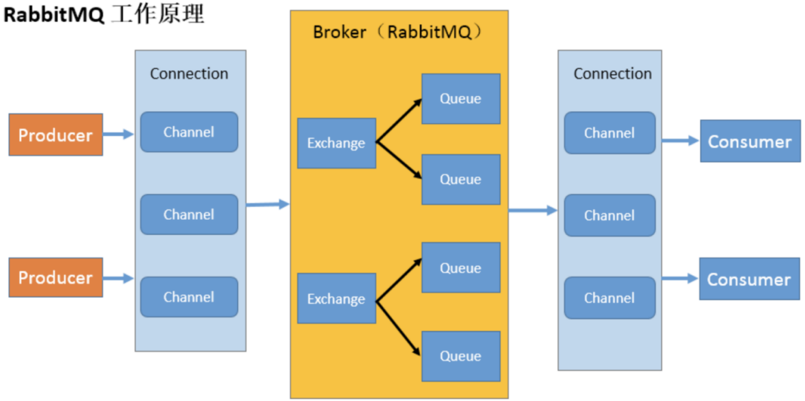
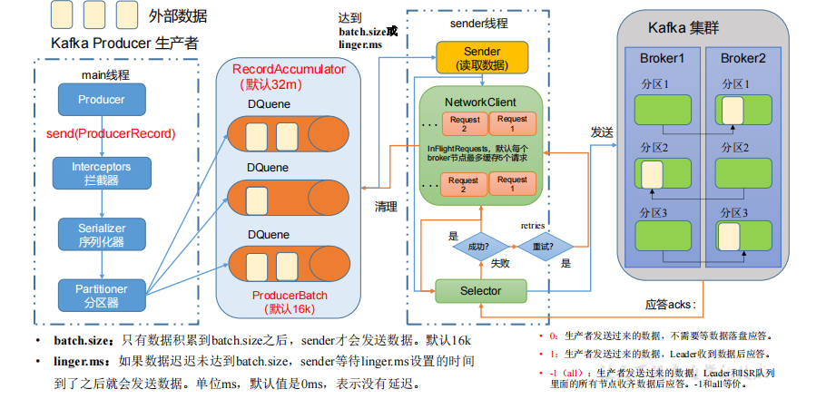
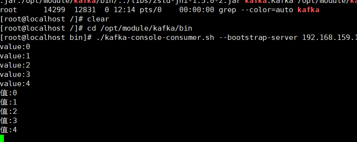
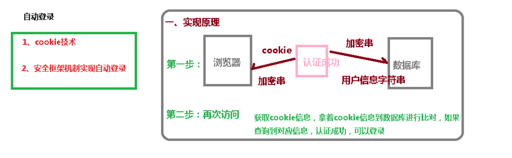
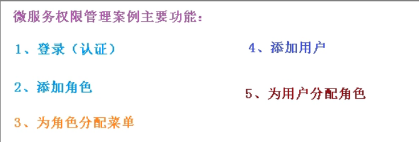
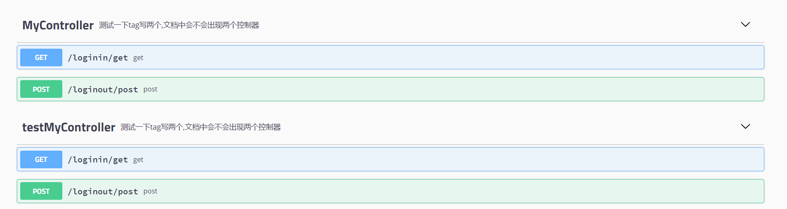
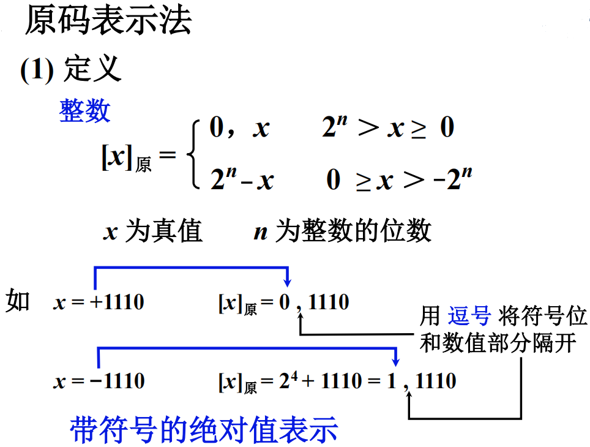
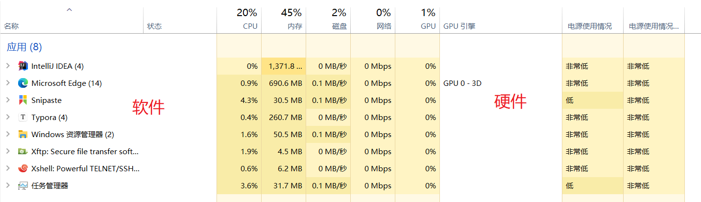
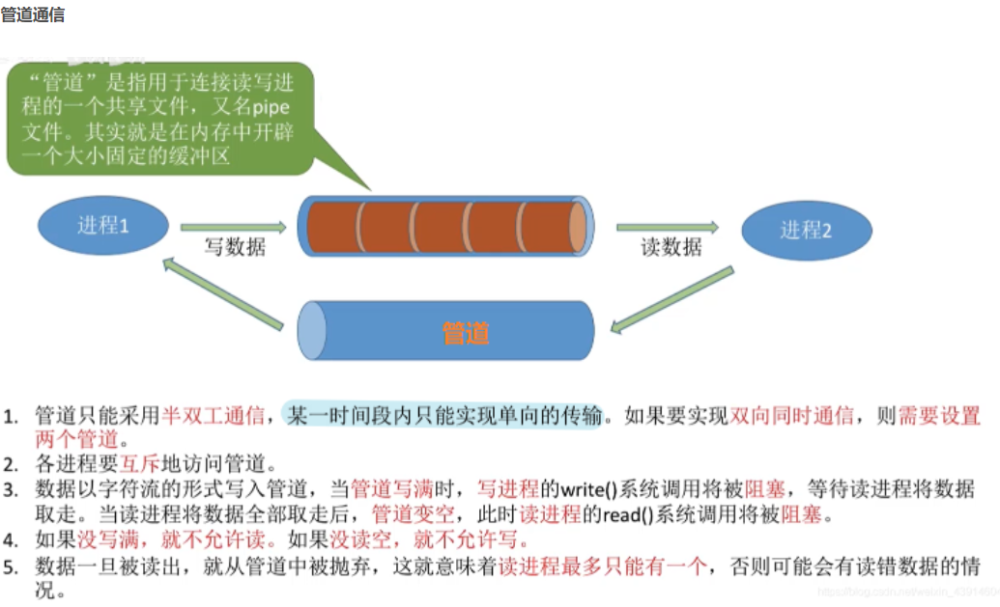
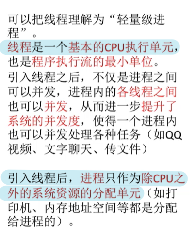

|        [PROJECT](#PROJECT)         |                                 |       [COMPONENT](#组件)        |      [INTERVIEW](#Interview)      |      [SOFT](#软件)      |
| :--------------------------------: | :-----------------------------: | :-----------------------------: | :-------------------------------: | :---------------------: |
|         [THREAD](#Thread)          |   [SPRINGCLOUD](#SpringCloud)   |       [JAVAWEB](#JavaWeb)       |     [SPRINGBOOT](#SpringBoot)     |                         |
|          [REDIS](#Redis)           |         [NGINX](#Nginx)         |    [STREAM API](#Stream API)    |            [SSM](#SSM)            | [THYMELEAF](#Thymeleaf) |
|         [DOCKER](#Docker)          |         [DUBBO](#Dubbo)         |      [RABBITMQ](#RabbitMQ)      |          [KAFKA](#Kafka)          |   [FASTDFS](#FastDFS)   |
|          [MYSQL](#MySQL)           |        [ORACLE](#Oracle)        | [SPRINGSESSION](#SpringSession) | [SPRINGSECURITY](#SpringSecurity) |     [SHELL](#Shell)     |
|        [SWAGGER](#Swagger)         | [ELASTICSEARCH](#ElasticSearch) |          [HTML](#Html)          |            [CSS](#CSS)            |    [JAVASCRIPT](#Js)    |
| [PC ORGANIZATION](#计算机组成原理) |  [OPERATING SYSTEM](#操作系统)  |       [LINUX](#Linux系统)       |     [PC NETWORK](#计算机网络)     |                         |
|            [VUE](#Vue)             |        [JQUERY](#jQuery)        |           [GIT](#Git)           |          [BLADE](#Blade)          |  [MAKEDOWN](#Markdown)  |
|       [DATA LINK](#资料链接)       |   [DESIGN MODE](#Design Mode)   |           [JSP](#JSP)           | [DATA STRUCTURE](#数据结构与算法) |   [ALGORITHM](#算法)    |


# PROJECT

## 1.CRM

[github地址](https://github.com/jiangrenbao/CRM.git)
[gitee地址](https://gitee.com/jiangrenbao/crm.git)
[建表sql(kivx)](https://pan.baidu.com/s/1LQIz6x7rEHFj9UJlnl1ejA)

## 2.尚筹网

[github地址](https://github.com/jiangrenbao/shangchouwang.git)

## 3.盈利宝

[github地址](https://github.com/jiangrenbao/yinglibao.git)

## 4.谷粒商城

# Thread

# JavaWeb

## 1.xml

xml是可扩展的标记性语言。  
用来保存数据，而且这些数据具有自我描述性。
作为项目或者模块的配置文件。
作为网络传输数据的格式（现在JSON为主）。

<font color="red" size="5px">文本区域（CDATA区）</font>

CDATA语法可以告诉xml解析器：CDATA里的文本内容，只是纯文本，不需要xml语法解析。

```xml
<![CDATA[ 这里可以把你输入的字符原样显示，不会解析xml ]]>
```

<font color="red" size="5px">dom4j解析技术</font>

pom.xml

```xml
<dependency>
  <groupId>org.dom4j</groupId>
  <artifactId>dom4j</artifactId>
  <version>2.1.3</version>
</dependency>
```

dom4jStudy.xml

```xml
<?xml version="1.0" encoding="UTF-8"?>
<books>
    <book id="1">
        <name>java编程思想</name>
        <price>52</price>
    </book>
    <book id="2">
        <name>java分布式开发</name>
        <price>96</price>
    </book>
</books>
```

java代码
```java
/**
 * @author jiangbao
 * @date 2022/4/9
 * @description
 */
public class Dom4jStudy {

    public static void main(String[] args) throws DocumentException {
        Document document = new SAXReader().read("C:\\javaproject\\shangchouwang\\RaiseNetwork\\webui\\src\\test\\resources\\dom4jStudy.xml");
        Element rootElement = document.getRootElement();
        List<Element> books = rootElement.elements("book");
        for (Element book : books) {
            System.out.println(book.attributeValue("id"));
            System.out.println(book.elementText("name"));
            System.out.println(book.elementText("price"));
        }
    }

}
```
## 2.tomcat

<font color="red" size="5px">常用的Web服务器</font>
<font color="orange" size="4px">Tomcat</font>
Apache组织提供，提供对jsp和Servlet的支持，轻量级。

<font color="orange" size="4px">Jboss</font>
纯Java的EJB服务器，支持所有的JavaEE规范（免费）。 

<font color="orange" size="4px">GlassFish</font>
由Oracle公司开发的一款JavaWeb服务器。 

<font color="orange" size="4px">WebLogic</font>
是Oracle 公司的产品，是目前应用最广泛的 Web 服务器。

<font color="red" size="5px">Tomcat目录</font>
bin      &nbsp;&nbsp;&nbsp;&nbsp;&nbsp;&nbsp;&nbsp;&nbsp;&nbsp; 存放可执行程序 
conf     &nbsp;&nbsp;&nbsp;&nbsp;&nbsp;&nbsp;&nbsp; 存放配置文件 
lib       &nbsp;&nbsp;&nbsp;&nbsp;&nbsp;&nbsp;&nbsp;&nbsp;&nbsp;&nbsp; 存放jar包 
logs     &nbsp;&nbsp;&nbsp;&nbsp;&nbsp;&nbsp;&nbsp; 存放输出日志 
temp    &nbsp;&nbsp;&nbsp;&nbsp;&nbsp;&nbsp; 存放临时数据 
webapps &nbsp; &nbsp; &nbsp; 存放部署的Web工程
work   &nbsp;&nbsp;&nbsp;&nbsp;&nbsp;&nbsp;&nbsp;  存放jsp翻译为Servlet的源码和Session钝化的目录

<font color="red" size="5px">部暑web工程到Tomcat中</font>
找到conf目录\Catalina\localhost\下，创建配置文件abc.xml：

```xml
<!-- 
	Context表示工程上下文 path表示工程的访问路径 
	docBase表示工程目录位置 
	访问这个工程的路径如下:http://ip:port/abc/ 就表示访问E:\book目录
--> 
<Context path="/abc" docBase="E:\book" /> 
```
<font color="red" size="5px">环境配置</font>
<font color="orange" size="4px">JAVA_HOME环境变量</font>

通知tomcat服务器在运行时需要的JDK安装位置
变量名(N):JAVA_HOME
变量值(V):C:\Program Files\Java\jdk1.8.0_101

<font color="orange" size="4px">CATALINA_HOME环境变量</font>
通知windows系统，要启动的tomcat服务器安装地址
变量名(N):CATALINA_HOME
变量值(V):D:\tools\tomcat9

## 3.Servlet

SUN公司提供的一组接口，制定动态资源文件的开发与调用规则，它可以接收客户端发送过来的请求，并响应数据给客户端。
该接口的实现类由HTTP服务器厂商提供，Tomcat服务器对于Servlet规范提供实现表现于servlet-api.jar。

<font color="red" size="5px">请求协议包</font>
浏览器 GET 方式发送请求，由Http服务器负责对请求行中二进制数据进行解析(utf-8)。 
浏览器 POST 方式发送请求，由当前请求对象对请求体中二进制数据进行解析(ISO-8859-1字符集)。
<font color="orange" size="4px">请求行</font>

|包含|含义|
|:-:|:-:|
|请求的方式|GET|
|请求的资源路径[+?+请求参数]|/工程路径/资源路径名|
|请求的协议的版本号|HTTP/1.1|

<font color="orange" size="4px">请求头</font>

|    包含    |                含义                |
| :--------: | :--------------------------------: |
| User-Agent |             浏览器信息             |
|    Host    |          服务器IP和端口号          |
|   Accept   | 通知服务器，浏览器所接收的数据类型 |

<font color="orange" size="4px">空白行</font>
隔离作用

<font color="orange" size="4px">请求体</font>
如果是 POST 请求，请求参数放在请求体中。

<font color="red" size="5px">响应协议包</font>
<font color="orange" size="4px">响应行</font>
响应的协议和版本号 &nbsp;&nbsp;&nbsp;&nbsp;HTTP/1.1
响应状态码 &nbsp;&nbsp;&nbsp;&nbsp;200
响应状态描述符 &nbsp;&nbsp;&nbsp;&nbsp;OK

|        包含        |          含义           |
| :----------------: | :---------------------: |
|       状态码       | 200、302、400、404、500 |
|     状态描述符     |           OK            |
| 响应的协议与版本号 |        HTTP/1.1         |

<font color="orange" size="4px">响应头</font>

|      包含      |       含义       |
| :------------: | :--------------: |
|  Content-Type  | 响应体的数据类型 |
| Content-Length |    响应体长度    |

<font color="orange" size="4px">空白行</font>
隔离作用

<font color="orange" size="4px">响应体</font>
响应数据

<font color="red" size="5px">http协议传输的过程</font>
Http服务器启动之后，接收浏览器发送的Http请求协议包，自动解析Http请求协议包信息，自动定位被访问的资源文件，自动生成一个Http响应协议包，自动将定位的静态资源文件或者动态资源文件的运行结果解析为二进制数据写入到Http响应协议包的响应体中，自动将Http响应协议包推送给"网络运营商"，由"网络运营商"负责将Http响应协议包推送回发送请求的浏览器上。

<font color="red" size="5px">服务器对动态资源文件的开发规则</font>
web.xml

```xml
<!--第一步：给Servlet程序起一个别名（一般是类名）-->
<!--
	Tomcat服务器内部使用Map存储所有Servlet接口实现类的全限定名称，Map servletMap = new HashMap();
	servletMap.put("OneServlet"，"com.alibaba.controller.OneServlet")
-->
<servlet>
	<servlet-name>OneServlet</servlet-name>
	<servlet-class>com.alibaba.controller.OneServlet</servlet-class>
</servlet>

<!--第二步：给Servlet程序配置访问地址-->
<!--
	Map urlMap = new HashMap(); 
	urlMap.put("/one"，"OneServlet")
  下划线 / 在服务器解析的时候，地址为：http://ip:port/工程路径
-->
<servlet-mapping>
	<servlet-name>OneServlet</servlet-name>
	<url-pattern>/one</url-pattern> 
</servlet-mapping>  
```
<font color="red" size="5px">服务器对动态资源文件的调用规则</font>
1）加载 被访问的Servlet接口实现类
2）反射 创建Servlet接口实现类的实例对象
3）init() 方法
4）service() 方法
5）服务器准备关闭时调用 destory() 方法销毁对象

<font color="red" size="5px">动态资源文件之间的调用规则</font>
<font color="orange" size="4px">重定向</font>
通过响应对象将下一个资源文件的地址写入到响应头location。

```java
response.sendRedirect(地址)；
```

浏览器地址栏内容改变
第一次请求结束后收到的状态码是否是302

<font color="orange" size="4px">请求转发</font>
调用请求对象代替浏览器向 Tomcat 服务器申请调用当前网站内部的资源文件。

```java
// 第一步：创建一个资源申请调用对象
RequestDispatcher report= request.getRequestDisptacher(地址)
// 第二步：将资源申请调用对象发送给Tomcat
report.forward(request，response)
```
<font color="orange" size="4px">制定动态资源文件之间的数据共享规则</font>
<font color="yellow" size="3px">ServletContext接口</font>
全局作用域对象，Tomcat服务器在该接口的实现类中声明ConcureentHashMap属性，用于进行共享数据存储。 
web.xml

```xml
<!--context-param 是上下文参数(它属于整个web工程)--> 
<context-param> 
	<param-name>username</param-name> 
	<param-value>context</param-value> 
</context-param> 
<context-param> 
	<param-name>password</param-name> 
	<param-value>root</param-value> 
</context-param> 
```

获取context-param的值

```java
ServletContext context = getServletConfig().getServletContext(); 
// 获取web.xml中配置的上下文参数context-param
String username = context.getInitParameter("username"); 
// 获取当前的工程路径，格式: /工程路径
context.getContextPath()；
```
<font color="yellow" size="3px">HttpServeltRequest接口</font>

<font color="yellow" size="3px">Cookie类</font>
Cookie类管理的共享平台相当于用户在服务端拥有会员卡，为同一个用户提供服务的Servlet都可以使用用户的会员卡进行数据共享。

```java
// 向cookie中存数据
Cookie card = new Cookie("共享数据名"，"共享数据");
response.addCookie(card);

// 向cookie汇总取数据
Cookie cookieArray[]= request.getCookies();
for(Cookie card:cookieArray){
	String cookieName = card.getName();    
	String value = card.getValue();
}
```
Cookie的生命周期能说一下吗?
正常情况下，Cookie存放在浏览器的内存中，意味着浏览器关闭，Cookie对象就被销毁。但在命令干预下，可以要求浏览器将接收到的Cookie对象存放在客户端计算机的硬盘上，并指定Cookie在硬盘上存活时间，在存活时间范围之内，关闭浏览器，关闭服务器，关闭计算机都不会导致Cookie对象销毁。

```java
// 设置cookie对象可以在计算机的硬盘上存活两分钟
cookie.setMaxAge(2 * 60);  
```
<font color="yellow" size="3px">HttpSession接口</font>
会话作用域对象，Tomcat服务器在为当前用户创建HttpSession对象时，相当于给当前用户分配一个私人储物柜。

<center>Tomcat服务器如何定位当前用户的私人储物柜?</center>
Tomcat为创建的HttpSession对象提供一个唯一编号，在服务结束时，将这个编号存放在一个Cookie(jsessionid，编号)中并推送到用户浏览器上，等到用户再次来访时，Tomcat服务器根据请求头中Cookie来断定哪一个HttpSession对象是当前用户的。
<center>HttpSession对象的生命周期能说一下吗?</center>
Tomcat根据存放会话作用域对象编号的cookie对象，来判断用户是否拥有自己的私人储物柜，当用户关闭了浏览器，等同于切断了用户与私人储物柜之间关系，此时由于Tomcat无法检测用户浏览器关闭时机，因此并不会将用户的私人储物柜进行关闭。在Tomcat创建会话作用域对象时，自动设置"最大空闲时间"，如果会话作用域对象从上一次使用完毕到现在的空闲时间达到了这个"最大空闲时间"，此时tomcat认为用户结束了本次会话并放弃了自己的会话作用域对象，此时tomcat将会销毁掉用户的私人储物柜。
web.xml

```xml
<!--Tomcat服务器默认的最大空闲时间是30分钟,设置会话作用域对象的最大空闲时间为5分钟-->
<session-config>
	<session-timeout>5</session-timeout>
</session-config> 
```
<center>Session何时生效?</center>
Sessinon在用户第一次访问服务器时创建，需要注意只有访问JSP、Servlet等程序时才会创建Session，只访问HTML、IMAGE等静态资源并不会创建Session，可调用request.getSession(true)强制生成Session。
<center>Session何时失效?</center>
服务器会把长时间没有活动的Session从服务器内存中清除，此时Session便失效。Tomcat中Session的默认失效时间为20分钟。

```java
// 强制使session失效
request.getSession().invalidate();
```
<center>请求对象和响应对象的生命周期能说一下吗?</center>
请求对象和响应对象的生命周期贯穿一次请求处理过程中。
Http服务器接收到浏览器发送的请求协议包时，自动为这个请求协议包创建一个请求对象和一个响应对象；
Http服务器调用doGet/doPost方法时，将当前请求对象和响应对象作为实参传入。
doGet/doPost方法执行完毕时，意味着本次请求处理完毕，在Http服务器准备推送响应包之前，负责销毁掉本次请求关联的请求对象和响应对象。

<font color="red" size="5px">监听器</font>
<font color="orange" size="4px">ServletContextListener接口</font>
监听ServletContext对象的创建和销毁时刻。 
ServletContext对象在web工程启动的时候创建，在web工程停止的时候销毁。  
MyListenerImpl.java

```java
public class MyListenerImpl implements ServletContextListener { 

  // 在ServletContext对象创建之后马上调用，做初始化 
	@Override 
	public void contextInitialized(ServletContextEvent sce) { 
	System.out.println("ServletContext 对象被创建了"); 
	}
	
  // 在ServletContext对象销毁之后调用 
	@Override 
	public void contextDestroyed(ServletContextEvent sce) { 
	System.out.println("ServletContext 对象被销毁了"); 
	} 
}
```
web.xml
```xml
<!--配置监听器--> 
<listener> 
	<listener-class>com.parkerJ.listener.MyListenerImpl</listener-class>
</listener>
```
<font color="red" size="5px">Filter接口</font>
可以在 Tomcat 调用资源文件之前对 Tomcat 进行拦截，对当前请求合法性进行检测，也可以对本次请求提供增强服务。
<font color="orange" size="4px">使用方式一：配置文件</font>
1）创建一个Filter接口实现类，并重写doFilter方法；如果放行：chain.doFilter(req， resp);
2）注册过滤器实现类拦截资源的地址
MyFilter.java

```java
public class MyFilter implements Filter {
  
    @Override
  public void doFilter(ServletRequest servletRequest， 
                       ServletResponse servletResponse， 
                       FilterChain filterChain) throws Exception {
    filterChain.doFilter(servletRequest， servletResponse);
  }
  
}
```

web.xml

```xml
<filter>
	<filter-name>myfilter</filter-name>
	<filter-class>com.alibaba.MyFilter</filter-class>
</filter>
<filter-mapping>
	<filter-name>myfilter</filter-name>
	<url-pattern>/one</url-pattern>
</filter-mapping>
```
<font color="orange" size="4px">使用方式二：注解</font>
MyFilter.java

```java
@WebFilter(filterName = "myfilter"，urlPatterns = "/one")
public class MyFilter implements Filter {
  
    @Override
  public void doFilter(ServletRequest servletRequest， 
                       ServletResponse servletResponse， 
                       FilterChain filterChain) throws Exception {
    filterChain.doFilter(servletRequest， servletResponse);
  }
  
}
```
<font color="orange" size="4px">Filter 对象的生命周期</font>
1）Tomcat服务器启动时，自动创建Filter实现类的实例对象
2）Tomcat服务器运行时，一个Filter实现类只会创建一个实例对象
3）Tomcat服务器关闭时，自动销毁Filter实现类的实例对象

<font color="red" size="5px">ServletConfig类</font>
每个Servlet程序创建时，会创建对应的 ServletConfig 对象。 
可以获取Servlet程序的别名servlet-name的值 
获取初始化参数init-param 
获取ServletContext对象 
web.xml

```xml
<servlet> 
	<servlet-name>HelloServlet</servlet-name>
	<servlet-class>com.parkerJ.servlet.HelloServlet</servlet-class> 
	<!--init-param 是初始化参数--> 
	<init-param> 
	<!--参数名--> 
		<param-name>username</param-name> 
		<!--参数值--> 
		<param-value>root</param-value> 
	</init-param> 
  
	<init-param> 
		<param-name>url</param-name> 
		<param-value>jdbc:mysql://localhost:3306/test</param-value> 
	</init-param> 
</servlet> 

<servlet-mapping> 
	<servlet-name>HelloServlet</servlet-name> 
	<url-pattern>/hello</url-pattern> 
</servlet-mapping>
```
```java
// 获取Servlet程序的别名servlet-name的值
servletConfig.getServletName()；  // HelloServlet
// 获取初始化参数init-param的username的值 
servletConfig.getInitParameter("username")；  // root
// 获取ServletContext对象 
ServletContext context = servletConfig.getServletContext()；
```
## 4.JSP

SUN公司提供的一个规范，指定了响应对象的封装规则以及调用规则。
Tomcat基于该规范封装了jsp文件，代替响应对象将响应结果写入到响应体中。jsp页面本质上是一个Servlet程序。

<font color="red" size="5px">page指令</font>
可以修改jsp页面中一些重要的属性或者行为。
<%@ page contentType="text/html;charset=UTF-8" language="java" %>
language属性：表示jsp翻译后是什么语言文件。 
contentType：表示jsp返回的数据类型是什么。
pageEncoding：表示当前 jsp 页面文件本身的字符集。 
import：跟java源代码中一样。用于导包，导类。
errorPage：设置当jsp页面运行时出错，自动跳转去的错误页面路径。
isErrorPage：设置当前jsp页面是否是错误信息页面。默认是false。如果是true可以获取异常信息。 

<font color="red" size="5px">脚本</font>
<font color="orange" size="4px">表达式脚本</font>
给jsp页面上输出数据。

```jsp
<%=12 %>
<%=request.getParameter("username")%>
```
<font color="orange" size="4px">代码脚本</font>
可以在jsp页面中，编写java语句。 

```js
<%
	int i = 13 ; 
%> 
```
<font color="red" size="5px">九大内置对象</font>
jsp中的内置对象，是指 Tomcat 在翻译 jsp 页面成为 Servlet 源代码后，内部提供的九大对象。

|       对象名        |      对象含义       |
|:-:|:-:|
|HttpServletRequest|请求对象|
|HttpServletResponse|响应对象|
|PageContext|当前jsp的上下文对象|
|HttpSession|回话对象|
|ServletContext|全局对象|
|ServletConfig|config对象|
|Out|jsp的输出流对象|
|Page|指向当前jsp的对象|
|Exception|异常对象|

<font color="red" size="5px">标签</font>
<font color="orange" size="4px">静态包含</font>

```js
<%@ include file="/include/footer.jsp"%> 
```
第一个斜杠/表示为 http://ip:port/工程路径/ ，并映射到代码的 web 目录。
1）静态包含不会翻译被包含的jsp页面；
2）实质是把被包含的jsp页面的代码拷贝到包含的位置执行输出。

<font color="orange" size="4px">动态包含</font>

```jsp
<jsp:include page="/include/footer.jsp"> 
	<jsp:param name="username" value="bbj"/> 
	<jsp:param name="password" value="root"/> 
</jsp:include> 
```

1）动态包含会把包含的jsp页面也翻译成为java代码； 
2）动态包含底层代码使用代码去调用被包含的jsp页面执行输出： 
JspRuntimeLibrary.include(request, response, "/include/footer.jsp", out, false); 

<font color="red" size="5px">jsp文件的运行原理</font>
1）当用户请求jsp文件时（one.jsp），Tomcat首先将该jsp文件编辑为一个Servlet接口实现类（one_jsp.java）
2）Tomcat然后将该Servlet接口实现类编译为字节码文件（one_jsp.class）
3）Tomcat然后通过反射创建该字节码文件对应的实例对象
4）Tomcat然后通过该实例对象调用_jspService()方法，这个方法通过输出流将jsp文件书写内容写入到响应体

<font color="red" size="5px">jsp页面中使用base标签</font>
避免重复拼写url的前缀。
base标签可以设置当前页面中所有相对路径工作时，参照哪个路径来进行跳转。
必须放在head标签内。
index.jsp

```html
<%@ page contentType="text/html;charset=UTF-8" language="java" %>
<html>
<script type="text/javascript" src="jquery/jquery-2.1.1.min.js"></script>
<head>
    <title>标题</title>
    <base href="http://${pageContext.request.serverName}:${pageContext.request.serverPort}${pageContext.request.contextPath}/"/>
</head>
<script type="text/javascript">
</script>
<body>
<!--
	前面会自动补充base标签的href属性
	base标签必须写在head标签内部
-->
<a href="admin/do/login.html">跳转登陆页面</a>
</body>
</html>
```

## 5.EL表达式

EL表达式主要是代替jsp页面中的表达式脚本在jsp页面中进行数据的输出。  
```jsp
<body> 
	<% request.setAttribute("key1","值"); %>
	EL表达式输出key的值：${key1} 
</body> 
```
输出Person的name属性：${p.name} 
输出Person的pnones数组的某个属性值：${p.phones[2]} 
输出Person的List集合中的某个元素值：${p.cities[2]}
输出Person的Map集合中某个key的值: ${p.map.key3} 

${ 5 == 5 } 、 ${ 5 eq 5 } 、${ 12 == 12 && 12 < 11 } 
${ !true } 、 ${ not true } 、${ 12 + 18 } 、${ 12 != 12 ? "1":"0" } 

${ empty 表达式 }
返回 false 的情况：null、空串、长度为零的数组、元素个数为0的 List 集合、元素个数为0的 Map 集合。

```js
<% request.setAttribute("emptyNull", null); %>
// true
${ empty emptyNull }  
```
## 6.JSTL标签

JSP标准标签库。

|     名称     |                  符号                  |
| :----------: | :------------------------------------: |
| 核心标签库 c |   http://java.sun.com/jsp/jstl/core    |
|  格式化 fmt  |    http://java.sun.com/jsp/jstl/fmt    |
|   函数 fn    | http://java.sun.com/jsp/jstl/functions |

<font color="red" size="5px">导入jstl标签库的jar包</font>
<font color="orange" size="4px">静态包含</font>
pom.xml

```xml
<!--
	taglibs-standard-impl-1.2.1.jar 
	taglibs-standard-spec-1.2.1.jar 
-->
<dependency>
  <groupId>taglibs</groupId>
  <artifactId>standard</artifactId>
  <version>1.1.2</version>
</dependency>
```

a.jsp

```jsp
<%@ taglib prefix="c" uri="http://java.sun.com/jsp/jstl/core" %> 

<c:if test="${ 12 == 12 }"> 
	<h1>12等于12</h1> 
</c:if>  

<% request.setAttribute("height", 180); %>
<c:choose> 
	<c:when test="${ requestScope.height > 190 }"> 
		<h2>小巨人</h2> 
	</c:when> 
  
	<c:when test="${ requestScope.height > 180 }"> 
		<h2>很高</h2> 
	</c:when> 
  
	<c:otherwise> 
		<h2>矮</h2>
	</c:otherwise> 
</c:choose> 

<!--遍历1到10输出，begin属性设置开始索引，end结束索引  var属性表示循环的变量--> 
<c:forEach begin="1" end="10" var="i"> 
	${i}行
</c:forEach> 

<!-- 遍历Object数组，items表示遍历的数据源  var表示当前遍历到的数据  -->
<% request.setAttribute("arr", new String[]{"186","166","188"}); %>
<c:forEach items="${ requestScope.arr }" var="item"> 
	${ item } 
</c:forEach>


<!-- 遍历 Map 集合   --> 
<% 
	Map<String,Object> map = new HashMap<String, Object>(); 
	map.put("key1", "value1"); 
	map.put("key2", "value2"); 
	request.setAttribute("map", map); 
%>
<c:forEach items="${ requestScope.map }" var="entry"> 
	<h1>${entry.key} = ${entry.value}</h1> 
</c:forEach> 


<!-- 遍历对象的 list 集合   --> 
<% 
	List<Student> studentList = new ArrayList<Student>(); 
	for (int i = 1; i <= 10; i++) { 
		studentList.add(new Student(i,"name"+i ,"pass"+i,18+i,"phone"+i));
	}
	request.setAttribute("stus", studentList); 
%>
<!-- 
	items 表示遍历的集合 
	var 表示遍历集合的每个数据 
	begin 表示遍历的开始索引值 
	end 表示结束的索引 
	step 属性表示遍历的步长值 
	varStatus 属性表示当前遍历到的数据的状态 
-->
<c:forEach begin="2" end="7" step="2" varStatus="status" items="${requestScope.stus}" var="stu"> 
	${stu.username}
	${stu.password}
	${status.count} 
</c:forEach>
```
## 7.ajax

html

```html
<%
	String webapp = request.getContextPath();
%>

<script type="text/javascript">
    var controllerUrl = "<%=webapp%>";
		$(document).ready(function(){   
            $.ajax({
                url:controllerUrl + "/sys_dept/getCompanyList.act",
                contentType: "application/json;charset=UTF-8",
                data: JSON.stringify({"name":"parker","age":18}),
                type:"post",
                dataType:"json",
                success:function (res){
                    $("#m_company").append("<option value=''>全部</option>");
                    for (var i = 0; i < res.length; i++) {
                        var item = res[i];
                        var option = "<option value=" + item.dept_id + ">" + item.dept_showname + "</option>";
                        $("#m_company").append(option);
                    }
                    $("#m_company").selectpicker('refresh');
                }
            });
        });
</script>
```

controller

```java
@RequestMapping(value = "/getStationInfo", method = RequestMethod.POST)
@ResponseBody
public JsonResult getStationInfo(HttpServletRequest request, @RequestBody Map<String, String> params) throws Exception {
        JsonResult jsonResult = new JsonResult(ccMaintainService.getStationInfo(request, params));
        return jsonResult;
}
```

ajax请求的同一返回结果类

```java
package com.alibaba.raise.util;
/**
 * parkerJ
 * 2021/10/22
 * description：
 * function：ajax请求返回返回结果类
 */
public class JsonResult {
    private static final String SUCCESS_CODE = "1";
    private static final String FAIL_CODE = "0";
    private boolean result;
    private String message;
    private String code;
    private Object data;

    public static JsonResult success(Object data){
       return new JsonResult(true, "success",SUCCESS_CODE,data);
    }

    public static JsonResult fail(String message){
        return new JsonResult(true, message,FAIL_CODE);
    }

    public JsonResult() {
    }

    public JsonResult(boolean result, String message, String code) {
        this.result = result;
        this.message = message;
        this.code = code;
    }

    public JsonResult(boolean result, String message, String code, Object data) {
        this.result = result;
        this.message = message;
        this.code = code;
        this.data = data;
    }

    public boolean isResult() {
        return result;
    }

    public JsonResult setResult(boolean result) {
        this.result = result;
        return this;
    }

    public String getMessage() {
        return message;
    }

    public JsonResult setMessage(String message) {
        this.message = message;
        return this;
    }

    public String getCode() {
        return code;
    }

    public JsonResult setCode(String code) {
        this.code = code;
        return this;
    }

    public Object getData() {
        return data;
    }

    public JsonResult setData(Object data) {
        this.data = data;
        return this;
    }
}
```

# SpringBoot

用来简化 Spring 应用的初始搭建以及开发过程。 
内嵌Tomcat等 Servlet 容器。
尽可能自动配置 Spring 容器和第三方库对象。
丢弃xml配置文件。 
策略包括 开箱即用（pom 文件中添加相关依赖包，就能直接使用依赖中包含的对象）和约定优于配置（springboot 已经规定了系统类的配置，注解扫描包，配置文件目录位置等，减少了开发人员的配置）
创建方式有 spring Initializr 和 custom: http://start.springboot.io

<font color="red" size="5px">JavaConfig</font>
使用Java类代替xml文件。
pom.xml

```xml
<dependency>
  <groupId>org.springframework</groupId>
  <artifactId>spring-context</artifactId>
  <version>${spring.version}</version>
</dependency>
```

TestConfig.java

```java
@Configuration
public class TestConfig {

  	// 将方法返回值注入到IOC容器中
    @Bean
    public String myString(){
        return new String("jiangbao");
    }
    
}
```

WebApplicationTests.java

```java
// @SpringBootTest
class WebApplicationTests {

    @Test
    void q123456() {
        AnnotationConfigApplicationContext ac = new AnnotationConfigApplicationContext(TestConfig.class);
        System.out.println(ac.getBean("myString")); // jiangbao

    }

}
```
<font color="red" size="5px">拦截器与过滤器的执行顺序</font>
用户发起请求--->
到达过滤器(Filter实现类，可以拦截所有)--->
到达中央调度器--->
到达拦截器(实现HandlerInterceptor接口，只能拦截controller)--->
到达controller

<font color="red" size="5px">@SpringBootApplication</font>
复合注解，由@SpringBootConfiguration（该类可以作为配置文件），@EnableAutoConfiguration（将对象自动注入到IOC容器中），@ComponentScan（组件扫描器，默认扫描的是@ComponentScan注解所在的类，类所在的包和子包）联合在一起组成的。

<font color="red" size="5px">多环境配置</font>


application.properties

```properties
spring.profiles.active=dev
```

<font color="red" size="5px">自定义配置</font>
application.properties

```properties
school.name=动力节点 
school.address=北京大兴区 
school.website=www.bjpowernode.com
```

HelloController.java

```java
@Controller 
public class HelloController { 
  
  @Value("${school.name}") 
  private String name;
  
}
```

SchoolInfo.java

```java
@Component 
@ConfigurationProperties(prefix = "school") 
public class SchoolInfo { 

	private String name; 
	private String address; 
	private String website; 
 
	// set | get 方法 

}
```

SchoolController.java

```java
@Controller 
public class SchoolController { 
  
  @Resource 
  private SchoolInfo schoolInfo;
  
}
```

<font color="red" size="5px">浏览器发起put或者delete请求</font>
需要借助框架的一个过滤器HiddenHttpMethodFilter，把 post 请求转为 put 或者 delete 。让框架支持put，delete请求的方式。

```html
<div style="margin-left: 200px">
  <form method="post" action="student/1001/lisi">
    <!--你想要使用的请求方式put或者delete-->
    <input type="hidden" name="_method" value="put">
    <input type="submit" value="提交put请求">
  </form>
</div>
```

application.properties

```properties
spring.mvc.hiddenmethod.filter.enabled=true
```

## 1.整合

<font color="red" size="5px">整合jsp</font>
pom.xml

```xml
<dependency> 
	<groupId>org.apache.tomcat.embed</groupId> 
	<artifactId>tomcat-embed-jasper</artifactId> 
</dependency>
<dependency> 
	<groupId>javax.servlet</groupId> 
	<artifactId>javax.servlet-api</artifactId> 
</dependency> 
<dependency>
	<groupId>javax.servlet.jsp</groupId> 
	<artifactId>javax.servlet.jsp-api</artifactId> 
<version>2.3.1</version> 
</dependency>
<dependency> 
	<groupId>javax.servlet</groupId> 
	<artifactId>jstl</artifactId> 
</dependency>

<!--配置jsp编译后的位置(SpringBoot 要求jsp文件必须编译到指定的 META-INF/resources 目录下才能访问到)-->
<build>
<resources> 
	<resource>
		<directory>src/main/webapp</directory> 
		<targetPath>META-INF/resources</targetPath>  
		<includes> 
			<include>**/*.*</include> 
		</includes> 
	</resource> 
</resources>
</build>
```
application.yml
```yml
# 配置视图解析器
spring:
  mvc:
    view:
      prefix: /
      suffix: .jsp
```
<font color="red" size="5px">整合拦截器</font>
MyInterceptor.java

```java
// 拦截器类
@Component
public class MyInterceptor implements HandlerInterceptor {

    // controller前执行
    @Override
    public boolean preHandle(HttpServletRequest request, HttpServletResponse response, Object handler) throws Exception {
        System.out.println("除了login都拦截");
        return true;
    }
  
}
```
WebMvcConfig.java

```java
@Configuration
// 注册拦截器类对象
// 实现WebMvcConfigurer接口的配置类等价于springmvc.xml文件
public class WebMvcConfig implements WebMvcConfigurer {
  
    @Override
    public void addInterceptors(InterceptorRegistry registry) {
        registry.addInterceptor(new MyInterceptor())
                .addPathPatterns("/user/**")
                .excludePathPatterns("/user/login");
    }
  
}
```
<font color="red" size="5px">整合Servlet</font>
MyServlet.java

```java
@Component
public class MyServlet extends HttpServlet {

    @Override
    protected void doGet(HttpServletRequest req, HttpServletResponse resp) throws ServletException, IOException {
        resp.setContentType("text/html;charset=utf-8");
        resp.getWriter().println("parkerJ");
    }
  
}
```
ServletConfig.java

```java
@Configuration
public class ServletConfig {

    @Bean
    // 创建的servlet对象作为参数创建ServletRegistrationBean对象
    public ServletRegistrationBean servletRegistrationBean(){
        return new ServletRegistrationBean(new MyServlet(), "/web");
    }
  
}
```
<font color="red" size="5px">整合过滤器</font>
MyFilter.java

```java
// javax.servlet.Filter
// 过滤器类
public class MyFilter implements Filter {

    @Override
    public void doFilter(ServletRequest servletRequest, ServletResponse servletResponse, FilterChain filterChain) throws IOException, ServletException {
        System.out.println("执行了过滤器");
        filterChain.doFilter(servletRequest, servletResponse);
    }
  
}
```
FilterConfig.java

```java
@Configuration
public class FilterConfig  {

    @Bean
    // 通过过滤器类创建FilterRegistrationBean对象
    // 拦截器**代表所有,过滤器*代表所有
    public FilterRegistrationBean filterRegistrationBean(){
        FilterRegistrationBean<Filter> bean = new FilterRegistrationBean<>();
        bean.setFilter(new MyFilter());
        bean.addUrlPatterns("/web/*");
        return bean;
    }
  
}
```
<font color="red" size="5px">配置字符集过滤器</font>
使GET与POST请求的编码方式都是utf-8。
<font color="orange" size="4px">方式一：创建FilterRegistrationBean</font>

```java
@Configuration
public class FilterConfig  {

    @Bean
    public FilterRegistrationBean filterRegistrationBean(){
        FilterRegistrationBean<Filter> bean = new FilterRegistrationBean<>();
        CharacterEncodingFilter filter = new CharacterEncodingFilter();
        filter.setEncoding("UTF-8");
        filter.setForceEncoding(true);
        bean.setFilter(filter);
        bean.addUrlPatterns("/*");
        return bean;
    }
  
}
```
application.yml
```yml
server:
  servlet:
    encoding:
      enabled: false
```
<font color="orange" size="4px">方式二：配置文件配置</font>
application.yml

```yml
server:
  servlet:
    encoding:
      charset: utf-8
      force: true
```
<font color="red" size="5px">整合Mybatis</font>
pom.xml添加web，mybatis，mysql的起步依赖。
application.yml

```yml
spring:
  # 配置数据源
  datasource:
    # 都是...of the database
    driver-class-name: com.mysql.cj.jdbc.Driver
    url: jdbc:mysql://localhost:3306/maintain?useUnicode=true&characterEncoding=UTF-8&serverTimezone=GMT%2B8
    username: root
    password: 123456

mybatis:
  # 指定xml映射文件的位置，将接口与xml文件分开管理
  mapper-locations: classpath:mappers/**/*.xml
  configuration:
    # 日志输出到控制台
    log-impl: org.apache.ibatis.logging.stdout.StdOutImpl
```
ApplicationLauncher.java

```java
// 启动类
// mybatis扫描@MapperScan注解的包中的mapper接口，创建mapper接口的代理对象。
@MapperScan(basePackages = {"com.parkerJ.mapper"})
public class ApplicationLauncher extends SpringBootServletInitializer {

    public static void main(String[] args) {
        SpringApplication.run(SpringbootApplication.class, args);;
    }
  
}
```
<font color="red" size="5px">整合事务</font>
方法上添加 @Transactional 即可。
启动类上添加 @EnableTransactionManagement，可加可不加

<font color="red" size="5px">整合Restful</font>
@RestController、@PathVariable、@PostMapping、@DeleteMapping、@PutMapping、@GetMapping
controller.java

```java
@GetMapping(value = "/student/{studentId}/{classname}") 
public String queryStudent(@PathVariable(value = "studentId") Integer id, @PathVariable String classname){
```

访问地址：http://localhost:8080/student/1001/bj2009

<font color="red" size="5px">整合dubbo</font>
<font color="orange" size="4px">公共项目</font>
Student.java

```java
// 实体类
public class Student implements Serializable { 
  
  private Integer id; 
  private String name; 
  private Integer age; 
  
  //set|get 方法 
  
}
```

StudentService.java

```java
// 服务接口
public interface StudentService {
  
	Student queryStudent(Integer studentId); 

}
```

<font color="orange" size="4px">服务提供者</font>
pom.xml

```xml
<dependency> 
  <groupId>org.apache.dubbo</groupId> 
  <artifactId>dubbo-spring-boot-starter</artifactId> 
  <version>2.7.8</version> 
</dependency> 

<dependency> 
  <groupId>org.apache.dubbo</groupId> 
  <artifactId>dubbo-dependencies-zookeeper</artifactId> 
  <version>2.7.8</version> 
  <type>pom</type> 
  <exclusions> 
    <exclusion> 
      <artifactId>slf4j-log4j12</artifactId> 
      <groupId>org.slf4j</groupId> 
    </exclusion>
  </exclusions> 
</dependency>

<dependency> 
	公共项目的依赖
</dependency>
```

application.properties

```properties
#服务名称 
spring.application.name=service-provider 
#zookeeper 注册中心 
dubbo.registry.address=zookeeper://localhost:2181 
#dubbo 注解所在的包名 
dubbo.scan.base-packages=com.bjpowernode.service
```

StudentServiceImpl.java

```java
import org.apache.dubbo.config.annotation.DubboService; 
import org.springframework.stereotype.Component; 
// 公共项目中的接口的实现类
@Component 
@DubboService(interfaceClass = StudentService.class,version = "1.0") 
public class StudentServiceImpl implements StudentService { 
  
  @Override 
  public Student queryStudent(Integer studentId) { 
    Student student = new Student(); 
    student.setId(studentId);
    student.setName("张三"); 
    student.setAge(20); 
    return student; 
  } 

}
```

Application.java

```java
// 启动类
@SpringBootApplication 
@EnableDubbo 
public class Application { 
  public static void main(String[] args) { 
    SpringApplication.run(Application.class, args); 
  } 
}
```

<font color="orange" size="4px">服务消费者</font>
pom.xml中添加的依赖与服务提供者相同
application.properties

```properties
#服务名称 
spring.application.name=service-consumer 
#dubbo 注解所在的包 
dubbo.scan.base-packages=com.bjpowernode
#zookeeper 
dubbo.registry.address=zookeeper://localhost:2181
```

MyController.java

```java
@RestController 
public class MyController { 
  
  @DubboReference(interfaceClass = StudentService.class,version = "1.0",check = false) 
  private StudentService studentService; 
  
  @GetMapping("/query") 
  public String searchStudent(Integer id){ 
    Student student = studentService.queryStudent(id); 
    return "查询学生："+ student.toString();
    } 

}
```

Application.java

```java
@SpringBootApplication 
@EnableDubbo 
public class Application { 
  
  public static void main(String[] args) { 
    SpringApplication.run(Application.class, args); 
  } 
  
}
```

<font color="red" size="5px">整合Redis</font>

pom.xml

```xml
<!-- redis -->
<dependency>
	<groupId>org.springframework.boot</groupId>
	<artifactId>spring-boot-starter-data-redis</artifactId>
</dependency>
<!-- spring2.X集成redis所需common-pool2-->
<dependency>
	<groupId>org.apache.commons</groupId>
	<artifactId>commons-pool2</artifactId>
	<version>2.6.0</version>
</dependency>
```

applicaton.properties

```bash
#Redis服务器地址
spring.redis.host=192.168.140.136
#Redis服务器连接端口
spring.redis.port=6379
#Redis数据库索引（默认为0）
spring.redis.database= 0
#连接超时时间（毫秒）
spring.redis.timeout=1800000
#连接池最大连接数（使用负值表示没有限制）
spring.redis.lettuce.pool.max-active=20
#最大阻塞等待时间(负数表示没限制)
spring.redis.lettuce.pool.max-wait=-1
#连接池中的最大空闲连接
spring.redis.lettuce.pool.max-idle=5
#连接池中的最小空闲连接
spring.redis.lettuce.pool.min-idle=0
```

RedisConfig.java

```java
@EnableCaching
@Configuration
// redis配置类
public class RedisConfig extends CachingConfigurerSupport {

    @Bean
    public RedisTemplate<String, Object> redisTemplate(RedisConnectionFactory factory) {
        RedisTemplate<String, Object> template = new RedisTemplate<>();
        RedisSerializer<String> redisSerializer = new StringRedisSerializer();
        Jackson2JsonRedisSerializer jackson2JsonRedisSerializer = new Jackson2JsonRedisSerializer(Object.class);
        ObjectMapper om = new ObjectMapper();
        om.setVisibility(PropertyAccessor.ALL, JsonAutoDetect.Visibility.ANY);
        om.enableDefaultTyping(ObjectMapper.DefaultTyping.NON_FINAL);
        jackson2JsonRedisSerializer.setObjectMapper(om);
        template.setConnectionFactory(factory);
			 // key序列化方式
        template.setKeySerializer(redisSerializer);
			 // value序列化
        template.setValueSerializer(jackson2JsonRedisSerializer);
			 // value hashmap序列化
        template.setHashValueSerializer(jackson2JsonRedisSerializer);
        return template;
    }

    @Bean
    public CacheManager cacheManager(RedisConnectionFactory factory) {
        RedisSerializer<String> redisSerializer = new StringRedisSerializer();
        Jackson2JsonRedisSerializer jackson2JsonRedisSerializer = new Jackson2JsonRedisSerializer(Object.class);
			 // 解决查询缓存转换异常的问题
        ObjectMapper om = new ObjectMapper();
        om.setVisibility(PropertyAccessor.ALL, JsonAutoDetect.Visibility.ANY);
        om.enableDefaultTyping(ObjectMapper.DefaultTyping.NON_FINAL);
        jackson2JsonRedisSerializer.setObjectMapper(om);
		    // 配置序列化（解决乱码的问题）,过期时间600秒
        RedisCacheConfiguration config = RedisCacheConfiguration.defaultCacheConfig()
                .entryTtl(Duration.ofSeconds(600))
                .serializeKeysWith(RedisSerializationContext.SerializationPair.fromSerializer(redisSerializer))
                .serializeValuesWith(RedisSerializationContext.SerializationPair.fromSerializer(jackson2JsonRedisSerializer))
                .disableCachingNullValues();
        RedisCacheManager cacheManager = RedisCacheManager.builder(factory)
                .cacheDefaults(config)
                .build();
        return cacheManager;
    }
}
```

controller

```java
@RestController
@RequestMapping("/redisTest")
public class RedisTestController {
  
    @Autowired
    private RedisTemplate redisTemplate;

    @GetMapping
    public String testRedis() {
        //设置值到redis
        redisTemplate.opsForValue().set("name","lucy");
        //从redis获取值
        String name = (String)redisTemplate.opsForValue().get("name");
        return name;
    }
  
}
```

# SpringCloud

是一个一站式开发分布式系统的框架，整合了诸多组件。

## 1.RestTemplate

HTTP请求工具，它提供了常见的REST请求方案的模版。
Config.java

```java
// 类似于xml配置文件,可以创建bean放于IOC容器中
@Configuration
public class Config {

    // 创建RestTemplate的bean放于IOC容器中
    @Bean
    public RestTemplate restTemplate(){
        return new RestTemplate();
    }
  
}
```
<font color="red" size="5px">GET请求</font>
<font color="orange" size="4px">getForObject(URI url, Class<T> responseType)</font>

```java
@RequestMapping("/c/test")
public String test() throws Exception {
  // String result = HttpClientUtils.doGet("http://localhost:9999/test");
  // 返回结果等同于responseEntity.getBody()
  return restTemplate.getForObject("http://provider1/test1", String.class);
}
```
<font color="orange" size="4px">getForObject(String url, Class<T> responseType, Map<String, ?> uriVariables)</font>

```java
@RestController
public class ProviderController {
    @RequestMapping(value = "/test2")
    public String test(String name, int age){
        return "name:" + name + "age:" + age;
    }
}
```

```java
@RestController
public class ConsumerController {

    @Resource
    private RestTemplate restTemplate;

    @RequestMapping("/c/test")
    public String test() throws Exception {
        Map<String, Object> paramMap = new ConcurrentHashMap<>();
        paramMap.put("name","parker");
        paramMap.put("age", 25);
        String result = restTemplate.getForObject("http://provider1/test2?name={name}&age={age}", String.class, paramMap);
        return result; // name:parkerage:25
    }
  
}
```

<font color="orange" size="4px">getForEntity(String url, Class<T> responseType, Object... uriVariables)</font>
该方法返回ResponseEntity<T>对象，ResponseEntity<T>是Spring对HTTP请求响应的封装，包括响应码、contentType、contentLength、响应消息体等；

```java
@RestController
public class ProviderController {
  
    @RequestMapping(value = "/test1")
    public String test(String name, int age){
        return "name:" + name + "age:" + age;
    }

}
```
```java
@RestController
public class ConsumerController {

    @Resource
    private RestTemplate restTemplate;

	 /**
    * 通过服务名找到指定服务提供者,改为服务地址就无法使用Ribbon实现客户端负载均衡
    * String.class表示希望返回的body类型是String类型
    */
    @RequestMapping("/c/test")
    public String test() throws Exception {
        Object[] param = {"parker",25};
        ResponseEntity<String> responseEntity = restTemplate.getForEntity("http://provider1/test1?name={0}&age={1}", String.class, param);
        System.out.println(responseEntity.getBody());
        return responseEntity.getBody();  // name:parkerage:25
    }

}
```
<font color="orange" size="4px">getForEntity(String url, Class<T> responseType, Map<String, ?> uriVariables)</font>

```java
@RestController
public class ProviderController {
    @RequestMapping(value = "/test2")
    public String test(String name, int age){
        return "name:" + name + "age:" + age;
    }
}
```
```java
@RestController
public class ConsumerController {
    @Resource
    private RestTemplate restTemplate;
    
    @RequestMapping("/c/test")
    public String test() throws Exception {
        Map<String, Object> paramMap = new ConcurrentHashMap<>();
        paramMap.put("name","parker");
        paramMap.put("age", 25);
        ResponseEntity<String> responseEntity = restTemplate.getForEntity("http://provider1/test2?name={name}&age={age}", String.class, paramMap);
        return responseEntity.getBody(); // name:parkerage:25
    }
  
}
```
<font color="red" size="5px">POST请求</font>
restTemplate.postForObject()
restTemplate.postForEntity()
restTemplate.postForLocation()
参数传map时，发送post请求，服务提供者用@RequestBody Map map去接。

## 2.Eureka

服务注册是将提供者服务的主机、端口、版本号、通信协议等信息登记到注册中心上。
服务发现是服务消费者向注册中心请求已经登记的服务列表，然后得到某个服务的主机、端口、版本号、通信协议等信息，从而实现对具体服务的调用。
Eureka主要功能为服务注册和服务发现，主要用来搭建服务注册中心。基于 REST 的服务，用来定位服务，进行中间层服务器的负载均衡和故障转移；
Eureka 采用了C-S（客户端/服务端）的设计架构，Eureka服务端和Eureka客户端。

<font color="red" size="5px">Eureka与Zookeeper比较</font>
CAP理论指出，一个分布式系统不可能同时满足C(一致性)、A(可用性)和P(分区容错性)。
分区容错性在是分布式系统中必须要保证的，Zookeeper保证CP, Eureka是AP。
<font color="orange" size="4px">Zookeeper保证CP</font>
在ZooKeeper中，当master节点因为网络故障与其他节点失去联系时，剩余节点会重新进行leader选举，但是问题在于，选举leader需要一定时间, 且选举期间整个ZooKeeper集群都是不可用的，这就导致在选举期间注册服务瘫痪。在云部署的环境下，因网络问题使得ZooKeeper集群失去master节点是大概率事件，虽然服务最终能够恢复，但是在选举时间内导致服务注册长期不可用是难以容忍的。

<font color="orange" size="4px">Eureka保证AP</font>
Eureka优先保证可用性，Eureka各个节点是平等的，某几个节点挂掉不会影响正常节点的工作，剩余的节点依然可以提供注册和查询服务。而Eureka的客户端在向某个Eureka注册或时如果发现连接失败，则会自动切换至其它节点，只要有一台Eureka还在，就能保证注册服务可用(保证可用性)，只不过查到的信息可能不是最新的(不保证强一致性)。
所以Eureka在网络故障导致部分节点失去联系的情况下，只要有一个节点可用，那么注册和查询服务就可以正常使用，而不会像zookeeper那样使整个注册服务瘫痪，Eureka优先保证了可用性。

<font color="red" size="5px">使用Eureka</font>
<font color="orange" size="4px">Eureka服务端</font>
pom.xml

```xml
<!--导入依赖-->
<dependency>
    <groupId>org.springframework.cloud</groupId>
    <artifactId>spring-cloud-starter-netflix-eureka-server</artifactId>
</dependency>

<properties>
    <java.version>1.8</java.version>
    <!--配置SpringCloud的版本-->
    <spring-cloud.version>2021.0.0</spring-cloud.version>
</properties>

<!--添加Maven的依赖管理器，否则eureka无法被识别-->
<dependencyManagement>
    <dependencies>
        <dependency>
            <groupId>org.springframework.cloud</groupId>
            <artifactId>spring-cloud-dependencies</artifactId>
            <version>${spring-cloud.version}</version>
            <type>pom</type>
            <scope>import</scope>
        </dependency>
    </dependencies>
</dependencyManagement>
```
application.yml
```yml
server:
  port: 9100

eureka:
  instance:
    hostname: localhost
  client:
    # 禁止注册自己
    register-with-eureka: false
    # 不去检索其他的服务
    fetch-registry: false
    service-url:
      # 声明注册中心地址
      defaultZone: http://${eureka.instance.hostname}:${server.port}/eureka
```
启动类上添加注解@EnableEurekaServer
```java
@EnableEurekaServer
@SpringBootApplication
public class Eureka1Application {
```
输入地址：http://localhost:9100


<font color="orange" size="4px">向Eureka服务端注册服务</font>
pom.xml

```xml
<dependency>
    <groupId>org.springframework.cloud</groupId>
    <artifactId>spring-cloud-starter-netflix-eureka-client</artifactId>
</dependency>

<properties>
    <java.version>1.8</java.version>
    <spring-cloud.version>2021.0.0</spring-cloud.version>
</properties>

<dependencyManagement>
    <dependencies>
        <dependency>
            <groupId>org.springframework.cloud</groupId>
            <artifactId>spring-cloud-dependencies</artifactId>
            <version>${spring-cloud.version}</version>
            <type>pom</type>
            <scope>import</scope>
        </dependency>
    </dependencies>
</dependencyManagement>
```
application.yml
```yml
server:
  port: 9999

spring:
  application:
    # 指定服务名
    name: provider1

eureka:
  client:
    service-url:
      # 指定eureka的访问地址
      defaultZone: http://localhost:9100/eureka   
```
启动类上添加注解@EnableEurekaClient
```java
@EnableEurekaClient
@SpringBootApplication
public class Provider1Application {
```
ProviderController 
```java
@RestController
public class ProviderController {
    @RequestMapping("/test")
    public String test(){
        return "show test!!!";
    }
}
```
启动项目输入地址：http://localhost:9100/查看，已注册provider1服务


<font color="orange" size="4px">消费Eureka中的服务</font>
服务的发现由 Eureka 客户端实现，而服务的真正调用由ribbon实现。
Ribbon 是一个基于 HTTP 和 TCP 的客户端负载均衡器，当使用 Ribbon 对服务进行访问的时候，它会扩展 Eureka 客户端的服务发现功能，实现从 Eureka 注册中心中获取服务端列表，并通过 Eureka 客户端来确定服务端是否己经启动。Ribbon 在 Eureka 客户端服务发现的基础上，实现了对服务实例的选择策略，从而实现对服务的负载均衡消费。
pom.xml

```xml
<dependency>
    <groupId>org.springframework.cloud</groupId>
    <artifactId>spring-cloud-starter-netflix-eureka-client</artifactId>
</dependency>

<properties>
    <java.version>1.8</java.version>
    <spring-cloud.version>2021.0.0</spring-cloud.version>
</properties>

<dependencyManagement>
    <dependencies>
        <dependency>
            <groupId>org.springframework.cloud</groupId>
            <artifactId>spring-cloud-dependencies</artifactId>
            <version>${spring-cloud.version}</version>
            <type>pom</type>
            <scope>import</scope>
        </dependency>
    </dependencies>
</dependencyManagement>
```
application.yml
```yml
server:
  port: 9998

spring:
  application:
    # 指定服务名
    name: consumer1
    
eureka:
  client:
    service-url: 
      #指定Eureka注册中的访问地址
      defaultZone: http://localhost:9100/eureka
```
启动类添加注解@EnableEurekaClient
```java
@EnableEurekaClient
@SpringBootApplication
public class Consumer1Application {
```
RestTemplateConfig
```java
@Configuration
public class RestTemplateConfig {

    /**
     * 使用Ribbon的负载均衡从注册中心中获取服务
     * @return
     */
    @LoadBalanced
    @Bean
    public RestTemplate restTemplate() {
        return new RestTemplate();
    }

}
```
ConsumerController 
```java
@RestController
public class ConsumerController {

    @Resource
    private RestTemplate restTemplate;

    @RequestMapping("/c/test")
    public String test() throws Exception {
        // String result = HttpClientUtils.doGet("http://localhost:9999/test");
        // 通过服务名找到指定服务提供者(服务名对应服务的IP地址和端口号)
        String result = restTemplate.getForEntity("http://provider1/test", String.class).getBody();
        return result;
    }
  
}
```
测试消费服务：http://localhost:9998/c/test


<font color="red" size="5px">Eureka集群部署</font>
多个服务注册中心互相注册，形成一组互相注册的服务注册中心，进而实现服务清单的互相同步，往注册中心A上注册的服务，可以被复制同步到注册中心B上，所以从任何一台注册中心上都能查询到已经注册的服务，从而达到高可用的效果。
9100的application.yml

```yml
server:
  port: 9100

eureka:
  instance:
    hostname: eureka9100
  client:
    # 禁止注册自己
    register-with-eureka: false
    # 不去检索其他的服务
    fetch-registry: false
    service-url:
      # 声明注册中心地址
      defaultZone: http://eureka9200:9200/eureka
```
9200的application.yml
```yml
server:
  port: 9200

eureka:
  instance:
    hostname: eureka9200
  client:
    # 禁止注册自己
    register-with-eureka: false
    # 不去检索其他的服务
    fetch-registry: false
    service-url:
      # 声明注册中心地址
      defaultZone: http://eureka9100:9100/eureka
```
在本地hosts文件配置：C:\Windows\System32\drivers\etc\hosts中配置
```bash
127.0.0.1 eureka9100
127.0.0.1 eureka9200
```
服务提供者与消费者配置文件中指定的Eureka服务端地址，两个都要写
```bash
eureka.client.service-url.defaultZone=http://eureka9100:9100/eureka/,http://eureka9200:9200/eureka/
```
<font color="red" size="5px">Eureka服务注册中心自我保护机制</font>
当Eureka注册中心进入自我保护模式时，在Eureka Server首页会输出如下警告信息：


<font color="orange" size="4px">优点</font>
Eureka 的自我保护模式是有意义的，该模式被激活后，它不会从注册列表中剔除因长时间没收到心跳导致注册过期的服务，而是等待修复，直到心跳恢复正常之后，它自动退出自我保护模式。这种模式旨在避免因网络分区故障导致服务不可用的问题。

<font color="orange" size="4px">缺点</font>
但是 Eureka Server 自我保护模式也会给我们带来一些困扰，如果在保护期内某个服务提供者刚好非正常下线了，此时服务消费者就会拿到一个无效的服务实例，此时会调用失败，对于这个问题需要服务消费者端具有一些容错机制，如重试，断路器等。

<font color="orange" size="4px">关于自我保护常用几个配置</font>
Eureka服务端
#关闭自我保护模式（默认开启） 
eureka.server.enable-self-preservation = false 
Eureka客户端
#每间隔2s，向服务端发送一次心跳，证明自己依然"存活"
eureka.instance.lease-renewal-interval-in-seconds=2
#告诉服务端，如果我10s之内没有给你发心跳，就代表我故障了，将我踢出掉
eureka.instance.lease-expiration-duration-in-seconds=10

## 3.Ribbon

Ribbon主要提供客户端的软件负载均衡算法，是基于HTTP和TCP的客户端负载均衡工具。
SpringCloud中，Ribbon主要与RestTemplate对象配合使用，Ribbon会自动化配置RestTemplate对象，通过@LoadBalanced开启RestTemplate对象调用时的负载均衡。
使用Ribbon对服务进行访问时候会扩展Eureka客户端的服务发现功能，实现从Eureka注册中心中获取所有符合条件的服务端列表，并通过Eureka客户端来确定服务端是否己经启动。Ribbon在Eureka客户端服务发现的基础上，实现了对服务实例的选择策略，从而实现对服务的负载均衡消费。

<font color="red" size="5px">使用Ribbon</font>
第一步：
启动多个服务提供者实例并注册到一个服务注册中心上。
第二步：
服务消费者通过被＠LoadBalanced注解修饰过的RestTemplate来调用服务提供者，即可实现服务提供者的高可用以及服务消费者的负载均衡调用。

<font color="red" size="5px">Ribbon负载均衡策略</font>
由IRule接口定义，不同的实现类提供不同的策略。

| 实现类                    | 策略                                                         |
| ------------------------- | ------------------------------------------------------------ |
| RandomRule                | 随机                                                         |
| RoundRobinRule            | 轮询                                                         |
| AvailabilityFilteringRule | 先过滤掉由于多次访问故障的服务，以及并发连接数超过阈值的服务，然后对剩下的服务按照轮询策略进行访问 |
| WeightedResponseTimeRule  | 根据平均响应时间计算所有服务的权重，响应时间越快服务权重就越大被选中的概率即越高，如果服务刚启动时统计信息不足，则使用RoundRobinRule策略，待统计信息足够会切换到该WeightedResponseTimeRule策略 |
| RetryRule                 | 先按照RoundRobinRule策略分发，如果分发到的服务不能访问，则在指定时间内进行重试，分发其他可用的服务 |
| BestAvailableRule         | 先过滤掉由于多次访问故障的服务，然后选择一个并发量最小的服务 |
| ZoneAvoidanceRule         | 综合判断服务节点所在区域的性能和服务节点的可用性，来决定选择哪个服务 |
|                           |                                                              |
## 4.Hystrix

当某个服务调用另一个服务时响应太慢或者发生故障，会造成调用者延迟或调用失败，当大量请求到达，则会造成请求的堆积，导致调用者的线程挂起，从而引发调用者也无法响应，调用者也发生故障，造成服务故障的蔓延，引发整个微服务系统瘫痪不可用。
微服务架构中的熔断器，就是当被调用方没有响应，调用方直接返回一个错误响应即可，而不是长时间的等待，这样避免调用时因为等待而线程一直得不到释放，避免故障在分布式系统间蔓延。
Hystrix具备服务降级、服务熔断、线程和信号隔离、请求缓存、请求合并以及服务监控等强大功能。

<font color="red" size="5px">使用Hystrix</font>
pom.xml

```xml
<dependency>
    <groupId>org.springframework.cloud</groupId>
    <artifactId>spring-cloud-starter-netflix-hystrix</artifactId>
</dependency>
```
启动类上添加注解@EnableCircuitBreaker，或者添加注解@SpringCloudApplication
```java
// @SpringCloudApplication
@EnableCircuitBreaker
@EnableEurekaClient
@SpringBootApplication
public class Consumer1Application {
```
在调用远程服务的方法上添加注解@HystrixCommand
```java
// hystrix默认超时时间是1000毫秒，如果后端的响应超过此时间，就会触发断路器，修改hystrix的默认超时时间为1.5s；如果本地方法或者远程提供者方法都出现异常，都会触发熔断器，调用error()方法
@HystrixCommand(fallbackMethod="error", commandProperties={
											@HystrixProperty(name="execution.isolation.thread.timeoutInMilliseconds", value="1500")}
 )
```
<font color="orange" size="4px">服务降级</font>
当某个服务熔断之后，服务端提供的服务将不再被调用，此时由客户端自己准备一个本地的 fallback 回调，返回一个默认值来代表服务端的返回。

<font color="orange" size="4px">异常处理</font>
消费者的方法抛了异常会自动进行服务降级，交给服务降级中的方法去处理。
当我们自己发生异常后，只需要在服务降级方法中添加一个Throwable类型的参数就能够获取到抛出的异常的类型

```java
public String error(Throwable throwable) {
    System.out.println(throwable.getMessage());
    return "error";
}
```
<font color="orange" size="4px">自定义Hystrix请求</font>
Myhyxtrix.java

```java
public class Myhyxtrix extends HystrixCommand<String> {

    private RestTemplate restTemplate;
    private String url;

    public Myhyxtrix(Setter setter, RestTemplate restTemplate, String url) {
        super(setter);
        this.restTemplate = restTemplate;
        this.url = url;
    }

    /**
     * 该方法抛异常会执行getFallback()方法
     * @return
     * @throws Exception
     */
    @Override
    protected String run() throws Exception {
        return restTemplate.getForEntity(url, String.class).getBody();
    }

    /**
     * 当远程服务超时、异常、不可用等情况时，会触发该熔断方法
     * getExecutionException()方法来获取服务抛出的异常
     * @return
     */
    @Override
    public String getFallback() {
        Throwable throwable = super.getExecutionException();
        System.out.println(throwable.getMessage());
        System.out.println(throwable.getStackTrace());
        //实现服务熔断/降级逻辑
        return "error";
    }

}
```
controller.java
```java
@RequestMapping(value = "/cc", method = RequestMethod.POST)
    public String cc() {
        Myhyxtrix myhyxtrix = new Myhyxtrix(com.netflix.hystrix.HystrixCommand.Setter.withGroupKey(HystrixCommandGroupKey.Factory.asKey("")), restTemplate, "http://provider/pp");
        // 调用该方法会执行myhyxtrix中的run()方法
        return myhyxtrix.execute();
    }
```
## 5.Feign

Spring Cloud基于Netflix Feign整合了Ribbon和Hystrix两个组件。是一种Web服务客户端定义方式。

<font color="red" size="5px">使用Feign</font>

启动类上添加注解@EnableFeignClients
pom.xml

```xml
<dependency>
    <groupId>org.springframework.cloud</groupId>
    <artifactId>spring-cloud-starter-openfeign</artifactId>
    <version>2.1.1.RELEASE</version>
</dependency>
```
TestService.java

```java
/**
 * @author jiangbao
 * @date 2022/2/22
 * @description  Feign的声明式接口, name属性用于指定需要访问的服务提供者的服务名
 */
@FeignClient(name = "provider")
public interface TestService {

	/**
	* 使用Feign是直接可以实现负载均衡的，有@FeignClient注解的接口，使用@RequestMapping注解到方法上映射远程的REST服务，此方法已做好负载均衡配置
	*/
    @RequestMapping("/test")
    public String test();
}
```
消费者controller
```java
@RestController
public class ConsumerController {

    @Resource
    private TestService testService;

    @RestController
    public class FeignController {

        @RequestMapping("/web/hello")
        public String hello() {
            System.out.println("其他处理...");
            return testService.test();
        }
    }
}
```
提供者controller
```java
@RestController
public class ProviderController {

    @RestController
    public class TestController {
        @RequestMapping("/test")
        public Object test() {
            return "Feign的服务提供者";
        }
    }
}
```
<font color="red" size="5px">feign聚合hystrix---------这段我演示是失败的,一直找不到原因,不想浪费时间,就撤了.</font>
application.yml

```yml
# 配置文件中开启 feign 对 hystrix 功能支持
feign:
  hystrix:
    enabled=true: true
```
TestHystrix.java

```java
// 自定义熔断器类，实现声明式服务消费接口
@Component
public class TestHystrix implements TestService {

    /**
     * 调用test发生错误时的熔断响应方法
     */
    @Override
    public String test() {
        return "调用test发生错误!!!";
    }
}
```
TestService.java

```java
// 声明式服务消费接口,需指定该类
@FeignClient(name = "provider",fallback = TestHystrix.class)
public interface TestService {

    @RequestMapping("/test")
    public String test();
}
```
<font color="red" size="5px">feign聚合hystrix(可拿到异常类型)---------这段我演示是失败的,一直找不到原因,不想浪费时间,就撤了.</font>

```java
@FeignClient(name = "provider",fallbackFactory = TestHystrix.class)
public interface TestService {

    @RequestMapping("/test")
    public String test();

}
```
```java
@Component
public class TestHystrix implements FallbackFactory<TestService> {

    @Override
    public TestService create(Throwable cause) {
       return new TestService() {
           @Override
           public String test() {
               return "触发服务熔断";
           }
       };
    }
  
}
```


# Docker

[官网](https://docs.docker.com/)
基于 Go 语言开发的应用容器引擎，具有可移植性和轻量级的特性，是一个Client-Server结构的系统。
优点：
1)利用Docker快速交付，测试和部署代码。
2)容器非常适合持续集成和持续交付（CI / CD）工作流程。
3)Docker 容器可以在本机上，虚拟机上，云服务上运行。
虚拟化技术特点：资源占用多，启动慢，虚拟出硬件，运行一个完整的操作系统上
容器化技术特点：启动快，docker利用宿主机的内核，也没有虚拟硬件，每个容器都是相互隔离

<font color="red" size="5px">组成</font>


<font color="orange" size="4px">images</font>
镜像，创建容器的模板，是一种轻量级、可执行的独立软件包，用来打包软件运行环境和基于运行环境开发的软件。
Docker的镜像实际上由一层一层的文件系统组成，这种层级的文件系统是UnionFS联合文件系统。

<font color="orange" size="4px">containers</font>
通过镜像创建，用于运行应用，类似于一个简易的Linux系统。

<font color="orange" size="4px">registry</font>
就是仓库（repository），用于存放镜像，如Docker Hub。

## 1.命令
[官网docker命令](https://docs.docker.com/engine/reference/commandline/docker/)

| <font color="orange" size="4px">镜像命令</font> | 作用                   |
| ----------------------------------- | ---------------------- |
| docker images                       | 查看本地主机的所有镜像 |
| docker search                       | 搜索镜像               |
| docker pull 镜像名[:tag]            | 下载镜像               |
| docker rmi -f  镜像id               | 根据id删除镜像         |
|  |  |
| docker rmi -f  镜像id 镜像id 镜像id | 删除多个镜像           |
| docker rmi -f  $(docker images -aq) | 删除全部的镜像         |
|                                     |                        |
|||

| <font color="orange" size="4px">容器命令</font>          | 作用                                 |
| ------------------------------------------------------------ | ------------------------------------ |
| docker run [options] image <br>docker run -it tomcat /bin/bash<br> --name="名字" 指定容器名字<br> -d 后台方式运行<br> -it 使用交互方式运行,进入容器查看内容<br> -P 随机指定端口(大写的P)<br> -p 指定容器端口<br>-p ip:主机端口:容器端口 配置主机端口映射到容器端口<br>-p 主机端口:容器端口<br>-p 容器端口 | 创建容器<br />docker run命令的工作原理：<br/>在本机寻找镜像，如果找到则运行该镜像，如果没找到就去镜像仓库找，找到了就会将该镜像下载到本地并运行，如果没找到就报错。 |
| exit                                                         | 停止并退出容器（后台方式运行则仅退出 |
| Ctrl  + P + Q                                                | 不停止容器退出                       |
| docker ps [options]<br>-a   列出所有容器的运行记录<br>-n=? 显示最近创建的n个容器<br>-q 只显示容器的编号 | 列出当前正在运行的容器               |
| docker rm 容器id                                             | 删除指定的容器                       |
| docker rm -f $(docker ps -aq)                                | 删除所有的容器                       |
| docker start 容器id                                          | 启动容器                             |
| docker restart 容器id                                        | 重启容器                             |
| docker stop 容器id                                           | 停止当前运行的容器                   |
| docker kill 容器id                                           | 强制停止当前容器                     |
|                                                              |                                      |
|||

| <font color="orange" size="4px">镜像 命令</font>             | 作用                                      |
| ------------------------------------------------------------ | ----------------------------------------- |
| docker version                                               | 查看docker的版本信息                      |
| docker info                                                  | 查看docker的系统信息,包括镜像和容器的数量 |
| docker 命令 --help                                           | 帮助命令(可查看可选的参数)                |
| docker logs -tf 容器id                                       | 查看日志                                  |
| docker logs --tail number 容器id                             | 显示number条日志                          |
| docker top 容器id                                            | 查看容器中的进程信息                      |
| docker inspect 容器id                                        | 查看容器的元数据                          |
| docker exec -it 容器id /bin/bash<br>进入容器后开启一个新的终端 | 进入正在运行的容器                        |
| docker attach 容器id<br>进入容器正在执行的终端               | 进入正在运行的容器                        |
| docker cp 容器id:容器内文件路径  主机目录路径<br>docker cp ca03basd12df:/home/a.txt /home | 复制容器里的文件到主机中                  |
| docker cp 目标主机文件路径 容器id:容器目录路径               | 复制主机里的文件到容器中                  |
| docker image inspect 镜像名[:latest]                         | 查看镜像共由什么文件组成                  |
|                                                              |                                           |
|                                                              |                                           |
|                                                              |                                           |
|                                                              |                                           |
|                                                              |                                           |
|                                                              |                                           |

# Dubbo

dubbo协议默认端口号20880。
RPC：远程过程调用，是一种进程间通信方式，是一种技术思想。它是一种通过网络请求远程计算机的服务，而不需要了解底层网络技术的协议。通过RPC能够解耦服务。
Dubbo：RPC 框架，提供了三大核心能力：面向接口的远程方法调用，智能容错和负载均衡，以及服务自动注册和发现。

<font color="red" size="5px">Dubbo结构</font>
<font color="orange" size="4px">服务提供者（Provider）</font>
暴露服务，服务提供者启动时向注册中心注册自己的服务。

<font color="orange" size="4px">服务消费者（Consumer）</font>
调用远程服务，服务消费者在启动时，向注册中心订阅所需的服务。从提供者地址列表中，基于软负载均衡算法，选一台提供者进行调用，如果调用失败，再选另一台调用。

<font color="orange" size="4px">注册中心（Registry）</font>
注册中心返回服务提供者地址列表给消费者，如果有变更，注册中心将基于长连接推送变更数据给消费者。

<font color="orange" size="4px">监控中心（Monitor）</font>
服务消费者和提供者，在内存中累计调用次数和调用时间，定时每分钟发送一次统计数据到监控中心。

<font color="red" size="5px">指导原则</font>
<font color="orange" size="4px">分包</font>
公共的接口，数据类（实现Serializable接口），异常等放到一个项目中，其他dubbo项目引用即可。

<font color="orange" size="4px">粒度</font>
一个方法表示一个完整功能，而不是某功能的一个步骤，否则将面临分布式事务问题，不使用Map做参数，维护不便。

<font color="orange" size="4px">版本</font>
每个接口都应定义版本号，为后续不兼容升级提供可能。

<font color="orange" size="4px">服务匹配</font>
消费者匹配指定的提供者服务，使用接口，version，group这三个，接口是必须的。 
不同version的服务不能调用。提供者和消费者必须同时使用version。

## 1.直连

<font color="red" size="5px">公共项目</font>
OrderService.java

```java
// 接口
public interface OrderService {
	Order createOrder(Integer userId， String goodsName);
}
```
pom.xml

```xml
<dependency>
	<groupId>org.apache.dubbo</groupId>
	<artifactId>dubbo</artifactId>
	<version>2.7.8</version>
</dependency>
```

<font color="red" size="5px">服务提供者</font>
OrderServiceImpl.java

```java
// 实现类
public class OrderServiceImpl implements OrderService {
  
	public Order createOrder(Integer userId， String goodsName) {
		Order order = new Order();
		return order;
	} 
  
}
```
provider.xml
```xml
<dubbo:application name="01-orderservice-provider" />
<dubbo:protocol name="dubbo" port="20880" />
<dubbo:service interface="com.parkerJ.service.OrderService" ref="orderServiceBean" registry="N/A" />
<bean id="orderServiceBean" class="com.parkerJ.service.impl.OrderServiceImpl" />
<dubbo:provider timeout="5000" />
```
ProvderApplication.java

```java
// 启动服务提供者
public class ProvderApplication {
  
    public static void main(String[] args) throws IOException {
        ClassPathXmlApplicationContext ac = new ClassPathXmlApplicationContext("provider.xml");
        ac.start();
        System.in.read();
    }
  
}
```
<font color="red" size="5px">服务消费者</font>
consumer.xml

```java
<dubbo:application name="02-shop-consumer" />
<dubbo:reference interface="com.parkerJ.service.OrderService" url="dubbo://localhost:20880" id="invokeOrderService"	registry="N/A" />
<dubbo:consumer timeout="5000" />
```
使用服务提供者提供的接口实现类的方法
```java
public static void main(String[] args) { 
	ApplicationContext ctx = new ClassPathXmlApplicationContext("shop-consumer.xml"); 
	// dubbo提供的动态代理对象
	OrderService orderService = (OrderService) ctx.getBean("invokeOrderService"); 
	Order order = orderService.createOrder(1， "phone"); 
}
```
## 2.直连+注解

provider.xml，consumer.xml

```xml
<!--xml文件中需要配置注解扫描包路径-->
<dubbo:annotation package="com.parkerJ.serivce" />
```

<font color="red" size="5px">@DubboService</font>
服务提供者暴露服务，等同于dubbo:service标签。用在接口的实现类上。
设置Dubbo的负载均衡策略，可以在@DubboService注解的loadbalance属性设置

```java
@Service
// random:随机
// roundrobin:轮询
// leastactive:最小活跃(在每次请求的时候查看所有的提供者之前被调用的接口耗时，耗时越长，则被调用的概率越低，也就是选择耗时短的提供者)
// weight = 300:权重越高则被调用的概率越大
@DubboService(weight = 300)
@DubboService(loadbalance = "random")
public class UserServiceImpl implements UserService {

}
```

<font color="red" size="5px">@DubboReference</font>

## 3.zookeeper

是一个分布式应用程序的协调服务。
Zookeeper运行需要java环境。
可以进行提供者的服务注册，消费者的服务订阅，服务的健康检查。 

<font color="red" size="5px">启动zookeeper服务</font>

<font color="red" size="5px">服务提供者与服务消费者</font>

pom.xml

```xml
<dependency>
	<groupId>org.apache.dubbo</groupId>
	<artifactId>dubbo</artifactId>
	<version>2.7.8</version>
</dependency>

<dependency>
  <groupId>org.apache.curator</groupId>
  <artifactId>curator-framework</artifactId>
  <version>4.0.1</version>
</dependency>

<dependency>
  <groupId>org.apache.curator</groupId>
  <artifactId>curator-recipes</artifactId>
  <version>4.0.1</version>
</dependency>
```
provider.xml，consumer.xml

```xml
<dubbo:registry address="zookeeper://localhost:2181"/>
```

# Stream API

方便对Collection、Array进行操作。

<font color="red" size="5px">三步</font>
<font color="orange" size="4px">第一步：创建Stream对象</font>
不改变源对象，返回新的Stream。

```java
List<String> list = new ArrayList<>();
// 顺序流
Stream<String> stream1 = list.stream();
// 并行流
Stream<String> stream2 = list.parallelStream();
        
Object[] array = list.toArray();
Stream<Object> stream3 = Arrays.stream(array);
        
Stream<Integer> stream4 = Stream.of(1, 2, 3, 4);
Stream<List<String>> stream5 = Stream.of(list);
```

<font color="orange" size="4px">第二步：中间操作</font>
筛选与切片

```java
// filter(Predicate p)    过滤
List<String> list = new ArrayList<>();
list.add("123");
list.add("45");
Stream<String> stream = list.stream();
stream.filter(str -> str.length() > 2).forEach(System.out::println); // 123


// limit(long maxSize)    截取
List<String> list = new ArrayList<>();
list.add("123");
list.add("45");
Stream<String> stream = list.stream();
stream.limit(1).forEach(System.out::println); // 123


// skip(long n)   跳过
List<String> list = new ArrayList<>();
list.add("123");
list.add("45");
Stream<String> stream = list.stream();
stream.skip(1).forEach(System.out::println); // 45


// distinct()   去重(hashCode + equals)
List<String> list = new ArrayList<>();
list.add("123");
list.add("45");
list.add("45");
Stream<String> stream = list.stream();
stream.distinct().forEach(System.out::println); // 123 45
```

映射

```java
// map(Function f)   参数函数作用于每一个元素
List<String> list = new ArrayList<>();
list.add("ab");
list.add("cd");
Stream<String> stream = list.stream();
stream.map(str -> str.toUpperCase()).forEach(System.out::print); // ABCD
```

排序

```java
// sorted()  产生一个按指定比较器排序的新流.如果参数为空,产生一个按自然顺序排序的新流
List<Integer> list = new ArrayList<>();
list.add(12);
list.add(34);
Stream<Integer> stream = list.stream();
stream.sorted((str1, str2) -> str2 - str1).forEach(System.out::print); // 3412
```

<font color="orange" size="4px">第三步：终止操作</font>
执行终止操作时才会执行中间操作链，之后该stream对象不再被使用。
匹配与查找

```java
// allMatch(Predicate p)   检查是否所有元素都满足指定条件(anyMatch() 至少匹配一个元素;noneMatch() 一个都没匹配时返回true)
List<Integer> list = new ArrayList<>();
list.add(12);
list.add(34);
Stream<Integer> stream = list.stream();
System.out.println(stream.filter(i -> i > 20).allMatch(i -> i > 20)); // true


// findFirst()   返回第一个元素
List<Integer> list = new ArrayList<>();
list.add(12);
list.add(34);
list.add(56);
Stream<Integer> stream = list.stream();
System.out.println(stream.filter(i -> i > 20).findFirst()); // Optional[34]


// findAny()   返回当前流中的任意元素
// count()    返回流中元素总数


// max(Comparator c) 返回流中最大值(min(Comparator c) 返回流中最小值)
List<Integer> list = new ArrayList<>();
list.add(12);
list.add(34);
list.add(56);
Stream<Integer> stream = list.stream();
System.out.println(stream.filter(i -> i > 20).max((i1,i2) -> i1-i2)); // Optional[56]

```

归约
reduce(T iden, BinaryOperator b) 将流中元素反复结合起来，得到一个值，返回T
stream.reduce(10, (o1, o2) -> o1 + o2));
reduce(BinaryOperator b) 可以将流中元素反复结合起来，得到一个值，返回Optional
stringStream.map(s -> s.toUpperCase()).reduce((s1, s2) -> s1 + s2));

收集

```java
// collect(Collector c)   将流转换为其他形式。接收一个Collector接口的实现类对象
List<Integer> list = new ArrayList<>();
list.add(12);
list.add(34);
list.add(56);
Stream<Integer> stream = list.stream();
List<Integer> retList = stream.filter(i -> i > 20).collect(Collectors.toList());
System.out.println(retList); // [34, 56]
```


# Nginx

[官网](http://nginx.org)
HTTP和反向代理服务器，特点是占有内存少，并发能力强。采用C语言开发编写。主要作用有负载均衡、动静分离。

<font color="red" size="5px">正向代理</font>
类似一个跳板机，局域网内的客户端需要访问局域网外的服务器,需要给客户端配置一个代理服务器来进行指定网站的访问。比如用户访问不了某网站，但是能访问一个代理服务器，这个代理服务器能访问那个不能访问的网站，于是先连上代理服务器，告诉它需要访问网站的内容，代理服务器去取回来,然后返回（VPN）。

<font color="red" size="5px">反向代理</font>
反向代理服务器接受浏览器的请求，然后将请求转发给内部网络上的服务器，如Tomcat，并将从服务器上得到的结果返回给发起请求的客户端。

<font color="red" size="5px">正反向代理的区别</font>
正向代理代理对象是客户端，反向代理代理对象是服务端，并且反向代理服务器不处理请求，只是将请求转发给内部网络上的服务器。

<font color="red" size="5px">负载均衡</font>
增加服务器的数量，然后将请求分发到各个服务器上，由nginx选择将请求分发给哪台服务器。

<font color="red" size="5px">动静分离</font>
为了加快网站的解析速度，把动态资源和静态资源由不同的服务器来解析，加快解析速度。降低原来单个服务器的压力。

## 1.命令

```bash
# sbin目录下启动,-c用于指定配置文件,nginx体系结构由master进程和worker进程组成,master进程读取配置文件，并维护worker进程；worker进程对请求进行实际处理
./nginx -c /usr/local/nginx/conf/nginx.conf
# 任意目录下启动
/usr/local/nginx/sbin/nginx -c /usr/local/nginx/conf/nginx.conf
# 优雅关闭，这种关闭方式会处理完请求后再关闭
kill -QUIT pid
# 快速关闭，这种关闭方式不管请求是否处理完成，直接关闭
kill -TERM pid
# 常规关闭
/usr/local/nginx/sbin/nginx -s stop
# 任意目录下重新启动nginx
/usr/local/nginx/sbin/nginx -s reload
# 查看nginx信息
/usr/local/nginx/sbin/nginx -V
```
## 2.nginx.conf

<font color="red" size="5px">基本配置</font>

```bash
# 配置worker进程运行用户，nobody也是一个linux用户，一般用于启动程序，没有密码
user  nobody;  
# 配置工作进程数目，根据硬件调整，通常等于CPU数量或者2倍于CPU数量
worker_processes  1;  
# 配置全局错误日志及类型，[debug | info | notice | warn | error | crit]，默认是error
error_log  logs/error.log;  
#error_log  logs/error.log  notice;
#error_log  logs/error.log  info;
# 配置进程pid文件
pid        logs/nginx.pid;   
```
<font color="red" size="5px">events配置</font>

```bash
events {
    # 配置每个worker进程连接数上限，nginx支持的总连接数就等于worker_processes * worker_connections
    worker_connections  1024;  
}
```
<font color="red" size="5px">http配置</font>

```bash
# 配置http服务器,利用它的反向代理功能提供负载均衡支持
http {
    # 配置nginx支持哪些多媒体类型，可以在conf/mime.types查看支持哪些多媒体类型
    include       mime.types;  
    # 默认文件类型为流类型，可以理解为支持任意类型
    default_type  application/octet-stream;  
    # 配置日志格式 
    #log_format  main  '$remote_addr - $remote_user [$time_local] "$request" '
    #                  '$status $body_bytes_sent "$http_referer" '
    #                  '"$http_user_agent" "$http_x_forwarded_for"';

    # 配置access.log日志及存放路径，并使用上面定义的main日志格式
    #access_log  logs/access.log  main;
    # 开启高效文件传输模式
    sendfile        on;  
    # 防止网络阻塞
    tcp_nopush     on;  
    # 长连接超时时间，单位是秒
    keepalive_timeout  65;  
    #keepalive_timeout  0;
    # 开启gzip压缩输出
    gzip  on; 	
    # 配置虚拟主机
    server {
        # 配置监听的端口号
        listen       80;  
        # 配置服务名
        server_name  localhost;  
        # 配置字符集
        #charset koi8-r;  
        # 配置本虚拟主机的访问日志
        #access_log  logs/host.access.log  main; 
	    # 当访问路径中有斜杠/，会被该location匹配到并进行处理
        location / {
	        # root是配置服务器的默认网站根目录位置，默认为nginx安装主目录下的html目录，root = ip + port
            root   html;  
	        # 配置首页文件的名称
            index  index.html index.htm;  
        }		
        # 配置404页面
        #error_page  404              /404.html;  
        # redirect server error pages to the static page /50x.html
        # 配置50x错误页面
        #error_page   500 502 503 504  /50x.html;  
        
	# 精确匹配
	location = /50x.html {
            root   html;
        }

		#PHP 脚本请求全部转发到Apache处理
        # proxy the PHP scripts to Apache listening on 127.0.0.1:80
        #
        #location ~ \.php$ {
        #    proxy_pass   http://127.0.0.1;
        #}

		#PHP 脚本请求全部转发到FastCGI处理
        # pass the PHP scripts to FastCGI server listening on 127.0.0.1:9000
        #
        #location ~ \.php$ {
        #    root           html;
        #    fastcgi_pass   127.0.0.1:9000;
        #    fastcgi_index  index.php;
        #    fastcgi_param  SCRIPT_FILENAME  /scripts$fastcgi_script_name;
        #    include        fastcgi_params;
        #}

		#禁止访问 .htaccess 文件
        # deny access to .htaccess files, if Apache's document root
        # concurs with nginx's one
        #
        #location ~ /\.ht {
        #    deny  all;
        #}
    }

	
	#配置另一个虚拟主机
    # another virtual host using mix of IP-, name-, and port-based configuration
    #
    #server {
    #    listen       8000;
    #    listen       somename:8080;
    #    server_name  somename  alias  another.alias;

    #    location / {
    #        root   html;
    #        index  index.html index.htm;
    #    }
    #}

	
	#配置https服务，安全的网络传输协议，加密传输，端口443，运维来配置
	#
    # HTTPS server
    #
    #server {
    #    listen       443 ssl;
    #    server_name  localhost;

    #    ssl_certificate      cert.pem;
    #    ssl_certificate_key  cert.key;

    #    ssl_session_cache    shared:SSL:1m;
    #    ssl_session_timeout  5m;

    #    ssl_ciphers  HIGH:!aNULL:!MD5;
    #    ssl_prefer_server_ciphers  on;

    #    location / {
    #        root   html;
    #        index  index.html index.htm;
    #    }
    #}
}
```
location匹配顺序：
(location =) > (location 完整路径) > (location ^~ 路径) > (location ~,~* 正则顺序) > (location 部分起始路径) > (location /)
(精确匹配)> (最长字符串匹配，但完全匹配) >（非正则匹配）>（正则匹配）>（最长字符串匹配，不完全匹配）>（location通配）

## 3.负载均衡

将请求"均匀"分摊到集群中多个服务器节点上执行。


nginx.conf

```bash
http {
    # upstream是配置nginx与后端服务器负载均衡非常重要的一个模块，它还能对后端的服务器的健康状态进行检查，若后端服务器中的一台发生故障，则前端的请求不会转发到该故障的机器
    upstream parker{
         server 192.168.159.1:8080;
				server 192.168.159.1:8081;
				server 192.168.159.1:8082;
    }
    server {
        listen       80;
        server_name  localhost;

				location /myweb {
	   			proxy_pass http://parker;
        }
    }
}
```
<font color="red" size="5px">负载均衡策略</font>

<font color="orange" size="4px">轮询（默认）</font>

```bash
upstream backserver { 
	server 127.0.0.1:8080; 
	server 127.0.0.1:9090; 
} 
```
<font color="orange" size="4px">权重</font>

```bash
# 每个请求按一定比例分发到不同的后端服务器，weight值越大访问的比例越大，用于后端服务器性能不均的情况
upstream backserver { 
   server 192.168.0.14 weight=5; 
   server 192.168.0.15 weight=2; 
} 
```
<font color="orange" size="4px">ip_hash</font>

```bash
# 又叫IP绑定，每个请求按访问ip的hash值分配，这样每个访问客户端会固定访问一个后端服务器，可以解决会话Session丢失的问题
upstream backserver { 
	ip_hash; 
	server 127.0.0.1:8080; 
	server 127.0.0.1:9090; 
}
```
<font color="orange" size="4px">最少连接</font>

```bash
# web请求会被转发到连接数最少的服务器上
upstream backserver { 
	least_conn;
	server 127.0.0.1:8080; 
	server 127.0.0.1:9090; 
}	
```
<font color="red" size="5px">负载均衡其他配置</font>

```bash
upstream backserver { 
	server 127.0.0.1:9100;
	# 其它所有的非backup机器都down的时候，才请求backup机器
	server 127.0.0.1:9200 backup; 
} 
upstream backserver { 
	server 127.0.0.1:9100;
	# down表示当前的server是down状态，不参与负载均衡
  server 127.0.0.1:9200 down; 
} 
```
## 4.动静分离

可以启动多个Nginx，每个Nginx的配置文件不一样即可。


主nginx.conf

```bash
http {
    include       mime.types;
    default_type  application/octet-stream;
    sendfile        on;  
    keepalive_timeout  65;    
    upstream www.p2p.com{ 
				server 192.168.159.130:8081;
				server 192.168.159.130:8082;
    }
   
    upstream www.p2pstatic.com{
          server 192.168.159.130:81;
          server 192.168.159.130:82;      
      }

    server {
        listen       80;
        server_name  localhost;

        location / {
            root   html;
            index  index.html index.htm;
        }  

       location /p2p{
                proxy_pass http://www.p2p.com;
        }

        location ~ .*/(css|js|img|images|image) {
    	 			proxy_pass http://www.p2pstatic.com;
        }
    }
}
```
副nginx.conf81
```bash
http {
    include       mime.types;
    default_type  application/octet-stream;
    sendfile        on;
    keepalive_timeout  65;   
    
    server {
        listen       81;
        server_name  localhost;

        location / {
            root   html;
            index  index.html index.htm;
        }  
        # 根路径为/opt/static,工程路径中有p2p,所以static目录下还要有p2p目录
        location ~ .*/(css|js|img|images|image) {
    			root /opt/static/;
        }  
    }
}
```
副nginx.conf82
```bash
http {
    include       mime.types;
    default_type  application/octet-stream;
    sendfile        on;   
    keepalive_timeout  65;
        
    server {
        listen       82;
        server_name  localhost;

        location / {
            root   html;
            index  index.html index.htm;
        }  
   
       location ~ .*/(css|js|img|images|image) {
    			root /opt/static/;
       }    
    }
}
```
## 5.虚拟主机

虚拟主机就是把一台物理服务器划分成多个“虚拟”的服务器。
Nginx提供虚拟主机的功能，不需要安装多个Nginx，就可以运行多个域名不同的网站。
nginx的虚拟主机就是通过nginx.conf中server节点指定的，想要设置多个虚拟主机，配置多个server节点即可。

<font color="red" size="5px">配置基于域名的虚拟主机</font>


C:\Windows\System32\drivers\etc\hosts配置：
192.168.1.1    beijing.myweb.com
192.168.1.1    nanjing.myweb.com
192.168.1.1    tianjin.myweb.com
配置三个城市站点，为了测试方便，访问的时候不用加上工程路径，部署在Tomcat的ROOT目录下。
将三个war包分别存放在三个端口号不同的Tomcat下。
<font color="orange" size="4px">方式一：一个nginx.conf中配置</font>
nginx.conf

```bash
http {
    include       mime.types;
    default_type  application/octet-stream;
    sendfile        on;
    keepalive_timeout  65;
    
    upstream bj.com{ 
			server 192.168.159.130:8083;
    }

    upstream nj.com{ 
			server 192.168.159.130:8082;
    }
    
    upstream tj.com{ 
			server 192.168.159.130:8081;
    }
    
    server {
        listen       80;
        server_name  beijing.myweb.com;

        location / {
           proxy_pass http://bj.com;
        }       
    }

    server {
        listen       80;
        server_name  nanjing.myweb.com;

        location / {
           proxy_pass http://nj.com;
        }       
    }

    server {
        listen       80;
        server_name  tianjin.myweb.com;

        location / {
           proxy_pass http://tj.com;
        }       
    }
}
```
<font color="orange" size="4px">方式二：引入外部文件的方式</font>
nginx.conf

```bash
http {
    include       mime.types;
    default_type  application/octet-stream;
    sendfile        on;
    keepalive_timeout  65;    
    # 引入某个配置文件，引入后相当于是将这个配置文件中的内容复制到当前位置。由于这个文件中的内容除了server就是upstream 因此需要写在http的里面其他server的外面
    include /usr/local/nginx/conf/abc.conf;
}
```
abc.conf
```bash
    upstream bj.com{ 
			server 192.168.159.130:8083;
    }

    upstream nj.com{ 
			server 192.168.159.130:8082;
    }
    
    upstream tj.com{ 
			server 192.168.159.130:8081;
    }
    
    server {
        listen       80;
        server_name  beijing.myweb.com;

        location / {
           proxy_pass http://bj.com;
        }       
    }

    server {
        listen       80;
        server_name  nanjing.myweb.com;

        location / {
           proxy_pass http://nj.com;
        }       
    }

    server {
        listen       80;
        server_name  tianjin.myweb.com;

        location / {
           proxy_pass http://tj.com;
        }       
    }
```

# Redis

[官网](https://redis.io/)
[redis命令文档](http://www.redis.cn/commands.html)
Redis基于kv结构的，作为缓存(cache)使用的nosql数据库，由c++编写，可持久化到硬盘中。
value的数据类型可以是String ，hash，list，set，sorted set。
Redis可解决解决CPU及内存压力，以及IO压力。

<font color="red" size="5px">使用场景</font>
对数据高并发的读写
海量数据的读写
对数据高可扩展性的
配合关系型数据库做高速缓存

<font color="red" size="5px">安装目录</font>
redis-benchmark：性能测试工具，可以在自己本子运行，看看自己本子性能如何
redis-check-aof：修复有问题的AOF文件
redis-check-dump：修复有问题的dump.rdb文件
redis-sentinel：Redis集群使用
redis-server：Redis服务器启动命令
redis-cli：客户端，操作入口

## 1.redis事务

<font color="red" size="5px">Multi、Exec、discard</font>
从输入Multi命令开始，输入的命令都会依次进入命令队列中，但不会执行，直到输入Exec后，Redis会将之前的命令队列中的命令依次执行。组队的过程中可以通过discard来放弃组队。  
组队中某个命令出现了报告错误，执行时整个的所有队列都会被取消。
如果执行阶段某个命令报出了错误，则只有报错的命令不会被执行，而其他的命令都会执行，不会回滚。

<font color="red" size="5px">乐观锁</font>
每次取数据时不会上锁，但是在更新数据的时候会判断一下在此期间别人有没有去更新这个数据，可以使用版本号等机制，判断更新后的版本号对应的值与原版本号对应的值是否相等,如果相等，其他线程或事务可以再次操作，如果不同，其他线程操作最新值。乐观锁适用于多读的应用类型，这样可以提高吞吐量。Redis就是利用这种check-and-set机制实现事务的。


<font color="red" size="5px">WATCH key [key ...]</font>
watch使用到了乐观锁。在执行multi之前，先执行watch key1 [key2]，可以监视一个(或多个) key ，如果在事务执行之前这个(或这些) key 被其他命令所改动，那么事务将被打断。
unwatch可以取消 WATCH 命令对所有 key 的监视。
秒杀时，注意事务问题（永远操作的是最新值），连接超时问题（redis单线程，可以使用连接池）。

## 2.持久化

<font color="red" size="5px">rdb</font>
在指定的时间间隔内将内存中的数据集快照写入磁盘，恢复时是将快照文件直接读到内存里。
<font color="orange" size="4px">原理</font>
Redis会单独创建（fork）一个子进程来进行持久化，会先将数据写入到 一个临时文件中，待持久化过程都结束了，再用这个临时文件替换上次持久化好的文件。 整个过程中，主进程是不进行任何IO操作的，这就确保了极高的性能 如果需要进行大规模数据的恢复，且对于数据恢复的完整性不是非常敏感，那RDB方式要比AOF方式更加的高效。RDB的缺点是最后一次持久化后的数据可能丢失。

<font color="orange" size="4px">修改redis.conf</font>
dbfilename ： 配置文件名称，默认为dump.rdb
dir ：配置rdb文件的保存路径，默认为Redis启动时命令行所在的目录下 dir ./
配置文件中默认的快照配置 ：


bgsave：Redis会在后台异步进行快照操作， 快照同时还可以响应客户端请求。
save ：save只管保存，其它不管，全部阻塞。手动保存。不建议。

<font color="red" size="5px">aof</font>
以日志的形式来记录每个写操作（增量保存），将Redis执行过的所有写指令记录下来(读操作不记录)， 只许追加文件但不可以改写文件，redis启动之初会读取该文件重新构建数据，换言之，redis 重启的话就根据日志文件的内容将写指令从前到后执行一次以完成数据的恢复工作。
<font color="orange" size="4px">修改redis.conf</font>
修改默认的appendonly no，改为yes。
配置文件名称默认为 appendonly.aof，可修改。
AOF和RDB同时开启，系统默认取AOF的数据（数据不会存在丢失）。

## 3.哨兵机制

<font color="red" size="5px">主从复制</font>
即读写分离，当一台服务器上的数据更新后，自动将更新的数据同步到其他服务器上，避免一台服务器出现故障而导致的数据丢失。
<font color="orange" size="4px">实现步骤</font>
部署多台redis服务器，配置文件指定redis服务器的主从关系，主负责写入数据，通过把写入的数据实时同步到从服务器，master负责写，slave负责读。
1）通过cp redis.conf redis6380/2/4.conf复制三份配置文件。
2）修改配置文件：
master配置文件：
port 6380，
daemonize yes，
pidfile/var/run/redis_6380.pid，
logfile “6380.log”，
dbfilename dump6380.rdb    
include /usr/local/redis-4.0.13/redis.conf
Slave配置文件：
加上slaveof 127.0.0.1 6380 ，其他修改的地方与master同。
3）启动三个redis服务器
4）启动三个redis客户端，src目录下：./redis-cli -p 端口号   
查看服务器信息：info replication  
5）在master客户端通过flushall命令清除数据，再写入几个数据，在slave客户端观察是否可以读到。

<font color="red" size="5px">容灭处理</font>
当master服务端出现故障，手动将slave中的一个提升为master，剩下的slave挂到新的master上。
<font color="orange" size="4px">实现步骤</font>
1）关闭master(6380)服务端，模拟该服务端挂掉了
2）手动将6382提升为master：slaveof no one
3）其他从客户端执行slaveof：127.0.0.1 6382
4）将原来的服务器添加到新的主从结构中，开启服务端与客户端:：laveof 127.0.0.1 6382
当从服务器挂掉，再重启时，跟之前的主服务器没有关系。

<font color="red" size="5px">哨兵机制</font>
主要任务：
监控(检查主服务器与从服务器是否正常工作)，提醒(被监控的redis出现问题，会通知管理员或其他的应用程序)，自动故障转移(监控的主服务器不能正常工作时，会进行故障转移，将一个从服务器提升为主服务器，让其他的从服务器挂到新的主服务器上，同时客户端提供新的主服务器地址)。
<font color="orange" size="4px">实现步骤</font>
1）复制三份sentinel.conf文件：
cp sentinel.conf sentinel26380/2/4.conf，模拟三个哨兵。
2）修改配置文件：vi sentinel.conf    
修改端口号：port 26380  
修改监控的master地址：sentinel minitor mymaster 127.0.0.1  master的端口号   2
3）启动三个redis服务端与sentinel  src目录下：
./redis-server ../redis.conf        
./redis-sentinel  /myredis/sentinel26380.conf 
4）让主服务器停止(6382客户端shutdown)，这时master自动切换为6380，其他的从服务器挂到新的主服务器上，停止的服务器重新启动后会成为从服务器。
安全设置：conf文件中：requirepass password    
客户端中：auth password，或者./redis-cli -p6379 -apassword

## 4.穿透击穿雪崩

<font color="red" size="5px">缓存穿透</font>
key对应的数据在redis与数据库中都不存在，大量针对此key的请求从缓存获取不到，请求都会压到数据源，从而可能压垮数据源。比如用一个不存在的用户id获取用户信息，不论缓存还是数据库都没有，若黑客利用此漏洞进行攻击可能压垮数据库。


解决方案：
1）对空值缓存：
如果一个查询返回的数据为空（不管是数据是否不存在），我们仍然把这个空结果（null）进行缓存，设置空结果的过期时间会很短，最长不超过五分钟
2）设置可访问的名单（白名单）：
使用bitmaps类型定义一个可以访问的名单，名单id作为bitmaps的偏移量，每次访问和bitmap里面的id进行比较，如果访问id不在bitmaps里面，进行拦截，不允许访问。
3）采用布隆过滤器：
是1970年由布隆提出的。它实际上是一个很长的二进制向量(位图)和一系列随机映射函数（哈希函数）。
布隆过滤器可以用于检索一个元素是否在一个集合中。它的优点是空间效率和查询时间都远远超过一般的算法，缺点是有一定的误识别率和删除困难。)
将所有可能存在的数据哈希到一个足够大的bitmaps中，一个一定不存在的数据会被 这个bitmaps拦截掉，从而避免了对底层存储系统的查询压力。
4）进行实时监控：
当发现Redis的命中率开始急速降低，需要排查访问对象和访问的数据，和运维人员配合，可以设置黑名单限制服务。

<font color="red" size="5px">缓存击穿</font>
某个key对应的数据存在，但在redis中过期，此时若有大量并发请求过来，这些请求发现缓存过期一般都会从后端DB加载数据并回设到缓存，这个时候大并发的请求可能会瞬间把后端DB压垮。


解决方案：
key可能会在某些时间点被超高并发地访问，是一种非常“热点”的数据。这个时候，需要考虑一个问题：缓存被“击穿”的问题。
1）预先设置热门数据：
在redis高峰访问之前，把一些热门数据提前存入到redis里面，加大这些热门数据key的时长。
2）实时调整：
现场监控哪些数据热门，实时调整key的过期时长
3）使用锁

<font color="red" size="5px">缓存雪崩</font>
大量的key对应的数据存在，但在redis中都过期，此时若有大量并发请求过来，这些请求发现缓存过期一般都会从后端DB加载数据并回设到缓存，这个时候大并发的请求可能会瞬间把后端DB压垮。
缓存雪崩与缓存击穿的区别在于这里针对很多key缓存，后者则是某一个key。


解决方案：
1）构建多级缓存架构：
nginx缓存 + redis缓存 +其他缓存（ehcache等）
2）使用锁或队列：
用加锁或者队列的方式保证来保证不会有大量的线程对数据库一次性进行读写，从而避免失效时大量的并发请求落到底层存储系统上。不适用高并发情况
3）设置过期标志更新缓存：
记录缓存数据是否过期（设置提前量），如果过期会触发通知另外的线程在后台去更新实际key的缓存。
4）将缓存失效时间分散开：
比如我们可以在原有的失效时间基础上增加一个随机值，比如1-5分钟随机，这样每一个缓存的过期时间的重复率就会降低，就很难引发集体失效的事件。

# Design Mode

创建型模式：1---5，结构型模式：6---12，行为型模式：13---23.
创建型模式是指将对象的创建与使用分离，从而降低系统的耦合度。
结构型模式用于描述如何将类或对象按某种布局组成更大的结构。分为类结构型模式(继承)和对象结构型模式(聚合)。
行为型模式指多个类或对象之间相互协作共同完成单个对象无法完成的任务。分为类行为模式(继承)和对象行为模式(聚合)。除了模板方法模式和解释器模式是类行为型模式，其他的全部属于对象行为型模式。

## 1.单例

保证一个类只有一个实例存在，节省内存。
频繁创建和销毁对象使用单例模式。
所有的单例模式，都要私有化它所有的构造方法，只对外提供一个静态方法用于创建该类的对象。

<font color="red" size="5px">饿汉式</font>
类被加载到内存中时，就会初始化静态变量以及执行静态代码块，并将内容保存在方法区中。

```java
// 方式一：静态变量
public class Hungry{

    public static Hungry hungry = new Hungry();
    
    // 所有的单例模式,都要私有化构造方法
    private Hungry(){
        
    }
    
    public static Hungry getInstance(){
        return hungry;
    }
}


// 方式二:静态代码块
public class Hungry{

    public static Hungry hungry;
    
    static {
        hungry = new Hungry();
    }

    public static Hungry getInstance(){
        return hungry;
    }
}
```
<font color="red" size="5px">懒汉式</font>
只有第一次使用到该对象时，才会完成该对象的创建。

```java
// 方式一:双重检查锁
public class Idler {

	// 保证该字段的可见性和有序性
    public static volatile Idler idler;
    
    public static Idler getInstance(){
       if (idler == null){
           synchronized (Idler.class){
               // 防止对象刚创建好后,下一个线程又重新创建了一次Idler对象
               if (idler == null){
                   idler = new Idler();
               }
           }
       }
       return idler;
    }
}


// 方式二:静态内部类(类被加载到内存中时，不会立即初始化它的内部类的静态变量，只有第一次使用该类时，才会初始化它的静态变量)
public class Idler {
    
    public static class InnerIdler{
        public static Idler idler = new Idler();

    }

    public static Idler getInstance(){
       return InnerIdler.idler;
    }
}


// 方式三:枚举方式(唯一一种不会被破坏的单例实现模式)
/**
 * @author jiangbao
 * @date 2022/3/30
 * @description 默认构造方法为:private ColorEnum(),
 * 枚举相当于 static final 修饰的类,不能被继承
 */
public enum Reason {

    SPRING("春", 3),
    SUMMER("夏", 5),
    COLUMN("秋", 9),
    WINTER("冬", 12);

    private String name;
    private int startMonth;

    Reason(String name, int startMonth) {
        this.name = name;
        this.startMonth = startMonth;
    }

    public String getName() {
        return name;
    }

    public int getStartMonth() {
        return startMonth;
    }
    
}
/**
 * @author jiangbao
 * @date 2022/3/30
 * @description
 */
public class MyTest {

    public static void main(String[] args) {

        System.out.println(Reason.SPRING); // SPRING
        System.out.println(Reason.SPRING); // SPRING

    }
}
```
<font color="red" size="5px">存在的安全问题</font>
<font color="orange" size="4px">通过序列化破坏单例模式</font>

```java
public class Person implements Serializable {

    public static Person person = new Person();

    private Person(){

    }
    
    public static Person GetInstance(){
        return person;
    }
}

public class Destroy {

    public static void main(String[] args) throws Exception {
        // 往文件中序列化一个对象
        Person person = Person.GetInstance();
        ObjectOutputStream oos = new ObjectOutputStream(new FileOutputStream("E:\\test.txt"));
        oos.writeObject(person);
        // 从文件中读第一次
        ObjectInputStream ois = new ObjectInputStream(new FileInputStream("E:\\test.txt"));
        Object p1 = ois.readObject();
        // 从文件中读第二次
        ois = new ObjectInputStream(new FileInputStream("E:\\test.txt"));
        Object p2 = ois.readObject();
        System.out.println(p1 == p2);   // false
    }
}
```
<font color="orange" size="4px">序列化问题的解决</font>
反序列化时 readResolve() 方法会通过反射被调用，并且返回该方法的值，如果没有定义，则返回新new出来的对象。

```java
public class Person implements Serializable {

    public static Person person = new Person();

    private Person(){

    }

    public static Person GetInstance(){
        return person;
    }
  
	  // 返回值类型只能是Object,不能是Person
    public Object readResolve() {
        return person;
    }
  
}
```
<font color="orange" size="4px">通过反射破坏单例模式</font>

```java
public class Person {
    
    public static Person person = new Person();
     
    private Person(){
        
    }

    public static Person GetInstance(){
        return person;
    }
}
```
```java
public class Destroy {

    public static void main(String[] args) throws Exception {
        Class<Person> personClass = Person.class;
        // 通过反射是可以获取到私有的构造方法的
        Constructor<Person> constructor = personClass.getDeclaredConstructor();
        constructor.setAccessible(true);
        Person p1 = constructor.newInstance();
        Person p2 = constructor.newInstance();
        System.out.println(p1 == p2);   // false
    }
  
}
```
<font color="orange" size="4px">反射问题的解决</font>
通过在私有构造方法中做判断，如果对象不为空，返回一个运行时异常(不理解意义是什么)。

```java
public class Person implements Serializable {

    public static Person person = new Person();

    private Person(){
        if (person != null){
            throw new RuntimeException("对象已经被创建");
        }
    }

    public static Person GetInstance(){
        return person;
    }
  
}
```
## 2.工厂方法

需要使用某类的对象时，直接从工厂中获取即可，不需要使用new关键字，达到解耦合的目的。
例子：汽车工厂生产不同品牌的汽车
一个汽车品牌，对应一个汽车类和具体汽车工厂类。

```java
// 汽车接口
public interface Car {
    
}
// 奔驰品牌汽车类
public class Benz implements Car {

}
// 宝马品牌汽车类
public class BMW implements Car {

}
// 抽象汽车工厂
public interface CarFactory {

    Car makeCar();
}
// 奔驰品牌汽车工厂
public class BenzCarFactory implements CarFactory {

    @Override
    public Car makeCar() {
        return new Benz();
    }
}
// 宝马品牌汽车工厂
public class BMWCarFactory implements CarFactory {

    @Override
    public Car makeCar() {
        return new BMW();
    }
}
// 测试
public class Car4sShop {
    
    private static CarFactory carFactory;
    
    public static Car sell(String type){
        if("benz".equalsIgnoreCase(type)){
            carFactory = new BenzCarFactory();
        }else if("BMW".equalsIgnoreCase(type)){
            carFactory = new BMWCarFactory();
        }
        return carFactory.makeCar();
    }
  
}
```
## 3.抽象工厂

可以在针对不同品牌的汽车的同时，针对不同品牌的自行车。
例子：宝马公司与奔驰公司不仅生产汽车，还生产自行车
宝马汽车与宝马自行车为同一个产品族，宝马汽车与奔驰汽车为同一个产品级。

```java
// 汽车接口
public interface Car {

}
// 奔驰汽车类
public class BenzCar implements Car {

}
// 宝马汽车类
public class BMWCar implements Car {

}
// 自行车接口
public interface Bike {
    
}
// 奔驰自行车类
public class BenzBike implements Bike {

}
// 宝马自行车类
public class BMWBike implements Bike {

}
// 抽象工厂
public interface MyFactory {
    
    Car createCar();
    
    Bike createBike();
}
// 奔驰具体工厂类
public class BenzFactory implements MyFactory {
    
    @Override
    public Car createCar() {
        return new BenzCar();
    }

    @Override
    public Bike createBike() {
        return new BenzBike();
    }
  
}
// 宝马具体工厂类
public class BMWFactory implements MyFactory {

    @Override
    public Car createCar() {
        return new BMWCar();
    }

    @Override
    public Bike createBike() {
        return new BMWBike();
    }
}
// 测试
public class UserMyFactory {
  
    private static MyFactory myFactory;

    public static void main(String[] args) {
        // 创建一个宝马牌的自行车
        myFactory = new BMWFactory();
        Bike bmwBike = myFactory.createBike();
        System.out.println(bmwBike);
    }
  
}
```
## 4.原型

用一个已经创建的实例作为原型，通过复制该原型对象来创建一个和原型对象相同的新对象。
当对象的创建非常复杂时，通过使用原型模式快速创建对象。

<font color="red" size="5px">浅克隆</font>

新对象与源对象虽然内存地址不同，但是如果类中有引用类型的属性，引用类型的属性的地址却是相同的。
例子：克隆羊


```java
// 抽象原型类
/*
 * @author  unascribed
 * @see     java.lang.CloneNotSupportedException
 * @see     java.lang.Object#clone()
 * @since   JDK1.0
 */
public interface Cloneable {
}
// 具体原型类(实现抽象原型类，并重写clone()方法)
public class OriginGoat implements Cloneable{

    private String name;

    @Override
    protected OriginGoat clone() throws CloneNotSupportedException {
        return (OriginGoat)super.clone();
    }

    public String getName() {
        return name;
    }

    public OriginGoat setName(String name) {
        this.name = name;
        return this;
    }
    
}
// 测试
public class MyTest {

    public static void main(String[] args) throws CloneNotSupportedException {

        OriginGoat originGoat = new OriginGoat();
        originGoat.setName("多莉");
        OriginGoat cloneGoat = originGoat.clone();
        System.out.println(originGoat == cloneGoat); // false
        System.out.println(originGoat.getName() == originGoat.getName()); // true

    }
}
```
<font color="red" size="5px">深克隆</font>
属性也一并克隆，深克隆需要通过序列化实现。

```java
// 具体原型类
public class OriginGoat  implements Serializable {

    private Address address;

    @Override
    protected OriginGoat clone() throws CloneNotSupportedException {
        return (OriginGoat)super.clone();
    }

    public Address getAddress() {
        return address;
    }

    public OriginGoat setAddress(Address address) {
        this.address = address;
        return this;
    }
}
// Address类
public class Address implements Serializable {

    private String location;

    public String getLocation() {
        return location;
    }

    public Address setLocation(String location) {
        this.location = location;
        return this;
    }
}
// 测试
public class UserClone {

    public static void main(String[] args) throws Exception {
        Address address = new Address();
        address.setLocation("dalian");
        // 需要序列化的类需要实现Serializable接口,类的属性也需要
        OriginGoat originGoat = new OriginGoat();
        originGoat.setAddress(address);
        // 通过对象输出流将goat序列化到goat.txt文件中
        ObjectOutputStream oos = new ObjectOutputStream(new FileOutputStream("E:\\goat.txt"));
        oos.writeObject(originGoat);
        // 通过对象输入流反序列化goat.txt文件中的goat
        ObjectInputStream ois = new ObjectInputStream(new FileInputStream("E:\\goat.txt"));
        OriginGoat goat = (OriginGoat) ois.readObject();
        // 返回false说明goat的address对象也被克隆出来一个
        System.out.println(originGoat.getAddress() == goat.getAddress());  // false
    }
  
}
```
## 5.建造者

将复杂对象的每个部分的创建过程与创建完之后每个部分的最终的构造过程分离。
主要用于创建的对象的特点为：对象复杂，由多个部件构成，各部件变化复杂，建造顺序不稳定。
结构：产品、抽象构造者、具体构造者、抽象装配者、具体装配者
例子：生产一个钢笔需要笔芯，笔杆，笔帽，每个品牌生产钢笔的材料与流程都是不同的。 

```java
// 产品类
public class Pen {

    // 笔芯
    private String lead;

    // 笔杆
    private String holder;

    // 笔帽
    private String cap;
  
  	// setter+getter+toString
}
// 抽象构造者
public interface PenBuilder {

    void buildLead();

    void buildHolder();

    void buildCap();

    Pen structurePen();

}
// 三菱牌具体构造者
public class SanLingBuilder implements PenBuilder {

    private Pen pen = new Pen();

    @Override
    public void buildLead() {
        pen.setLead("三菱牌笔头");
        System.out.println("生产三菱牌笔头");

    }

    @Override
    public void buildHolder() {
        pen.setHolder("三菱牌笔杆");
        System.out.println("生产三菱牌笔杆");

    }

    @Override
    public void buildCap() {
        pen.setCap("三菱牌笔帽");
        System.out.println("生产三菱牌笔帽");

    }

    @Override
    public Pen structurePen() {
        System.out.println("返回三菱牌钢笔");
        return pen;
    }
    
}
// 晨光牌具体构造者
public class ChenGuangBuilder implements PenBuilder {

    private Pen pen = new Pen();

    @Override
    public void buildLead() {
        pen.setLead("晨光牌笔头");
        System.out.println("生产晨光牌笔头");
    }

    @Override
    public void buildHolder() {
        pen.setHolder("晨光牌笔杆");
        System.out.println("生产晨光牌笔杆");

    }

    @Override
    public void buildCap() {
        pen.setCap("晨光牌笔帽");
        System.out.println("生产晨光牌笔帽");

    }

    @Override
    public Pen structurePen() {
        System.out.println("返回晨光牌钢笔");
        return pen;
    }

}
// 抽象装配者
public interface PenDirector {

    Pen constructPen();

}
// 三菱牌具体装配者
public class SanLingPenDirector implements PenDirector {

    @Override
    public Pen constructPen() {
        SanLingBuilder builder = new SanLingBuilder();
        // 三菱牌是先放笔杆,再连接笔尖,最后连接笔帽
        builder.buildHolder();
        builder.buildLead();
        builder.buildCap();
        return builder.structurePen();
    }

}
// 晨光牌具体装配者
public class ChenGuangPenDirector implements PenDirector {

    @Override
    public Pen constructPen() {
        ChenGuangBuilder builder = new ChenGuangBuilder();
        // 晨光牌是先连接笔尖,再放笔杆,最后连接笔帽
        builder.buildLead();
        builder.buildHolder();
        builder.buildCap();
        return builder.structurePen();
    }

}
// 测试
public class MyTest {

    public static void main(String[] args) throws CloneNotSupportedException {
        // 创建三菱牌钢笔
        PenDirector penDirector = new SanLingPenDirector();
        penDirector.constructPen();
        System.out.println("=========");
        // 创建晨光牌钢笔
        penDirector = new ChenGuangPenDirector();
        penDirector.constructPen();
        /*
            生产三菱牌笔杆
            生产三菱牌笔头
            生产三菱牌笔帽
            返回三菱牌钢笔
            =========
            生产晨光牌笔头
            生产晨光牌笔杆
            生产晨光牌笔帽
            返回晨光牌钢笔
        */
    }
  
}
```

## -----------

## 6.代理

目标对象不能直接访问，通过代理对象进行访问，并且可以扩展目标对象的功能。
分为静态代理和动态代理。动态代理的代理类是在Java运行时动态生成。动态代理又分为JDK代理和CGLib代理两种。
JDK动态代理要求必须定义接口，对接口进行代理。而CGLib代理不需要接口。
结构：接口、目标对象、代理对象

<font color="red" size="5px">静态代理</font>
例子：租房子与中介联系，无法跟房主直接沟通


```java
// 租房子接口
public interface RentHouse {

    String rent(String address);
  
}
// 房主(目标对象)
public class Renter implements RentHouse {

    @Override
    public String rent(String address) {
        return "我是房主,我打算把" + address + "这块的房子租出去,中介你去帮我一下";
    }
  
}
// 中介(代理对象)
public class Agent implements RentHouse {

    // 代理对象聚合目标对象
    private Renter renter = new Renter();

    @Override
    public String rent(String address) {
        System.out.println("我是中介,如果你想买" + address + "这块的房子,就联系我");
        System.out.println("好的,我联系一下房主,他同意,你就可以直接住进来了");
        System.out.println(renter.rent(address));
        return "恭喜您,成功租到" + address + "这块的房子";
    }
  
}
// 测试
public class Tenant {

    public static void main(String[] args) {
        // 创建一个中介类,通过联系中介类,去租新科花园这块的房子
        Agent agent = new Agent();
        System.out.println(agent.rent("新科花园"));
        /*
            我是中介,如果你想买新科花园这块的房子,就联系我
            好的,我联系一下房主,他同意,你就可以直接住进来了
            我是房主,我打算把新科花园这块的房子租出去,中介你去帮我一下
            恭喜您,成功租到新科花园这块的房子
        */
    }
  
}
```
<font color="red" size="5px">JDK动态代理</font>
例子：租房子与中介联系，而无法跟房主直接沟通

```java
// 租房子接口(接口)
public interface RentHouse {

    String rent(String address);

    String inquiry(String address);
}
// 房主(目标对象)
public class Renter implements RentHouse {

    @Override
    public String rent(String address) {
        return "我是房主,我打算把" + address + "这块的房子租出去,中介你去帮我一下";
    }

    @Override
    public String inquiry(String address) {
        return "我是房主,我把" + address + "这一带的房子信息跟你说一下";
    }
}
// JDK动态代理工厂(用于创建JDK动态代理对象)
public class JDKProxyFactory {

    private static Renter renter = new Renter();

    public static RentHouse getRentHouseProxy(){
        /*
            ClassLoader loader ：类加载器,用于加载代理类,使用目标对象的类加载器即可
            Class<?>[] interfaces ：目标对象所实现的接口,其中真实对象和代理对象实现相同的接口
            InvocationHandler h ：代理对象的调用处理程序
        */
        RentHouse rentHouse = (RentHouse)Proxy.newProxyInstance(renter.getClass().getClassLoader(),
                                                                renter.getClass().getInterfaces(),
                                                                new rendHouseInvocationHandler());
        return rentHouse;
    }
    // 中介对象的代理处理程序
    static class rendHouseInvocationHandler implements InvocationHandler{

        /**
         * @param proxy 代理对象
         * @param method 代理对象调用的接口方法的Method实例
         * @param args 代理对象调用接口方法时传递的实际参数
         * @return
         * @throws Throwable
         */
        @Override
        public Object invoke(Object proxy, Method method, Object[] args) throws Throwable {
            String name = method.getName();
            if ("rent".equals(name)){
                System.out.println("我是中介,如果你想买" + args[0] + "这块的房子,就联系我");
                System.out.println("好的,我联系一下房主,他同意,你就可以直接住进来了");
                System.out.println(method.invoke(renter, args[0]));
                return "恭喜您,成功租到" + args[0] + "这块的房子";
            }else if ("inquiry".equals(name)){
                System.out.println("我是中介,如果你想打听" + args[0] + "一带的的房子,就联系我");
                System.out.println("好的,我联系一下房主,问一下他那块都有多少房子,房租多少");
                System.out.println(method.invoke(renter, args[0]));
                return "已经将信息告诉您了,你看看选哪套房子";
            }

            return null;
        }
    }
}
// 测试
public class Tenant {

    public static void main(String[] args) {
        RentHouse rentHouseProxy = JDKProxyFactory.getRentHouseProxy();
        System.out.println(rentHouseProxy.inquiry("北京四合院"));
        System.out.println("===========one hundred years later============");
        System.out.println(rentHouseProxy.rent("大连新科花园"));
    }
  
}
```
<font color="red" size="5px">CGLIB动态代理</font>
专为没有实现接口的目标对象提供代理。
CGLib原理是动态生成目标类的子类。
pom.xml

```xml
<dependency> 
	<groupId>cglib</groupId> 
	<artifactId>cglib</artifactId> 
	<version>2.2.2</version> 
</dependency>
```
例子：租房子时中介联系，而无法跟房主直接沟通

```java
// 房主(目标对象)
public class Renter {

    public String rent(String address) {
        return "我是房主,我打算把" + address + "这块的房子租出去,中介你去帮我一下";
    }
    
    public String inquiry(String address) {
        return "我是房主,我把" + address + "这一带的房子信息跟你说一下";
    }
}
// CGLIB动态代理工厂(用于创建动态代理对象)
public class CglibProxyFactory  {

    private static Renter renter = new Renter();

    public static Renter getRentHouseProxy(){
        // 创建Enhancer对象，类似于JDK动态代理的Proxy类
        Enhancer enhancer =new Enhancer();
        // 设置父类的字节码对象
        enhancer.setSuperclass(renter.getClass());
        // 设置回调函数
        enhancer.setCallback(new rentMethodInterceptor());
        // 创建代理对象
        Renter renterProxy = (Renter) enhancer.create();
        return renterProxy;
    }

    static class rentMethodInterceptor implements MethodInterceptor{

        /**
         * @param o 代理对象
         * @param method 真实对象中的方法的Method实例
         * @param objects 实际参数
         * @param methodProxy 代理对象中的方法的method实例
         * @return
         * @throws Throwable
         */
        @Override
        public Object intercept(Object o,
                                Method method,
                                Object[] objects,
                                MethodProxy methodProxy) throws Throwable {
            String name = method.getName();
            if ("rent".equals(name)){
                System.out.println("我是中介,如果你想买" + objects[0] + "这块的房子,就联系我");
                System.out.println("好的,我联系一下房主,他同意,你就可以直接住进来了");
                System.out.println(method.invoke(renter, objects[0]));
                return "恭喜您,成功租到" + objects[0] + "这块的房子";
            }else if ("inquiry".equals(name)){
                System.out.println("我是中介,如果你想打听" + objects[0] + "一带的的房子,就联系我");
                System.out.println("好的,我联系一下房主,问一下他那块都有多少房子,房租多少");
                //System.out.println(methodProxy.invoke(o, objects));
                System.out.println(method.invoke(renter, objects[0]));
                return "已经将信息告诉您了,你看看选哪套房子";
            }
            return null;
        }
    }

}
// 测试
public class Tenant {

    public static void main(String[] args) {
        Renter rentHouseProxy = CglibProxyFactory.getRentHouseProxy();
        System.out.println(rentHouseProxy.inquiry("北京四合院"));
        System.out.println("===========one hundred years later============");
        System.out.println(rentHouseProxy.rent("大连新科花园"));
    }
  
}
```
## 7.适配器

将原本不兼容的接口融合在一起工作。
结构：目标接口、被适配者、适配器

<font color="red" size="5px">类适配器模式</font>
类适配器模式要求目标接口和被适配者必须有一个是接口。
例子：中国的插头通过转换器插进欧洲的插口。

```java
// 欧洲插口(目标接口)
public interface EuropeSocket {

    void charge();
  
}
// 中国插头(被适配者)
public class ChinaPlug {

   public void insertSocket(){
       System.out.println("中国插头插入插口进行充电");
   }
  
}
// 适配器
public class PowerAdapter extends ChinaPlug implements EuropeSocket {

    @Override
    public void charge() {
        System.out.println("电源适配器可以插入欧洲插口");
        this.insertSocket();
    }
  
}
// 测试
public class ChargeProcess {

    public static void main(String[] args) {
        PowerAdapter powerAdapter = new PowerAdapter();
        powerAdapter.charge();
        /*
            电源适配器可以插入欧洲插口  
            中国插头插入插口进行充电
        */
    }
}
```
<font color="red" size="5px">对象适配器模式</font>

```java
// 欧洲插口(目标接口)
public interface EuropeSocket {

    void charge();
  
}
// 中国插头(被适配者)
public class ChinaPlug {

   public void insertSocket(){
       System.out.println("中国插头插入插口进行充电");
   }
  
}
// 适配器
public class PowerAdapter implements EuropeSocket {

    private ChinaPlug chinaPlug = new ChinaPlug();

    @Override
    public void charge() {
        chinaPlug.insertSocket();
        super.charge();
    }
  
}
// 测试
public class ChargeProcess {

    public static void main(String[] args) {
        PowerAdapter powerAdapter = new PowerAdapter();
        powerAdapter.charge();
    }
}
```
## 8.装饰者

不改变现有对象结构的前提下，动态地给该对象增加额外功能。
结构：被装饰者接口、被装饰者具体类、装饰者接口、装饰者具体类
例子：菜品增加调料，如蒜蓉酱，调味酱等。
这个例子不太好，food抽象类中应该加了eat()抽象方法，这样才能体现功能增强。

```java
// 新科饭店菜品类(被装饰者接口)
public abstract class Food {

    private String name;

    private double price;

   // setter+getter
}
// 鱼香肉丝(被装饰者具体类)
public class Fish extends Food {

    public static Food getInstance(){
        Fish fish = new Fish();
        fish.setName("鱼香肉丝");
        fish.setPrice(39);
        return fish;
    }
  
}
// 宫保鸡丁(被装饰者具体类)
public class Chicken extends Food {

    public static Food getInstance(){
        Chicken chicken = new Chicken();
        chicken.setName("宫保鸡丁");
        chicken.setPrice(58);
        return chicken;
    }
  
}
// 调料类(装饰者接口)
public abstract class Flavour extends Food {

    private Food Food;

    private String spices;

    public  double totalPrice(){
        return food.getPrice() + this.getPrice();
    }

    public  String endName(){
        return "加了" + this.getSpices() + "的" + food.getName();
    }

}
// 蒜蓉酱(装饰者具体类)
public class MincedGarlic extends Flavour {

    public static MincedGarlic getInstance(){
        MincedGarlic MincedGarlic = new MincedGarlic();
        MincedGarlic.setSpices("蒜蓉酱");
        MincedGarlic.setPrice(5);
        return MincedGarlic;
    }
}
// 调味酱(装饰者具体类)
public class Bechamel extends Flavour {

    public static Bechamel getInstance(){
        Bechamel bechamel = new Bechamel();
        bechamel.setSpices("调味酱");
        bechamel.setPrice(8);
        return bechamel;
    }
  
}
// 测试
public class waiter {

    public static void main(String[] args) {
        waiter waiter = new waiter();
        waiter.order("鱼香肉丝", "蒜蓉酱");
    }

    public void order(String name, String spices) {
        Food cook = null;
        if ("鱼香肉丝".equals(name)) {
            cook = Fish.getInstance();
        } else if ("宫保鸡丁".equals(name)) {
            cook = Chicken.getInstance();
        }
        Flavour sideDish = sideDish(spices);
        sideDish.setFood(cook);
        System.out.println(sideDish.endName());
        System.out.println(sideDish.totalPrice());
    }

    public Flavour sideDish(String spices) {
        if ("蒜蓉酱".equals(spices)) {
            return MincedGarlic.getInstance();
        } else if ("调味酱".equals(spices)) {
            return Bechamel.getInstance();
        }
        return null;
    }
}
```
## 9.桥接

存在两个变化的维度，其中一个维度聚合另一个维度。
提高系统的扩充性，在两个变化维度中任意扩展一个维度，都不需要修改原有系统。
例子：去不同书店买不同书
不同的书店是一个维度，不同的书又是一个维度。


```java
// 书
public interface Book {

    void read();

}
// 三国演义
public class ThreeKindoms implements Book {

    @Override
    public void read() {
        System.out.println("欢迎阅读三国演义,该书价格为46");
    }
  
}
// 水浒传
public class WaterMargin implements Book {

    @Override
    public void read() {
        System.out.println("欢迎阅读水浒传,该书价格为34");
    }
  
}
// 书店
public abstract class BookShop {

    protected Book book;

    public abstract void rent(); 
  
}
// 新华书店
public class Xinhua extends BookShop{

    @Override
    public void rent() {
        System.out.println("欢迎来到新华书店");
        book.read();
    }
  
}
// 当当商城
public class DangDang extends BookShop {
    @Override
    public void rent() {
        System.out.println("欢迎来到当当商城");
        book.read();
    }
}
// 测试
public class waiter {

    public static void main(String[] args) {
        ThreeKindoms threeKindoms = new ThreeKindoms();
        Xinhua xinhua = new Xinhua();
        xinhua.setBook(threeKindoms);
        xinhua.rent();
    }
  
}

```
## 10.外观

为多个复杂的子系统提供一个一致的接口，而使这些子系统更加容易被访问。
例子：智能开关，一键控制电灯、空调的开与关

```java
// 台灯类
public class Light {

    public void on(){
        System.out.println("open lights");
    }

    public void close(){
        System.out.println("close lights");
    }
  
}
// 空调类
public class AirConditioner {

    public void on(){
        System.out.println("open air conditioner");
    }

    public void close(){
        System.out.println("close air conditioner");
    }
  
}
// 智能开关类
public class IntelligentSwitch {

    private Light light = new Light();
    private AirConditioner airConditioner = new AirConditioner();

    public void on(){
        light.on();
        airConditioner.on();
        tv.on();
    }

    public void close(){
        light.close();
        airConditioner.close();;
        tv.close();
    }
  
}
// 测试
public class User {

    public static void main(String[] args) {
        IntelligentSwitch intelligentSwitch = new IntelligentSwitch();
        intelligentSwitch.on();
        System.out.println("===========");
        intelligentSwitch.close();
    }
  
}
```
## 11.组合

又名部分整体模式，是用于把一组相似的对象当作一个单一的对象。
组合模式依据树形结构来组合对象，用来表示部分以及整体层次。
结构：抽象根节点、树枝节点、叶子节点
例子：打印系统管理下的所有节点


```java
// 抽象根节点 
public abstract class RootNode {

    protected String name;
    protected int level;

    public abstract RootNode add(RootNode rootNode);

    public abstract RootNode remove(RootNode rootNode);

    public abstract void getChild(int i);

    public abstract void print();

  	// setter + getter
  
}
// 树枝节点
public class Menu extends RootNode {

    private List<RootNode> rootNodeList = new ArrayList<>();

    @Override
    public RootNode add(RootNode rootNode) {
        rootNodeList.add(rootNode);
        return this;
    }

    @Override
    public RootNode remove(RootNode rootNode) {
        rootNodeList.remove(rootNode);
        return this;
    }

    @Override
    public void getChild(int i) {
        rootNodeList.get(i);
    }

    @Override
    public void print() {
        for (int i = 1; i < level; i++) {
            System.out.print("——");
        }
        System.out.println(name);
        for (int i = 0; i < rootNodeList.size(); i++) {
            rootNodeList.get(i).print();
        }
    }

}
// 叶子节点
public class MenuItem extends RootNode {

    @Override
    public void print() {
        for (int i = 1; i < level; i++) {
            System.out.print("——");
        }
        System.out.println(name);
    }

    @Override
    public RootNode add(RootNode rootNode) {
        return null;
    }

    @Override
    public RootNode remove(RootNode rootNode) {
        return null;
    }

    @Override
    public void getChild(int i) {

    }

}
// 测试
public class CreateMenu {

    public static void main(String[] args) {
        Menu 系统管理 = new Menu("系统管理", 1);
        Menu 菜单管理 = new Menu("菜单管理", 2);
        Menu 权限配置 = new Menu("权限配置", 2);
        系统管理.add(菜单管理).add(权限配置);
        MenuItem 页面访问 = new MenuItem("页面访问", 3);
        MenuItem 展开菜单 = new MenuItem("展开菜单", 3);
        MenuItem 编辑菜单 = new MenuItem("编辑菜单", 3);
        MenuItem 删除菜单 = new MenuItem("删除菜单", 3);
        MenuItem 新增菜单 = new MenuItem("新增菜单", 3);
        菜单管理.add(页面访问).add(展开菜单).add(编辑菜单).add(删除菜单).add(新增菜单);
        MenuItem 提交保存 = new MenuItem("提交保存", 3);
        权限配置.add(页面访问).add(提交保存);
        系统管理.print();
    }
  
}
```
## 12.享元

通过共享已经存在的对象来大幅度减少需要创建的对象数量。
例子：地名如大连，北京，成都，如果已经创建一个就一直用这一个就行。

```java
// 抽象地址类（抽象享元）
public class Address {

    protected String name;

}
// 大连类(具体享元)
public class Dalian extends Address {

    public Dalian() {
        this.setName("大连");
    }

}
// 北京类(具体享元)
public class Beijing extends Address {

    public Beijing() {
        this.setName("北京");
    }
}
// 地址工厂(享元工厂)
public class AddressFactory {

    private Map<String, Address> map = new HashMap<>();

    private AddressFactory() {
        Dalian dalian = new Dalian();
        map.put("dalian", dalian);
        Beijing beijing = new Beijing();
        map.put("beijing", beijing);
    }

    public static AddressFactory getInstance() {
        return InnerAddressFactory.ADDRESS_FACTORY;
    }

    private static class InnerAddressFactory {
        public static final AddressFactory ADDRESS_FACTORY = new AddressFactory();
    }

    public Address getAddress(String address) {
        return map.get(address);
    }
}
// 测试
public class SelctAddress {

    public static void main(String[] args) {
        AddressFactory factory = AddressFactory.getInstance();
        System.out.println(factory.getAddress("beijing").getName());
    }
  
}
```
## -----------

## 13.模板

一个业务中的业务流程是固定的，流程中的部分步骤是相同的，部分步骤是不同的。
提高代码复用性。
例子：去银行办理业务时，一般有四步：挂号、排队、处理业务，除了处理业务，其他二步基本一样。

```java
// 银行类
public abstract class Bank {

	  // 模板方法(执行流程)
    public final void bankBusiness() {
        registration();
        queue();
        deal();
        score();
    }

	  // 挂号
    public void registration() {
        System.out.println("你好先生,请先来挂个号");
    }

	 // 排队
    public void queue() {
        System.out.println("好的先生,那挂完号您先排队等一下");
    }

	  // 办理业务
    public abstract void deal();

}
// 高富帅类
public class 高富帅 extends Bank {

    @Override
    public void deal() {
        System.out.println("I want to save three million dollars");
    }
  
}
//  白富美类
 public class 白富美 extends Bank {

    @Override
    public void deal() {
        System.out.println("I want to withdraw three million dollars which that's man has saved");
    }
   
}
 public class Client {

    public static void main(String[] args) {
        Bank 高富帅 = new 高富帅();
        高富帅.bankBusiness();
        Bank 白富美 = new 白富美();
        白富美 = new 白富美();
        白富美.bankBusiness();
    }
   
}
```
## 14.策略

针对某个业务，制定了一系列策略，且这些策略互不影响。
例子：客户退了一个工单，针对被退的工单，制定不同的处理策略


```java
// 抽象策略
public interface DealBack {

    void dealBack();
  
}
// 具体策略1
public class Leader1 implements DealBack {

    @Override
    public void dealBack() {
        System.out.println(" I will patient call him ");
    }
  
}
// 具体策略2
public class Leader2 implements DealBack {

    @Override
    public void dealBack() {
        System.out.println("I will make maintain finish");
    }
  
}
// 测试
public class Client {

    public static void main(String[] args) {
        DealBack leader1 = new Leader1();
        leader1.dealBack();
      DealBack leader2 = new Leader1();
        leader2.dealBack();
    }
  
}
```
## 15.命令

将一个命令封装为一个对象，使发出命令与处理命令分开，两者之间通过命令对象进行沟通。
结构：抽象命令、具体命令、命令发起人、命令处理人。
例子：客户在美团点餐，老板娘接收美团上的订单，将订单打印给厨师，厨师去炒菜

```java
// 抽象命令
public interface Command {
    void execute();
}
// 订单类(仅用于作为具体命令的一个属性)
public class Order {
    
    // 餐桌号码 
    private int diningTable;
    // 用来存储餐名并记录份数 
    private Map<String, Integer> foodDic = new HashMap<String, Integer>();
  
}
// 具体命令
public class OrderCommand implements Command {

    // 持有命令处理者对象
    private SeniorChef receiver;

    private Order order;
    
    @Override
    public void execute() {
        System.out.println(order.getDiningTable() + "桌的订单：");
        Set<String> keys = order.getFoodDic().keySet();
        for (String key : keys) {
            receiver.makeFood(order.getFoodDic().get(key), key);
        }
        try {
            Thread.sleep(100);
            //停顿一下 模拟做饭的过程 
        } catch (InterruptedException e) {
            e.printStackTrace();
        }
        System.out.println(order.getDiningTable() + "桌的饭弄好了");
    }

}
// 命令发起人
public class Waiter {

    // 发起人可以有跟多命令等待发起
    private ArrayList<Command> commands;

    public Waiter() {
        commands = new ArrayList();
    }

		// 添加命令
    public void setCommand(Command cmd) {
        commands.add(cmd);
    }

    // 处理命令
    public void orderUp() {
        System.out.println("大厨，新订单来了.......");
        for (int i = 0; i < commands.size(); i++) {
            Command cmd = commands.get(i);
            if (cmd != null) {
                cmd.execute();
            }
        }
    }
}
// 命令处理人
public class SeniorChef {

    public void makeFood(int num,String foodName) {
        System.out.println(num + "份" + foodName);
    }
  
}
// 测试 
public class Test {

    public static void main(String[] args) {
        // 创建两个订单
        Order o1 = new Order();
        o1.setDiningTable(1);
        o1.setFoodDic("炒鸡蛋", 1);
        Order o2 = new Order();
        o2.setDiningTable(1);
        o2.setFoodDic("炒面", 3);
        // 创建一个厨子
        SeniorChef chef = new SeniorChef();
        // 创建两个具体订单命令
        OrderCommand oc1 = new OrderCommand(chef, o1);
        OrderCommand oc2 = new OrderCommand(chef, o2);
        // 创建一个服务员,并将两个订单命令放到list集合中
        Waiter waiter = new Waiter();
        waiter.setCommand(oc1);
        waiter.setCommand(oc2);
        // 执行订单命令
        waiter.orderUp();
    }
}
```
## 16.责任链

一个请求有多个对象可以处理，但每个对象的处理条件或权限不同。
例子：开发一个请假流程控制系统。请假一天以下的假只需要小组长同意即可，请假1天到3天的假还需要部门经理同意；请求3天到7天还需要总经理同意。


```java
// 请假条类
public class LeaveRequest {

    private String name;
    private int num;
    private String content;

}
```

```java
// 抽象处理者
public abstract class Handler {

    protected final static int NUM_ONE = 1;
    protected final static int NUM_THREE = 3;
    protected final static int NUM_SEVEN = 7;
    // 具体领导能批准的请假天数的区间
    private int numStart;
    private int numEnd;

    // 领导的领导
    private Handler nextHandler;

    // 提交请假条
    public final void submit(LeaveRequest leave) {
        if (0 == this.numStart) {
            return;
        }
        // 如果请假天数达到该领导者的处理要求(第三种情况是上不封顶的那个大领导)
        if (leave.getNum() <= this.numStart || (leave.getNum() > this.numStart && leave.getNum() < this.numEnd) || this.numEnd == 0) {
            this.handleLeave(leave);
        }
        // 请假天数未达到领导有资格审批的标准
        else{
            if (this.nextHandler != null){
                this.nextHandler.submit(leave);
            }
        }
    }

    // 领导处理请假条的方法
    protected abstract void handleLeave(LeaveRequest leave);

}
// 小组长
public class GroupLeader extends Handler {

    public GroupLeader() {
        // 小组长处理[1,3)天的请假
        super(Handler.NUM_ONE, Handler.NUM_THREE);
    }

    @Override
    protected void handleLeave(LeaveRequest leave) {
        System.out.println("小组长审批：同意。");
    }
}
// 部门经理
public class Manager extends Handler {

    public Manager() {
        // 部门经理处理[3,7)天的请假
        super(Handler.NUM_THREE, Handler.NUM_SEVEN);
    }

    @Override
    protected void handleLeave(LeaveRequest leave) {
        System.out.println("部门经理审批：同意。");
    }
}
// 总经理
public class GeneralManager extends Handler {

    public GeneralManager() {
        // 部门经理处理7天以上的请假
        super(Handler.NUM_SEVEN);
    }

    @Override
    protected void handleLeave(LeaveRequest leave) {
        System.out.println("总经理审批：同意。");
    }
}
// 测试
public class Test {

    public static void main(String[] args) {
        // 请假条
        LeaveRequest leave = new LeaveRequest("小花", 100, "身体不适");
        // 各位领导
        GroupLeader groupLeader = new GroupLeader();
        Manager manager = new Manager();
        GeneralManager generalManager = new GeneralManager();
        // 小组长的领导是部门经理
        groupLeader.setNextHandler(manager);
        // 部门经理的领导是总经理
        manager.setNextHandler(generalManager);
        // 提交申请
        groupLeader.submit(leave);
    }
  
}
```
## 17.状态

对有状态的对象，把复杂的“判断逻辑”提取到不同的状态对象中，允许状态对象在其内部状态发生改变时改变其行为。
例子：通过按钮来控制一个电梯的状态
一个电梯有开门状态，关门状态，停止状态，运行状态。每一种状态改变，都有可能要根据其他状态来更新处理。例如，如果电梯门现在处于运行时状态，就不能进行开门操作，而如果电梯门是停止状态，就可以执行开门操作。


```java
// 环境角色
public class Context {

    // 开门状态，这时候电梯只能关闭
    public final static OpenningState openningState = new OpenningState();
  
    // 关闭状态，这时候电梯可以运行、停止和开门
    public final static ClosingState closeingState = new ClosingState();
  
    // 运行状态，这时候电梯只能停止
    public final static RunningState runningState = new RunningState();
  
    // 停止状态，这时候电梯可以开门、运行
    public final static StoppingState stoppingState = new StoppingState();
  
    // 当前环境的电梯状态
    private LifeState lifeState;


    public void setLiftState(LifeState liftState) {
        // 当前环境改变
        this.lifeState = liftState;
        // 把当前的环境通知到各个实现类中
        this.lifeState.setContext(this);
    }

    public void open() {
        this.lifeState.open();
    }

    public void close() {
        this.lifeState.close();
    }

    public void run() {
        this.lifeState.run();
    }

    public void stop() {
        this.lifeState.stop();
    }
  
}
// 抽象状态
public abstract class LifeState {

    //定义一个环境角色，也就是封装状态的变化引起的功能变化
    protected Context context;

    //电梯开门动作
    public abstract void open();

    //电梯关门动作
    public abstract void close();

    //电梯运行动作
    public abstract void run();

    //电梯停止动作
    public abstract void stop();
}
// 开门状态
public class OpenningState extends LifeState {

    @Override
    public void open() {
        System.out.println("电梯门开启...");
    }

    @Override
    public void close() {
        // 状态修改
        super.context.setLiftState(Context.closeingState);
        // 动作委托为CloseState来执行，也就是委托给了ClosingState子类执行这个动作
        super.context.getLiftState().close();
    }

    @Override
    public void run() {

    }

    @Override
    public void stop() {

    }
}
// 关闭状态
public class ClosingState extends LifeState {

    @Override
    public void close() {
        System.out.println("电梯门关闭...");
    }

    @Override
    public void open() {
        super.context.setLiftState(Context.openningState);
        super.context.open();
    }

    @Override
    public void run() {
        super.context.setLiftState(Context.runningState);
        super.context.run();
    }

    @Override
    public void stop() {
        super.context.setLiftState(Context.stoppingState);
        super.context.stop();
    }
}
// 运行状态
public class RunningState extends LifeState {

    @Override
    public void open() {

    }

    @Override
    public void close() {

    }

    @Override
    public void run() {
        System.out.println("电梯正在运行...");
    }

    @Override
    public void stop() {
        super.context.setLiftState(Context.stoppingState);
        super.context.stop();
    }
}
// 停止状态
public class StoppingState extends LifeState {

    @Override
    public void open() {
        // 状态修改
        super.context.setLiftState(Context.openningState);
        // 动作委托为CloseState来执行，也就是委托给了ClosingState子类执行这个动作
        super.context.getLiftState().open();
    }

    @Override
    public void close() {
        super.context.setLiftState(Context.closeingState);
        //动作委托为CloseState来执行，也就是委托给了ClosingState子类执行这个动作
        super.context.getLiftState().close();
    }

    @Override
    public void run() {
        super.context.setLiftState(Context.runningState);
        super.context.getLiftState().run();
    }

    @Override
    public void stop() {
        System.out.println("电梯停止了...");
    }
}
// 测试
public class Test {

    public static void main(String[] args) {
        Context context = new Context();
        context.setLiftState(new ClosingState());
        context.open();
        context.close();
        context.run();
        context.stop();
    }
  
}
```
## 18.观察者

又称为发布-订阅（Publish/Subscribe）模式，它定义了一种一对多的依赖关系，让多个观察者对象同时监听某一个主题对象。这个主题对象在状态变化时，会通知所有的观察者对象，使他们能够自动更新自己。
例子：公众号新内容会推送给关注公众号的微信用户。

```java
// 抽象观察者
public interface Observer {
    void update(String message);
}
// 微信用户(具体观察者)
public class WeixinUser implements Observer {

    // 微信用户名
    private String name;

    @Override
    public void update(String message) {
        System.out.println(name + "-" + message);
    }
  
}
// 抽象主题
public interface Subject {

    // 增加订阅者
    public void attach(Observer observer);

    // 删除订阅者
    public void detach(Observer observer);

    // 通知订阅者更新消息
    public void notify(String message);
  
}
// 具体主题
public class SubscriptionSubject implements Subject {

    // 储存订阅公众号的微信用户
    private List<Observer> weixinUserlist = new ArrayList<Observer>();

    @Override
    public void attach(Observer observer) {
        weixinUserlist.add(observer);
    }

    @Override
    public void detach(Observer observer) {
        weixinUserlist.remove(observer);
    }

    @Override
    public void notify(String message) {
        for (Observer observer : weixinUserlist) {
            observer.update(message);
        }
    }

}
// public class Client {

    public static void main(String[] args) {
        // 创建个微信公众号
        SubscriptionSubject mSubscriptionSubject = new SubscriptionSubject();
        // 创建微信用户
        WeixinUser user1 = new WeixinUser("张三");
        WeixinUser user2 = new WeixinUser("李四");
        WeixinUser user3 = new WeixinUser("王五");
        //订阅公众号
        mSubscriptionSubject.attach(user1);
        mSubscriptionSubject.attach(user2);
        mSubscriptionSubject.attach(user3);
        //公众号更新发出消息给订阅的微信用户
        mSubscriptionSubject.notify("震惊,某明星深夜...");
    }

}
```
## 19.中介者


又叫调停模式，定义一个中介角色来封装一系列对象之间的交互，使原有对象之间的耦合松散，且可以独立地改变它们之间的交互。
例子：租房基本都是通过房屋中介，房主将房屋托管给房屋中介，而租房者从房屋中介获取房屋信息。房屋中介充当租房者与房主之间的中介者。


```java
// 抽象中介者
public abstract class Mediator {

    // 联络方法
    public abstract void constact(String message,Person person);
  
}
// 具体中介者
public class MediatorStructure extends Mediator {

    // 中介结构必须知道所有房主和租房者的信息
    private HouseOwner houseOwner;
    private Tenant tenant;

    public void constact(String message, Person person) {
        if (person == houseOwner) {
            //如果是房主，则租房者获得信息
            tenant.getMessage(message);
        } else {
            //反则是房主获得信息
            houseOwner.getMessage(message);
        }
    }

}
// 人类
public abstract class Person {

    protected String name;
    protected Mediator mediator;

}
// 房主类
public class HouseOwner extends Person {

    // 与中介者联系
    public void constact(String message) {
        mediator.constact(message, this);
    }

    // 获取信息
    public void getMessage(String message) {
        System.out.println("房主" + name + "获取到的信息：" + message);
    }
  
}
// 租客
public class Tenant extends Person {

    //与中介者联系
    public void constact(String message) {
        mediator.constact(message, this);
    }

    //获取信息
    public void getMessage(String message) {
        System.out.println("租房者" + name + "获取到的信息：" + message);
    }
  
}
// 测试
public class Client {

    public static void main(String[] args) {
        MediatorStructure mediator = new MediatorStructure();
        HouseOwner houseOwner = new HouseOwner("张三", mediator);
        Tenant tenant = new Tenant("李四", mediator);
        // 中介结构要知道房主和租房者
        mediator.setHouseOwner(houseOwner);
        mediator.setTenant(tenant);
        tenant.constact("需要租三室的房子");
        houseOwner.constact("我这有三室的房子，你需要租吗？");
        // 房主张三获取到的信息：需要租三室的房子
        // 租房者李四获取到的信息：我这有三室的房子，你需要租吗？
    }
  
}
```
## 20.迭代器

提供一个对象来顺序访问集合对象中的一系列数据，而不暴露集合对象的内部结构。
例子：定义一个可以存储学生对象的容器，将遍历该容器的功能交由迭代器实现。

```java
// 学生类
public class Student {

    private String name;

    private String number;
  
}
// 抽象迭代器
public interface StudentIterator {

    boolean hasNext();

    Student next();
}
// 具体迭代器
public class StudentIteratorImpl implements StudentIterator {

    private List<Student> list;
    private int position = 0;

    @Override
    public boolean hasNext() {
        return position < list.size();
    }

    @Override
    public Student next() {
        Student currentStudent = list.get(position);
        position++;
        return currentStudent;
    }
  
}
// 抽象容器类
public interface StudentAggregate {

    void addStudent(Student student);

    void removeStudent(Student student);

    StudentIterator getStudentIterator();
  
}
// 具体容器类
public class StudentAggregateImpl implements StudentAggregate {

    private List<Student> list = new ArrayList<Student>();

    // 学生列表
    @Override
    public void addStudent(Student student) {
        this.list.add(student);
    }

    @Override
    public void removeStudent(Student student) {
        this.list.remove(student);
    }

    @Override
    public StudentIterator getStudentIterator() {
        return new StudentIteratorImpl(list);
    }

}
// 测试
public class Client {

    public static void main(String[] args) {
        // 创建一个容器
        StudentAggregateImpl aggregate = new StudentAggregateImpl();
        // 添加学生
        aggregate.addStudent(new Student("张三","1"));
        aggregate.addStudent(new Student("李四","2"));
        aggregate.addStudent(new Student("王五","3"));
        // 创建迭代器
        StudentIterator iterator = aggregate.getStudentIterator();
        while (iterator.hasNext()){
            System.out.println(iterator.next());
        }
    }
  
}
```
## 21.访问者

封装一些作用于某种数据结构中的各元素的操作，它可以在不改变这个数据结构的前提下定义作用于这些元素的新的操作。
例子：给宠物喂食。

```java
// 宠物类-抽象元素
public interface Animal {

    /**
     * 接收人类喂养
     */
    void accept(Person person);
  
}
// 宠物狗-具体元素
public class Dog implements Animal {

    @Override
    public void accept(Person person) {
        person.feed(this);
        System.out.println("好好吃，汪汪汪！！！");
    }
  
}
// 宠物猫-具体元素
public class Cat implements Animal {

    @Override
    public void accept(Person person) {
        person.feed(this);
        System.out.println("好好吃，喵喵喵！！！");
    }
}
// 人类-抽象访问者
public interface Person {

    void feed(Cat cat);

    void feed(Dog dog);
}
// 宠物主人类-具体访问者
public class Owner implements Person {

    @Override
    public void feed(Cat cat) {
        System.out.println("主人喂食猫");
    }

    @Override
    public void feed(Dog dog) {
        System.out.println("主人喂食狗");
    }
  
}
// 客人类-具体访问者
public class Someone implements Person {

    @Override
    public void feed(Cat cat) {
        System.out.println("客人喂食猫");
    }

    @Override
    public void feed(Dog dog) {
        System.out.println("客人喂食狗");
    }
  
}

// 主人家-对象结构
public class Home {

    private List<Animal> nodeList = new ArrayList<Animal>();

    // 让其他人也可以喂养主人家的猫狗
    public void action(Person person) {
        for (Animal node : nodeList) {
            node.accept(person);
        }
    }

    //添加操作
    public void add(Animal animal) {
        nodeList.add(animal);
    }
  
}
// 测试
public class Client {

    public static void main(String[] args) {
        Home home = new Home();
        home.add(new Dog());
        home.add(new Cat());
        Owner owner = new Owner();
        home.action(owner);
        Someone someone = new Someone();
        home.action(someone);
    }
  
}
```
## 22.备忘录

## 23.解释器

# SSM

## 1.整合mybatis


pom.xml
```xml
<dependencies>
  <dependency>
    <groupId>junit</groupId>
    <artifactId>junit</artifactId>
    <version>4.13</version>
    <scope>test</scope>
  </dependency>
  <dependency>
    <groupId>com.alibaba</groupId>
    <artifactId>druid</artifactId>
    <version>1.1.14</version>
  </dependency>
  <dependency>
    <groupId>mysql</groupId>
    <artifactId>mysql-connector-java</artifactId>
    <version>8.0.28</version>
  </dependency>
  <dependency>
    <groupId>org.mybatis</groupId>
    <artifactId>mybatis</artifactId>
    <version>3.5.7</version>
  </dependency>
  <dependency>
    <groupId>org.mybatis</groupId>
    <artifactId>mybatis-spring</artifactId>
    <version>2.0.6</version>
  </dependency>
  <dependency>
    <groupId>org.springframework</groupId>
    <artifactId>spring-test</artifactId>
    <version>5.3.16</version>
    <scope>test</scope>
  </dependency>
  <dependency>
    <groupId>org.springframework</groupId>
    <artifactId>spring-context</artifactId>
    <version>5.3.16</version>
    <scope>test</scope>
  </dependency>
  <dependency>
    <groupId>org.springframework</groupId>
    <artifactId>spring-tx</artifactId>
    <version>5.3.16</version>
  </dependency>

  <dependency>
    <groupId>org.springframework</groupId>
    <artifactId>spring-jdbc</artifactId>
    <version>4.2.5.RELEASE</version>
  </dependency>
</dependencies>
```

jdbc.properties
```properties
jdbc.url=jdbc:mysql://localhost:3306/raisenetwork?useUnicode=true&characterEncoding=UTF-8
jdbc.driver=com.mysql.cj.jdbc.Driver
jdbc.user=root
jdbc.password=123456
```
mybatis.xml
```xml
<?xml version="1.0" encoding="UTF-8" ?> <!DOCTYPE configuration PUBLIC "-//mybatis.org//DTD Config 3.0//EN"
        "http://mybatis.org/dtd/mybatis-3-config.dtd">
<configuration>

</configuration>
```
spring-mybatis.xml
```xml
<?xml version="1.0" encoding="UTF-8"?>
<beans xmlns="http://www.springframework.org/schema/beans"
       xmlns:xsi="http://www.w3.org/2001/XMLSchema-instance"
       xmlns:context="http://www.springframework.org/schema/context"
       xsi:schemaLocation="http://www.springframework.org/schema/beans http://www.springframework.org/schema/beans/spring-beans.xsd
		http://www.springframework.org/schema/context http://www.springframework.org/schema/context/spring-context-4.3.xsd">

    <!--指定配置文件位置-->
    <context:property-placeholder location="classpath:jdbc.properties"/>

    <!--创建数据源bean-->
    <bean id="dataSource" class="com.alibaba.druid.pool.DruidDataSource">
        <property name="username" value="${jdbc.user}"/>
        <property name="password" value="${jdbc.password}"/>
        <property name="url" value="${jdbc.url}"/>
        <property name="driverClassName" value="${jdbc.driver}"/>
    </bean>

    <!--创建sqlsessionfactorybean-->
    <bean id="SqlSessionFactoryBean" class="org.mybatis.spring.SqlSessionFactoryBean">
        <property name="dataSource" ref="dataSource"/>
        <property name="configLocation" value="mybatis.xml"/>
        <!--指定mapper.xml文件位置-->
        <property name="mapperLocations"  value="classpath:mappers/AdminMapper.xml"/>
    </bean>

    <bean id="MapperScannerConfigurer" class="org.mybatis.spring.mapper.MapperScannerConfigurer">
        <!--指定mapper接口的位置(用于创建接口的动态代理对象)-->
        <property name="basePackage" value="com.jiangbao.mapper"/>
    </bean>


    
</beans>
```
MyTest.java
```java
import com.jiangbao.mapper.AdminMapper;
import org.junit.Test;
import org.junit.runner.RunWith;
import org.springframework.test.context.ContextConfiguration;
import org.springframework.test.context.junit4.SpringJUnit4ClassRunner;

import javax.annotation.Resource;
import java.util.Map;

/**
 * @author jiangbao
 * @date 2022/3/23
 * @description
 */
@RunWith(SpringJUnit4ClassRunner.class)
// 加载bean
/*@ContextConfiguration(locations={"file:src/main/webapp/WEB-INF/spring-mybatis.xml"})*/
@ContextConfiguration(locations={"classpath:spring-mybatis.xml"})
public class MyTest {

    @Resource
    private AdminMapper adminMapper;

    @Test
    public void testMapper(){
        Map map = adminMapper.queryAdminById();
        // {login_act=admin, login_pwd=202cb962ac59075b964b07152d234b70}
        System.out.println(map);
    }
}
```

## 2.整合SpringMVC


web.xml

```xml
<?xml version="1.0" encoding="UTF-8"?>
<web-app xmlns:xsi="http://www.w3.org/2001/XMLSchema-instance"
         xmlns="http://java.sun.com/xml/ns/javaee"
         xsi:schemaLocation="http://java.sun.com/xml/ns/javaee http://java.sun.com/xml/ns/javaee/web-app_2_5.xsd"
         version="2.5">

    <!-- needed for ContextLoaderListener -->
    <context-param>
        <param-name>contextConfigLocation</param-name>
        <param-value>classpath:spring-*.xml</param-value>
    </context-param>

    <!-- Bootstraps the root web application context before servlet initialization -->
    <listener>
        <listener-class>org.springframework.web.context.ContextLoaderListener</listener-class>
    </listener>

    <!--字符集过滤器-->
    <filter>
        <filter-name>CharacterEncodingFilter</filter-name>
        <filter-class>org.springframework.web.filter.CharacterEncodingFilter</filter-class>
        <!-- 指定字符集 -->
        <init-param>
            <param-name>encoding</param-name>
            <param-value>UTF-8</param-value>
        </init-param>
        <!-- 强制请求设置字符集 -->
        <init-param>
            <param-name>forceRequestEncoding</param-name>
            <param-value>true</param-value>
        </init-param>
        <!-- 强制响应设置字符集 -->
        <init-param>
            <param-name>forceResponseEncoding</param-name>
            <param-value>true</param-value>
        </init-param>
    </filter>

    <!-- 这个Filter执行的顺序要在所有其他Filter前面 -->
    <!-- 原因如下： -->
    <!-- request.setCharacterEncoding(encoding)必须在request.getParameter()前面 -->
    <!-- response.setCharacterEncoding(encoding)必须在response.getWriter()前面 -->
    <filter-mapping>
        <filter-name>CharacterEncodingFilter</filter-name>
        <url-pattern>/*</url-pattern>
    </filter-mapping>

    <!-- The front controller of this Spring Web application, responsible for handling all application requests -->
    <servlet>
        <servlet-name>springDispatcherServlet</servlet-name>
        <servlet-class>org.springframework.web.servlet.DispatcherServlet</servlet-class>
        <init-param>
            <param-name>contextConfigLocation</param-name>
            <param-value>classpath:spring-webmvc.xml</param-value>
        </init-param>
        <!-- Servlet默认生命周期中，创建对象是在第一次接收到请求时 -->
        <!-- 而DispatcherServlet创建对象后有大量的“框架初始化”工作，不适合在第一次请求时来做 -->
        <!-- 设置load-on-startup就是为了让DispatcherServlet在Web应用启动时创建对象、初始化 -->
        <load-on-startup>1</load-on-startup>
    </servlet>

    <!-- Map all requests to the DispatcherServlet for handling -->
    <servlet-mapping>
        <servlet-name>springDispatcherServlet</servlet-name>
        <!-- url-pattern配置方式一：/表示拦截所有请求 -->
        <!-- <url-pattern>/</url-pattern> -->

        <!-- url-pattern配置方式二：配置请求扩展名 -->
        <!-- 优点1：xxx.css、xxx.js、xxx.png等等静态资源完全不经过SpringMVC，不需要特殊处理 -->
        <!-- 优点2：可以实现伪静态效果。表面上看起来是访问一个HTML文件这样的静态资源，但是实际上是经过Java代码运算的结果。 -->
        <!-- 	伪静态作用1：给黑客入侵增加难度。 -->
        <!-- 	伪静态作用2：有利于SEO优化（让百度、谷歌这样的搜索引擎更容易找到我们项目）。 -->
        <!-- 缺点：不符合RESTFul风格 -->
        <url-pattern>*.html</url-pattern>

        <!-- 为什么要另外再配置json扩展名呢？ -->
        <!-- 如果一个Ajax请求扩展名是html，但是实际服务器给浏览器返回的是json数据，二者就不匹配了，会出现406错误。 -->
        <!-- 为了让Ajax请求能够顺利拿到JSON格式的响应数据，我们另外配置json扩展名 -->
        <url-pattern>*.json</url-pattern>
    </servlet-mapping>
</web-app>
```

spring-webmvc.xml
```xml
<?xml version="1.0" encoding="UTF-8"?>
<beans xmlns="http://www.springframework.org/schema/beans"
       xmlns:xsi="http://www.w3.org/2001/XMLSchema-instance"
       xmlns:mvc="http://www.springframework.org/schema/mvc"
       xmlns:context="http://www.springframework.org/schema/context"
       xsi:schemaLocation="http://www.springframework.org/schema/mvc http://www.springframework.org/schema/mvc/spring-mvc-4.3.xsd
		http://www.springframework.org/schema/beans http://www.springframework.org/schema/beans/spring-beans.xsd
		http://www.springframework.org/schema/context http://www.springframework.org/schema/context/spring-context-4.3.xsd">

    <!--<editor-fold desc="配置controller扫描包">-->
    <context:component-scan base-package="com.alibaba.raise.controller"/>
    <context:component-scan base-package="com.alibaba.raise.mvc"/>
    <!--</editor-fold>-->

    <!--<editor-fold desc="配置SpringMVC的注解驱动">-->
    <mvc:annotation-driven/>
    <!--</editor-fold>-->

    <!--<editor-fold desc="配置视图解析器">-->
    <bean id="viewResolver" class="org.springframework.web.servlet.view.InternalResourceViewResolver">
        <property name="prefix" value="/WEB-INF/"/>
        <property name="suffix" value=".jsp"/>
    </bean>
    <!--</editor-fold>-->

    <!--<editor-fold desc="配置基于XML的异常映射">-->

    <bean id="simpleMappingExceptionResolver"
          class="org.springframework.web.servlet.handler.SimpleMappingExceptionResolver">
        <!-- 配置异常类型和具体视图页面的对应关系 -->
        <property name="exceptionMappings">
            <props>
                <!-- key属性指定异常全类名 -->
                <!-- 标签体中写对应的视图（这个值要拼前后缀得到具体路径） -->
                <prop key="java.lang.Exception">system-error</prop>
            </props>
        </property>
    </bean>

    <!--</editor-fold>-->

    <!--将controller与视图绑定-->
    <mvc:view-controller path="/admin/mainpage.html" view-name="admin-main"/>

    <!--注册拦截器-->
    <mvc:interceptors>
        <!--登陆的拦截器-->
        <mvc:interceptor>
            <mvc:mapping path="/**"/>
            <!--跳转到后台登陆页面不拦截-->
            <mvc:exclude-mapping path="/admin/do/login.html"/>
            <!--登陆账号的功能不拦截-->
            <mvc:exclude-mapping path="/background/login.html"/>
            <!--退出功能不拦截-->
            <mvc:exclude-mapping path="admin/do/logout.html"/>
            <bean id="loginInterceptor" class="com.alibaba.raise.mvc.interceptor.LoginInterceptor"/>
        </mvc:interceptor>
    </mvc:interceptors>
    
</beans>

```

## 3.Spring

<font color="red" size="5px">IOC</font>
<font color="orange" size="4px">实现IOC容器的两种方式</font>
接口BeanFactory：Spring内部的使用接口，不提供开发人员进行使用。加载配置文件时候不会创建对象，在获取对象时才去创建对象。 
接口ApplicationContext：BeanFactory接口的子接口，提供更多更强大的功能，一般由开发人员进行使用，加载配置文件时就会完成所有对象的创建，默认执行无参数构造方法。

```java
// 加载applicationContext.xml文件，加载完成即完成所有对象的创建
ApplicationContext ac = new ClassPathXmlApplicationContext("applicationContext.xml");
// 调用getBean()方法，通过<bean>标签的id取出对象
Student student = (Student)ac.getBean("student");
```
<font color="orange" size="4px">普通bean与工厂bean</font>
普通bean：在配置文件中定义的bean类型就是返回类型。
工厂bean：在配置文件定义的bean类型可以和返回类型不一样。
创建类实现FactoryBean接口，实现接口里面的getObject()方法，返回不同的的bean类型

```java
public class MyBean implements FactoryBean<Course> { 
	@Override 
	public Course getObject() throws Exception { 
		Course course = new Course(); 
		course.setCname("abc"); 
		return course; 
	} 
}
```
<font color="orange" size="4px">IOC底层原理</font>
第一步：xml解析
通过xml解析技术，解析出类的全限定名称。
第二步：工厂模式
创建工厂类，定义一个静态方法，用于返回一个具体的实例对象。
第三步：反射
在工厂类的返回实例对象的静态方法中，通过类的全限定名称，根据反射技术创建出实例对象，用于返回。

<font color="red" size="5px">AOP</font>
不修改源代码，在主干功能里面添加新功能。
切面Aspect：把通知应用到切入点的过程。
面向切面编程：公共的内容提取出来封装成切面，通过动态代理实现自动织入到主业务中。
连接点JoinPoint：被增强功能的方法。
切入点Pointcut：指明切入功能的位置。
目标对象Target：被增强功能的对象。
通知Advice：就是切入时机，是在目标方法执行前还是执行后进行功能增强。

<font color="orange" size="4px">spring-aspects框架</font>
是一款优秀的AOP框架，底层通过动态代理实现功能增强。
切入点表达式：execution ( [访问权限] 方法返回值 方法声明(参数) [异常类型] )

| 符号 | 含义                                                         |
| ---- | ------------------------------------------------------------ |
| *    | 代表任意个字符<br>方法声明处的最后*.*(..)，代表任意类/接口中的任意方法，其中方法可以是任意参数 |
| ..   | 在方法参数中代表任意参数；在包的路径中，代表任意包路径       |
| +    | 用在类/接口后，表示当前类/接口与子类/实现类                  |
|      |                                                              |
|      |                                                              |

<font color="orange" size="4px">@Before</font>
前置通知，得不到目标方法的返回值。目标方法执行前增强功能。
方法访问权限必须是public，参数可以是JoinPoint(目标方法)。
切面类

```java
// 让AspectJ框架把该类当做切面类来用，里面的方法即为切面方法
// 增强类上面添加注解@Order(数字)，数字越小优先级越高 
@Aspect    
@Component
@Order(1)
public class MyAspectJ {
  
    @Before(value = "execution(* *..*.*(..))")
    public void myBefore(JoinPoint jp){
        System.out.println("目标方法声明部分:"+jp.getSignature());
        System.out.println("参数:"+Arrays.toString(jp.getArgs()));
        // 增强的功能
        System.out.println("前置功能完成");
    }
  
}
```
applicationContext.xml
```xml
<!--自动为spring容器中那些配置@aspect切面的bean创建代理对象，织入切面-->
<aop:aspectj-autoproxy></aop:aspectj-autoproxy>
```
测试
```java
ApplicationContext ac = new ClassPathXmlApplicationContext("applicationContext.xml");
// JDK动态代理，底层拦住的接口中的方法，所以类型是接口
Service service= (Service) ac.getBean("service");
// 底层会通过MyAspectJ的动态代理对象，在doSome()执行前，先执行myBefore()
service.doSome();   
```
applicationContext.xml
```xml
<!--子类动态代理，可以直接使用ServiceImp类型来接代理对象-->
<aop:aspectj-autoproxy proxy-target-class="true"/>
```
测试
```java
ServiceImp service= (ServiceImp) ac.getBean("service");
service.doSome();
```
<font color="orange" size="4px">@AfterReturning</font>
后置通知，目标方法执行后添加切面功能，返回值以方法参数形式返回到切面方法中。八种基本类型+String的返回值不可变，其他可变。
访问权限是public，切入点表达式后加参数returnning，指定返回值的名称，此名称与切面方法的参数名称一致。

```java
@Aspect
@Component
public class MyAspectJ {
  
   @AfterReturning(value="execution(* *(..))"，returning = "object")
    public void after(Object object){
       System.out.println("后置功能完成");
       System.out.println("目标方法的返回值:"+object);
   }
  
}
```
applicationContext.xml
```xml
<aop:aspectj-autoproxy></aop:aspectj-autoproxy>
```
<font color="orange" size="4px">@Around</font>
环绕通知，目标方法被拦截，需要手动调用。目标方法的返回值都可改变。
访问权限是public，方法的返回值即目标方法的返回值，方法参数是ProceedingJoinPoint ，此参数就是目标方法，方法要抛出Throwable异常，所以遇到异常就终止执行。
接口与实现类

```java
public interface Service {
    String doSome(String name，int age);
}   

public class ServiceImp implements Service{
  
    @Override
    public String doSome(String name，int age) {
        System.out.println("doSome业务完成");
        return "success";
    }
  
}
```
切面类
```java
@Aspect
@Component
public class MyAspectJ {
  
   @Around(value = "execution(* *(..))")
    public Object around(ProceedingJoinPoint pjp) throws Throwable {
       Object[ ] args = pjp.getArgs();
       // 目标方法执行条件
       if (args!=null&&args.length==2){
           if ("bender".equals(args[0])){
               System.out.println("前置增强功能实现");
               object=pjp.proceed(pjp.getArgs());
               object=((String)object).toUpperCase();
               System.out.println("后置功能实现");
           }
       }
       return object;
   }
  
}
```
applicationContext.xml
```xml
<aop:aspectj-autoproxy></aop:aspectj-autoproxy>
```
<font color="orange" size="4px">@Pointcut</font>
@Pointcut在切面类的某个方法之上，该类其他方法的execution的value属性值均可使用该方法名作为切入点。这个使用@Pointcut 注解的方法一般使用private。

```java
@Aspect
public class MyAspectJ {
    @Before(value = "cut()")
	public void before(){…}

   @AfterReturning(value = "cut()")
	public void after(){…}

    @Pointcut(value = "execution(* *..service.*.*(..))")
    privatevoid cut(){}
}
```
<font color="red" size="5px">事务</font>
数据库默认的隔离级别：
MySQL :   REPEATABLE-READ，可重复读          
Oracle  :  READ COMMITTED，读已提交

<font color="orange" size="4px">事务的传播特性</font>
propagation.

| 名称          | 含义                                                         |
| ------------- | ------------------------------------------------------------ |
| Required      | 如果没有，就开启一个事务，如果有，就加入到当前事务           |
| Required_new  | 如果没有，就开启一个事务，如果有，就将当前事务挂起，再开启一个新事务，等事务执行完毕，再执行挂起的事务 |
| Nested        | 如果没有，就开启一个事务，如果有，就在当前事务中嵌套其他事务 |
| Supports      | 如果没有，就以非事务方式运行，如果有，就加入当前事务         |
| Not_supported | 不支持事务                                                   |
| Never         | 如果有事务，就抛出异常                                       |
| Mandatory     | 如果没有事务，就抛出异常，如果有，就使用当前事务             |
|||

<font color="orange" size="4px">事务嵌套</font>
A类的a方法中，调用了B类的b方法，其中b方法抛出异常：

| 事务关系                          | 运行结果                    |
| :-------------------------------: | :-------------------------: |
| a没有事务，b有事务                | a中的sql语句能执行，b中回滚 |
| a事务Required，b没有事务          | a和b中的sql语句都会回滚     |
| a事务Required，b事务Not_supported | a回滚，b能够执行            |
|                                   |                             |
|||

<font color="orange" size="4px">注解方式配置事务</font>
applicationContext_service.xml

```xml
<!--第一步：配置事务管理器-->
<bean id="transactionManager" class="org.springframework.jdbc.datasource.DataSourceTransactionManager">
	<property name="dataSource" ref="dataSource" />
</bean>
<!--第二步：添加事务的注解驱动-->
<tx:annotation-driven></tx:annotation-driven>
```
```java
// 第三步：在类上或方法上进行事务注解的添加，修饰符为public
@Transactional(propagation = Propagation.REQUIRED)
```
<font color="orange" size="4px">使用AspectJ的AOP配置管理事务</font>


spring-tx.xml

```xml
<?xml version="1.0" encoding="UTF-8"?>
<beans xmlns="http://www.springframework.org/schema/beans"
       xmlns:xsi="http://www.w3.org/2001/XMLSchema-instance"
       xmlns:context="http://www.springframework.org/schema/context"
       xmlns:tx="http://www.springframework.org/schema/tx"
       xmlns:aop="http://www.springframework.org/schema/aop"
       xsi:schemaLocation="http://www.springframework.org/schema/beans http://www.springframework.org/schema/beans/spring-beans.xsd
		http://www.springframework.org/schema/context http://www.springframework.org/schema/context/spring-context-4.3.xsd
		http://www.springframework.org/schema/aop http://www.springframework.org/schema/aop/spring-aop-4.3.xsd
		http://www.springframework.org/schema/tx http://www.springframework.org/schema/tx/spring-tx-4.3.xsd">
    <import resource="classpath:spring-mybatis.xml"/>

    <!-- 配置自动扫描的包：主要是为了把Service扫描到IOC容器中 -->
    <context:component-scan base-package="com.alibaba.raise.service"/>

    <!-- 配置事务管理器 -->
    <bean id="txManager" class="org.springframework.jdbc.datasource.DataSourceTransactionManager">
        <!-- 装配数据源 -->
        <property name="dataSource" ref="dataSource"/>

    </bean>

    <!-- 配置事务切面 -->
    <aop:config>
        <!-- 考虑到后面我们整合SpringSecurity，避免把UserDetailsService加入事务控制，让切入点表达式定位到ServiceImpl -->
        <aop:pointcut expression="execution(* *..*ServiceImpl.*(..))" id="txPointcut"/>

        <!-- 将切入点表达式和事务通知关联起来 -->
        <aop:advisor advice-ref="txAdvice" pointcut-ref="txPointcut"/>
    </aop:config>

    <!-- 配置事务通知 -->
    <tx:advice id="txAdvice" transaction-manager="txManager">

        <!-- 配置事务属性 -->
        <tx:attributes>

            <!-- 查询方法：配置只读属性，让数据库知道这是一个查询操作，能够进行一定优化 -->
            <tx:method name="get*" read-only="true"/>
            <tx:method name="find*" read-only="true"/>
            <tx:method name="query*" read-only="true"/>
            <tx:method name="count*" read-only="true"/>
            <tx:method name="select*" read-only="true"/>

            <!-- 增删改方法：配置事务传播行为、回滚异常 -->
            <!--
                propagation属性：
                    REQUIRED：默认值，表示当前方法必须工作在事务中，如果当前线程上没有已经开启的事务，则自己开新事务。如果已经有了，那么就使用这个已有的事务。
                        顾虑：用别人的事务有可能“被”回滚。
                    REQUIRES_NEW：建议使用的值，表示不管当前线程上有没有事务，都要自己开事务，在自己的事务中运行。
                        好处：不会受到其他事务回滚的影响。
             -->
            <!--
                rollback-for属性：配置事务方法针对什么样的异常回滚
                    默认：运行时异常回滚
                    建议：编译时异常和运行时异常都回滚
             -->
            <tx:method name="save*" propagation="REQUIRES_NEW" rollback-for="java.lang.Exception"/>
            <tx:method name="insert*" propagation="REQUIRES_NEW" rollback-for="java.lang.Exception"/>

            <tx:method name="update*" propagation="REQUIRES_NEW" rollback-for="java.lang.Exception"/>
            <tx:method name="add*" propagation="REQUIRES_NEW" rollback-for="java.lang.Exception"/>

            <tx:method name="remove*" propagation="REQUIRES_NEW" rollback-for="java.lang.Exception"/>
            <tx:method name="delete*" propagation="REQUIRES_NEW" rollback-for="java.lang.Exception"/>
            <tx:method name="batch*" propagation="REQUIRES_NEW" rollback-for="java.lang.Exception"/>

        </tx:attributes>

    </tx:advice>

</beans>
```

## 4.SpringMVC

<font color="red" size="5px">SpringMVC的执行流程</font>


1）向服务器发送http请求,请求被前端控制器DispatcherServlet捕获
2）DispatcherServlet根据<servlet-name>中的配置对请求的URL进行解析，得到请求资源标识符（URI）。 然后根据该URI，调用HandlerMapping 获得该Handler配置的所有相关的对象（包括Handler对象以及Handler对象对应的拦截器），最后以 HandlerExecutionChain 对象的形式返回。
3）DispatcherServlet根据获得的Handler,选择合适的HandlerAdapter
4）提取Request中的模型数据，填充Handler入参，开始执行Handler（Controller)。 在填充Handler的入参过程中，根据你的配置，Spring将帮你做一些额外的工作：
HttpMessageConveter：将请求消息（如Json、xml等数据）转换成对象，将对象转换为指定的响应信息。
数据转换：对请求消息进行数据转换。如String转换成Integer、Double等。
数据格式化：对请求消息进行数据格式化。 如将字符串转换成格式化数字或格式化日期等。
数据验证： 验证数据的有效性（长度、格式等），验证结果存储到BindingResult或Error中。
5）Handler(Controller)执行完成后，向 DispatcherServlet 返回一个 ModelAndView 对象。
6）根据返回的ModelAndView，选择一个适合的ViewResolver（必须是已经注册到Spring容器中的ViewResolver)返回给DispatcherServlet。
7）ViewResolver 结合Model和View，来渲染视图。
8）视图负责将渲染结果返回给客户端

<font color="red" size="5px">Interceptor拦截器</font>

拦截器主要拦截指定的用户请求，并进行相应的处理。如日志记录，权限检查，性能检测等。

<font color="orange" size="4px">方法</font>
preHandle() ：    在请求被处理之前进行操作，返回值为true时，会继续执行控制器的方法。
postHandle()    ：在请求被处理之后进行操作，但结果还没有渲染前进行操作，可以改变响应结果。
afterCompletion ：所有的请求响应结束后执行善后工作，清理对象，关闭资源。

<font color="orange" size="4px">实现拦截器的方式</font>
自定义类实现HandlerInterceptor接口，并重写方法。 
在springmvc.xml文件中注册拦截器


拦截器类

```java
public class LoginInterceptor implements HandlerInterceptor {
    @Override
    public boolean preHandle(HttpServletRequest request, HttpServletResponse response, Object o) throws Exception {
        Admin admin = (Admin) request.getSession().getAttribute(RaiseConstant.LOGIN_USER);
        if (admin == null) {
            throw new RequestRefusedException(RaiseConstant.MESSAGE_NEED_LOGIN);
        } else {
            return true;
        }
    }
}
```

访问被拒绝异常

```java
/**
 * parkerJ
 * 2021/10/24
 * description：访问被拒绝异常类
 * function：
 */
public class RequestRefusedException  extends RuntimeException{
    private static final long serialVersionUID = -4422392987529309890L;

    public RequestRefusedException(String message) {
        super(message);
    }
}
```

捕捉异常并处理

```java
@ControllerAdvice
public class RaiseExceptionResolver {

    /**
     * 发生RequestRefusedException异常时执行的方法
     *
     * @param exception
     * @param request
     * @param response
     * @return
     * @throws IOException
     */
    @ExceptionHandler(value = RequestRefusedException.class)
    public ModelAndView resolveRequestRefusedException(
            RequestRefusedException exception,
            HttpServletRequest request,
            HttpServletResponse response
    ) throws IOException {
        String viewName = "admin-login";
        return commonResolve(viewName, exception, request, response);
    }
}
```

spring-webmvc.xml

```xml
<!--注册拦截器-->
<mvc:interceptors>
  <!--登陆的拦截器-->
  <mvc:interceptor>
    <mvc:mapping path="/**"/>
    <!--跳转到后台登陆页面的controller不拦截-->
    <mvc:exclude-mapping path="/admin/do/login.html"/>
    <!--登陆账号的controller不拦截-->
    <mvc:exclude-mapping path="/background/login.html"/>
    <!--退出controller不拦截-->
    <mvc:exclude-mapping path="admin/do/logout.html"/>
    <bean id="loginInterceptor" class="com.alibaba.raise.mvc.interceptor.LoginInterceptor"/>
  </mvc:interceptor>
</mvc:interceptors>
```

<font color="red" size="5px">SpringMVC默认支持的参数类型</font>
HttpServletRequest   
HttpServletResponse  
HttpSession         
Model
Map<String，Object>
ModelMap 

<font color="red" size="5px">请求参数为日期的处理</font>
日期类型不能自动注入到方法的参数中，需要单独做转换处理。
<font color="orange" size="4px">方式一：在方法的参数上使用@DateTimeFormat注解</font>

```java
@RequestMapping("/submitDate")
public String submitdateone(@DateTimeFormat(pattern="yyyy-MM-dd")  Date date){
    return "dateShow";
}
```

springmvc.xml

```xml
<mvc:annotation-driven/>
```

<font color="orange" size="4px">方式二：在类的成员setXXX()方法上使用注解</font>

```java
@DateTimeFormat(pattern="yyyy-MM-dd")
```

<font color="orange" size="4px">方式三：类中定义方法，方法上使用@InitBinder注解，解决类中所有的日期问题</font>

```java
@InitBinder
public void initBinder(WebDataBinder dataBinder) {
    SimpleDateFormat sf = new SimpleDateFormat("yyyy-MM-dd");
		dataBinder.registerCustomEditor(Date.class,new CustomDateEditor(sf，true));
}
```

<font color="red" size="5px">四种跳转方式</font>
<font color="orange" size="4px">请求转发跳到页面</font>

```jsp
<a href="${pageContext.request.contextPath}/one/requestpage.act">请求转发页面跳转</a>
```

```java
@Controller
@RequestMapping("/one")
public class One {
  
 // 默认的请求转发跳页面
 @RequestMapping("/requestpage")
 public String jump1(){
     return "main";
   
}
```

<font color="orange" size="4px">请求转发跳到另一个controller</font>

```jsp
<a href="${pageContext.request.contextPath}/one/requestContro.act">	请求转发跳controller</a>
```

```java
// 当使用redirect和forward关键字时，视图解析器无效
@RequestMapping("/requestContro")
public String requestController(){
	return "forward:/two/demo.act";
}
```

<font color="orange" size="4px">重定向跳到页面</font>

```jsp
<a href="${pageContext.request.contextPath}/one/redirectpage.act">重定向页面跳转</a>
```

```java
@RequestMapping("/redirectpage")
public String redirectpage(){
	return "redirect:/main.jsp";
}
```

<font color="orange" size="4px">重定向跳到另一个controller</font>

```jsp
<a href="${pageContext.request.contextPath}/one/redirectcontro.act">	重定向其他controller</a>
```

```java
@RequestMapping("/redirectcontroller")
public String redirectcontroller(){
	return "redirect:/two/demo.act";
}
```

springmvc.xml

```xml
<!--设置DispatcherServlet不会拦截以/static开头的所有静态资源请求，将其交给默认的default去处理-->
<mvc:resources mapping="/static/**"  location="/WEB-INF/static/" />
```

<font color="red" size="5px">异常映射</font>
统一管理项目中的异常。
普通请求：在页面上显示异常信息。
Ajax 请求：返回 JSON 数据。


<font color="orange" size="4px">第一种方式：基于xml</font>

```xml
 <!--<editor-fold desc="配置基于XML的异常映射">-->
<bean id="simpleMappingExceptionResolver"
          class="org.springframework.web.servlet.handler.SimpleMappingExceptionResolver">
<!-- 配置异常类型和具体视图页面的对应关系 -->
	<property name="exceptionMappings">
		<props>
			<!-- key属性指定异常全类名 -->
			<!-- 标签体中写对应的视图（这个值要拼前后缀得到具体路径） -->
			<prop key="java.lang.Exception">system-error</prop>
		</props>
	</property>
</bean>
 <!--将controller与视图绑定,path属性参数为url后缀,view-name属性参数为返回页面名(需要配置视图解析器)-->
 <mvc:view-controller path="/admin/mainpage.html" view-name="admin-main"/>
</beans>
```

system-error.jsp

```html
<%@ page language="java" contentType="text/html; charset=UTF-8" pageEncoding="UTF-8" %>
<!DOCTYPE html>
<html lang="zh-CN">
<head>
    <meta charset="UTF-8">
    <meta http-equiv="X-UA-Compatible" content="IE=edge">
    <meta name="viewport" content="width=device-width, initial-scale=1">
    <meta name="description" content="">
    <meta name="keys" content="">
    <meta name="author" content="">
    <base href="http://${pageContext.request.serverName }:${pageContext.request.serverPort }${pageContext.request.contextPath }/"/>
    <link rel="stylesheet" href="bootstrap/css/bootstrap.min.css">
    <link rel="stylesheet" href="css/font-awesome.min.css">
    <link rel="stylesheet" href="css/login.css">
    <script type="text/javascript" src="jquery/jquery-2.1.1.min.js"></script>
    <script type="text/javascript" src="bootstrap/js/bootstrap.min.js"></script>
    <script type="text/javascript">
        $(function () {
            $("button").click(function () {
                // 相当于浏览器的后退按钮
                window.history.back();
            });
        });
    </script>
    <style>
    </style>
</head>
<body>
<nav class="navbar navbar-inverse navbar-fixed-top" role="navigation">
    <div class="container">
        <div class="navbar-header">
            <div>
                <a class="navbar-brand" href="index.html" style="font-size: 32px;">尚筹网-创意产品众筹平台</a>
            </div>
        </div>
    </div>
</nav>

<div class="container">
    <h2 class="form-signin-heading" style="text-align: center;">
        <i class="glyphicon glyphicon-log-in"></i> 尚筹网系统消息
    </h2>
    <!--
        requestScope对应的是存放request域数据的Map
        requestScope.exception相当于request.getAttribute("exception")
        requestScope.exception.message相当于exception.getMessage()
     -->
    <h3 style="text-align: center;">${requestScope.exception.message }</h3>
    <button style="width: 150px;margin: 50px auto 0px auto;" class="btn btn-lg btn-success btn-block">点我返回上一步</button>
</div>
</body>
</html>
```

<font color="orange" size="4px">第二种方式：基于注解</font>
RaiseExceptionResolver类

```java
package com.alibaba.raise.mvc.config;
import java.io.IOException;
import javax.servlet.http.HttpServletRequest;
import javax.servlet.http.HttpServletResponse;
import com.alibaba.raise.constant.RaiseConstant;
import com.alibaba.raise.exception.*;
import com.alibaba.raise.util.JsonResult;
import com.alibaba.raise.util.RaiseUtil;
import org.springframework.web.bind.annotation.ControllerAdvice;
import org.springframework.web.bind.annotation.ExceptionHandler;
import org.springframework.web.servlet.ModelAndView;
import com.google.gson.Gson;
/**
 * class: 异常处理器类
 * @ControllerAdvice: 表示当前类是一个基于注解的异常处理器类 attention：component-scan need to scan this class
 * @ControllerAdvice是一个Controller增强器,可对controller中被@RequestMapping注解的方法加一些逻辑处理。最常用的就是异常处理,当将异常抛到controller时,可以对异常进行统一处理,规定返回的json格式或是跳转到一个错误页面.
 */
@ControllerAdvice
public class RaiseExceptionResolver {
    /**
     * 发生SqlUpdataException异常时执行的方法
     * @param exception
     * @param request
     * @param response
     * @return
     * @throws IOException
     */
    @ExceptionHandler(value = SqlUpdataException.class)
    public ModelAndView resolveSqlUpdataException(
            SqlUpdataException exception,
            HttpServletRequest request,
            HttpServletResponse response
    ) throws IOException {
        String viewName = "system-error";
        // String viewName = "system-edit";
        return commonResolve(viewName, exception, request, response);
    }  

    /**
     * 核心异常处理方法
     * @param viewName  异常处理完成后要去的页面
     * @param exception 实际捕获到的异常类型
     * @param request   当前请求对象
     * @param response  当前响应对象
     * @return
     * @throws IOException
     */
    private ModelAndView commonResolve(String viewName,
                                       Exception exception,
                                       HttpServletRequest request,
                                       HttpServletResponse response) throws IOException {

        // 判断当前请求类型
        boolean judgeResult = RaiseUtil.judgeRequestType(request);
        // 如果是Ajax请求
        if (judgeResult) {
            JsonResult jsonResult = JsonResult.fail(exception.getMessage());
            String json = new Gson().toJson(jsonResult);
            response.getWriter().write(json);
            return null;
        }
        // 如果是普通请求
        ModelAndView modelAndView = new ModelAndView();
        // 将Exception对象存入模型
        modelAndView.addObject("exception", exception);
        // 设置对应的视图名称
        modelAndView.setViewName(viewName);
        // 返回modelAndView对象
        return modelAndView;
    }
}
```

 RaiseUtil.judgeRequestType(request)

 ```java
/**
     * 判断当前请求是否为ajax请求
     * @param request 请求对象
     * @return
     *      true：当前请求是ajax请求
     *      false：当前请求是普通请求
     */
    public static boolean judgeRequestType(HttpServletRequest request) {

        // 1.获取请求消息头
        String acceptHeader = request.getHeader("Accept");
        String xRequestHeader = request.getHeader("X-Requested-With");

        // 2.判断
        return (acceptHeader != null && acceptHeader.contains("application/json")) ||
                (xRequestHeader != null && xRequestHeader.equals("XMLHttpRequest"));
    }
 ```

自定义的异常类SqlUpdataException.java

```java
public class SqlUpdataException extends RuntimeException {

	private static final long serialVersionUID = 1L;

	public SqlUpdataException(String message) {
		super(message);
	}
  
}
```

## 5.Mybatis

<font color="red" size="5px">三层架构</font>
<font color="orange" size="4px">表现层</font>
显示数据以及接收用户输入的数据。

<font color="orange" size="4px">业务层</font>
主要进行业务流程代码的开发。

<font color="orange" size="4px">持久层</font>
对数据库的访问。

<font color="red" size="5px">返回主键值给参数对象</font>
完成插入操作后，将生成的主键信息返回给实参的实体类对象的属性，方便进行后续操作。 
xxxMapper.xml

```xml
<insert id="insertUser" parameterType="com.oracle.demo..Users">
	<selectKey order="AFTER" keyProperty="uid" resultType="int">
		select LAST_INSERT_ID()       	
	</selectKey>   
</insert>
```
<font color="red" size="5px">关联关系</font>
<font color="orange" size="4px">一对多</font>
一的xml文件

```xml
<resultMap id="customermap" type="customer">
	<id property="id" column="cid" />
	<result property="name" column="name" />  
	<collection property="ordersList" ofType="order">
		<id property="id" column="oid" />
		<result property="orderNumber" column="orderNumber" />
	</collection>
  
</resultMap>
```
<font color="orange" size="4px">多对一</font>
多的xml文件

```xml
<resultMap id="ordersmap" type="orders">
	<id property="id" column="oid"></id>
	<result property="orderNumber" column="orderNumber" />
	
	<association property="customer" javaType="customer">
		<id property="id" column="cid"></id>
		<result property="name" column="name"></result>
	</association>
  
</resultMap>
```
<font color="red" size="5px">Mybatis缓存</font>
<font color="orange" size="4px">一级缓存</font>
当数据库中发生增删改操作时，清空缓存。
一级缓存使用的sqlSession的作用域，缓存的数据在sqlSession的对象中。

<font color="orange" size="4px">二级缓存</font>
二级缓存使用的是mapper（namespace）的作用域，sqlSession共享同一个mapper的二级缓存。
开启二级缓存：
SqlMapConfig.xml

```xml
<setting>
	<setting name="cacheEnabled" value="true" />
</setting>
```
mapper.xml
```xml
<cache></cache>
```
实体类实现java.io.serializable接口，保证实体类可序列化。

<font color="red" size="5px">mybatis.xml</font>

```xml
<!--头参数-->
<?xml version="1.0" encoding="UTF-8" ?>
<!DOCTYPE configuration PUBLIC "-//mybatis.org//DTD Config 3.0//EN" "http://mybatis.org/dtd/mybatis-3-config.dtd">

<configuration>
  
	<!--将文件流指向db.properties-->
	<properties resource="jdbc.properties" />
  
	<!--查看mybatis生成的sql语句的日志配置-->
	<settings>
		<setting name="logImpl" value="STDOUT_LOGGING"/>
	</settings>
  
	<!--配置实体类别名-->
	<typeAliases>
		<package name="com.alibaba.pojo"></package>
	</typeAliases>
  
	<!--配置环境变量-->
	<environments default="development">
		<environment id="development">
			<!--JDBC：事务手工提交，要明确写commit()和rollback()-->
			<transactionManager type="JDBC" />
         	<!--配置数据源-->
			<dataSource type="POOLED">           
        		<property name="driver" value="${jdbc.driverClassName}"/>    
        		<property name="url" value="${jdbc.url}" />
        		<property name="username" value="${jdbc.username}"/>
        		<property name="password" value="${jdbc.password}"/>
			</dataSource>
		</environment>
	</environments>
  
	<!--注册mapper.xml文件(四种方式)-->
	<mapper resource="com/alibaba/mapper/UsersMapper.xml">
	<mapper class="com.alibaba.mapper.UsersMapper">
	<mapper url="file:///E:/UserMapper.xml">
	<mappers>
		<package name="com.alibaba.mapper"/>
	</mappers>
    
</configuration>
```
<font color="red" size="5px">代码实现</font>

```java
public void test() throws Exception{
	// 创建SqlMapConfig.xml文件的读取流
	InputStream in = Resources.getResourceAsStream("mybatis.xml");
	// 获得SqlSessionFactory对象
	SqlSessionFactory factory=new SqlSessionFactoryBuilder().build(in);
	// 获得SqlSession对象(是数据库连接/操作对象)
	SqlSession session = factory.openSession();
	// 创建Mapper接口的动态代理对象
	StudentMapper mapper=session.getMapper(StudentMapper.class);
	// 使用动态代理的方式访问数据库
	List<Student> list = mapper.getAll();
	// 事务管理机制使用JDBC，所以要手工提交事务
	session.commit();
	// 该对象是线程不安全的，使用后关闭
	session.close();
}
```

## 6.PS

<font color="red" size="5px">@RequestBody和@RequestParam区别</font>

<font color="orange" size="4px">@RequestParam</font>
用来处理 Content-Type = application/x-www-form-urlencoded，它是HTTP协议的默认值。
@RequestParam(required = false, defaultValue = "1") Integer pageNum

<font color="orange" size="4px">@RequestBody</font>
用来处理非 Content-Type = application/x-www-form-urlencoded的。
GET请求中没有HttpEntity，所以@RequestBody不适用。


# RabbitMQ

消息队列，是一种跨进程的通信机制，用于上下游传递消息。

<font color="red" size="5px">RabbitMQ作用</font>
流量消峰
正常情况下订单系统每秒处理一万次订单,高峰期时，如果有两万次下单操作系统是处理不了的，此时可以使用消息队列做缓冲，把一秒内下的订单分散成一段时间来处理，先扣钱，当完成订单服务后通知用户即可,虽然不能做到及时通知,但是比不能下单的体验要好。

应用解耦


订单系统的完成依赖有库存系统、物流系统、支付系统,当任何一个子系统出故障，都会造成下单操作异常。使用消息队列后，如果某个系统发生故障，可以将该系统要处理的内存被缓存在消息队列中，用户的下单操作可以正常完成。

异步处理


有些服务间调用是异步的，例如 A 调用 B，B 需要花费很长时间执行，但是 A 需要知道 B 什么时候可以执行完，使用队列后，调用 B 服务后，只需要监听 B 处理完成的消息，当 B 处理完成后，会发送一条消息给 MQ，MQ 会将此消息转发给 A 服务，能及时的得到异步处理成功的消息。

## 1.工作原理



Broker：
接收和分发消息的应用，RabbitMQ Server 就是 Message Broker

Virtual host：
当多个不同的用户使用同一个 RabbitMQ server 提供的服务时，可以划分出多个 vhost，每个用户在自己的 vhost 创建 exchange／queue 

Connection：
publisher／consumer 和 broker 之间的 TCP 连接。

Channel：
connection 内部建立的逻辑连接，Channel 作为轻量级的Connection 极大减少了操作系统建立 TCP connection 的开销。

Exchange：
message 到达 broker 的第一站，根据分发规则，匹配查询表中的 routing key，分发消息到 queue 中去。
常用的类型有：direct (point-to-point), topic (publish-subscribe) and fanout (multicast)。
一方面它接收来自生产者的消息，另一方面它将消息推送到队列中。

Queue：
消息最终被送到这里等待 consumer 取走。
队列是 RabbitMQ 内部使用的一种数据结构，消息只能存储在队列中，本质是一个大的消息缓冲区。

Binding：
exchange 和 queue 之间的虚拟连接，binding中可以包含routing key，Binding信息被保存到exchange中的查询表中，用于message的分发依据。

<font color="red" size="5px">一个生产者，两个消费者，一个队列</font>
工作/任务队列主要是为了避免立即执行资源密集型任务，而不得不等待它完成。
把任务封装为消息并将其发送到队列，后台运行的工作进程(消费者)接收队列中的任务并执行。
当有多个工作进程(消费者)共享一个队列时，消费者会轮询接收队列中的任务(消息)。
pom.xml

```xml
添加rabbitmq的jar包。
```

Producer.java

```java
/**
 * @description 消息生产者生产消息(任务)
 */
public class Producer {

    public static final String QUEUE_NAME = "myQueue";

    public static void main(String[] args) throws Exception {

        // 创建连接工厂
        ConnectionFactory connectionFactory = new ConnectionFactory();
        // 设置rabbitmq服务器的ip地址以及账号密码
        connectionFactory.setHost("192.168.1.1");
        connectionFactory.setUsername("admin");
        connectionFactory.setPassword("1");
        // 创建连接对象
        Connection connection = connectionFactory.newConnection();
        // 创建信道
        Channel channel = connection.createChannel();
        /*
          创建一个队列
          参数一 : 队列名
          参数二 : 队列中的消息是否保存到硬盘中,默认为内存中(false)
          参数三 : 队列是否支持多个消费者
          参数四 : 消费者断开连接后,是否自动删除
          参数五 : 其他参数
        */
        channel.queueDeclare(QUEUE_NAME, false, false, false, null);
        for (int i = 0; i < 10; i++) {
            /*
              生产者通过信道发布消息到队列中
              参数一 : 交换机
              参数二 : 路由key
              参数三 : 其他参数信息
              参数四 : 发送的具体消息(消息体)
            */
            channel.basicPublish("", QUEUE_NAME, null, (i+"").getBytes());
            System.out.println("消息 " + i + " 已发送");
        }
        System.in.read();
    }
}
```
```java
/**
 * @description 消费者1消费(接收)消息(任务)
 */
public class Consumer1 {

    public static final String QUEUE_NAME = "myQueue";

    public static void main(String[] args) throws Exception{
        // 创建连接工厂
        ConnectionFactory connectionFactory = new ConnectionFactory();
        // 设置rabbitmq服务器的ip地址以及账号密码
        connectionFactory.setHost("192.168.1.1");
        connectionFactory.setUsername("admin");
        connectionFactory.setPassword("1");
        // 创建连接对象
        Connection connection = connectionFactory.newConnection();
        // 创建信道
        Channel channel = connection.createChannel();
        /*
          消费者通过信道消费消息
          参数一 : 队列名
          参数二 : 消费成功后是否自动应答
          参数三 : 消费者成功消费的回调
          参数四 : 消费者取消消费的回调
        */
        channel.basicConsume(QUEUE_NAME, true,  (s,delivery)-> System.out.println(1+" "+new String(delivery.getBody())),s-> System.out.println("取消消费"));
        System.in.read();
    }
```
```java
/**
 * @description 消费者2消费(接收)消息(任务)
 */
public class Consumer2 {

    public static final String QUEUE_NAME = "myQueue";

    public static void main(String[] args) throws Exception{
        // 创建连接工厂
        ConnectionFactory connectionFactory = new ConnectionFactory();
        // 设置rabbitmq服务器的ip地址以及账号密码
        connectionFactory.setHost("192.168.1.1");
        connectionFactory.setUsername("admin");
        connectionFactory.setPassword("1");
        // 创建连接对象
        Connection connection = connectionFactory.newConnection();
        // 创建信道
        Channel channel = connection.createChannel();
        /*
          消费者通过信道消费消息
          参数一 : 队列名
          参数二 : 消费成功后是否自动应答
          参数三 : 消费者成功消费的回调
          参数四 : 消费者取消消费的回调
        */
        channel.basicConsume(QUEUE_NAME, true,  (s,delivery)-> System.out.println(1+" "+new String(delivery.getBody())),s-> System.out.println("取消消费"));
        System.in.read();
    }
```
<font color="red" size="5px">消息应答</font>
消费者在接收到消息并且处理该消息之后，告诉 rabbitmq 它已经处理，rabbitmq 可以把该消息删除。 
消息应答避免消息还未处理完就被丢弃。
<font color="orange" size="4px">自动应答</font>
消息发送后立即被认为已经传送成功，仅适用在消费者可以高效并以某种速率能够处理这些消息的情况下使用。

<font color="orange" size="4px">手动应答</font>
手动应答的好处是可以批量应答并且减少网络拥堵。

```java
// 第二个参数为false,即取消自动应答
channel.basicConsume(QUEUE_NAME, 
					false,  
					(s,delivery)-> System.out.println(new String(delivery.getBody())),
					s-> System.out.println("取消消费"));
```

手动应答代码应在消费者处写。

```java
channel.basicConsume(QUEUE_NAME, 
					false,  
					(s,delivery)-> {
						System.out.println(new String(delivery.getBody()));
						// true 代表批量应答channel上未应答的消息,如果channel上有消息1,2,3,当前tag是3, 那么1和2这些还未应答的消息都会被确认收到消息应答;false的话,只应答tag是3的消息(Channel.basicNack(用于否定确认),Channel.basicReject(用于否定确认，并且不处理该消息并可以将其丢弃))
						channel.basicAck(3, false);},
					s-> System.out.println("取消消费"));
```
<font color="red" size="5px">不公平分发</font>
消费者1处理任务的速度非常快，消费者2处理速度却很慢，导致消费者1很大一部分时间处于空闲状态，而消费者2一直在干活。

```java
// 消费者处添加改代码,可以使多个消费者共享一个队列时,根据处理速度实现不公平分发任务
channel.basicQos(1);
```
<font color="red" size="5px">预取值</font>
消息异步发送，所以channel不止一个消息。
手动确认也是异步，为了避免缓冲区里有无限制的未确认消息问题，需要设置预取值。
预取值定义通道上允许的未确认消息的最大数量。一旦数量达到配置的数量，RabbitMQ 将停止在该通道上传递更多消息。假设在通道上有未确认的消息 5、6、7，8，并且通道的预取值为 4，此时 RabbitMQ 将不会在该通道上再传递任何消息，除非至少有一个未应答的消息被 ack。

```java
// prefetch数量为该信道中未ack的消息的数量
channel.basicQos(4);
```


<font color="red" size="5px">如何保证队列中的消息不会消失？</font>
保证队列持久化，保证队列中的消息持久化，发布确认( rabbitmq 通知生产者消息已经发布)。
<font color="orange" size="4px">队列持久化</font>


非持久化的队列在 rabbitmq 重启的情况下会被删除掉，如果要队列实现持久化，需要在声明队列的时候把durable参数设置为true。

```java
// durable为true
channel.queueDeclare(QUEUE_NAME, true, false, false, null);
```

如果修改之前的不持久的队列让它持久，则需要删除原来不持久的，再创建一个新的持久的。

<font color="orange" size="4px">消息持久化</font>
要想让消息实现持久化，需要发布消息的时候给props属性加属性值MessageProperties.PERSISTENT_TEXT_PLAIN

```java
channel.basicPublish("", 
					QUEUE_NAME, 
					MessageProperties.PERSISTENT_TEXT_PLAIN, 
					"这是我发送的消息".getBytes());
```

当消息在存储到磁盘的过程中关闭 rabbitmq 服务器，依然无法持久化该消息。

<font color="orange" size="4px">单个确认发布</font>
它是同步确认发布，只有发布的消息被确认发布，后续的消息才能继续发布，因为waitForConfirmsOrDie(long)方法只有在消息被确认的时候才返回，如果在指定时间范围内这个消息没有被确认那么它将抛出异常。所以发布速度特别的慢，因为如果没有确认发布的消息就会阻塞所有后续消息的发布。

```java
public class Producer {

    public static final String QUEUE_NAME = "myQueue";

    public static void main(String[] args) throws Exception {

        ConnectionFactory connectionFactory = new ConnectionFactory();
        connectionFactory.setHost("192.168.1.1");
        connectionFactory.setUsername("admin");
        connectionFactory.setPassword("1");
        Connection connection = connectionFactory.newConnection();
        Channel channel = connection.createChannel();
        // 开启发布确认
        channel.confirmSelect();
        // 第二个参数为true表示队列持久化
        channel.queueDeclare(QUEUE_NAME, true, false, false, null);
        // 第三个参数设置为队列中的消息持久化
        channel.basicPublish("", QUEUE_NAME, MessageProperties.PERSISTENT_TEXT_PLAIN, "这是我发送的消息".getBytes());
        // 发布一个消息后就等待确认
        if (channel.waitForConfirms()){
            System.out.println("消息已发送");
        }
        System.in.read();
    }
}
```
<font color="orange" size="4px">批量确认发布</font>
先发布一批消息然后一起确认可以极大地提高吞吐量，缺点是当发生故障导致发布出现问题时，不知道是哪个消息出现问题了，我们必须将整个批处理保存在内存中，以记录重要的信息而后重新发布消息，仍然是同步的，也一样阻塞消息的发布。
实现方法是先调用批量数据的channel.basicPublish()方法，再调用一次channel.waitForConfirms()方法即可。

<font color="orange" size="4px">异步确认发布</font>
原理：


消息无论是否确认收到都会调用回调函数通知信道。

```java
public class Producer {

    public static final String QUEUE_NAME = "myQueue";

    public static void main(String[] args) throws Exception {

        ConnectionFactory connectionFactory = new ConnectionFactory();
        connectionFactory.setHost("192.168.159.130");
        connectionFactory.setUsername("admin");
        connectionFactory.setPassword("admin");
        Connection connection = connectionFactory.newConnection();
        Channel channel = connection.createChannel();
        // 创建一个支持高并发的map容器,存储信道中未确认的消息,等待处理
        ConcurrentSkipListMap<Long,String> confirmMap = new ConcurrentSkipListMap<>();

        // 开启发布确认
        channel.confirmSelect();
        // 添加消息监听器,监听消息发布的成功或失败
        channel.addConfirmListener((deliveryTag,  multiple)-> {
            System.out.println(deliveryTag + "号消息已确认发布");
            // confirmMap容器中删除该消息
            if (multiple){
                ConcurrentNavigableMap<Long, String> confirmed = confirmMap.headMap(deliveryTag);
                confirmed.clear();
            }else{
                confirmMap.remove(deliveryTag);
            }
                },
            (deliveryTag,  multiple)-> {
                System.out.println(deliveryTag + "号消息未确认发布");
                confirmMap.get(deliveryTag);
        });
        // 第二个参数为true表示队列持久化
        channel.queueDeclare(QUEUE_NAME, true, false, false, null);
        for (int i = 0; i < 100; i++) {
            String message = "这是我发送的消息" + i;
            // 将消息存到confirmMap容器中
            confirmMap.put(channel.getNextPublishSeqNo(), message);
            // 第三个参数设置为队列中的消息持久化
            channel.basicPublish("", QUEUE_NAME, MessageProperties.PERSISTENT_TEXT_PLAIN, message.getBytes());
        }
        System.in.read();
    }
}
```
## 2.交换机

生产者只能将消息发送到交换机(exchange)，交换机接收来自生产者的消息，将它们推入队列。
交换机的类型决定如何处理接收到的消息。

<font color="red" size="5px">临时队列</font>

```java
String queueName = channel.queueDeclare().getQueue();
```
临时队列具有随机名称，一旦断开消费者的连接，临时队列将被自动删除。

<font color="red" size="5px">绑定</font>
用于进行 exchange 和 queue 的绑定。


<font color="red" size="5px">无名交换机</font>

```java
// 第一个空串代表的是无名(默认)交换机
channel.basicPublish("", QUEUE_NAME, MessageProperties.PERSISTENT_TEXT_PLAIN, message.getBytes());
```
<font color="red" size="5px">fanout 交换机</font>
类似于广播，交换机与多个队列通过routingKey绑定。交换机只在消费者处声明，不在生产者处声明。

```java
// 消费者1
public class C1 {

    public static final String EXCHANGE_NAMW = "fanoutExchange";

    public static void main(String[] args) throws Exception{
        ConnectionFactory connectionFactory = new ConnectionFactory();
        connectionFactory.setHost("192.168.159.130");
        connectionFactory.setUsername("admin");
        connectionFactory.setPassword("admin");
        Connection connection = connectionFactory.newConnection();
        Channel channel = connection.createChannel();
        channel.exchangeDeclare(EXCHANGE_NAMW, "fanout", true);
        String c1 = channel.queueDeclare().getQueue();
        channel.queueBind(c1, EXCHANGE_NAMW, "111");
        DeliverCallback deliverCallback = (consumerTag, delivery) -> {
            String message = new String(delivery.getBody(), "UTF-8");
            System.out.println("c1    " + message);
        };
       channel.basicConsume(c1, true, deliverCallback, consumerTag -> {});
    }
}
```
```java
// 消费者2
public class C2 {

    public static final String EXCHANGE_NAMW = "fanoutExchange";

    public static void main(String[] args) throws Exception{
        ConnectionFactory connectionFactory = new ConnectionFactory();
        connectionFactory.setHost("192.168.159.130");
        connectionFactory.setUsername("admin");
        connectionFactory.setPassword("admin");
        Connection connection = connectionFactory.newConnection();
        Channel channel = connection.createChannel();
        channel.exchangeDeclare(EXCHANGE_NAMW, "fanout", true);
        String c2 = channel.queueDeclare().getQueue();
        channel.queueBind(c2, EXCHANGE_NAMW, "111");
        DeliverCallback deliverCallback = (consumerTag, delivery) -> {
            String message = new String(delivery.getBody(), "UTF-8");
            System.out.println("c2    "+message);
        };
       channel.basicConsume(c2, true, deliverCallback, consumerTag -> {});
    }
}
```
```java
// 生产者
public class Producer {

    public static final String EXCHANGE_NAMW = "fanoutExchange";

    public static void main(String[] args) throws Exception {

        ConnectionFactory connectionFactory = new ConnectionFactory();
        connectionFactory.setHost("192.168.159.130");
        connectionFactory.setUsername("admin");
        connectionFactory.setPassword("admin");
        Connection connection = connectionFactory.newConnection();
        Channel channel = connection.createChannel();
        Scanner sc = new Scanner(System.in);
        System.out.println("请输入信息");
        while (sc.hasNext()) {
            String message = sc.nextLine();
            channel.basicPublish(EXCHANGE_NAMW, "111", null, message.getBytes("UTF-8"));
            System.out.println("生产者发出消息" + message);
        }
        System.in.read();
    }
}
```
<font color="red" size="5px">direct 交换机</font>
路由交换机的消息只到它通过routingKey绑定的队列中去，一个交换机只绑定一个队列。

```java
// 消费者1
public class C1 {

    public static final String EXCHANGE_NAMW = "directExchange";

    public static void main(String[] args) throws Exception{
        ConnectionFactory connectionFactory = new ConnectionFactory();
        connectionFactory.setHost("192.168.159.130");
        connectionFactory.setUsername("admin");
        connectionFactory.setPassword("admin");
        Connection connection = connectionFactory.newConnection();
        Channel channel = connection.createChannel();
        channel.exchangeDeclare(EXCHANGE_NAMW, BuiltinExchangeType.DIRECT, true);
        String c1 = channel.queueDeclare().getQueue();
        channel.queueBind(c1, EXCHANGE_NAMW, "c1");
        
        DeliverCallback deliverCallback = (consumerTag, delivery) -> {
            String message = new String(delivery.getBody(), "UTF-8");
            System.out.println("c1    "+message);
        };
       channel.basicConsume(c1, true, deliverCallback, consumerTag -> {});
    }
}
```
```java
// 消费者2
public class C2 {

    public static final String EXCHANGE_NAMW = "directExchange";

    public static void main(String[] args) throws Exception{
        ConnectionFactory connectionFactory = new ConnectionFactory();
        connectionFactory.setHost("192.168.159.130");
        connectionFactory.setUsername("admin");
        connectionFactory.setPassword("admin");
        Connection connection = connectionFactory.newConnection();
        Channel channel = connection.createChannel();
        channel.exchangeDeclare(EXCHANGE_NAMW, BuiltinExchangeType.DIRECT, true);
        String c2 = channel.queueDeclare().getQueue();
        channel.queueBind(c2, EXCHANGE_NAMW, "c2");
        DeliverCallback deliverCallback = (consumerTag, delivery) -> {
            String message = new String(delivery.getBody(), "UTF-8");
            System.out.println("c2    "+message);
        };
       channel.basicConsume(c2, true, deliverCallback, consumerTag -> {});
    }
}
```
```java
// 生产者
public class Producer {

    public static final String EXCHANGE_NAMW = "directExchange";

    public static void main(String[] args) throws Exception {

        ConnectionFactory connectionFactory = new ConnectionFactory();
        connectionFactory.setHost("192.168.159.130");
        connectionFactory.setUsername("admin");
        connectionFactory.setPassword("admin");
        Connection connection = connectionFactory.newConnection();
        Channel channel = connection.createChannel();
        Scanner sc = new Scanner(System.in);
        System.out.println("请输入信息");
        while (sc.hasNext()) {
            String message = sc.nextLine();
            if (message.contains("1")){
                channel.basicPublish(EXCHANGE_NAMW, "c1", null, message.getBytes("UTF-8"));
            }else if (message.contains("2")){
                channel.basicPublish(EXCHANGE_NAMW, "c2", null, message.getBytes("UTF-8"));
            }
            System.out.println("生产者发出消息" + message);
        }
        System.in.read();
    }
}
```
<font color="red" size="5px">topic 交换机</font>
主题交换机的routingKey能随意写，必须满足一定的要求，如"book.reading.healthy"这种类型的。单词列表最多不能超过 255 个字节。
替换符 *(星号) 可以代替一个单词。
替换符 #(井号) 可以替代零个或多个单词。
当一个队列绑定键是#，那么这个队列将接收所有数据，就有点像 fanout 。
如果队列绑定键当中没有#和星号出现，那么该队列绑定类型就是 direct 。

```java
// 消费者1
public class C1 {

    public static final String EXCHANGE_NAMW = "topicExchange";

    public static void main(String[] args) throws Exception{
        ConnectionFactory connectionFactory = new ConnectionFactory();
        connectionFactory.setHost("192.168.159.130");
        connectionFactory.setUsername("admin");
        connectionFactory.setPassword("admin");
        Connection connection = connectionFactory.newConnection();
        Channel channel = connection.createChannel();
        channel.exchangeDeclare(EXCHANGE_NAMW, BuiltinExchangeType.TOPIC, true);
        String c1 = channel.queueDeclare().getQueue();
        channel.queueBind(c1, EXCHANGE_NAMW, "*.reading.*");
        DeliverCallback deliverCallback = (consumerTag, delivery) -> {
            String message = new String(delivery.getBody(), "UTF-8");
            System.out.println("c1    "+message);
        };
       channel.basicConsume(c1, true, deliverCallback, consumerTag -> {});
    }
}
```
```java
// 消费者2
public class C2 {

    public static final String EXCHANGE_NAMW = "topicExchange";

    public static void main(String[] args) throws Exception{
        ConnectionFactory connectionFactory = new ConnectionFactory();
        connectionFactory.setHost("192.168.159.130");
        connectionFactory.setUsername("admin");
        connectionFactory.setPassword("admin");
        Connection connection = connectionFactory.newConnection();
        Channel channel = connection.createChannel();
        channel.exchangeDeclare(EXCHANGE_NAMW, BuiltinExchangeType.TOPIC, true);
        String c2 = channel.queueDeclare().getQueue();
        channel.queueBind(c2, EXCHANGE_NAMW, "test.#");
        DeliverCallback deliverCallback = (consumerTag, delivery) -> {
            String message = new String(delivery.getBody(), "UTF-8");
            System.out.println("c2    "+message);
        };
       channel.basicConsume(c2, true, deliverCallback, consumerTag -> {});
    }
}
```
```java
// 生产者
public class Producer {

    public static final String EXCHANGE_NAMW = "topicExchange";


    public static void main(String[] args) throws Exception {

        ConnectionFactory connectionFactory = new ConnectionFactory();
        connectionFactory.setHost("192.168.159.130");
        connectionFactory.setUsername("admin");
        connectionFactory.setPassword("admin");
        Connection connection = connectionFactory.newConnection();
        Channel channel = connection.createChannel();
        Scanner sc = new Scanner(System.in);
        System.out.println("请输入信息");
        while (sc.hasNext()) {
            String message = sc.nextLine();
            if (message.contains("1")){
                channel.basicPublish(EXCHANGE_NAMW, "*.reading.*", null, message.getBytes("UTF-8"));
            }else if (message.contains("2")){
                channel.basicPublish(EXCHANGE_NAMW, "test.#", null, message.getBytes("UTF-8"));
            }
            System.out.println("生产者发出消息" + message);
        }
        System.in.read();
    }
}
```
<font color="red" size="5px">死信队列</font>

剩下的有空学。

# Kafka

Kafka是一个分布式的基于发布/订阅模式的消息队列，主要应用于大数据实时处理领域。

<font color="red" size="5px">作用</font>

<font color="orange" size="4px">缓存/消峰</font>
双十一期间，消息的发布速度远大于消息的消费（处理）速度，此时通过kafka可以接收发布的消息，消费者端按照自身的处理能力接收消息队列中的消息。

<font color="orange" size="4px">解耦</font>
kafka提供接口，使不同渠道的消息发布者可以按照该接口将消息发布到队列中，消息的消费者根据接口订阅队列中的消息，不需要每个发布者针对不同的消费者而进行不同的处理。

<font color="orange" size="4px">异步处理</font>
在appstore通过绑定支付宝买东西时，支付订单后就显示支付成功，但是扣钱的行为却是在一小时之后或者更久，这就是通过类似于kafka这种消息队列的异步处理，用户只需要支付订单，就会返回成功消息，而真实的扣钱行为却是在支付成功之后处理，从而提高用户体验。

<font color="red" size="5px">消息队列的两种模式</font>

<font color="orange" size="4px">点对点模式</font>
发布者将消息发布到消息队列中，消费者接收消息，向队列确认收到，队列就会将该消息删除掉。

<font color="orange" size="4px">发布订阅模式</font>
发布者将消息发布到队列，队列对消息进行分类，不同的消费者消费不同类别队列中的消息，接收消息后也不会删除队列中的消息。

<font color="red" size="5px">结构</font>


<font color="orange" size="4px">Consumer Group（CG）</font>
消费者组。消费者组内每个消费者负责消费不同分区的数据（如果组内有三个消费者，topic主题队列有三个分区，则每个消费者，消费不同的分区的队列中的消息）。消费者组之间互不影响。

<font color="orange" size="4px">Broker</font>
一台Kafka服务器就是一个broker。一个kafka集群由多个broker组成。一个broker可以容纳多个topic。

<font color="orange" size="4px">Topic</font>
可以理解为一个队列，生产者和消费者面向的都是topic。

<font color="orange" size="4px">Partition</font>
为了实现扩展性，一个非常大的 topic 可以分布到多个 broker 上分为多个分区。

<font color="orange" size="4px">Replica</font>
副本。一个 topic 的每个分区都有若干个副本，一个 Leader 和若干个Follower。
生产者发送数据的对象，以及消费者消费数据的对象都是 Leader。
每个分区多个副本中的Follower实时从 Leader 中同步数据，保持和Leader 数据的同步。Leader 发生故障时，某个 Follower 会成为新的 Leader。

## 1.命令行操作

[基础架构](https://www.bilibili.com/video/BV1vr4y1677k?p=5)


<font color="red" size="5px">topic</font>

| 参数                                              | 描述                                 |
| :------------------------------------------------ | :----------------------------------- |
| --bootstrap-server <String: server toconnect to>  | 连接的 Kafka Broker 主机名称和端口号 |
| --topic <String: topic>                           | 操作的 topic 名称                    |
| --create                                          | 创建主题                             |
| --delete                                          | 删除主题                             |
| --alter                                           | 修改主题                             |
| --list                                            | 查看所有主题                         |
| --describe                                        | 查看主题详细描述                     |
| --partitions <Integer: # of partitions>           | 设置分区数                           |
| --replication-factor<Integer: replication factor> | 设置分区副本                         |
| --config <String: name=value>                     | 更新系统默认的配置                   |
|                                                   |                                      |
|                                                   |                                      |
```bash
cd /opt/module/kafka/bin
# 查看操作主题命令参数
./kafka-topics.sh
# 查看当前服务器中的所有 topic
./kafka-topics.sh --bootstrap-server 192.168.159.10:9092,192.168.159.11:9092,192.168.159.13:9092 --list
# 查看指定topic的详情
./kafka-topics.sh --bootstrap-server 192.168.159.10:9092,192.168.159.11:9092,192.168.159.13:9092 --topic first --describe
# 创建test主题
./kafka-topics.sh --bootstrap-server 192.168.159.10:9092,192.168.159.11:9092,192.168.159.13:9092 --create --partitions 1 --replication-factor 3 --topic test
# 修改分区数（分区数只能增加，不能减少）
./kafka-topics.sh --bootstrap-server 192.168.159.10:9092,192.168.159.11:9092,192.168.159.13:9092 --alter --partitions 2 --topic test
# 删除test主题
./kafka-topics.sh --bootstrap-server 192.168.159.10:9092,192.168.159.11:9092,192.168.159.13:9092 --delete --topic test
```
<font color="red" size="5px">producer</font>

| 参数                                             | 描述                                 |
| ------------------------------------------------ | ------------------------------------ |
| --bootstrap-server <String: server toconnect to> | 连接的 Kafka Broker 主机名称和端口号 |
| --topic <String: topic>                          | 操作的 topic 名称                    |
|                                                  |                                      |
```bash
# 查看操作生产者命令参数
./kafka-console-producer.sh
# 生产者发送消息
./kafka-console-producer.sh --bootstrap-server 192.168.159.10:9092,192.168.159.11:9092,192.168.159.13:9092 --topic first
```
<font color="red" size="5px">consumer</font>

| 参数                                             | 描述                                 |
| ------------------------------------------------ | ------------------------------------ |
| --bootstrap-server <String: server toconnect to> | 连接的 Kafka Broker 主机名称和端口号 |
| --topic <String: topic>                          | 操作的 topic 名称                    |
| --from-beginning                                 | 从头开始消费                         |
| --group <String: consumer group id>              | 指定消费者组名称                     |
|                                                  |                                      |
```bash
# 查看操作消费者命令参数
./kafka-console-consumer.sh
## 消费消息
./kafka-console-consumer.sh --bootstrap-server 192.168.159.10:9092,192.168.159.11:9092,192.168.159.13:9092 --topic first
# 把主题中所有的数据都读取出来（包括历史数据）
./kafka-console-consumer.sh --bootstrap-server 192.168.159.10:9092,192.168.159.11:9092,192.168.159.13:9092 --from-beginning --topic first
```
遇到个无法解决的问题：第一次时producer发送消息，consumer可以接收到，关闭consumer后，consumer再接收数据，就无法接收到。

## 4.Kafka生产者

[生产者发送数据到kafka集群的流程](https://www.bilibili.com/video/BV1vr4y1677k?p=10)
在消息发送的过程中，涉及到main 线程和 Sender 线程。main 线程中创建了一个双端队列 RecordAccumulator。main 线程将消息发送给 RecordAccumulator，Sender 线程不断从 RecordAccumulator 中拉取消息发送到 Kafka Broker。



<font color="red" size="5px">异步发送</font>

<font color="orange" size="4px">创建 Kafka 生产者，采用异步的方式发送到 Kafka Broker</font>

pom.xml
```xml
<dependency>
	<groupId>org.apache.kafka</groupId>
	<artifactId>kafka-clients</artifactId>
	<version>3.0.0</version>
</dependency>
```
Producer1.java
```java
import org.apache.kafka.clients.producer.KafkaProducer;
import org.apache.kafka.clients.producer.ProducerConfig;
import org.apache.kafka.clients.producer.ProducerRecord;
import org.apache.kafka.common.serialization.StringSerializer;

import java.util.Properties;

/**
 * @author jiangbao
 * @date 2022/3/19
 * @description
 */
public class Producer1 {

    public static void main(String[] args) {
        // 1.创建发送者对象
        Properties properties = new Properties();
        properties.put(ProducerConfig.BOOTSTRAP_SERVERS_CONFIG, "192.168.159.10:9092,192.168.159.11:9092,192.168.159.13:9092");
        properties.put(ProducerConfig.KEY_SERIALIZER_CLASS_CONFIG, StringSerializer.class.getName());
        properties.put(ProducerConfig.VALUE_SERIALIZER_CLASS_CONFIG, StringSerializer.class.getName());
        KafkaProducer<String, String> producer = new KafkaProducer<String, String>(properties);
        // 2.发送数据到kafka集群
        for (int i = 0; i < 5; i++) {
            // producer.send(new ProducerRecord<String, String>("topic1", "value:" + i));
            // 回调函数会在 producer 收到 ack 时调用，为异步调用(send()方法后加.get(),变为同步发送)
            producer.send(new ProducerRecord<>("topic1", "值:" + i), (metadata, exception) -> {
                        if (exception == null) {
                            System.out.println("主题:" + metadata.topic() + ",分区:" + metadata.partition());
                        }
                    }
            );
        }
        // 3.关闭资源
        producer.close();
    }

}
```


<font color="orange" size="4px">Kafka分区好处</font>

合理使用存储资源。100T的数据通过三个分区存储，每个分区对应的服务器只需要33T。 
提高并行度。生产者可以以分区为单位发送数据；消费者可以以分区为单位进行消费数据。


<font color="orange" size="4px">生产者发送消息时的默认分区策略</font>

默认的分区器DefaultPartitioner
```java
/**
 * The default partitioning strategy:
 * 修改producer.send()中的参数ProducerRecord<K, V>
 * <ul>
 * 指定分区时,使用指定的分区
 * <li>If a partition is specified in the record, use it
 * 未指定分区,指定key时,根据key的hash值对主题的分区个数的求余的结果来选择分区
 * <li>If no partition is specified but a key is present choose a partition based on a hash of the key
 * 既没有指定分区,也没有指定key,采用粘性分区器(随机选择一个分区,并尽可能一直使用该分区)
 * <li>If no partition or key is present choose the sticky partition that changes when the batch is full.
 * 
 * See KIP-480 for details about sticky partitioning.
 */
public class DefaultPartitioner implements Partitioner {
```
<font color="orange" size="4px">自定义分区器，取消使用默认分区器</font>

需求：发送者发送的数据中包含name，则将该数据放到0分区，包含age，则将该数据放到1分区，其他放到2分区。

第一步：创建Partitioner接口的实现类

MyPartition.java
```java
import org.apache.kafka.clients.producer.Partitioner;
import org.apache.kafka.common.Cluster;

import java.util.Map;

/**
 * @author jiangbao
 * @date 2022/3/19
 * @description
 */
public class MyPartition implements Partitioner {

    @Override
    public int partition(String topic, Object key, byte[] keyBytes, Object value, byte[] valueBytes, Cluster cluster) {
        int partiton = 2;
        String content = value.toString();
        if (content != null){
            if (content.contains("name")){
                partiton = 0;
            }else if (content.contains("age")){
                partiton = 1;
            }
        }
        return partiton;
    }

    @Override
    public void close() {

    }

    @Override
    public void configure(Map<String, ?> configs) {

    }
}
```
第二步：发送者指定分区器

Producer1.java
```java
import org.apache.kafka.clients.producer.*;
import org.apache.kafka.common.serialization.StringSerializer;

import java.util.Properties;

/**
 * @author jiangbao
 * @date 2022/3/19
 * @description
 */
public class Producer1 {

    public static void main(String[] args) {
        // 1.创建发送者对象
        Properties properties = new Properties();
        properties.put(ProducerConfig.BOOTSTRAP_SERVERS_CONFIG, "192.168.159.10:9092,192.168.159.11:9092,192.168.159.13:9092");
        properties.put(ProducerConfig.KEY_SERIALIZER_CLASS_CONFIG, StringSerializer.class.getName());
        properties.put(ProducerConfig.VALUE_SERIALIZER_CLASS_CONFIG, StringSerializer.class.getName());
        // value值为自定义分区器类的全类名
        properties.put(ProducerConfig.PARTITIONER_CLASS_CONFIG, "MyPartition");
        KafkaProducer<String, String> producer = new KafkaProducer<String, String>(properties);
        // 2.发送数据到kafka集群
        for (int i = 0; i < 5; i++) {
            //producer.send(new ProducerRecord<String, String>("topic1", "value:" + i));
            // 回调函数会在 producer 收到 ack 时调用，为异步调用
            producer.send(new ProducerRecord<>("topic1", "b", "fdshjkfsdf:" + i), (metadata, exception) -> {
                        if (exception == null) {
                            System.out.println("主题:" + metadata.topic() + ",分区:" + metadata.partition());
                        }
                    }
            );
        }
        // 3.关闭资源
        producer.close();
    }

}

```


<font color="orange" size="4px">生产者提高吞吐量的方式</font>

[生产者如何提高吞吐量](https://www.bilibili.com/video/BV1vr4y1677k?p=17&spm_id_from=pageDriver)
设置缓冲区的大小
设置从缓存区发往broker的每批次的大小（batch.size）
设置从缓存区发往broker的等待时间的大小（linger.time）
设置压缩每批次发送的数据，使不改变每批次大小的条件下一次发送更多的数据
Producer1.java

```java
import org.apache.kafka.clients.producer.*;
import org.apache.kafka.common.serialization.StringSerializer;

import java.util.Properties;

/**
 * @author jiangbao
 * @date 2022/3/19
 * @description
 */
public class Producer1 {

    public static void main(String[] args) {
        // 1.创建发送者对象
        Properties properties = new Properties();
        properties.put(ProducerConfig.BOOTSTRAP_SERVERS_CONFIG, "192.168.159.10:9092,192.168.159.11:9092,192.168.159.13:9092");
        properties.put(ProducerConfig.KEY_SERIALIZER_CLASS_CONFIG, StringSerializer.class.getName());
        properties.put(ProducerConfig.VALUE_SERIALIZER_CLASS_CONFIG, StringSerializer.class.getName());
        // value值为自定义分区器类的全类名
        properties.put(ProducerConfig.PARTITIONER_CLASS_CONFIG, "MyPartition");
        // batch.size：批次大小，默认 16K
        properties.put(ProducerConfig.BATCH_SIZE_CONFIG, 16384);
        // linger.ms：等待时间，默认 0
        properties.put(ProducerConfig.LINGER_MS_CONFIG, 1);
        // RecordAccumulator：缓冲区大小，默认 32M：buffer.memory
        properties.put(ProducerConfig.BUFFER_MEMORY_CONFIG,33554432);
        // compression.type：压缩，默认 none，可配置值 gzip、snappy、lz4 和 zstd
        properties.put(ProducerConfig.COMPRESSION_TYPE_CONFIG,"snappy");
        KafkaProducer<String, String> producer = new KafkaProducer<String, String>(properties);
        // 2.发送数据到kafka集群
        for (int i = 0; i < 5; i++) {
            //producer.send(new ProducerRecord<String, String>("topic1", "value:" + i));
            // 回调函数会在 producer 收到 ack 时调用，为异步调用
            producer.send(new ProducerRecord<>("topic1", "b", "fdshjkfsdf:" + i), (metadata, exception) -> {
                        if (exception == null) {
                            System.out.println("主题:" + metadata.topic() + ",分区:" + metadata.partition());
                        }
                    }
            );
        }
        // 3.关闭资源
        producer.close();
    }

}
```
<font color="red" size="5px">发送的数据的可靠性</font>

生产者将数据通过broker发送给消费者时，可能会发生相关问题。
在生产环境中，acks=0 很少使用；acks=1，一般用于传输普通日志，允许丢个别数据；acks=-1，一般用于传输和钱相关的数据，对可靠性要求比较高的场景。

<font color="orange" size="4px">ack应答级别</font>

acks=0：生产者发送完数据后就应答。


acks=1：生产者发送过来的数据，Leader收到数据后应答。


acks=-1（all）：生产者发送过来的数据，Leader和ISR队列里面的所有节点收齐数据后应答。


设置ack与重试次数：

```java
// 设置 acks
 properties.put(ProducerConfig.ACKS_CONFIG, "all");
 // 重试次数 retries，默认是 int 最大值，2147483647
 properties.put(ProducerConfig.RETRIES_CONFIG, 3);
```
问题一：
可能会出现follower同步leader的数据时，follower挂掉了，导致一直没有应答，但是leader和其他follower是已经接收到数据了的。
解决办法：
Leader维护了一个动态的ISR，意为和Leader保持同步的Follower+Leader集合(leader：0，isr:0,1,2)。
如果Follower长时间（默认30s）未向Leader发送通信请求或同步数据，则该Follower将被踢出ISR，这样就不用等长期联系不上或者已经故障的节点。
问题二：
如果分区副本设置为1个，或者ISR里应答的最小副本数量设置为1，即leader：0，isr:0，这样和和ack=1的效果是一样的，仍然有丢数的风险。
结论：
数据完全可靠条件 = ACK级别设置为-1 + 分区副本大于等于2 + ISR里应答的最小副本数量大于等于2（副本数量=leader+follower的数量）

<font color="red" size="5px">数据去重</font>

生产者发送数据时，leader和follower都接收到了，但是可能会出现leader挂掉了，就没有给producer应答，此时某个follower会成为新的leader，并且这个新的leader中已经含有了生产者发送的数据，但是由于之前没有给producer应答，producer会再次发送该数据给leader，但是leader已经有该数据了，导致发送的数据重复。


至少一次= ACK级别设置为-1 + 分区副本大于等于2 + ISR里应答的最小副本数量大于等于2
精确一次：幂等性和事务 + 至少一次

<font color="orange" size="4px">幂等性</font>

幂等性是指Producer不论向Broker发送多少次重复数据，Broker端都只会持久化一条，保证了不重复。
开启参数 enable.idempotence 即开启幂等性。默认为 true，false 关闭。
重复数据的判断标准：具有<PID, Partition, SeqNumber>相同主键的消息提交时，Broker只会持久化一条。
PID：Kafka每次重启都会分配一个新的PID
Partition ：分区号
Sequence Number：单调自增的数字。
幂等性只能保证的是在单会话、单分区内不重复。


<font color="orange" size="4px">生产者事务</font>

事务解决了kafka服务器不小心关掉再重启后可能导致的数据重复问题。
开启事务，必须开启幂等性。
[事务工作原理](https://www.bilibili.com/video/BV1vr4y1677k?p=19&spm_id_from=pageDriver)
PS：这工作原理听一遍很难记住啊！


kafka事务的API

```java
// 1 初始化事务
void initTransactions();
// 2 开启事务
void beginTransaction() throws ProducerFencedException;
// 3 在事务内提交已经消费的偏移量（主要用于消费者）
void sendOffsetsToTransaction(Map<TopicPartition, OffsetAndMetadata> offsets, String consumerGroupId) throws 
ProducerFencedException;
// 4 提交事务
void commitTransaction() throws ProducerFencedException;
// 5 放弃事务（类似于回滚事务的操作）
void abortTransaction() throws ProducerFencedException;
```
使用步骤：
```java
properties.put(ProducerConfig.TRANSACTIONAL_ID_CONFIG, "transactionid1");
// 初始化事务
producer.initTransactions();
// 开启事务
producer.beginTransaction();
try {
    // 2.发送数据到kafka集群
    producer.send();...............................
    // 提交事务
    producer.commitTransaction();
} catch (Exception e) {
    // 终止事务
    producer.abortTransaction();
} finally {
    // 3.关闭资源
    producer.close();
}
```
Producer1.java
```java
import org.apache.kafka.clients.producer.*;
import org.apache.kafka.common.serialization.StringSerializer;

import java.util.Properties;

/**
 * @author jiangbao
 * @date 2022/3/19
 * @description
 */
public class Producer1 {

    public static void main(String[] args) {

        // 1.创建发送者对象
        Properties properties = new Properties();
        properties.put(ProducerConfig.BOOTSTRAP_SERVERS_CONFIG, "192.168.159.130:9092,192.168.159.131:9092,192.168.159.133:9092");
        properties.put(ProducerConfig.KEY_SERIALIZER_CLASS_CONFIG, StringSerializer.class.getName());
        properties.put(ProducerConfig.VALUE_SERIALIZER_CLASS_CONFIG, StringSerializer.class.getName());
        // value值为自定义分区器类的全类名
        properties.put(ProducerConfig.PARTITIONER_CLASS_CONFIG, "MyPartition");
        // batch.size：批次大小，默认 16K
        properties.put(ProducerConfig.BATCH_SIZE_CONFIG, 16384);
        // linger.ms：等待时间，默认 0
        properties.put(ProducerConfig.LINGER_MS_CONFIG, 1);
        // RecordAccumulator：缓冲区大小，默认 32M：buffer.memory
        properties.put(ProducerConfig.BUFFER_MEMORY_CONFIG, 33554432);
        // compression.type：压缩，默认 none，可配置值 gzip、snappy、lz4 和 zstd
        properties.put(ProducerConfig.COMPRESSION_TYPE_CONFIG, "snappy");
        properties.put(ProducerConfig.TRANSACTIONAL_ID_CONFIG, "transactionid1");
        KafkaProducer<String, String> producer = new KafkaProducer<String, String>(properties);
        // 设置事务 id（必须），事务 id 任意起名
        // 初始化事务
        producer.initTransactions();
        // 开启事务
        producer.beginTransaction();

        try {
            // 2.发送数据到kafka集群
            for (int i = 0; i < 5; i++) {
                //producer.send(new ProducerRecord<String, String>("topic1", "value:" + i));
                // 回调函数会在 producer 收到 ack 时调用，为异步调用
                producer.send(new ProducerRecord<>("topic1", "b", "trans:" + i), (metadata, exception) -> {
                            if (exception == null) {
                                System.out.println("主题:" + metadata.topic() + ",分区:" + metadata.partition());
                            }
                        }
                );
            }
            // 提交事务
            producer.commitTransaction();
        } catch (Exception e) {
            // 终止事务
            producer.abortTransaction();
        } finally {
            // 3.关闭资源
            producer.close();
        }
    }

}
```
<font color="red" size="5px">数据有序</font>

1）kafka在1.x版本之前保证数据单分区有序，条件为：
max.in.flight.requests.per.connection=1（不需要考虑是否开启幂等性）
 2）kafka在1.x及以后版本保证数据单分区有序，条件为：
开启幂等性，max.in.flight.requests.per.connection需要设置小于等于5即可；
或者未开启幂等性，max.in.flight.requests.per.connection设置为1
因为在kafka1.x以后，启用幂等后，kafka服务端会缓存producer发来的最近5个request的元数据，无论如何都可以保证最近5个request的数据都是有序的。

## 5.Kafka Broker

[prettyZoo](https://pan.baidu.com/s/1I-AelGtqN3h0jzNHkrAzag)


<font color="red" size="5px">Kafka Broker 总体工作流程</font>

[总体工作流程](https://www.bilibili.com/video/BV1vr4y1677k?p=23)


# Thymeleaf

在web和非web环境中都可以使用。
在html标签中使用。

<font color="red" size="5px">使用</font>

```html
<div th:text="${name}" > 替换此处内容 </div>


<div th:object=" ${user} ">
    <p th:text=" *{name} "/>
    <p th:text=" *{age} "/>
</div>


<a th:href="@{'/query/name?id=1001'}"> 
<a th:href="@{/find/student(name=${name}，age=25)}">
  
  
 <div th:each="循环变量，状态变量:${key}">
    <p th:text="${循环变量}" />
</div>
<!--状态变量：表示循环的信息，是一个对象类型，默认值是循环变量+Stat-->
<div th:each="str:${strList}">
	<p th:text="${strStat.index}"></p>
	<p th:text="${str}"/>
</div>
  
  
<p th:if="true/false">为true时展示</p>
<p th:unless="true/false ">不为true时展示</p>
 <!--th:unless="${sex == 'f'}"-->
  
  
<div th:switch="${name}">
    <p th:case="lisi">显示李四</p>
    <p th:case="*">其他</p>
</div>
  

<!--内联文本-->
<div th:inline="text">
    <h3>我的是姓名是：[[${name}]]</h3>
</div>
  
  
<!--内联脚本-->
<script type="text/javascript" th:inline="javascript">
    var name = [[${name}]];
</script>

  
<p th:text=" |姓名是:${name}，年龄是:${age}| " />


<p th:text=" ${result? '正确':'错误'} "></p>
  

<!--?的作用是:如果是null就不会继续调用，所以不会出现异常-->
<p th:text="${zoo?.dog?.name}"></p>  
```
<font color="red" size="5px">内置对象与功能类</font>

内置对象

```html
#request  =  HttpServletRequest
#session  =  HttpSession
session  =  session作用域中key和value的Map集合
<p th:text="${#request.getAttribute('name')}">request中的数据</p>
<p th:text="${#request.getRequestURL()}">request url</p>
<p th:text="${#session.getAttribute('myname')}"></p>
<p th:text="${#session.getCreationTime()}"></p>
<p th:text="${session.myname}"></p>
```
内置功能对象 

[官方手册](http://www.thymeleaf.org/doc/tutorials/3.0/usingthymeleaf.html )

```html
<p th:text="${#dates.format(mydate，'yyyy-MM-dd HH:mm:ss')}"></p>
<p th:text="${#dates.year(mydate)}"></p> 
<p th:text="${#dates.month(mydate)}"></p> 
<p th:text="${#dates.createNow()}" />
<p th:text="${#numbers.formatCurrency(mynum)}"></p> 
<p th:text="${#numbers.formatDecimal(mynum，5，2)}"></p>
<p th:text="${#strings.toUpperCase(mystr)}"></p> 
<p th:text="${#strings.indexOf(mystr，'power')}"></p> 
<p th:text="${#strings.substring(mystr，2，5)}"></p> 
<p th:text="${#lists.isEmpty(mylist)}"></p> 
<p th:text="${#lists.size(mylist)}"></p> 
```
<font color="red" size="5px">自定义模板</font>

head.html

```html
<!--定义top模板-->
<div th:fragment="top"> 
	<p>阿里</p> 
	<p>www.bjpowernode</p> 
</div> 
```
foot.html
```html
<!--定义foot模板-->
<div th:fragment="foot"> 
	<p>baidu</p> 
  <p>www.baidu</p> 
</div> 
```
其他模板文件中引用top以及foot模板
```html
<div th:insert="~{head :: top}"></div>  
<div th:insert="head :: top"></div> 
<div th:include="foot :: html"></div> 
<div th:include="foot"></div>
```

# MySQL

# Oracle

# FastDFS

## 1.介绍

<font color="red" size="5px">分布式文件管理系统</font>

管理文件的软件。文件通常是在多个服务器节点上，这些服务器节点通过网络相连构成一个庞大的文件存储服务器集群。
常见的分布式文件系统有：FastDFS、GFS、HDFS、Lustre 、Ceph 、GridFS等。


传统方式弊端：
如果用户数量多，IO操作比较多，对磁盘访问压力很大。
如果磁盘发生故障，会造成数据丢失。
存储容量有限。

<font color="red" size="5px">分布式文件管理系统</font>

采用C语言开发，作者阿里巴巴余庆。
属于客户端、服务端(跟踪器tracker + 存储节点storage)架构。
功能有文件存储、文件同步、文件访问（文件上传、文件下载、文件删除）等，解决了大容量文件存储的问题，特别适合以文件为载体的在线服务，如相册网站、文档网站、图片网站、视频网站等等。

<font color="red" size="5px">跟踪器（tracker）</font>

主要做调度工作，在内存中记录集群中存储节点storage的状态信息，是客户端与存储节点storage的枢纽。
因为相关信息全部在内存中，Tracker Server的性能非常高，一个较大的集群（比如上百个group）中有3台就足够了。

<font color="red" size="5px">存储节点（storage）</font>

用于存储文件，包括文件和文件属性（meta data）都保存到存储服务器磁盘上。
完成文件管理的所有功能：文件存储、文件同步和提供文件访问等。

## 3.FastDFS的HTTP访问


文件上传成功的信息中有访问文件的http路径,FastDFS提供了Nginx扩展模块，利用该模块，可以通过Nginx访问已经上传到FastDFS上的文件。
[fastdfs-nginx-module-master.zip(x3ga)](https://pan.baidu.com/s/16Ov1JisEvu35JndkpBJBgg)

```bash
# 解压nginx扩展模块
unzip fastdfs-nginx-module-master.zip
# 安装nginx并添加fastDFS模块
yum install gcc openssl openssl-devel pcre pcre-devel zlib zlib-devel –y
tar -zxvf nginx-1.14.2.tar.gz
cd nginx-1.14.2
# prefix指定nginx安装路径，add-module指定fastDFS的nginx模块的源代码路径（就是解压后的fastdfs-nginx-module-master的src目录下）
./configure --prefix=/usr/local/nginx_fdfs --add-module=/home/soft/fastdfs-nginx-module-master/src
make
make install
# 将/home/soft/fastdfs-nginx-module-master/src(Nginx扩展模块的目录)目录下的mod_fastdfs.conf文件拷贝到 /etc/fdfs/目录下，这样才能正常启动Nginx
cp /home/soft/fastdfs-nginx-module-master/src/mod_fastdfs.conf /etc/fdfs/
# 修改mod_fastdfs.conf配置文件
base_path=/opt/fastdfs/nginx_mod
tracker_server=192.168.1.1:22122
# 设置url中含有组名,可以解析识别组名
url_have_group_name = true
# 与storage实际存放文件的路径保持一致
store_path0=/opt/fastdfs/storage/files 
# 修改nginx.conf，拦截请求路径中包含/group[1-9]/M0[0-9]的请求，用fastdfs的Nginx模块进行转发。ngx_fastdfs_module;这个指令是扩展模块提供的，根据这个指令找到FastDFS提供的Nginx模块配置文件，然后找到Tracker，最终找到Stroager
location ~ /group[1-9]/M0[0-9] {	
     ngx_fastdfs_module;  
}
# nginx/sbin目录下启动nginx
./nginx
# 重启或启动FastDFS服务进程
fdfs_trackerd /etc/fdfs/tracker.conf restart
fdfs_storaged /etc/fdfs/storage.conf restart
# 上传文件进行测试
fdfs_test /etc/fdfs/client.conf upload /root/aa.txt
```

输入网址即可。

## 4.Java中使用FastDFS

FastDFS主要用于upload上传文件，download下载文件，delete删除文件。

[fastdfs-client-java(85bv)](https://pan.baidu.com/s/1gHGAMI6vlnPCPNq9FTcCHQ)

pom.xml

```xml
<dependency>
	<groupId>org.csource</groupId>
	<artifactId>fastdfs-client-java</artifactId>
	<version>1.27-SNAPSHOT</version>
</dependency>
```
Linux中启动nginx，启动tracker服务，启动storage服务
resources目录下创建fastdfs.conf文件，内容为：tracker_server=192.168.1.1:22122

```java
package com.parker.fastdfs;

import org.csource.common.MyException;
import org.csource.fastdfs.*;
import java.io.IOException;

/**
 * @author jiangbao
 * java操作FastDFS类
 */
public class FastDFS {

    public static void main(String[] args) {
        // upload("C:\\Users\\admin\\Pictures\\java.jpg","jpg");
        // delete("group1", "M00/00/00/wKifgmHb35-AeHbjAAAAF5_XNSY170.txt");
        // download("group1", "M00/00/00/wKifgmHb5PWAUeQvAADh5hvAuWE661.jpg","C:\\\\Users\\\\admin\\\\Pictures\\\\admin.jpg");
    }
    
    /**
     * 文件上传
     * @param localFileName
     * @param fileExtName
     */
    public static void upload(String localFileName,String fileExtName){
        TrackerServer trackerServer = null;
        StorageServer storageServer = null;
        try {
            // 1.加载配置文件，默认去classpath下加载
            ClientGlobal.init("fastdfs.conf");
            // 2.创建TrackerClient对象
            TrackerClient trackerClient = new TrackerClient();
            // 3.创建TrackerServer对象
            trackerServer = trackerClient.getConnection();
            // 4.创建StorageServer对象
            storageServer = trackerClient.getStoreStorage(trackerServer);
            // 5.创建StorageClient对象，这个对象完成对文件的操作
            StorageClient storageClient = new StorageClient(trackerServer,storageServer);
            /**
             * 6.上传文件
             * 参数1:本地文件绝对路径
             * 参数2:文件后缀名
             * 参数3:文件信息
             */
            String [] uploadArray = storageClient.upload_file(localFileName,fileExtName,null);
            for (String str:uploadArray) {
                System.out.println(str);
            }
        } catch (IOException e) {
            e.printStackTrace();
        } catch (MyException e) {
            e.printStackTrace();
        } finally {
            if(storageServer != null){
                try {
                    storageServer.close();
                } catch (IOException e) {
                    e.printStackTrace();
                }
            }
            if(trackerServer != null){
                try {
                    trackerServer.close();
                } catch (IOException e) {
                    e.printStackTrace();
                }
            }
        }
    }

    /**
     * 文件删除
     */
    public static void delete(String groupName,String remoteFileName){
        TrackerServer trackerServer = null;
        StorageServer storageServer = null;
        try {
            // 1.加载配置文件，默认去classpath下加载
            ClientGlobal.init("fastdfs.conf");
            // 2.创建TrackerClient对象
            TrackerClient trackerClient = new TrackerClient();
            // 3.创建TrackerServer对象
            trackerServer = trackerClient.getConnection();
            // 4.创建StorageServer对象
            storageServer = trackerClient.getStoreStorage(trackerServer);
            // 5.创建StorageClient对象，这个对象完成对文件的操作
            StorageClient storageClient = new StorageClient(trackerServer,storageServer);
            //2. 返回0表示成功，其它均表示失败
            /**
             * 删除文件
             * 参数1:组名
             * 参数2:远程文件名
             * 返回0表示成功,其他均表示失败
             */
            int num = storageClient.delete_file(groupName, remoteFileName);
            System.out.println(num);
        } catch (IOException e) {
            e.printStackTrace();
        } catch (MyException e) {
            e.printStackTrace();
        } finally {
            if(storageServer != null){
                try {
                    storageServer.close();
                } catch (IOException e) {
                    e.printStackTrace();
                }
            }
            if(trackerServer != null){
                try {
                    trackerServer.close();
                } catch (IOException e) {
                    e.printStackTrace();
                }
            }
        }
    }

    /**
     * 文件下载
     */
    public static void download(String groupName,String remoteFileName,String localFileName){
        TrackerServer trackerServer = null;
        StorageServer storageServer = null;
        try {
            // 1.加载配置文件，默认去classpath下加载
            ClientGlobal.init("fastdfs.conf");
            // 2.创建TrackerClient对象
            TrackerClient trackerClient = new TrackerClient();
            // 3.创建TrackerServer对象
            trackerServer = trackerClient.getConnection();
            // 4.创建StorageServer对象
            storageServer = trackerClient.getStoreStorage(trackerServer);
            // 5.创建StorageClient对象，这个对象完成对文件的操作
            StorageClient storageClient = new StorageClient(trackerServer,storageServer);
            /**
             * 下载文件
             * 参数1:组名
             * 参数2:远程文件名
             * 参数3:下载到本地的文件名
             * 返回0表示成功，其它均表示失败
             */
            int num = storageClient.download_file(groupName,
                    remoteFileName,localFileName);
            System.out.println(num);
        } catch (IOException e) {
            e.printStackTrace();
        } catch (MyException e) {
            e.printStackTrace();
        } finally {
            if(storageServer != null){
                try {
                    storageServer.close();
                } catch (IOException e) {
                    e.printStackTrace();
                }
            }
            if(trackerServer != null){
                try {
                    trackerServer.close();
                } catch (IOException e) {
                    e.printStackTrace();
                }
            }
        }
    }

}
```
## 5.FastDFS在web项目中的应用

一笔借款常被称为一个债权，一个债权会有一个合同（pdf文件）。

<font color="red" size="5px">环境搭建</font>

创建表creditor_info


创建表creditor_file


pom.xml

```xml
<dependency>
  <groupId>org.springframework.boot</groupId>
  <artifactId>spring-boot-starter-web</artifactId>
</dependency>
<dependency>
  <groupId>org.mybatis.spring.boot</groupId>
  <artifactId>mybatis-spring-boot-starter</artifactId>
  <version>1.3.2</version>
</dependency>
<dependency>
  <groupId>org.csource</groupId>
  <artifactId>fastdfs-client-java</artifactId>
  <version>1.27-SNAPSHOT</version>
</dependency>
<dependency>
  <groupId>org.springframework.boot</groupId>
  <artifactId>spring-boot-starter-thymeleaf</artifactId>
</dependency>
<dependency>
  <groupId>mysql</groupId>
  <artifactId>mysql-connector-java</artifactId>
  <version>8.0.27</version>
</dependency>
```
application.yml
```yml
server:
  servlet:
    context-path: /fastdfs
  port: 9999
spring:
  thymeleaf:
    cache: false
  application:
    name: dataservice
  datasource:
    url: jdbc:mysql://localhost:3306/fastdfs?useUnicode=true&characterEncoding=UTF-8&serverTimezone=GMT%2B8
    driver-class-name: com.mysql.cj.jdbc.Driver
    username: root
    password: 123456
  servlet:
    multipart:
      # 设置上传的单个文件的大小(默认1M)
      max-file-size: 10MB
      # 允许表单提交的最大数据上限(默认10M)
      max-request-size: 100MB

mybatis:
  mapper-locations: classpath:mappers/**/*.xml
  configuration:
    log-impl: org.apache.ibatis.logging.stdout.StdOutImpl
```
controller
```java
@RequestMapping("/")
public String showCreditorList(Model model){
   List<CreditorInfo> list= creditorService.getCreditorList();
   model.addAttribute("creditorList",list);
   return "creditorList";
}
```
creditorService.getCreditorList()方法执行的sql
```xml
<select id="selectAll"  resultMap="BaseResultMap">
    select 
      ci.*,cf.id cfid,cf.file_size,cf.file_type,cf.group_name,cf.old_filename,cf.remote_file_name,cf.ci_id
    from
      creditor_info ci
    left JOIN
      creditor_file cf
    ON
      ci.id=cf.ci_id
  </select>
```
creditorList.html
```html
<body>
    <h1>合同列表</h1>
<table>
    <tr>
        <td>序号</td>
        <td>姓名</td>
        <td>身份证</td>
        <td>性别</td>
        <td>手机号</td>
        <td>地址</td>
        <td>借款金额</td>
        <td></td>
    </tr>
    <tr th:each="cl:${creditorList}">
        <td th:text="${clStat.count}">序号</td>
        <td th:text="${cl.realName}">姓名</td>
        <td th:text="${cl.idCard}">身份证</td>
        <td th:text="${cl.sex==1?'男':'女'}">性别</td>
        <td th:text="${cl.phone}">手机号</td>
        <td th:text="${cl.address}">地址</td>
        <td th:text="${#numbers.formatCurrency(cl.money)}">借款金额</td>
        <td>
            <span th:if="${cl.creditorFile==null}">
                <a th:href="@{|/toUpload?creditorId=${cl.id}|}">上传合同</a>
            </span>
            <span th:if="${cl.creditorFile!=null}">
                <a th:href="@{|/download?id=${cl.creditorFile.id}|}">下载合同</a>
                <a th:href="@{|/delete?creditorFileId=${cl.creditorFile.id}|}" onclick="return confirm('您确认要删除文件吗？')">删除合同</a>
            </span>
        </td>
    </tr>
</table>
</body>
```


<font color="red" size="5px">点击上传合同（/toUpload?creditorId=${cl.id}）</font>

controller
```java
@RequestMapping("/toUpload")
public String toUpload(Integer creditorId,Model model){
    model.addAttribute("creditorId",creditorId);
    return "uploadFile";
}
```
uploadFile.html
```html
<body>
    <h1>上传合同</h1>
    <!--
        定义文件上传表单
        method必须为post
        必须指定enctype属性为multipart/form-data
        target取值为某个iframe的name属性，用于指定在某个符合页面中显示相应内容或在新窗口中响应内容
     -->
    <form th:action="@{|/upload|}" target="success" method="post" enctype="multipart/form-data">
        合同文件:<input type="file" name="uploadFile"><br>
        <input type="hidden" name="creditorId" th:value="${creditorId}">
        <input type="submit" value="上传文件">
    </form>
<iframe name="success" style="display: none"></iframe>
</body>
```
success.html
```html
<head>
    <meta charset="UTF-8">
    <title>Title</title>
    <script>
        alert("[[${msg}]]")
        window.top.location.href="[[${url}]]"
    </script>
</head>
```


<font color="red" size="5px">选择本地一个文件后点击上传文件（/upload）</font>

controller
```java
	/**
     * 文件上传控制器
     * @param creditorId 合同id
     * @param uploadFile 为表单中上传的文件对象，这个类是Spring提供者专门用于封装上传的文件对象
     * @return
     */
    @RequestMapping("/upload")
    public  String upload(Integer creditorId, MultipartFile uploadFile,Model model, HttpServletRequest request) throws IOException {
        System.out.println(uploadFile.getBytes());//上传的字节数组
        System.out.println(uploadFile.getContentType());//上传文件的类型
        System.out.println(uploadFile.getInputStream());//上传文件的输入流
        System.out.println(uploadFile.getName());//上传文件的表单中的文件域name属性
        System.out.println(uploadFile.getOriginalFilename());//上传文件的文件名
        System.out.println(uploadFile.getSize());//上传文件的大小
        //上传的是否为空，true表示为空，false表示不为空，注意没有选择文件以及文件大小为0均为返回true
        System.out.println(uploadFile.isEmpty());
        /**
         * 执行文件上传
         * 注意：可能需要限制文件的上传的类型，可以根据uploadFile中获取的文件类型来进行判断
         */
        byte[] buffFile=uploadFile.getBytes();
        String fileName=uploadFile.getOriginalFilename();
        String fileExtName="";
        int index=fileName.lastIndexOf(".");
        // 进入if表示当前文件名中有 . 并且这个 . 不是最后一个字符串
        if(index>=0&&index<fileName.length()-1){
            fileExtName=fileName.substring(index+1);
        }
        String strs[]=FastDFSUtil.upload(buffFile,fileExtName);
        for(String str:strs){
            System.out.println(str);
        }
        // 上传文件后,创建一条creditor_file记录
        CreditorFile creditorFile=new CreditorFile();
        creditorFile.setCiId(creditorId);
        creditorFile.setFileSize(uploadFile.getSize());
        creditorFile.setFileType(uploadFile.getContentType());
        creditorFile.setGroupName(strs[0]);
        creditorFile.setOldFilename(uploadFile.getOriginalFilename());
        creditorFile.setRemoteFileName(strs[1]);
        creditorService.addCreditorFile(creditorFile);
        // 跳转到根目录
        model.addAttribute("msg","文件上传成功点击确定返回！");
        model.addAttribute("url",request.getContextPath());
        return "success";
    }
```
FastDFS的upload()方法
```java
	/**
     * 文件上传
     */
    public static String[] upload(byte[] buffFile, String fileExtName) {
        StorageClient sc = null;
        StorageServer ss = null;
        try {
            // 读取配置文件用于获取所有TrackerServer的地址路径
            ClientGlobal.init("fastdfs.conf");
            TrackerClient tc = new TrackerClient();
            TrackerServer ts = tc.getConnection();
            ss = tc.getStoreStorage(ts);
            //创建Storage客户端对象，利用这个对象来完成对FastDFS的操作例如文件上传下载和删除
            sc = new StorageClient(ts, ss);
            /**
             * 上传文件
             *   参数 1 为需要上传的文件字节数组
             *   参数 2 为文件扩展名
             *   参数 3 为文件的属性文件通常为null即可
             *   返回值为一个String的数组，这数组非常重要必须妥善保管
             *   元素1 为文件所在组 元素2 为文件远程文件名
             */
            String[] result = sc.upload_file(buffFile, fileExtName, null);
            return result;

        } catch (IOException e) {
            e.printStackTrace();
        } catch (MyException e) {
            e.printStackTrace();
        } finally {
            if (sc != null) {
                try {
                    ss.close();
                } catch (IOException e) {
                    e.printStackTrace();
                }
            }
        }
        return null;
    }
```


<font color="red" size="5px">点击下载合同</font>

controller
```java
/**
     * 文件下载控制器
     * ResponseEntity通常用于返回文件流
     * @ResponseBody可以直接返回Json结果
     * @ResponseEntity不仅可以返回json结果，还可以定义返回的HttpHeaders和HttpStatus
     * ResponseEntity的优先级高于@ResponseBody。在不是ResponseEntity的情况下才去检查有没有@ResponseBody注解。如果响应类型是ResponseEntity可以不写@ResponseBody注解，写了也没有关系。
     */
    @GetMapping("/download")
    public ResponseEntity<byte[]> download(@RequestParam("id") Integer id){
        CreditorFile creditorFile = creditorService.selectByPrimaryKey(id);
        // 返回文件流
        byte [] fileBytes = FastDFSUtil.download(creditorFile.getGroupName(),creditorFile.getRemoteFileName());
        HttpHeaders httpHeaders = new HttpHeaders();
        httpHeaders.setContentType(MediaType.APPLICATION_OCTET_STREAM); // 流类型
        // .jpg
        String extName = creditorFile.getOldFilename().substring(creditorFile.getOldFilename().lastIndexOf("."));
        // 解决文件名乱码问题
        httpHeaders.setContentDispositionFormData("attachment",System.currentTimeMillis() + extName);
        ResponseEntity<byte[]> responseEntity = new ResponseEntity<byte[]>(fileBytes,httpHeaders, HttpStatus.OK);
        return responseEntity;
    }
```
FastDFSUtil.download()方法
```java
		/**
     * 文件下载
     * 返回下载到的文件流
     */
    public static byte[] download(String group,String remoteFilename) {
        byte[] fileBytes = null;
        StorageClient sc = null;
        StorageServer ss = null;
        try {
            //读取配置文件用于获取所有TrackerServer的地址路径
            ClientGlobal.init("fastdfs.conf");
            TrackerClient tc = new TrackerClient();
            TrackerServer ts = tc.getConnection();
            ss = tc.getStoreStorage(ts);
            //创建Storage客户端对象，利用这个对象来完成对FastDFS的操作例如文件上传下载和删除
            sc = new StorageClient(ts, ss);
            fileBytes = sc.download_file(group,remoteFilename);
        } catch (IOException e) {
            e.printStackTrace();
        } catch (MyException e) {
            e.printStackTrace();
        } finally {
            if (sc != null) {
                try {
                    ss.close();
                } catch (IOException e) {
                    e.printStackTrace();
                }
            }
        }
        return fileBytes;
    }
```


<font color="red" size="5px">点击删除合同</font>

controller
```java
@RequestMapping("/delete")
    @ResponseBody
    public String delete(Integer creditorFileId, Model model) throws IOException {
        creditorService.deleteCreditorFileById(creditorFileId);
        return "success";
    }
```


## 6.FastDFS集群部署


[linuxmini版iso文件(icuo)](https://pan.baidu.com/s/12wrQUJ6gDNV3hxG0guWX-Q)
[fastdfs集群部署文档(eg3x)](https://pan.baidu.com/s/1N6wxidN5XDknSl9_RQufEA)
执行过程：

成功的截图：


# SpringSession

提供一组API和实现，用于管理用户的session信息。
它把 servlet容器 实现的 httpSession 替换为 spring-session，专注于解决 session 管理问题，Session 信息存储在 Redis 中，可简单快速且无缝的集成到应用中。

## 1.SSM项目配置SpringSession

第一步：pom.xml


第二步：web.xml

```xml
<filter>
    <filter-name>springSessionRepositoryFilter</filter-name>
	  <filter-class>org.springframework.web.filter.DelegatingFilterProxy</filter-class>
</filter>
<filter-mapping>
    <filter-name>springSessionRepositoryFilter</filter-name>
    <url-pattern>/*</url-pattern>
</filter-mapping>

<!--加载Spring配置文件，ssm项目一般都会有，所以可不写-->
<context-param>
    <param-name>contextConfigLocation</param-name>
    <param-value>classpath:applicationContext.xml</param-value>
</context-param>
<listener>
	<listener-class>org.springframework.web.context.ContextLoaderListener</listener-class>
</listener>
```
第三步：自定义spring-session.xml
```xml
<!-- Spring session 的配置类 -->
<bean class="org.springframework.session.data.redis.config.annotation.web.http.RedisHttpSessionConfiguration"/>

<!-- spring注解、bean的处理器,一般ssm都会配置,可不写 -->
<context:annotation-config/>
<!-- 配置jedis连接工厂，用于连接redis,如果项目继承了redis,就可以不写 -->
<bean id="jedisConnectionFactory" class="org.springframework.data.redis.connection.jedis.JedisConnectionFactory">
    <property name="hostName" value="192.168.1.1"/>
    <property name="port" value="6379"/>
    <property name="password" value="213"/>
    <property name="usePool" value="true"/>
    <property name="timeout" value="15000"/>
</bean>
```
第四步：applicationContext.xml
```bash
<!--导入配置文件-->
<import resource="spring-session.xml" />
```
## 2.SpringBoot项目配置SpringSession

添加spring web，spring session，redis依赖，配置文件中配置redis信息即可。
```bash
spring.redis.host=localhost
spring.redis.port=6379
# 配置Cookie存放在根路径中，用于实现同域名(ip)下不同项目的Session共享
server.servlet.session.cookie.path=/
# 配置Cookie存放在根域名下，用于实现同根域名不同二级子域名的Session共享
# 如: 域名(ip)为：bj.login.com， nj.login.com
server.servlet.session.cookie.domain=login.com
# 设置Session的最大生命周期，默认为30m表示30分钟
server.servlet.session.timeout=30m
```

# SpringSecurity

## 1.介绍

<font color="red" size="5px">作用</font>

用户认证与权限认证。

<font color="red" size="5px">SpringSecurity 基本原理</font>

SpringSecurity 本质是一个过滤器链。
org.springframework.security.web.context.request.async.WebAsyncManagerIntegrationFilter
org.springframework.security.web.context.SecurityContextPersistenceFilter 
org.springframework.security.web.header.HeaderWriterFilter
org.springframework.security.web.csrf.CsrfFilter
org.springframework.security.web.authentication.logout.LogoutFilter 
org.springframework.security.web.authentication.UsernamePasswordAuthenticationFilter 
org.springframework.security.web.authentication.ui.DefaultLoginPageGeneratingFilter 
org.springframework.security.web.authentication.ui.DefaultLogoutPageGeneratingFilter
org.springframework.security.web.savedrequest.RequestCacheAwareFilter
org.springframework.security.web.servletapi.SecurityContextHolderAwareRequestFilter
org.springframework.security.web.authentication.AnonymousAuthenticationFilter 
org.springframework.security.web.session.SessionManagementFilter 
org.springframework.security.web.access.ExceptionTranslationFilter 
org.springframework.security.web.access.intercept.FilterSecurityInterceptor

FilterSecurityInterceptor是一个方法级的权限过滤器, 基本位于过滤链的最底部。
ExceptionTranslationFilter是个异常过滤器，用来处理在认证授权过程中抛出的异常。
UsernamePasswordAuthenticationFilter：对/login 的 POST 请求做拦截，校验表单中用户名，密码。
UserDetailsService接口：实现类实现该接口后，在方法中完成用户输入的用户名与密码与数据库中数据的验证的逻辑。

PasswordEncoder 接口：

```java
// 该方法用于对密码进行编码
String encode(CharSequence rawPassword);
// 表示验证从存储中获取的编码密码与编码后提交的原始密码是否匹配。如果密码匹配返回 true；如果不匹配返回 false。第一个参数表示原密码。第二个参数表示b编号后的密码。
boolean matches(CharSequence rawPassword, String encodedPassword);
```

PasswordEncoder的实现类有BCryptPasswordEncoder，是 Spring Security 官方推荐的密码解析器。

```java
@SpringBootTest
class Security1ApplicationTests {

    @Test
    void contextLoads() {
        BCryptPasswordEncoder encoder = new BCryptPasswordEncoder();
        String jiangbao = encoder.encode("jiangbao");
        System.out.println(encoder.matches("jiangbao", jiangbao)); // true
    }

}
```
## 2.自定义用户名与密码

<font color="red" size="5px">使用默认的用户名与密码</font>

pom.xml

```xml
<dependency>
            <groupId>org.springframework.boot</groupId>
            <artifactId>spring-boot-starter-security</artifactId>
</dependency>
<dependency>
            <groupId>org.springframework.boot</groupId>
            <artifactId>spring-boot-starter-web</artifactId>
</dependency>
<dependency>
            <groupId>org.springframework.security</groupId>
            <artifactId>spring-security-test</artifactId>
            <scope>test</scope>
</dependency>
```
SecurityController
```java
package com.alibaba.controller;

import org.springframework.web.bind.annotation.RequestMapping;
import org.springframework.web.bind.annotation.RestController;

/**
 * @author jiangbao
 * @date 2022/3/2
 * @description
 */
@RestController
public class SecurityController {

    @RequestMapping("/test")
    public String test(){
        return "test";
    }
}
```
启动项目，输入地址：http://localhost:8080/test
输入用户名：user
密码：


<font color="red" size="5px">方式一：配置文件</font>

application.yml
```yml
server:
  port: 1234

spring:
  security:
    user:
      name: root
      password: root
```
<font color="red" size="5px">方式二：自定义配置类</font>

SecurityConfig
```java
/**
 * @author jiangbao
 * @date 2022/3/2
 * @description
 */
@Configuration
public class SecurityConfig extends WebSecurityConfigurerAdapter {

    @Override
    protected void configure(AuthenticationManagerBuilder auth) throws Exception {
        // 设置密码
        BCryptPasswordEncoder encoder = new BCryptPasswordEncoder();
        String password = encoder.encode("123");
        // 用户名:张三,密码:123
        auth.inMemoryAuthentication().withUser("zhangsan").password(password).roles("admin");
    }

    // 注入 PasswordEncoder 类到 spring 容器中(解码时框架底层需要用到该类对象去解码)
    @Bean
    public PasswordEncoder passwordEncoder(){
        return new BCryptPasswordEncoder();
    }
}
```
<font color="red" size="5px">方式三：自定义UserDetailsService接口的实现类</font>

该接口的loadUserByUsername()方法一般用于通过查数据库验证用户。
SecurityConfig
```java
/**
 * @author jiangbao
 * @date 2022/3/2
 * @description
 */
@Configuration
public class SecurityConfig extends WebSecurityConfigurerAdapter {

    @Resource
    private UserDetailsService userDetailsService;

    @Override
    protected void configure(AuthenticationManagerBuilder auth) throws Exception {    
       // 指定userDetailsService接口的实现类与passwordEncoder(用于密码的编码与解码)的对象
        auth.userDetailsService(userDetailsService).passwordEncoder(BCryptPasswordEncoder());
    }

    // 注入 PasswordEncoder 类到 spring 容器中
    @Bean
    public BCryptPasswordEncoder BCryptPasswordEncoder() {
        return new BCryptPasswordEncoder();
    }
}
```
MyUserDetailService
```java
/**
 * @author jiangbao
 * @date 2022/3/3
 * @description
 */
@Service
public class MyUserDetailService implements UserDetailsService {

    /*
    如果通过这种方式使用bCryptPasswordEncoder对象,会导致依赖循环
    @Resource
    private BCryptPasswordEncoder bCryptPasswordEncoder;
    */

    @Override
    public UserDetails loadUserByUsername(String username) throws UsernameNotFoundException {
        List<GrantedAuthority> admin = AuthorityUtils.commaSeparatedStringToAuthorityList("admin");
        // 用户名:lisi 密码:456
        return new User("lisi", new BCryptPasswordEncoder().encode("456"),admin);
    }
}
```
## 3.查询数据库完成认证

建表

```sql
create table users(
 id bigint primary key auto_increment,
username varchar(20) unique not null,
password varchar(100)
);
-- 密码 atguigu
insert into users values(1,'张san','123');
-- 密码 atguigu
insert into users values(2,'李si','456');
create table role(
id bigint primary key auto_increment,
name varchar(20)
);
insert into role values(1,'管理员');
insert into role values(2,'普通用户');
create table role_user(
uid bigint,
rid bigint
);
insert into role_user values(1,1);
insert into role_user values(2,2);
create table menu(
id bigint primary key auto_increment,
name varchar(20),
url varchar(100),
parentid bigint,
permission varchar(20)
);
insert into menu values(1,'系统管理','',0,'menu:system');
insert into menu values(2,'用户管理','',0,'menu:user');
create table role_menu(
mid bigint,
rid bigint
);
insert into role_menu values(1,1);
insert into role_menu values(2,1);
insert into role_menu values(2,2);
```
pom.xml

```xml
<dependencies>
	 <dependency>
		 <groupId>org.springframework.boot</groupId>
		 <artifactId>spring-boot-starter-web</artifactId>
	 </dependency>
	 <dependency>
		 <groupId>org.springframework.boot</groupId>
		 <artifactId>spring-boot-starter-security</artifactId>
	 </dependency>
	 <dependency>
		 <groupId>org.springframework.boot</groupId>
		 <artifactId>spring-boot-starter-test</artifactId>
		 <scope>test</scope>
	 </dependency>
	 <!--mybatis-plus-->
	 <dependency>
		 <groupId>com.baomidou</groupId>
		 <artifactId>mybatis-plus-boot-starter</artifactId>
	 	 <version>3.0.5</version>
	 </dependency>
	 <!--mysql-->
	 <dependency>
		 <groupId>mysql</groupId>
		 <artifactId>mysql-connector-java</artifactId>
	 </dependency>
	 <!--lombok 用来简化实体类-->
	 <dependency>
		 <groupId>org.projectlombok</groupId>
		 <artifactId>lombok</artifactId>
	 </dependency>
</dependencies>
```
Users.java

```java
package com.alibaba.pojo;

import lombok.Data;

@Data
public class Users {
    private Integer id;
    private String username;
    private String password;
}
```
application.yml
```yml
server:
  port: 1234

spring:
  datasource:
    driver-class-name: com.mysql.cj.jdbc.Driver
    url: jdbc:mysql://localhost:3306/security?serverTimezone=GMT%2B8
    username: root
    password: 123456
        
#  security:
#    user:
#      name: root
#      password: root
```
UsersMapper.java
```java
package com.alibaba.mapper;

import com.alibaba.pojo.Users;
import com.baomidou.mybatisplus.core.mapper.BaseMapper;
import org.springframework.stereotype.Repository;

@Repository
public interface UsersMapper extends BaseMapper<Users> {
    
}
```
Security1Application.java
```java
@SpringBootApplication
@MapperScan("com.alibaba.mapper")
public class Security1Application {

    public static void main(String[] args) {
        SpringApplication.run(Security1Application.class, args);
    }

}
```
MyUserDetailService.java
```java
/**
 * @author jiangbao
 * @date 2022/3/3
 * @description
 */
@Service
public class MyUserDetailService implements UserDetailsService {

    @Resource
    private UsersMapper usersMapper;

    @Override
    public UserDetails loadUserByUsername(String username) throws UsernameNotFoundException {
        // 使用mybatis-plus框架
        QueryWrapper<Users> wrapper = new QueryWrapper();
        // 第一个参数为查询的表的实体类的属性
        wrapper.eq("username",username);
        Users users = usersMapper.selectOne(wrapper);
        if(users == null) {
            throw new UsernameNotFoundException("用户名不存在！");
        }
        System.out.println(users);
        List<GrantedAuthority> auths = AuthorityUtils.commaSeparatedStringToAuthorityList("role");
        return new User(users.getUsername(),new BCryptPasswordEncoder().encode(users.getPassword()),auths);
    }
}
```
框架底层会用到BCryptPasswordEncoder对象，创建该bean对象。

SecurityConfig.java

```java
@Configuration
public class SecurityConfig extends WebSecurityConfigurerAdapter {

    // 注入 PasswordEncoder 类到 spring 容器中
    @Bean
    public BCryptPasswordEncoder BCryptPasswordEncoder() {
        return new BCryptPasswordEncoder();
    }
}
```
## 4.基于用户的角色与权限进行访问

## 自定义登陆认证页面

引入thymeleaf模板引擎
pom.xml
```xml
<dependency> 
	<groupId>org.springframework.boot</groupId> 
	<artifactId>spring-boot-starter-thymeleaf</artifactId>
</dependency>
```
创建登陆页面
resources/static/login.html
```html
<!DOCTYPE html>
<html lang="en">
<head>
    <meta charset="UTF-8">
    <title>Title</title>
</head>
<body>
<form action="/toLogin" method="post">

    <input type="text" name="username">
    <input type="password" name="password">

    <input type="submit" value="提交">
</form>
</body>
</html>
```
创建controller
SecurityController.java
```java
/**
 * @author jiangbao
 * @date 2022/3/2
 * @description
 */
@Controller
public class SecurityController {

	// 不跳登陆页面
    @RequestMapping("/")
    @ResponseBody
    public String kong() {
        return "///";
    }

	// 先跳转登录页面
    @RequestMapping("/success")
    @ResponseBody
    public String success() {
        return "success";
    }

	// 先跳转登录页面
    @RequestMapping("/loginSuccess")
    @ResponseBody
    public String loginSuccess() {
        return "loginSuccess";
    }
}
```
创建配置类进行配置
SecurityConfig.java
```java
/**
 * @author jiangbao
 * @date 2022/3/2
 * @description
 */
@Configuration
public class SecurityConfig extends WebSecurityConfigurerAdapter {

    // 注入 PasswordEncoder 类到 spring 容器中
    @Bean
    public PasswordEncoder passwordEncoder() {
        return new BCryptPasswordEncoder();
    }

    @Override
    protected void configure(HttpSecurity http) throws Exception {
        http.formLogin()
                // 登陆的页面
                .loginPage("/login.html")
                // 跳转到登陆页面的url
                .loginProcessingUrl("/toLogin")
                // 登陆页面登陆时,如果登陆成功,跳转的路径
                .defaultSuccessUrl("/loginSuccess").permitAll()
                .and().authorizeRequests()
                // 设置那些路径不需要登陆就可以直接访问
                .antMatchers("/", "/toLogin").permitAll()
                .anyRequest().authenticated()
                // 关闭csrf防护
                .and().csrf().disable();

    }

}
```
## hasAuthority()    hasAnyAuthority()

如果当前的主体具有指定的权限，则返回 true,否则返回 false。
SecurityConfig.java
```java
/**
 * @author jiangbao
 * @date 2022/3/2
 * @description
 */
@Configuration
public class SecurityConfig extends WebSecurityConfigurerAdapter {

    // 注入 PasswordEncoder 类到 spring 容器中
    @Bean
    public PasswordEncoder passwordEncoder() {
        return new BCryptPasswordEncoder();
    }

    @Override
    protected void configure(HttpSecurity http) throws Exception {
        http.formLogin()
                // 设置需要需要有admin的权限才能访问/needAdmin
                .and().authorizeRequests()
                .antMatchers("/needAdmin")
                .hasAuthority("admin");
                // 或者设置需要有admin或者root的权限的用户都可以访问/needAdmin(这个演示时不好用,也不知道为什么)
                // .hasAnyAuthority("admin", "root");
    }

}
```
SecurityController.java
```java
/**
 * @author jiangbao
 * @date 2022/3/2
 * @description
 */
@Controller
public class SecurityController {

    @RequestMapping("/needAdmin")
    @ResponseBody
    public String needAdmin() {
        return "/needAdmin/";
    }

}
```
MyUserDetailService.java
```java
/**
 * @author jiangbao
 * @date 2022/3/3
 * @description
 */
@Service
public class MyUserDetailService implements UserDetailsService {

    @Resource
    private UsersMapper usersMapper;

    @Override
    public UserDetails loadUserByUsername(String username) throws UsernameNotFoundException {
        // 使用mybatis-plus框架
        QueryWrapper<Users> wrapper = new QueryWrapper();
        // 第一个参数为查询的表的实体类的属性
        wrapper.eq("username",username);
        Users users = usersMapper.selectOne(wrapper);
        if(users == null) {
            throw new UsernameNotFoundException("用户名不存在！");
        }
        System.out.println(users);
        // 用户有admin权限才能访问/needAdmin,否则访问/needAdmin时报403错误
        List<GrantedAuthority> auths =
                AuthorityUtils.commaSeparatedStringToAuthorityList("admin");
        return new User(users.getUsername(),
                new BCryptPasswordEncoder().encode(users.getPassword()),auths);
    }
}
```
## hasRole
如果当前的主体具有指定的角色，则返回 true，否则返回 false。

SecurityConfig.java

```java
/**
 * @author jiangbao
 * @date 2022/3/2
 * @description
 */
@Configuration
public class SecurityConfig extends WebSecurityConfigurerAdapter {

    // 注入 PasswordEncoder 类到 spring 容器中
    @Bean
    public PasswordEncoder passwordEncoder() {
        return new BCryptPasswordEncoder();
    }

    @Override
    protected void configure(HttpSecurity http) throws Exception {
        http.formLogin()
                // 设置需要需要有admin的权限才能访问/needAdmin
                .and().authorizeRequests()
                .antMatchers("/needAdmin")
                .hasRole("teacher");
     
    }

}
```
SecurityController.java
```java
/**
 * @author jiangbao
 * @date 2022/3/2
 * @description
 */
@Controller
public class SecurityController {

    @RequestMapping("/needAdmin")
    @ResponseBody
    public String needAdmin() {
        return "/needAdmin/";
    }

}
```
MyUserDetailService.java
```java
/**
 * @author jiangbao
 * @date 2022/3/3
 * @description
 */
@Service
public class MyUserDetailService implements UserDetailsService {

    @Resource
    private UsersMapper usersMapper;

    @Override
    public UserDetails loadUserByUsername(String username) throws UsernameNotFoundException {
        // 使用mybatis-plus框架
        QueryWrapper<Users> wrapper = new QueryWrapper();
        // 第一个参数为查询的表的实体类的属性
        wrapper.eq("username",username);
        Users users = usersMapper.selectOne(wrapper);
        if(users == null) {
            throw new UsernameNotFoundException("用户名不存在！");
        }
        System.out.println(users);
        // 用户有admin权限才能访问/needAdmin,否则访问/needAdmin时报403错误
        List<GrantedAuthority> auths =
                AuthorityUtils.commaSeparatedStringToAuthorityList("ROLE_teacher");
        return new User(users.getUsername(),
                new BCryptPasswordEncoder().encode(users.getPassword()),auths);
    }
}
```
## 配置没有权限访问(403)时跳转到unauth.html页面

/resources/static/unauth.html
```html
<!DOCTYPE html>
<html lang="en">
<head>
    <meta charset="UTF-8">
    <title>Title</title>
</head>
<body>
<h1>您没有权限!!!</h1>
</body>
</html>
```
SecurityConfig.java
```java
@Configuration
public class SecurityConfig extends WebSecurityConfigurerAdapter {

    // 注入 PasswordEncoder 类到 spring 容器中
    @Bean
    public PasswordEncoder passwordEncoder() {
        return new BCryptPasswordEncoder();
    }

    @Override
    protected void configure(HttpSecurity http) throws Exception {
        http.exceptionHandling().accessDeniedPage("/unauth.html");
        http.formLogin()
                // 设置需要需要有admin的权限才能访问/needAdmin
                .and().authorizeRequests()
                .antMatchers("/needAdmin")
                .hasAuthority("admin");

    }

}
```
## 5.用户授权相关注解

## @Secured

设置可以指定访问的url的角色。

### 第一步：启动类/配置类上添加注解@EnableGlobalMethodSecurity(securedEnabled=true)

Security1Application.java
```java
@SpringBootApplication
@MapperScan("com.alibaba.mapper")
@EnableGlobalMethodSecurity(securedEnabled=true)
public class Security1Application {

    public static void main(String[] args) {
        SpringApplication.run(Security1Application.class, args);
    }

}
```
### 第二步：方法上使用该注解
SecurityController.java
```java
/**
 * @author jiangbao
 * @date 2022/3/2
 * @description
 */
@Controller
public class SecurityController {

    @Secured({"ROLE_teacher","ROLE_student"})
    @RequestMapping("/security")
    @ResponseBody
    public String security() {
        return "security";
    }

}
```
### 第三步：给登陆对象角色
MyUserDetailService.java
```java
/**
 * @author jiangbao
 * @date 2022/3/3
 * @description
 */
@Service
public class MyUserDetailService implements UserDetailsService {

    @Resource
    private UsersMapper usersMapper;

    @Override
    public UserDetails loadUserByUsername(String username) throws UsernameNotFoundException {
        // 使用mybatis-plus框架
        QueryWrapper<Users> wrapper = new QueryWrapper();
        // 第一个参数为查询的表的实体类的属性
        wrapper.eq("username",username);
        Users users = usersMapper.selectOne(wrapper);
        if(users == null) {
            throw new UsernameNotFoundException("用户名不存在！");
        }
        System.out.println(users);
        List<GrantedAuthority> auths =
                AuthorityUtils.commaSeparatedStringToAuthorityList("ROLE_student");
        return new User(users.getUsername(),
                new BCryptPasswordEncoder().encode(users.getPassword()),auths);
    }
}
```
### 第四步：配置类
```java
/**
 * @author jiangbao
 * @date 2022/3/2
 * @description
 */
@Configuration
public class SecurityConfig extends WebSecurityConfigurerAdapter {

    // 注入 PasswordEncoder 类到 spring 容器中
    @Bean
    public PasswordEncoder passwordEncoder() {
        return new BCryptPasswordEncoder();
    }

    @Override
    protected void configure(HttpSecurity http) throws Exception {
        http.exceptionHandling().accessDeniedPage("/unauth.html");
        // 如果没有这行代码,注解不好用(会报403)
        http.formLogin();
    }

}
```
## @PreAuthorize

进入方法前的权限验证。
与@Secured的第二步不同

```java
@Controller
public class SecurityController {

    @PreAuthorize("hasAnyAuthority('root','admin')")
    @RequestMapping("/pre")
    @ResponseBody
    public String pre() {
        return "pre";
    }
}
```
## @PostAuthorize
在方法执行后再进行权限验证，适合验证带有返回值的权限。
## 用户注销
```java
@Configuration
public class SecurityConfig extends WebSecurityConfigurerAdapter {

    // 注入 PasswordEncoder 类到 spring 容器中
    @Bean
    public PasswordEncoder passwordEncoder() {
        return new BCryptPasswordEncoder();
    }

    @Override
    protected void configure(HttpSecurity http) throws Exception {
        // 设置登出走得url是/logout,这个url不用创建,通过这个url访问到/index,这个url需要手动创建
        http.logout().logoutUrl("/logout").logoutSuccessUrl("/index").permitAll();
        // 如果没有这行代码,注解不好用(会报403)
        http.formLogin();

    }

}
```
# 六 十天免登陆



## 实现
### 第一步：创建表
```sql
CREATE TABLE `persistent_logins` (
 `username` varchar(64) NOT NULL,
 `series` varchar(64) NOT NULL,
 `token` varchar(64) NOT NULL,
 `last_used` timestamp NOT NULL DEFAULT CURRENT_TIMESTAMP ON UPDATE 
CURRENT_TIMESTAMP,
 PRIMARY KEY (`series`)
) ENGINE=InnoDB DEFAULT CHARSET=utf8;
```
### 第二步：配置数据库信息
application.yml
```yml
server:
  port: 1234

spring:
  datasource:
    driver-class-name: com.mysql.cj.jdbc.Driver
    url: jdbc:mysql://localhost:3306/security?serverTimezone=GMT%2B8
    username: root
    password: 123456
```
### 第三步：编写配置类配置自动登录
SecurityConfig.java
```java
/**
 * @author jiangbao
 * @date 2022/3/2
 * @description
 */
@Configuration
public class SecurityConfig extends WebSecurityConfigurerAdapter {

    @Resource
    private DataSource dataSource;
    
    // 配置数据库操作对象
    @Bean
    public PersistentTokenRepository persistentTokenRepository(){
        JdbcTokenRepositoryImpl jdbcTokenRepository = new JdbcTokenRepositoryImpl();
        jdbcTokenRepository.setDataSource(dataSource);
        // 自动创建表
        jdbcTokenRepository.setCreateTableOnStartup(true);
        return jdbcTokenRepository;
    }
    // 注入 PasswordEncoder 类到 spring 容器中
    @Bean
    public PasswordEncoder passwordEncoder() {
        return new BCryptPasswordEncoder();
    }
    
	@Resource
    private UserDetailsService userDetailsService;

    @Override
    protected void configure(HttpSecurity http) throws Exception {
        // 设置登出走得url是/logout,这个url不用创建,通过这个url访问到/index,这个url需要手动创建
        http.logout().logoutUrl("/logout").logoutSuccessUrl("/index").permitAll();
        // 配置异常后跳转的页面
        http.exceptionHandling().accessDeniedPage("/unauth.html");
        // 如果没有这行代码,注解不好用(会报403)
        http.formLogin()
        		.loginPage("/login.html")
                // 跳转到登陆页面的url
                .loginProcessingUrl("/toLogin")
                // 登陆页面登陆时,如果登陆成功,跳转的路径
                .defaultSuccessUrl("/loginSuccess").permitAll()
                .and().rememberMe().tokenRepository(persistentTokenRepository())
                // 设置有效时长,单位秒
                .tokenValiditySeconds(60)
                .userDetailsService(userDetailsService)
                .and().csrf().disable()
                // 不写这一步会报错
                .authorizeRequests()
                // 写这一步,才会在访问url时进入到登陆页面
                .anyRequest().authenticated();

    }

}
```
### 第四步：登陆页面
```html
<!DOCTYPE html>
<html lang="en">
<head>
    <meta charset="UTF-8">
    <title>Title</title>
</head>
<body>
<form action="/toLogin" method="post">

    <input type="text" name="username">
    <input type="password" name="password">
    <input type="checkbox" name="remember-me">记住我
    <input type="submit" value="提交">
</form>
</body>
</html>
```
登陆成功后的cookie信息：

数据库中：

# 七 CSRF
跨站请求伪造(session riding)，攻击者通过一些技术手段欺骗用户的浏览器去访问一个自己曾经认证过的网站并运行一些操作（如发邮件，发消息，甚至财产操作如转账和购买商品）。由于浏览器曾经认证过，所以被访问的网站会认为是真正的用户操作而去运行。
Spring Security CSRF 会针对 PATCH，POST，PUT 和 DELETE 方法进行防护。
在登录页面添加一个隐藏域：

```html
<input type="hidden"th:if="${_csrf}!=null" th:value="${_csrf.token}"name="_csrf"/>
```
关闭安全配置的类中的 csrf
```java
http.csrf().disable();
```
# 八 微服务认证与授权
微服务是指将一个项目根据功能拆分成多个模块，每个模块就是一个单独的项目。
## 实现思路

## 例子


建表sql：
```sql
# Host: localhost  (Version 5.7.19)
# Date: 2019-11-18 15:49:15
# Generator: MySQL-Front 6.1  (Build 1.26)


#
# Structure for table "acl_permission"
#

CREATE TABLE `acl_permission` (
  `id` char(19) NOT NULL DEFAULT '' COMMENT '编号',
  `pid` char(19) NOT NULL DEFAULT '' COMMENT '所属上级',
  `name` varchar(20) NOT NULL DEFAULT '' COMMENT '名称',
  `type` tinyint(3) NOT NULL DEFAULT '0' COMMENT '类型(1:菜单,2:按钮)',
  `permission_value` varchar(50) DEFAULT NULL COMMENT '权限值',
  `path` varchar(100) DEFAULT NULL COMMENT '访问路径',
  `component` varchar(100) DEFAULT NULL COMMENT '组件路径',
  `icon` varchar(50) DEFAULT NULL COMMENT '图标',
  `status` tinyint(4) DEFAULT NULL COMMENT '状态(0:禁止,1:正常)',
  `is_deleted` tinyint(1) unsigned NOT NULL DEFAULT '0' COMMENT '逻辑删除 1（true）已删除， 0（false）未删除',
  `gmt_create` datetime DEFAULT NULL COMMENT '创建时间',
  `gmt_modified` datetime DEFAULT NULL COMMENT '更新时间',
  PRIMARY KEY (`id`),
  KEY `idx_pid` (`pid`)
) ENGINE=InnoDB DEFAULT CHARSET=utf8mb4 COMMENT='权限';

#
# Data for table "acl_permission"
#

INSERT INTO `acl_permission` VALUES ('1','0','全部数据',0,NULL,NULL,NULL,NULL,NULL,0,'2019-11-15 17:13:06','2019-11-15 17:13:06'),('1195268474480156673','1','权限管理',1,NULL,'/acl','Layout',NULL,NULL,0,'2019-11-15 17:13:06','2019-11-18 13:54:25'),('1195268616021139457','1195268474480156673','用户管理',1,NULL,'user/list','/acl/user/list',NULL,NULL,0,'2019-11-15 17:13:40','2019-11-18 13:53:12'),('1195268788138598401','1195268474480156673','角色管理',1,NULL,'role/list','/acl/role/list',NULL,NULL,0,'2019-11-15 17:14:21','2019-11-15 17:14:21'),('1195268893830864898','1195268474480156673','菜单管理',1,NULL,'menu/list','/acl/menu/list',NULL,NULL,0,'2019-11-15 17:14:46','2019-11-15 17:14:46'),('1195269143060602882','1195268616021139457','查看',2,'user.list','','',NULL,NULL,0,'2019-11-15 17:15:45','2019-11-17 21:57:16'),('1195269295926206466','1195268616021139457','添加',2,'user.add','user/add','/acl/user/form',NULL,NULL,0,'2019-11-15 17:16:22','2019-11-15 17:16:22'),('1195269473479483394','1195268616021139457','修改',2,'user.update','user/update/:id','/acl/user/form',NULL,NULL,0,'2019-11-15 17:17:04','2019-11-15 17:17:04'),('1195269547269873666','1195268616021139457','删除',2,'user.remove','','',NULL,NULL,0,'2019-11-15 17:17:22','2019-11-15 17:17:22'),('1195269821262782465','1195268788138598401','修改',2,'role.update','role/update/:id','/acl/role/form',NULL,NULL,0,'2019-11-15 17:18:27','2019-11-15 17:19:53'),('1195269903542444034','1195268788138598401','查看',2,'role.list','','',NULL,NULL,0,'2019-11-15 17:18:47','2019-11-15 17:18:47'),('1195270037005197313','1195268788138598401','添加',2,'role.add','role/add','/acl/role/form',NULL,NULL,0,'2019-11-15 17:19:19','2019-11-18 11:05:42'),('1195270442602782721','1195268788138598401','删除',2,'role.remove','','',NULL,NULL,0,'2019-11-15 17:20:55','2019-11-15 17:20:55'),('1195270621548568578','1195268788138598401','角色权限',2,'role.acl','role/distribution/:id','/acl/role/roleForm',NULL,NULL,0,'2019-11-15 17:21:38','2019-11-15 17:21:38'),('1195270744097742849','1195268893830864898','查看',2,'permission.list','','',NULL,NULL,0,'2019-11-15 17:22:07','2019-11-15 17:22:07'),('1195270810560684034','1195268893830864898','添加',2,'permission.add','','',NULL,NULL,0,'2019-11-15 17:22:23','2019-11-15 17:22:23'),('1195270862100291586','1195268893830864898','修改',2,'permission.update','','',NULL,NULL,0,'2019-11-15 17:22:35','2019-11-15 17:22:35'),('1195270887933009922','1195268893830864898','删除',2,'permission.remove','','',NULL,NULL,0,'2019-11-15 17:22:41','2019-11-15 17:22:41'),('1195349439240048642','1','讲师管理',1,NULL,'/edu/teacher','Layout',NULL,NULL,0,'2019-11-15 22:34:49','2019-11-15 22:34:49'),('1195349699995734017','1195349439240048642','讲师列表',1,NULL,'list','/edu/teacher/list',NULL,NULL,0,'2019-11-15 22:35:52','2019-11-15 22:35:52'),('1195349810561781761','1195349439240048642','添加讲师',1,NULL,'create','/edu/teacher/form',NULL,NULL,0,'2019-11-15 22:36:18','2019-11-15 22:36:18'),('1195349876252971010','1195349810561781761','添加',2,'teacher.add','','',NULL,NULL,0,'2019-11-15 22:36:34','2019-11-15 22:36:34'),('1195349979797753857','1195349699995734017','查看',2,'teacher.list','','',NULL,NULL,0,'2019-11-15 22:36:58','2019-11-15 22:36:58'),('1195350117270261762','1195349699995734017','修改',2,'teacher.update','edit/:id','/edu/teacher/form',NULL,NULL,0,'2019-11-15 22:37:31','2019-11-15 22:37:31'),('1195350188359520258','1195349699995734017','删除',2,'teacher.remove','','',NULL,NULL,0,'2019-11-15 22:37:48','2019-11-15 22:37:48'),('1195350299365969922','1','课程分类',1,NULL,'/edu/subject','Layout',NULL,NULL,0,'2019-11-15 22:38:15','2019-11-15 22:38:15'),('1195350397751758850','1195350299365969922','课程分类列表',1,NULL,'list','/edu/subject/list',NULL,NULL,0,'2019-11-15 22:38:38','2019-11-15 22:38:38'),('1195350500512206850','1195350299365969922','导入课程分类',1,NULL,'import','/edu/subject/import',NULL,NULL,0,'2019-11-15 22:39:03','2019-11-15 22:39:03'),('1195350612172967938','1195350397751758850','查看',2,'subject.list','','',NULL,NULL,0,'2019-11-15 22:39:29','2019-11-15 22:39:29'),('1195350687590748161','1195350500512206850','导入',2,'subject.import','','',NULL,NULL,0,'2019-11-15 22:39:47','2019-11-15 22:39:47'),('1195350831744782337','1','课程管理',1,NULL,'/edu/course','Layout',NULL,NULL,0,'2019-11-15 22:40:21','2019-11-15 22:40:21'),('1195350919074385921','1195350831744782337','课程列表',1,NULL,'list','/edu/course/list',NULL,NULL,0,'2019-11-15 22:40:42','2019-11-15 22:40:42'),('1195351020463296513','1195350831744782337','发布课程',1,NULL,'info','/edu/course/info',NULL,NULL,0,'2019-11-15 22:41:06','2019-11-15 22:41:06'),('1195351159672246274','1195350919074385921','完成发布',2,'course.publish','publish/:id','/edu/course/publish',NULL,NULL,0,'2019-11-15 22:41:40','2019-11-15 22:44:01'),('1195351326706208770','1195350919074385921','编辑课程',2,'course.update','info/:id','/edu/course/info',NULL,NULL,0,'2019-11-15 22:42:19','2019-11-15 22:42:19'),('1195351566221938690','1195350919074385921','编辑课程大纲',2,'chapter.update','chapter/:id','/edu/course/chapter',NULL,NULL,0,'2019-11-15 22:43:17','2019-11-15 22:43:17'),('1195351862889254913','1','统计分析',1,NULL,'/statistics/daily','Layout',NULL,NULL,0,'2019-11-15 22:44:27','2019-11-15 22:44:27'),('1195351968841568257','1195351862889254913','生成统计',1,NULL,'create','/statistics/daily/create',NULL,NULL,0,'2019-11-15 22:44:53','2019-11-15 22:44:53'),('1195352054917074946','1195351862889254913','统计图表',1,NULL,'chart','/statistics/daily/chart',NULL,NULL,0,'2019-11-15 22:45:13','2019-11-15 22:45:13'),('1195352127734386690','1195352054917074946','查看',2,'daily.list','','',NULL,NULL,0,'2019-11-15 22:45:30','2019-11-15 22:45:30'),('1195352215768633346','1195351968841568257','生成',2,'daily.add','','',NULL,NULL,0,'2019-11-15 22:45:51','2019-11-15 22:45:51'),('1195352547621965825','1','CMS管理',1,NULL,'/cms','Layout',NULL,NULL,0,'2019-11-15 22:47:11','2019-11-18 10:51:46'),('1195352856645701633','1195353513549205505','查看',2,'banner.list','',NULL,NULL,NULL,0,'2019-11-15 22:48:24','2019-11-15 22:48:24'),('1195352909401657346','1195353513549205505','添加',2,'banner.add','banner/add','/cms/banner/form',NULL,NULL,0,'2019-11-15 22:48:37','2019-11-18 10:52:10'),('1195353051395624961','1195353513549205505','修改',2,'banner.update','banner/update/:id','/cms/banner/form',NULL,NULL,0,'2019-11-15 22:49:11','2019-11-18 10:52:05'),('1195353513549205505','1195352547621965825','Bander列表',1,NULL,'banner/list','/cms/banner/list',NULL,NULL,0,'2019-11-15 22:51:01','2019-11-18 10:51:29'),('1195353672110673921','1195353513549205505','删除',2,'banner.remove','','',NULL,NULL,0,'2019-11-15 22:51:39','2019-11-15 22:51:39'),('1195354076890370050','1','订单管理',1,NULL,'/order','Layout',NULL,NULL,0,'2019-11-15 22:53:15','2019-11-15 22:53:15'),('1195354153482555393','1195354076890370050','订单列表',1,NULL,'list','/order/list',NULL,NULL,0,'2019-11-15 22:53:33','2019-11-15 22:53:58'),('1195354315093282817','1195354153482555393','查看',2,'order.list','','',NULL,NULL,0,'2019-11-15 22:54:12','2019-11-15 22:54:12'),('1196301740985311234','1195268616021139457','分配角色',2,'user.assgin','user/role/:id','/acl/user/roleForm',NULL,NULL,0,'2019-11-18 13:38:56','2019-11-18 13:38:56');

#
# Structure for table "acl_role"
#

CREATE TABLE `acl_role` (
  `id` char(19) NOT NULL DEFAULT '' COMMENT '角色id',
  `role_name` varchar(20) NOT NULL DEFAULT '' COMMENT '角色名称',
  `role_code` varchar(20) DEFAULT NULL COMMENT '角色编码',
  `remark` varchar(255) DEFAULT NULL COMMENT '备注',
  `is_deleted` tinyint(1) unsigned NOT NULL DEFAULT '0' COMMENT '逻辑删除 1（true）已删除， 0（false）未删除',
  `gmt_create` datetime NOT NULL COMMENT '创建时间',
  `gmt_modified` datetime NOT NULL COMMENT '更新时间',
  PRIMARY KEY (`id`)
) ENGINE=InnoDB DEFAULT CHARSET=utf8;

#
# Data for table "acl_role"
#

INSERT INTO `acl_role` VALUES ('1','普通管理员',NULL,NULL,0,'2019-11-11 13:09:32','2019-11-18 10:27:18'),('1193757683205607426','课程管理员',NULL,NULL,0,'2019-11-11 13:09:45','2019-11-18 10:25:44'),('1196300996034977794','test',NULL,NULL,0,'2019-11-18 13:35:58','2019-11-18 13:35:58');

#
# Structure for table "acl_role_permission"
#

CREATE TABLE `acl_role_permission` (
  `id` char(19) NOT NULL DEFAULT '',
  `role_id` char(19) NOT NULL DEFAULT '',
  `permission_id` char(19) NOT NULL DEFAULT '',
  `is_deleted` tinyint(1) unsigned NOT NULL DEFAULT '0' COMMENT '逻辑删除 1（true）已删除， 0（false）未删除',
  `gmt_create` datetime NOT NULL COMMENT '创建时间',
  `gmt_modified` datetime NOT NULL COMMENT '更新时间',
  PRIMARY KEY (`id`),
  KEY `idx_role_id` (`role_id`),
  KEY `idx_permission_id` (`permission_id`)
) ENGINE=InnoDB DEFAULT CHARSET=utf8 COMMENT='角色权限';

#
# Data for table "acl_role_permission"
#

INSERT INTO `acl_role_permission` VALUES ('1196301979754455041','1','1',1,'2019-11-18 13:39:53','2019-11-18 13:39:53'),('1196301979792203778','1','1195268474480156673',1,'2019-11-18 13:39:53','2019-11-18 13:39:53'),('1196301979821563906','1','1195268616021139457',1,'2019-11-18 13:39:53','2019-11-18 13:39:53'),('1196301979842535426','1','1195269143060602882',1,'2019-11-18 13:39:53','2019-11-18 13:39:53'),('1196301979855118338','1','1195269295926206466',1,'2019-11-18 13:39:53','2019-11-18 13:39:53'),('1196301979880284161','1','1195269473479483394',1,'2019-11-18 13:39:53','2019-11-18 13:39:53'),('1196301979913838593','1','1195269547269873666',1,'2019-11-18 13:39:53','2019-11-18 13:39:53'),('1196301979926421506','1','1196301740985311234',1,'2019-11-18 13:39:53','2019-11-18 13:39:53'),('1196301979951587330','1','1195268788138598401',1,'2019-11-18 13:39:53','2019-11-18 13:39:53'),('1196301980014501889','1','1195269821262782465',1,'2019-11-18 13:39:53','2019-11-18 13:39:53'),('1196301980035473410','1','1195269903542444034',1,'2019-11-18 13:39:53','2019-11-18 13:39:53'),('1196301980052250626','1','1195270037005197313',1,'2019-11-18 13:39:53','2019-11-18 13:39:53'),('1196301980077416450','1','1195270442602782721',1,'2019-11-18 13:39:53','2019-11-18 13:39:53'),('1196301980094193665','1','1195270621548568578',1,'2019-11-18 13:39:53','2019-11-18 13:39:53'),('1196301980119359489','1','1195268893830864898',1,'2019-11-18 13:39:53','2019-11-18 13:39:53'),('1196301980136136706','1','1195270744097742849',1,'2019-11-18 13:39:53','2019-11-18 13:39:53'),('1196301980249382913','1','1195270810560684034',1,'2019-11-18 13:39:53','2019-11-18 13:39:53'),('1196301980270354434','1','1195270862100291586',1,'2019-11-18 13:39:53','2019-11-18 13:39:53'),('1196301980287131649','1','1195270887933009922',1,'2019-11-18 13:39:53','2019-11-18 13:39:53'),('1196301980303908866','1','1195349439240048642',1,'2019-11-18 13:39:53','2019-11-18 13:39:53'),('1196301980320686082','1','1195349699995734017',1,'2019-11-18 13:39:53','2019-11-18 13:39:53'),('1196301980345851905','1','1195349979797753857',1,'2019-11-18 13:39:53','2019-11-18 13:39:53'),('1196301980362629121','1','1195350117270261762',1,'2019-11-18 13:39:53','2019-11-18 13:39:53'),('1196301980383600641','1','1195350188359520258',1,'2019-11-18 13:39:53','2019-11-18 13:39:53'),('1196301980408766465','1','1195349810561781761',1,'2019-11-18 13:39:53','2019-11-18 13:39:53'),('1196301980421349378','1','1195349876252971010',1,'2019-11-18 13:39:53','2019-11-18 13:39:53'),('1196301980438126593','1','1195350299365969922',1,'2019-11-18 13:39:53','2019-11-18 13:39:53'),('1196301980450709506','1','1195350397751758850',1,'2019-11-18 13:39:53','2019-11-18 13:39:53'),('1196301980501041153','1','1195350612172967938',1,'2019-11-18 13:39:53','2019-11-18 13:39:53'),('1196301980517818370','1','1195350500512206850',1,'2019-11-18 13:39:53','2019-11-18 13:39:53'),('1196301980538789889','1','1195350687590748161',1,'2019-11-18 13:39:53','2019-11-18 13:39:53'),('1196301980622675970','1','1195350831744782337',1,'2019-11-18 13:39:53','2019-11-18 13:39:53'),('1196301980639453186','1','1195350919074385921',1,'2019-11-18 13:39:53','2019-11-18 13:39:53'),('1196301980660424705','1','1195351159672246274',1,'2019-11-18 13:39:53','2019-11-18 13:39:53'),('1196301980677201922','1','1195351326706208770',1,'2019-11-18 13:39:53','2019-11-18 13:39:53'),('1196301980698173441','1','1195351566221938690',1,'2019-11-18 13:39:53','2019-11-18 13:39:53'),('1196301980714950658','1','1195351020463296513',1,'2019-11-18 13:39:53','2019-11-18 13:39:53'),('1196301980723339266','1','1195351862889254913',1,'2019-11-18 13:39:53','2019-11-18 13:39:53'),('1196301980744310786','1','1195351968841568257',1,'2019-11-18 13:39:53','2019-11-18 13:39:53'),('1196301980761088001','1','1195352215768633346',1,'2019-11-18 13:39:53','2019-11-18 13:39:53'),('1196301980777865217','1','1195352054917074946',1,'2019-11-18 13:39:53','2019-11-18 13:39:53'),('1196301980794642434','1','1195352127734386690',1,'2019-11-18 13:39:53','2019-11-18 13:39:53'),('1196301980811419650','1','1195352547621965825',1,'2019-11-18 13:39:53','2019-11-18 13:39:53'),('1196301980828196865','1','1195353513549205505',1,'2019-11-18 13:39:53','2019-11-18 13:39:53'),('1196301980844974082','1','1195352856645701633',1,'2019-11-18 13:39:53','2019-11-18 13:39:53'),('1196301980861751298','1','1195352909401657346',1,'2019-11-18 13:39:53','2019-11-18 13:39:53'),('1196301980886917122','1','1195353051395624961',1,'2019-11-18 13:39:53','2019-11-18 13:39:53'),('1196301980928860162','1','1195353672110673921',1,'2019-11-18 13:39:53','2019-11-18 13:39:53'),('1196301980954025986','1','1195354076890370050',1,'2019-11-18 13:39:53','2019-11-18 13:39:53'),('1196301980970803201','1','1195354153482555393',1,'2019-11-18 13:39:53','2019-11-18 13:39:53'),('1196301980987580418','1','1195354315093282817',1,'2019-11-18 13:39:53','2019-11-18 13:39:53'),('1196305293070077953','1','1',1,'2019-11-18 13:53:03','2019-11-18 13:53:03'),('1196305293099438081','1','1195268474480156673',1,'2019-11-18 13:53:03','2019-11-18 13:53:03'),('1196305293120409602','1','1195268616021139457',1,'2019-11-18 13:53:03','2019-11-18 13:53:03'),('1196305293153964034','1','1195269143060602882',1,'2019-11-18 13:53:03','2019-11-18 13:53:03'),('1196305293183324162','1','1195269295926206466',1,'2019-11-18 13:53:03','2019-11-18 13:53:03'),('1196305293212684290','1','1195269473479483394',1,'2019-11-18 13:53:03','2019-11-18 13:53:03'),('1196305293237850114','1','1195269547269873666',1,'2019-11-18 13:53:03','2019-11-18 13:53:03'),('1196305293271404545','1','1196301740985311234',1,'2019-11-18 13:53:03','2019-11-18 13:53:03'),('1196305293485314049','1','1195268788138598401',1,'2019-11-18 13:53:03','2019-11-18 13:53:03'),('1196305293506285569','1','1195269821262782465',1,'2019-11-18 13:53:03','2019-11-18 13:53:03'),('1196305293527257089','1','1195269903542444034',1,'2019-11-18 13:53:03','2019-11-18 13:53:03'),('1196305293552422914','1','1195270037005197313',1,'2019-11-18 13:53:03','2019-11-18 13:53:03'),('1196305293565005825','1','1195270442602782721',1,'2019-11-18 13:53:03','2019-11-18 13:53:03'),('1196305293594365954','1','1195270621548568578',1,'2019-11-18 13:53:03','2019-11-18 13:53:03'),('1196305293611143169','1','1195268893830864898',1,'2019-11-18 13:53:03','2019-11-18 13:53:03'),('1196305293627920385','1','1195270744097742849',1,'2019-11-18 13:53:03','2019-11-18 13:53:03'),('1196305293657280513','1','1195349439240048642',1,'2019-11-18 13:53:03','2019-11-18 13:53:03'),('1196305293674057729','1','1195349699995734017',1,'2019-11-18 13:53:03','2019-11-18 13:53:03'),('1196305293690834946','1','1195349979797753857',1,'2019-11-18 13:53:03','2019-11-18 13:53:03'),('1196305293716000770','1','1195350117270261762',1,'2019-11-18 13:53:03','2019-11-18 13:53:03'),('1196305293736972290','1','1195350188359520258',1,'2019-11-18 13:53:03','2019-11-18 13:53:03'),('1196305293749555202','1','1195349810561781761',1,'2019-11-18 13:53:03','2019-11-18 13:53:03'),('1196305293766332417','1','1195349876252971010',1,'2019-11-18 13:53:03','2019-11-18 13:53:03'),('1196305293795692546','1','1195350299365969922',1,'2019-11-18 13:53:03','2019-11-18 13:53:03'),('1196305293812469762','1','1195350397751758850',1,'2019-11-18 13:53:03','2019-11-18 13:53:03'),('1196305293837635586','1','1195350612172967938',1,'2019-11-18 13:53:03','2019-11-18 13:53:03'),('1196305293858607106','1','1195350500512206850',1,'2019-11-18 13:53:03','2019-11-18 13:53:03'),('1196305293875384322','1','1195350687590748161',1,'2019-11-18 13:53:03','2019-11-18 13:53:03'),('1196305293892161538','1','1195350831744782337',1,'2019-11-18 13:53:03','2019-11-18 13:53:03'),('1196305293950881794','1','1195350919074385921',1,'2019-11-18 13:53:03','2019-11-18 13:53:03'),('1196305293976047617','1','1195351159672246274',1,'2019-11-18 13:53:03','2019-11-18 13:53:03'),('1196305294127042561','1','1195351326706208770',1,'2019-11-18 13:53:03','2019-11-18 13:53:03'),('1196305294156402690','1','1195351566221938690',1,'2019-11-18 13:53:03','2019-11-18 13:53:03'),('1196305294177374209','1','1195351862889254913',1,'2019-11-18 13:53:03','2019-11-18 13:53:03'),('1196305294194151425','1','1195351968841568257',1,'2019-11-18 13:53:03','2019-11-18 13:53:03'),('1196305294223511554','1','1195352215768633346',1,'2019-11-18 13:53:03','2019-11-18 13:53:03'),('1196305294240288770','1','1195352054917074946',1,'2019-11-18 13:53:03','2019-11-18 13:53:03'),('1196305294248677377','1','1195352127734386690',1,'2019-11-18 13:53:03','2019-11-18 13:53:03'),('1196305294248677378','1','1195352547621965825',1,'2019-11-18 13:53:03','2019-11-18 13:53:03'),('1196305294319980546','1','1195353513549205505',1,'2019-11-18 13:53:03','2019-11-18 13:53:03'),('1196305294319980547','1','1195352856645701633',1,'2019-11-18 13:53:03','2019-11-18 13:53:03'),('1196305294319980548','1','1195352909401657346',1,'2019-11-18 13:53:03','2019-11-18 13:53:03'),('1196305294378700802','1','1195353051395624961',1,'2019-11-18 13:53:03','2019-11-18 13:53:03'),('1196305294378700803','1','1195353672110673921',1,'2019-11-18 13:53:03','2019-11-18 13:53:03'),('1196305294458392577','1','1195354076890370050',1,'2019-11-18 13:53:03','2019-11-18 13:53:03'),('1196305294483558402','1','1195354153482555393',1,'2019-11-18 13:53:03','2019-11-18 13:53:03'),('1196305294500335618','1','1195354315093282817',1,'2019-11-18 13:53:03','2019-11-18 13:53:03'),('1196305566656139266','1','1',1,'2019-11-18 13:54:08','2019-11-18 13:54:08'),('1196305566689693698','1','1195268474480156673',1,'2019-11-18 13:54:08','2019-11-18 13:54:08'),('1196305566706470913','1','1195268616021139457',1,'2019-11-18 13:54:08','2019-11-18 13:54:08'),('1196305566740025346','1','1195269143060602882',1,'2019-11-18 13:54:08','2019-11-18 13:54:08'),('1196305566756802561','1','1195269295926206466',1,'2019-11-18 13:54:08','2019-11-18 13:54:08'),('1196305566781968385','1','1195269473479483394',1,'2019-11-18 13:54:08','2019-11-18 13:54:08'),('1196305566811328514','1','1195269547269873666',1,'2019-11-18 13:54:08','2019-11-18 13:54:08'),('1196305566828105730','1','1196301740985311234',1,'2019-11-18 13:54:08','2019-11-18 13:54:08'),('1196305566853271554','1','1195268788138598401',1,'2019-11-18 13:54:08','2019-11-18 13:54:08'),('1196305566878437378','1','1195269821262782465',1,'2019-11-18 13:54:08','2019-11-18 13:54:08'),('1196305566895214593','1','1195269903542444034',1,'2019-11-18 13:54:08','2019-11-18 13:54:08'),('1196305566916186113','1','1195270037005197313',1,'2019-11-18 13:54:08','2019-11-18 13:54:08'),('1196305566949740546','1','1195270442602782721',1,'2019-11-18 13:54:08','2019-11-18 13:54:08'),('1196305566966517761','1','1195270621548568578',1,'2019-11-18 13:54:08','2019-11-18 13:54:08'),('1196305566991683585','1','1195268893830864898',1,'2019-11-18 13:54:08','2019-11-18 13:54:08'),('1196305567012655106','1','1195270744097742849',1,'2019-11-18 13:54:08','2019-11-18 13:54:08'),('1196305567029432322','1','1195270810560684034',1,'2019-11-18 13:54:08','2019-11-18 13:54:08'),('1196305567042015233','1','1195270862100291586',1,'2019-11-18 13:54:08','2019-11-18 13:54:08'),('1196305567100735490','1','1195270887933009922',1,'2019-11-18 13:54:08','2019-11-18 13:54:08'),('1196305567117512705','1','1195349439240048642',1,'2019-11-18 13:54:08','2019-11-18 13:54:08'),('1196305567142678530','1','1195349699995734017',1,'2019-11-18 13:54:08','2019-11-18 13:54:08'),('1196305567155261442','1','1195349979797753857',1,'2019-11-18 13:54:08','2019-11-18 13:54:08'),('1196305567172038658','1','1195350117270261762',1,'2019-11-18 13:54:08','2019-11-18 13:54:08'),('1196305567188815873','1','1195350188359520258',1,'2019-11-18 13:54:08','2019-11-18 13:54:08'),('1196305567218176001','1','1195349810561781761',1,'2019-11-18 13:54:08','2019-11-18 13:54:08'),('1196305567234953217','1','1195349876252971010',1,'2019-11-18 13:54:08','2019-11-18 13:54:08'),('1196305567251730434','1','1195350299365969922',1,'2019-11-18 13:54:08','2019-11-18 13:54:08'),('1196305567272701954','1','1195350397751758850',1,'2019-11-18 13:54:08','2019-11-18 13:54:08'),('1196305567289479170','1','1195350612172967938',1,'2019-11-18 13:54:08','2019-11-18 13:54:08'),('1196305567310450690','1','1195350500512206850',1,'2019-11-18 13:54:08','2019-11-18 13:54:08'),('1196305567327227905','1','1195350687590748161',1,'2019-11-18 13:54:08','2019-11-18 13:54:08'),('1196305567448862722','1','1195350831744782337',1,'2019-11-18 13:54:08','2019-11-18 13:54:08'),('1196305567478222850','1','1195350919074385921',1,'2019-11-18 13:54:08','2019-11-18 13:54:08'),('1196305567495000065','1','1195351159672246274',1,'2019-11-18 13:54:08','2019-11-18 13:54:08'),('1196305567520165889','1','1195351326706208770',1,'2019-11-18 13:54:08','2019-11-18 13:54:08'),('1196305567541137409','1','1195351566221938690',1,'2019-11-18 13:54:08','2019-11-18 13:54:08'),('1196305567570497538','1','1195351862889254913',1,'2019-11-18 13:54:08','2019-11-18 13:54:08'),('1196305567587274754','1','1195351968841568257',1,'2019-11-18 13:54:08','2019-11-18 13:54:08'),('1196305567604051970','1','1195352215768633346',1,'2019-11-18 13:54:08','2019-11-18 13:54:08'),('1196305567633412098','1','1195352054917074946',1,'2019-11-18 13:54:08','2019-11-18 13:54:08'),('1196305567683743745','1','1195352127734386690',1,'2019-11-18 13:54:08','2019-11-18 13:54:08'),('1196305567721492481','1','1195352547621965825',1,'2019-11-18 13:54:08','2019-11-18 13:54:08'),('1196305567742464002','1','1195353513549205505',1,'2019-11-18 13:54:08','2019-11-18 13:54:08'),('1196305567771824129','1','1195352856645701633',1,'2019-11-18 13:54:08','2019-11-18 13:54:08'),('1196305567792795650','1','1195352909401657346',1,'2019-11-18 13:54:08','2019-11-18 13:54:08'),('1196305567809572866','1','1195353051395624961',1,'2019-11-18 13:54:08','2019-11-18 13:54:08'),('1196305567843127298','1','1195353672110673921',1,'2019-11-18 13:54:08','2019-11-18 13:54:08'),('1196305567868293122','1','1195354076890370050',1,'2019-11-18 13:54:08','2019-11-18 13:54:08'),('1196305567885070338','1','1195354153482555393',1,'2019-11-18 13:54:08','2019-11-18 13:54:08'),('1196305567910236162','1','1195354315093282817',1,'2019-11-18 13:54:08','2019-11-18 13:54:08'),('1196312702601695234','1','1',0,'2019-11-18 14:22:29','2019-11-18 14:22:29'),('1196312702652026881','1','1195268474480156673',0,'2019-11-18 14:22:29','2019-11-18 14:22:29'),('1196312702668804098','1','1195268616021139457',0,'2019-11-18 14:22:29','2019-11-18 14:22:29'),('1196312702698164226','1','1195269143060602882',0,'2019-11-18 14:22:29','2019-11-18 14:22:29'),('1196312702723330049','1','1195269295926206466',0,'2019-11-18 14:22:29','2019-11-18 14:22:29'),('1196312702744301569','1','1195269473479483394',0,'2019-11-18 14:22:29','2019-11-18 14:22:29'),('1196312702765273089','1','1195269547269873666',0,'2019-11-18 14:22:29','2019-11-18 14:22:29'),('1196312702790438913','1','1196301740985311234',0,'2019-11-18 14:22:29','2019-11-18 14:22:29'),('1196312702945628161','1','1195268788138598401',0,'2019-11-18 14:22:29','2019-11-18 14:22:29'),('1196312702970793985','1','1195269821262782465',0,'2019-11-18 14:22:29','2019-11-18 14:22:29'),('1196312703000154114','1','1195269903542444034',0,'2019-11-18 14:22:29','2019-11-18 14:22:29'),('1196312703025319938','1','1195270037005197313',0,'2019-11-18 14:22:29','2019-11-18 14:22:29'),('1196312703046291458','1','1195270442602782721',0,'2019-11-18 14:22:29','2019-11-18 14:22:29'),('1196312703063068673','1','1195270621548568578',0,'2019-11-18 14:22:29','2019-11-18 14:22:29'),('1196312703084040193','1','1195268893830864898',0,'2019-11-18 14:22:29','2019-11-18 14:22:29'),('1196312703113400321','1','1195270744097742849',0,'2019-11-18 14:22:29','2019-11-18 14:22:29'),('1196312703134371842','1','1195270810560684034',0,'2019-11-18 14:22:30','2019-11-18 14:22:30'),('1196312703159537665','1','1195270862100291586',0,'2019-11-18 14:22:30','2019-11-18 14:22:30'),('1196312703184703490','1','1195270887933009922',0,'2019-11-18 14:22:30','2019-11-18 14:22:30'),('1196312703209869313','1','1195349439240048642',0,'2019-11-18 14:22:30','2019-11-18 14:22:30'),('1196312703230840834','1','1195349699995734017',0,'2019-11-18 14:22:30','2019-11-18 14:22:30'),('1196312703251812354','1','1195349979797753857',0,'2019-11-18 14:22:30','2019-11-18 14:22:30'),('1196312703272783873','1','1195350117270261762',0,'2019-11-18 14:22:30','2019-11-18 14:22:30'),('1196312703293755394','1','1195350188359520258',0,'2019-11-18 14:22:30','2019-11-18 14:22:30'),('1196312703327309826','1','1195349810561781761',0,'2019-11-18 14:22:30','2019-11-18 14:22:30'),('1196312703348281345','1','1195349876252971010',0,'2019-11-18 14:22:30','2019-11-18 14:22:30'),('1196312703365058561','1','1195350299365969922',0,'2019-11-18 14:22:30','2019-11-18 14:22:30'),('1196312703386030082','1','1195350397751758850',0,'2019-11-18 14:22:30','2019-11-18 14:22:30'),('1196312703440556034','1','1195350612172967938',0,'2019-11-18 14:22:30','2019-11-18 14:22:30'),('1196312703486693378','1','1195350500512206850',0,'2019-11-18 14:22:30','2019-11-18 14:22:30'),('1196312703511859202','1','1195350687590748161',0,'2019-11-18 14:22:30','2019-11-18 14:22:30'),('1196312703654465537','1','1195350831744782337',0,'2019-11-18 14:22:30','2019-11-18 14:22:30'),('1196312703683825665','1','1195350919074385921',0,'2019-11-18 14:22:30','2019-11-18 14:22:30'),('1196312703700602882','1','1195351159672246274',0,'2019-11-18 14:22:30','2019-11-18 14:22:30'),('1196312703717380098','1','1195351326706208770',0,'2019-11-18 14:22:30','2019-11-18 14:22:30'),('1196312703738351618','1','1195351566221938690',0,'2019-11-18 14:22:30','2019-11-18 14:22:30'),('1196312703759323137','1','1195351020463296513',0,'2019-11-18 14:22:30','2019-11-18 14:22:30'),('1196312703776100353','1','1195351862889254913',0,'2019-11-18 14:22:30','2019-11-18 14:22:30'),('1196312703792877570','1','1195351968841568257',0,'2019-11-18 14:22:30','2019-11-18 14:22:30'),('1196312703830626305','1','1195352215768633346',0,'2019-11-18 14:22:30','2019-11-18 14:22:30'),('1196312703843209217','1','1195352054917074946',0,'2019-11-18 14:22:30','2019-11-18 14:22:30'),('1196312703868375041','1','1195352127734386690',0,'2019-11-18 14:22:30','2019-11-18 14:22:30'),('1196312703889346561','1','1195352547621965825',0,'2019-11-18 14:22:30','2019-11-18 14:22:30'),('1196312703901929473','1','1195353513549205505',0,'2019-11-18 14:22:30','2019-11-18 14:22:30'),('1196312703918706689','1','1195352856645701633',0,'2019-11-18 14:22:30','2019-11-18 14:22:30'),('1196312703952261121','1','1195352909401657346',0,'2019-11-18 14:22:30','2019-11-18 14:22:30'),('1196312703973232642','1','1195353051395624961',0,'2019-11-18 14:22:30','2019-11-18 14:22:30'),('1196312703990009857','1','1195353672110673921',0,'2019-11-18 14:22:30','2019-11-18 14:22:30'),('1196312704048730114','1','1195354076890370050',0,'2019-11-18 14:22:30','2019-11-18 14:22:30'),('1196312704069701633','1','1195354153482555393',0,'2019-11-18 14:22:30','2019-11-18 14:22:30'),('1196312704094867457','1','1195354315093282817',0,'2019-11-18 14:22:30','2019-11-18 14:22:30');

#
# Structure for table "acl_user"
#

CREATE TABLE `acl_user` (
  `id` char(19) NOT NULL COMMENT '会员id',
  `username` varchar(20) NOT NULL DEFAULT '' COMMENT '微信openid',
  `password` varchar(32) NOT NULL DEFAULT '' COMMENT '密码',
  `nick_name` varchar(50) DEFAULT NULL COMMENT '昵称',
  `salt` varchar(255) DEFAULT NULL COMMENT '用户头像',
  `token` varchar(100) DEFAULT NULL COMMENT '用户签名',
  `is_deleted` tinyint(1) unsigned NOT NULL DEFAULT '0' COMMENT '逻辑删除 1（true）已删除， 0（false）未删除',
  `gmt_create` datetime NOT NULL COMMENT '创建时间',
  `gmt_modified` datetime NOT NULL COMMENT '更新时间',
  PRIMARY KEY (`id`),
  UNIQUE KEY `uk_username` (`username`)
) ENGINE=InnoDB DEFAULT CHARSET=utf8mb4 COMMENT='用户表';

#
# Data for table "acl_user"
#

INSERT INTO `acl_user` VALUES ('1','admin','96e79218965eb72c92a549dd5a330112','admin','',NULL,0,'2019-11-01 10:39:47','2019-11-01 10:39:47'),('2','test','96e79218965eb72c92a549dd5a330112','test',NULL,NULL,0,'2019-11-01 16:36:07','2019-11-01 16:40:08');

#
# Structure for table "acl_user_role"
#

CREATE TABLE `acl_user_role` (
  `id` char(19) NOT NULL DEFAULT '' COMMENT '主键id',
  `role_id` char(19) NOT NULL DEFAULT '0' COMMENT '角色id',
  `user_id` char(19) NOT NULL DEFAULT '0' COMMENT '用户id',
  `is_deleted` tinyint(1) unsigned NOT NULL DEFAULT '0' COMMENT '逻辑删除 1（true）已删除， 0（false）未删除',
  `gmt_create` datetime NOT NULL COMMENT '创建时间',
  `gmt_modified` datetime NOT NULL COMMENT '更新时间',
  PRIMARY KEY (`id`),
  KEY `idx_role_id` (`role_id`),
  KEY `idx_user_id` (`user_id`)
) ENGINE=InnoDB DEFAULT CHARSET=utf8;

#
# Data for table "acl_user_role"
#

INSERT INTO `acl_user_role` VALUES ('1','1','2',0,'2019-11-11 13:09:53','2019-11-11 13:09:53');

```
## 环境搭建


父工程中的pom.xml文件定义依赖(父工程项目为springboot,打包方式为pom,版本为<version>2.2.1.RELEASE</version>)：
```xml
<properties>
   <java.version>1.8</java.version>
   <mybatis-plus.version>3.0.5</mybatis-plus.version>
   <velocity.version>2.0</velocity.version>
   <swagger.version>2.7.0</swagger.version>
   <jwt.version>0.7.0</jwt.version>
   <fastjson.version>1.2.28</fastjson.version>
   <gson.version>2.8.2</gson.version>
   <json.version>20170516</json.version>
   <cloud-alibaba.version>0.2.2.RELEASE</cloud-alibaba.version>
</properties>

<dependencyManagement>
   <dependencies>
       <!--Spring Cloud-->
       <dependency>
           <groupId>org.springframework.cloud</groupId>
           <artifactId>spring-cloud-dependencies</artifactId>
           <version>Hoxton.RELEASE</version>
           <type>pom</type>
           <scope>import</scope>
       </dependency>

       <dependency>
           <groupId>org.springframework.cloud</groupId>
           <artifactId>spring-cloud-alibaba-dependencies</artifactId>
           <version>${cloud-alibaba.version}</version>
           <type>pom</type>
           <scope>import</scope>
       </dependency>
       <!--mybatis-plus 持久层-->
       <dependency>
           <groupId>com.baomidou</groupId>
           <artifactId>mybatis-plus-boot-starter</artifactId>
           <version>${mybatis-plus.version}</version>
       </dependency>

       <!-- velocity 模板引擎, Mybatis Plus 代码生成器需要 -->
       <dependency>
           <groupId>org.apache.velocity</groupId>
           <artifactId>velocity-engine-core</artifactId>
           <version>${velocity.version}</version>
       </dependency>

       <dependency>
           <groupId>com.google.code.gson</groupId>
           <artifactId>gson</artifactId>
           <version>${gson.version}</version>
       </dependency>
       <!--swagger-->
       <dependency>
           <groupId>io.springfox</groupId>
           <artifactId>springfox-swagger2</artifactId>
           <version>${swagger.version}</version>
       </dependency>
       <!--swagger ui-->
       <dependency>
           <groupId>io.springfox</groupId>
           <artifactId>springfox-swagger-ui</artifactId>
           <version>${swagger.version}</version>
       </dependency>
       <!-- JWT -->
       <dependency>
           <groupId>io.jsonwebtoken</groupId>
           <artifactId>jjwt</artifactId>
           <version>${jwt.version}</version>
       </dependency>
       <dependency>
           <groupId>com.alibaba</groupId>
           <artifactId>fastjson</artifactId>
           <version>${fastjson.version}</version>
       </dependency>
       <dependency>
           <groupId>org.json</groupId>
           <artifactId>json</artifactId>
           <version>${json.version}</version>
       </dependency>
   </dependencies>
</dependencyManagement>
```
启动redis、nacos。

nacos访问地址:http://localhost:8848/nacos
## 

# Shell

## 一.介绍


<font color="red" size="5px">shell解析器</font>

```bash
# linux提供的shell解析器
[root@localhost /]# cat /etc/shells
/bin/sh
/bin/bash
/sbin/nologin
/usr/bin/sh
/usr/bin/bash
/usr/sbin/nologin
/bin/tcsh
/bin/csh
# Centos默认的解析器是bash
[root@localhost /]# echo $SHELL
/bin/bash
# /bin/sh与/bin/bash的关系
[root@localhost /]# cd /bin
[root@localhost bin]# ll | grep bash
-rwxr-xr-x. 1 root root     960392 8月   3 2016 bash
lrwxrwxrwx. 1 root root         10 12月 20 23:12 bashbug -> bashbug-64
-rwxr-xr-x. 1 root root       7041 8月   3 2016 bashbug-64
lrwxrwxrwx. 1 root root          4 12月 20 23:12 sh -> bash
说明sh也是调用的bash
```
## 二.shell脚本

脚本以#!/bin/bash开头（指定解析器）

<font color="red" size="5px">需求一：创建一个Shell脚本，输出helloworld</font>

```shell
[root@localhost study]# touch helloworld.sh
[root@localhost study]# vi helloworld.sh 
# 输入内容: 
#!/bin/bash   
echo "helloworld"
# 保存内容并退出: 
Esc  :   W    Q
# 执行脚本      
## 第一种：采用bash或sh+脚本的相对路径或绝对路径
[root@localhost study]# sh /study/helloworld.sh 
helloworld
[root@localhost study]# bash /study/helloworld.sh
helloworld
## 第二种：采用输入脚本的绝对路径或相对路径执行脚本
### 需要赋予helloworld.sh脚本的+x权限
[root@localhost study]# chmod 777 /study/helloworld.sh 
### 执行脚本(当前目录是/study)
[root@localhost study]# ./helloworld.sh 
helloworld
[root@localhost study]# /study/helloworld.sh 
helloworld
# 第一种执行方法，本质是bash或sh解析器帮助执行脚本，所以脚本本身不需要执行权限。
# 第二种执行方法，本质是脚本需要自己执行，所以需要执行权限
```
<font color="red" size="5px">需求二：多命令处理。在/study目录下创建一个hello.txt,在hello.txt文件中增加“I love shell”</font>

```shell
[root@localhost study]# touch moreorders.sh
[root@localhost study]# vi moreorders.sh 
# 输入内容:
#!/bin/bash
cd /study
touch hello.txt
echo "I love java" >>hello.txt
# 执行脚本
[root@localhost study]# sh moreorders.sh 
[root@localhost study]# ll
总用量 12
-rw-r--r--. 1 root root 12 2月  28 15:17 hello.txt
-rwxrwxrwx. 1 root root 30 2月  28 14:55 helloworld.sh
-rw-r--r--. 1 root root 69 2月  28 15:15 moreorders.sh
[root@localhost study]# cat hello.txt
I love java
[root@localhost study]# 
```
## 三.变量

<font color="red" size="5px">常用系统变量</font>

```shell
[root@localhost bin]# echo $HOME
/root
[root@localhost bin]# echo $PWD
# 当前目录
/bin
[root@localhost bin]# echo $SHELL
# shell的命令解释器
/bin/bash
[root@localhost bin]# echo $USER
# 当前用户
root
```
<font color="red" size="5px">自定义变量</font>

```shell
# 1)变量名称可以由字母、数字和下划线组成，但是不能以数字开头，环境变量名建议大写
# 2)等号两侧不能有空格
[root@localhost bin]# A=a
[root@localhost bin]# echo $A
a
# 撤销变量
[root@localhost bin]# unset A
[root@localhost bin]# echo $A

# 声明静态变量(只读,不可改,不可撤销)
[root@localhost bin]# readonly A=aaa
[root@localhost bin]# echo $A
aaa
[root@localhost bin]# unset A
bash: unset: A: 无法反设定: 只读 variable
[root@localhost bin]# A=bbb
bash: A: 只读变量
# 在bash中，变量默认类型都是字符串类型，无法直接进行数值运算
[root@localhost bin]# B=1+1
[root@localhost bin]# echo $B
1+1
# 变量的值如果有空格，需要使用双引号或单引号括起来
[root@localhost bin]# C=it is shell
bash: is: 未找到命令...
[root@localhost bin]# C="it is shell"
[root@localhost bin]# echo $C
it is shell
# 把变量提升为全局环境变量，这样其他shell脚本中可以直接通过 $变量名 的形式引入该变量
[root@localhost bin]# export A
```
<font color="red" size="5px">特殊变量</font>

<font color="orange" size="4px">$数字</font>

study.sh
```shell
#!/bin/bash
echo $0
echo "$1 $2 $3"
```
执行脚本
```shell
# n为数字，$0代表该脚本名称，$1-$9代表第一到第九个参数，十以上的参数需要用大括号包含，如${10}
[root@localhost study]# sh study.sh p1 p2 p3
study.sh
p1 p2 p3
```
<font color="orange" size="4px">$#</font>

study.sh
```shell
#!/bin/bash
echo $#
```
执行脚本
```shell
# 获取所有输入参数个数，常用于循环
[root@localhost study]# sh study.sh p1 p2 p3
3
```
<font color="orange" size="4px">$ *、$@</font>

study.sh
```shell
#!/bin/bash
echo $*
echo $@
```
执行脚本
```shell
# $* 这个变量代表命令行中所有的参数，把所有的参数看成一个整体
# $@ 这个变量也代表命令行中所有的参数，把每个参数区分对待
[root@localhost study]# sh study.sh p1 p2 p3
p1 p2 p3
p1 p2 p3
```
<font color="orange" size="4px">$?</font>

```shell
[root@localhost study]# sh study.sh p1 p2 p3
p1 p2 p3
p1 p2 p3
# 返回最后一次执行的命令的返回状态。如果这个变量的值为0，证明上一个命令正确执行；如果这个变量的值为非0，则证明上一个命令执行不正确
[root@localhost study]# echo $?
0
```
## 四.运算符

```shell
# expr运算符间要有空格
[root@localhost study]# expr 1 + 1
2
[root@localhost study]# $[1+1]
bash: 2: 未找到命令...
[root@localhost study]# echo $[1+1]
2
[root@localhost study]# echo $((1+1))
2
[root@localhost study]# num=$[$[1+2]*3]
[root@localhost study]# echo $num
9
[root@localhost study]# echo $[(1+2)*3]
9
```
## 五.条件判断

<font color="red" size="5px">两个整数之间比较</font>

= 字符串比较
-lt 小于（less than）			
-le 小于等于（less equal）
-eq 等于（equal）				
-gt 大于（greater than）
-ge 大于等于（greater equal）	
-ne 不等于（Not equal）

<font color="red" size="5px">按照文件权限进行判断</font>

-r 有读的权限（read）			
-w 有写的权限（write）
-x 有执行的权限（execute）

<font color="red" size="5px">按照文件类型进行判断</font>

-f 文件存在并且是一个常规的文件（file）
-e 文件存在（existence）		
-d 文件存在并是一个目录（directory）

```shell
# 1)[ condition ] condition前后要有空格
# 2)条件非空即为true，[ atguigu ]返回true，[] 返回false。
[root@localhost study]# [ 1 -eq 1 ]
[root@localhost study]# echo $?
# 返回0说明上一个命令执行结果为true
0
[root@localhost study]# [ 1 -lt 1 ]
[root@localhost study]# echo $?
# 返回非0说明上一个命令执行结果为false
1
# study.sh是否具有写权限
[root@localhost study]# [ -w study.sh ]
[root@localhost study]# echo $?
0
# /study/study.sh文件是否存在
[root@localhost study]# [ -e /study/study.sh ]
[root@localhost study]# echo $?
0
# 多条件判断:
## 1)&& 表示前一条命令执行成功时，才执行后一条命令
## 2)|| 表示上一条命令执行失败后，才执行下一条命令
[root@localhost study]# [ 1 -eq 1 ] && echo 1=1 || echo 1!=1
1=1
[root@localhost study]# [ 1 -eq 1 ] || echo 1!=1 && echo 1=1
1=1
```
## 六.流程控制

<font color="red" size="5px">if</font>

study.sh
```shell
#!/bin/bash
# [ 条件判断式 ]，中括号和条件判断式之间必须有空格,if后要有空格
if [ $1 -eq "1" ]
then
        echo "1输入的是1"
elif [ $1 -eq "2" ]
then
        echo "输入的非1"
fi
```
执行脚本
```shell
# 下载dos2unix
[root@localhost study]# yum install dos2unix
# 使用dos2unix对脚本转换(通过这两步就可以在windows系统中修改shell脚本内容了)
[root@localhost study]# dos2unix study.sh
[root@localhost study]# sh study.sh 1
1输入的是1
[root@localhost study]# sh study.sh 2
输入的非1
[root@localhost study]#
```
另一种格式：
if [ 条件判断式 ];then 
  程序 
fi

<font color="red" size="5px">case</font>

study.sh
```shell
#!/bin/bash
# 1)case行尾必须为单词“in”，每一个模式匹配必须以右括号“）”结束。
# 2)双分号“;;”表示命令序列结束，相当于java中的break。
# 3)最后的“*）”表示默认模式，相当于java中的default。
case $1 in
"1")
        echo "输入的是1"
;;

"2")
        echo "输入的是2"
;;
*)
        echo "输入的是既不是1也不是2"
;;
esac
```
执行脚本
```shell
[root@localhost study]# dos2unix study.sh
dos2unix: converting file study.sh to Unix format ...
[root@localhost study]# sh study.sh 2
输入的是2
[root@localhost study]# sh study.sh 1
输入的是1
[root@localhost study]# sh study.sh 3
输入的是既不是1也不是2
```
<font color="red" size="5px">for</font>

study.sh
```shell
#!/bin/bash
# 语法1
s=0
for((i=0;i<=$1;i++))
	do
        s=$[$s+$i]
	done
echo $s

# 语法2
# 1) $*和$@都表示传递给函数或脚本的所有参数，不被双引号“”包含时，都以$1 $2 …$n的形式输出所有参数
# 2) 当它们被双引号“”包含时，“$*”会将所有的参数作为一个整体，以“$1 $2 …$n”的形式输出所有参数；“$@”会将各个参数分开，以“$1” “$2”…”$n”的形式输出所有参数
for i in "$*"
    do
      echo $i
    done

for i in "$@"
    do
      echo $i
    done
```
执行脚本
```shell
[root@localhost study]# dos2unix study.sh
dos2unix: converting file study.sh to Unix format ...
[root@localhost study]# sh study.sh 100 1 2 3
5050
100 1 2 3
100
1
2
3
```
<font color="red" size="5px">while</font>

study.sh
```shell
#!/bin/bash

s=0
i=1
while [ $i -le 100 ]
do
        s=$[$s+$i]
        i=$[$i+1]
done

echo $s
```
执行脚本
```shell
dos2unix: converting file study.sh to Unix format ...
[root@localhost study]# sh study.sh 
5050
```
## 七.read读取控制台输入

study.sh
```shell
#!/bin/bash
# 7秒内，读取控制台输入的名称；如果七秒内没输入，就取消从控制台的输入
# -p：指定读取值时的提示符； -t：指定读取值时等待的时间（秒）；自定义的P：指定读取值的变量名
read -t 7 -p "Enter your name in 7 seconds " P
echo $P
```
执行脚本
```shell
[root@localhost study]# dos2unix study.sh
dos2unix: converting file study.sh to Unix format ...
[root@localhost study]# sh study.sh 
Enter your name in 7 seconds parker
parker
[root@localhost study]# sh study.sh 
Enter your name in 7 seconds 
[root@localhost study]# 
```
## 八.函数

<font color="red" size="5px">系统函数</font>

<font color="orange" size="4px">basename</font>

语法格式：basename [string / pathname] [suffix]  	
作用：取路径中的文件名（删掉所有的前缀后的内容）。suffix为后缀，指定后缀，会将后缀也删掉。

```shell
[root@localhost study]# basename /study/study.sh
study.sh
[root@localhost study]# basename /study/study.sh .sh
study
```
<font color="orange" size="4px">dirname</font>

语法格式：dirname 文件绝对路径
作用：取文件的路径

```shell
[root@localhost study]# dirname /study/study.sh 
/study
```
<font color="red" size="5px">自定义函数</font>

study.sh
```shell
#!/bin/bash
# 1) 必须在调用函数之前，先声明函数，shell脚本是逐行运行。不会像其它语言一样先编译。
# 2) 最后一句是return;时没有返回值，否则以最后一条命令的运行结果作为返回值。return后可跟数值n(0-255)
function sum(){
    s=0
    s=$[ $1 + $2 ]
    echo "$s"
}
read -p "Please input the number1: " n1;
read -p "Please input the number2: " n2;
sum $n1 $n2;
```
执行脚本
```shell
[root@localhost study]# dos2unix study.sh
dos2unix: converting file study.sh to Unix format ...
[root@localhost study]# sh study.sh 
Please input the number1: 1
Please input the number2: 2
3
```
## 九.Shell工具

<font color="red" size="5px">cut</font>

基本用法：cut [选项参数]  filename
默认分隔符是制表符。
作用：cut 命令从文件的每一行剪切字节、字符和字段并将这些字节、字符和字段输出。

| 选项参数 | 功能                         |
| -------- | ---------------------------- |
| -f       | 列号，提取第几列             |
| -d       | 分隔符，按照指定分隔符分割列 |
|          |                              |
|          |                              |
```shell
#!/bin/bash

dong.shen.da
guan.zhen.lian
wo.wo.wo
lai.lai.lai
le.le.le
```
执行脚本
```shell
[root@localhost study]# dos2unix study.sh
dos2unix: converting file study.sh to Unix format ...
# 截取以.分割的第二列
[root@localhost study]# cut -d "." -f 2 study.sh
#!/bin/bash

shen
zhen
wo
lai
le
# 截取以.分割的第二三列
[root@localhost study]# cut -d "." -f 2,3 study.sh
#!/bin/bash

shen.da
zhen.lian
wo.wo
lai.lai
le.le
[root@localhost study]# cat study.sh | grep "guan"
guan.zhen.lian
# 截取guan
[root@localhost study]# cat study.sh | grep "guan" | cut -d "." -f 1 
guan
# 选取系统PATH变量值，第2个“：”开始后的所有路径
[root@localhost study]# echo $PATH
/usr/local/sbin:/usr/local/bin:/usr/sbin:/usr/bin:/root/bin
[root@localhost study]# echo $PATH | cut -d ":" -f 2-
/usr/local/bin:/usr/sbin:/usr/bin:/root/bin
```
<font color="red" size="5px">sed</font>

sed是一种流编辑器，一次处理一行内容。
处理时，把当前处理的行存储在临时缓冲区中，称为“模式空间”，接着用sed命令处理缓冲区中的内容，处理完成后，把缓冲区的内容送往屏幕。接着处理下一行，这样不断重复，直到文件末尾。文件内容并没有改变，除非你使用重定向存储输出。
基本语法：sed [选项参数]  ‘命令功能’  filename
选项参数

| 选项参数 | 功能                                  |
| -------- | ------------------------------------- |
| -e       | 直接在指令列模式上进行sed的动作编辑   |
|          |                                       |
|          |                                       |
|          |                                       |
| 命令功能 |                                       |
| 命令     | 功能描述                              |
| --       | --                                    |
| a        | 新增，a的后面可以接字串，在下一行出现 |
| d        | 删除                                  |
| s        | 查找并替换                            |
|          |                                       |
|          |                                       |
|          |                                       |
```txt
dong.shen.da
guan.zhen.lian
wo.wo.wo
lai.lai.lai
le.le.le
```
```shell
# 将“a:a”这个单词插入到study.txt第二行下，打印
[root@localhost study]# sed '2a a:a' study.txt 
dong.shen.da
guan.zhen.lian
a:a
wo.wo.wo
lai.lai.lai
le.le.le
# 文件并没有改变
[root@localhost study]# cat study.txt 
dong.shen.da
guan.zhen.lian
wo.wo.wo
lai.lai.lai
le.le.le
# 删除study.txt文件所有包含wo的行(使用了正则表达式)
[root@localhost study]# sed '/wo/d' study.txt
dong.shen.da
guan.zhen.lian
lai.lai.lai
le.le.le
# 将study.txt文件中wo替换为ni(‘g’表示global，全部替换)
[root@localhost study]# sed 's/wo/ni/g' study.txt
dong.shen.da
guan.zhen.lian
ni.ni.ni
lai.lai.lai
le.le.le
# 将study.txt文件中的第二行删除并将wo替换为ni
le.le.le[root@localhost study]# sed -e '2d' -e 's/wo/ni/g' study.txt
dong.shen.da
ni.ni.ni
lai.lai.lai
le.le.le
```
<font color="red" size="5px">awk</font>

一个强大的文本分析工具，把文件逐行的读入，以空格为默认分隔符将每行切片，切开的部分再进行分析处理。
基本语法：awk [选项参数] ‘pattern1{action1}  pattern2{action2}...’ filename
pattern：表示AWK在数据中查找的内容，就是匹配模式
action：在找到匹配内容时所执行的一系列命令
选项参数：

| 选项参数 | 功能                 |
| -------- | -------------------- |
| -F       | 指定输入文件的分隔符 |
| -v       | 赋值一个用户定义变量 |
|          |                      |
```txt
## study.txt 的文本内容
dong.shen.da
guan.zhen.lian
wo.ai.ni
wo.ai.ta
lai.lai.lai
le.le.le
```
执行命令
```shell
# 搜索study.txt文件以wo关键字开头的所有行，并输出该行的第3列
[root@localhost study]# awk -F. '/^wo/{print $3}' study.txt /bin/bash
ni
ta
# 搜索study.txt文件以wo关键字开头的所有行，并输出该行的第2列和第3列，中间以“，”号分割(只有匹配了pattern的行才会执行action)。
[root@localhost study]# awk -F. '/^wo/{print $2","$3}' study.txt /bin/bash
ai,ni
ai,ta
# 只显示study.txt的第1列和第3列，以逗号分割，且在第一行前添加"start1,start3"，第一行后添加"end1,end3"。
# BEGIN 在所有数据读取行之前执行；END 在所有数据执行之后执行
[root@localhost study]# awk -F . 'BEGIN{print "start1, start3"} {print $1","$3} END{print "end1,end3"}' study.txt
start1, start3
dong,da
guan,lian
wo,ni
wo,ta
lai,lai
le,le
end1,end3
# 将study.txt文件中的某个数字加1并打印
## 首先将study.txt内容修改为:
dong.shen.da.1
guan.zhen.lian.1
wo.ai.ni.1
wo.ai.ta.1
lai.lai.lai.1
le.le.le.1
[root@localhost study]# awk -v i=1 -F. '{print $4+i}' study.txt
2
2
2
2
2
2
```
awk的内置变量
| 变量     | 说明                                   |
| -------- | -------------------------------------- |
| FILENAME | 文件名                                 |
| NR       | 已读的记录数                           |
| NF       | 浏览记录的域的个数（切割后，列的个数） |
|          |                                        |
|          |                                        |
|          |                                        |
```txt
dong.shen.da.1
guan.zhen.lian.1
wo.ai.ni.1
wo.ai.ta.1
lai.lai.lai.1
le.le.le.1
```
执行命令
```shell
# 统计study.txt文件名，每行的行号，每行的列数
[root@localhost study]#  awk -F. '{print "filename:"  FILENAME ", linenumber:" NR  ",columns:" NF}' study.txt
filename:study.txt, linenumber:1,columns:4
filename:study.txt, linenumber:2,columns:4
filename:study.txt, linenumber:3,columns:4
filename:study.txt, linenumber:4,columns:4
filename:study.txt, linenumber:5,columns:4
filename:study.txt, linenumber:6,columns:4
```
<font color="red" size="5px">sort</font>

将文件进行排序，并将排序结果标准输出。
基本语法：sort(选项)(参数)

| 选项 | 说明                     |
| ---- | ------------------------ |
| -n   | 依照数值的大小排序       |
| -r   | 以相反的顺序来排序       |
| -t   | 设置排序时所用的分隔字符 |
| -k   | 指定需要排序的列         |
|      |                          |
|      |                          |
|      |                          |
```txt
bb:40:5.4
bd:20:4.2
cls:10:3.5
xz:50:2.3
ss:30:1.6
```
执行命令
```shell
# 按照“:”分割后的第三列倒序排序
[root@localhost study]# sort -t : -nrk 3  study.txt
bb:40:5.4
bd:20:4.2
cls:10:3.5
xz:50:2.3
ss:30:1.6
```
## 十.面试题

<font color="red" size="5px">根据文件内容,求出某一列的和</font>

有文件study.txt内容:
张三 40
李四 50
王五 60
使用Linux命令计算第二列的和并输出

```shell
[root@localhost study]# cat study.txt |awk -F " " '{sum+=$2} END{print sum}'
150
```
<font color="red" size="5px">Shell脚本里如何检查一个文件是否存在？如果不存在该如何处理？</font>

检查/study/study.sh是否存在
study.sh

```shell
#!/bin/bash

if [ -f /study/study.sh ]; then
   echo "文件存在!"
else
   echo "文件不存在!"
fi
```
执行脚本
```shell
[root@localhost study]# sh study.sh 
文件存在!
```
<font color="red" size="5px">用shell写一个脚本，对文本中无序的一列数字排序</font>

study.txt
```txt
9
8
7
6
5
4
3
2
10
1
```
执行命令
```shell
[root@localhost study]# sort -n study.txt
1
2
3
4
5
6
7
8
9
10
[root@localhost study]# sort -n study.txt|awk '{a+=$0;print $0}END{print "SUM="a}'
1
2
3
4
5
6
7
8
9
10
SUM=55
```
<font color="red" size="5px">请用shell脚本写出查找当前文件夹（/home）下所有的文本文件内容中包含有字符”shen”的文件名称</font>


```shell
[root@localhost study]# grep -r "1" /study 
/study/passwd:bin:x:1:1:bin:/bin:/sbin/nologin
/study/passwd:mail:x:8:12:mail:/var/spool/mail:/sbin/nologin
/study/passwd:operator:x:11:0:operator:/root:/sbin/nologin
/study/passwd:games:x:12:100:games:/usr/games:/sbin/nologin
/study/passwd:ftp:x:14:50:FTP User:/var/ftp:/sbin/nologin
/study/passwd:systemd-network:x:192:192:systemd Network Management:/:/sbin/nologin
/study/passwd:dbus:x:81:81:System message bus:/:/sbin/nologin
/study/passwd:abrt:x:173:173::/etc/abrt:/sbin/nologin
/study/passwd:usbmuxd:x:113:113:usbmuxd user:/:/sbin/nologin
/study/passwd:geoclue:x:993:991:User for geoclue:/var/lib/geoclue:/sbin/nologin
/study/passwd:rtkit:x:172:172:RealtimeKit:/proc:/sbin/nologin
/study/passwd:qemu:x:107:107:qemu user:/:/sbin/nologin
/study/passwd:setroubleshoot:x:991:988::/var/lib/setroubleshoot:/sbin/nologin
/study/passwd:pulse:x:171:171:PulseAudio System Daemon:/var/run/pulse:/sbin/nologin
/study/passwd:jiangrenbao:x:1000:1000:jiangrenbao:/home/jiangrenbao:/bin/bash
/study/passwd:mysql:x:1001:1001::/home/mysql:/bin/bash
/study/study.txt:10
/study/study.txt:1
[root@localhost study]# grep -r "1" /study | cut -d ":" -f 1
/study/passwd
/study/passwd
/study/passwd
/study/passwd
/study/passwd
/study/passwd
/study/passwd
/study/passwd
/study/passwd
/study/passwd
/study/passwd
/study/passwd
/study/passwd
/study/passwd
/study/passwd
/study/passwd
/study/study.txt
/study/study.txt

```


# Swagger

<font color="red" size="5px">使用时出现的异常及解决办法</font>

<font color="orange" size="4px">org.springframework.context.ApplicationContextException: Failed to start bean ‘documentationPluginsBootstrapper’; nested exception is java.lang.NullPointerException</font>

解决办法：
回退springboot的版本，比如回退到2.5.6。

<font color="red" size="5px">使用</font>

pom.xml
```xml
<dependency>
    <groupId>io.springfox</groupId>
    <artifactId>springfox-swagger2</artifactId>
    <version>2.9.2</version>
</dependency>
<dependency>
    <groupId>io.springfox</groupId>
    <artifactId>springfox-swagger-ui</artifactId>
    <version>2.9.2</version>
</dependency>
```
MyController.java
```java
/**
 * @author jiangbao
 * @date 2022/3/23
 * @description
 */
@RestController
public class MyController {

    @GetMapping("/get")
    public String get(String name,int age){
        return name  + "   " + age;
    }

    @PostMapping("/post")
    public String post(){
        return "post";
    }


    @RequestMapping("/req")
    public String req(){
        return "req";
    }
}
```
启动类
```java
@EnableSwagger2
@SpringBootApplication
public class Swagger1Application {

    public static void main(String[] args) {
        SpringApplication.run(Swagger1Application.class, args);
    }

}
```
访问地址：http://localhost:8080/swagger-ui.html

<font color="orange" size="4px">swagger配置类</font>

SwaggerConfiguration.java
```java
package com.jiangbao.swagger1.config;

import org.springframework.context.annotation.Bean;
import org.springframework.context.annotation.Configuration;
import springfox.documentation.builders.ApiInfoBuilder;
import springfox.documentation.service.ApiInfo;
import springfox.documentation.service.Contact;
import springfox.documentation.spi.DocumentationType;
import springfox.documentation.spring.web.plugins.Docket;

/**
 * @author jiangbao
 * @date 2022/3/23
 * @description
 */
@Configuration
public class SwaggerConfiguration {

    @Bean
    public Docket docket() {
        Docket docket = new Docket(DocumentationType.SWAGGER_2);
        ApiInfo apiInfo = new ApiInfoBuilder()
                .contact(new Contact("alibaba-Jack Ma", "/http://www.baidu.com", "123@163.com"))
                .title("swagger学习文档")
                .description("这是swagger学习中使用的文档例子")
                .version("1.3")
                .build();
        docket.apiInfo(apiInfo);
        // 设置扫描哪些包的controller
      	docket.select().apis(RequestHandlerSelectors.basePackage("com.jiangbao.swagger1.controller"));
        return docket;
    }
}
```


MyController.java

```java
package com.jiangbao.swagger1.controller;

import org.springframework.web.bind.annotation.GetMapping;
import org.springframework.web.bind.annotation.PostMapping;
import org.springframework.web.bind.annotation.RequestMapping;
import org.springframework.web.bind.annotation.RestController;

/**
 * @author jiangbao
 * @date 2022/3/23
 * @description
 */
@RestController
public class MyController {

    @GetMapping("/loginin/get")
    public String get(String name,int age){
        return name  + "   " + age;
    }

    @PostMapping("/loginout/post")
    public String post(){
        return "post";
    }


    @RequestMapping("/req")
    public String req(){
        return "req";
    }
}
```
启动后打开ui界面：


<font color="orange" size="4px">@Api</font>

MyController.java
```java
package com.jiangbao.swagger1.controller;

import io.swagger.annotations.Api;
import org.springframework.web.bind.annotation.GetMapping;
import org.springframework.web.bind.annotation.PostMapping;
import org.springframework.web.bind.annotation.RequestMapping;
import org.springframework.web.bind.annotation.RestController;

/**
 * @author jiangbao
 * @date 2022/3/23
 * @description
 */
@Api(tags = {"MyController","testMyController"},description = "测试一下tag写两个,文档中会不会出现两个控制器")
@RestController
public class MyController {

    @GetMapping("/loginin/get")
    public String get(String name,int age){
        return name  + "   " + age;
    }

    @PostMapping("/loginout/post")
    public String post(){
        return "post";
    }

    @RequestMapping("/req")
    public String req(){
        return "req";
    }
}
```
启动后打开ui界面：


<font color="orange" size="4px">@ApiOperation</font>

MyController.java
```java
@ApiOperation(value = "登陆的方法",notes = "测试一下note的内容输入在哪")
@GetMapping("/loginin/get")
public String get(String name,int age){
    return name  + "   " + age;
}
```
启动后打开ui界面：


<font color="orange" size="4px">@ApiParam</font>

MyController.java
```java
@ApiOperation(value = "登陆的方法", notes = "测试一下note的内容输入在哪")
@GetMapping("/loginin/get")
public String get(
        @ApiParam(name = "姓名", value = "这是姓名,必填的", required = true) String name,
        @ApiParam(name = "年龄", value = "这是年龄,非必填的") int age) {
    return name + "   " + age;
}
```
启动后打开ui界面：


<font color="orange" size="4px">@ApiIgnore</font>

设置该方法不生成在swagger文档。

MyController.java

```java
@ApiIgnore
@ApiOperation(value = "登陆的方法", notes = "测试一下note的内容输入在哪")
@GetMapping("/loginin/get")
public String get(
        @ApiParam(name = "姓名", value = "这是姓名,必填的", required = true) String name,
        @ApiParam(name = "年龄", value = "这是年龄,非必填的") int age) {
    return name + "   " + age;
}
```
启动后打开ui界面：


<font color="orange" size="4px">@ApiImplicitParam</font>

MyController.java
```java
@ApiImplicitParams(
       value = {
               @ApiImplicitParam(name = "m", value = "这是m的value,必填", required = true, paramType = "这是m的paramtype", dataType = "这是m的datatype"),
               @ApiImplicitParam(name = "n", value = "这是n的value", paramType = "这是n的paramtype", dataType = "这是n的datatype")
       }
)
@PostMapping("/loginout/post")
public String post(String m, String n) {
    return "post";
}
```
启动后打开ui界面：


<font color="orange" size="4px">@ApiModel</font>

MyModel.java
```java
/**
 * @author jiangbao
 * @date 2022/3/24
 * @description
 */
@ApiModel(value = "这是MyModel", description = "mymodel用于演示效果")
public class MyModel implements Serializable {

    @ApiModelProperty(value = "name的value", name = "name的name")
    private String name;
    @ApiModelProperty(value = "age的value", name = "age的name")
    private String age;

    public String getName() {
        return name;
    }

    public MyModel setName(String name) {
        this.name = name;
        return this;
    }

    public String getAge() {
        return age;
    }

    public MyModel setAge(String age) {
        this.age = age;
        return this;
    }
}
```
MyController.java
```java
@PostMapping("/loginout/testModel")
public Object testModel() {
    MyModel myModel = new MyModel();
    myModel.setName("jiangbao");
    myModel.setAge("25");
    return myModel;
}
```
启动后打开ui界面：


# ElasticSearch

## 1.介绍

[官网文档与下载地址](https://www.elastic.co/cn/webinars/getting-started-elasticsearch?baymax=rtp&elektra=docs-cn&storm=sidebar1)
[elasticsearch-7.8.0-windows-x86_64(1234)](https://pan.baidu.com/s/15tFoeyvyB3xwblIRS2Kq2w)
Elaticsearch简称为 ES，是一个开源的高扩展的分布式全文搜索引擎。

<font color="red" size="5px">正排索引与倒排索引</font>

<font color="orange" size="4px">正排索引</font>

根据id查询content


<font color="orange" size="4px">倒排索引</font>

根据关键字查询id，再根据id查询content。


<font color="red" size="5px">Elasticsearch与Mysql相关数据库对比</font>

Elasticsearch 是面向文档型数据库，一条数据在这里就是一个文档。
Elasticsearch 7.X 中，Type 的概念已经被删除。


## 2.基本请求

<font color="red" size="5px">启动</font>

解压windows版本的后，点击bin目录下的elasticsearch.bat启动ES服务。
9300 端口为 Elasticsearch 集群间组件的通信端口；
9200 端口为浏览器访问的http协议 RESTful 端口。
地址栏输入：http://localhost:9200/

```json
{
  "name": "DESKTOP-MQLJB6K",
  "cluster_name": "elasticsearch",
  "cluster_uuid": "sga8uL5QQaSklnUXQndiqw",
  "version": {
    "number": "7.8.0",
    "build_flavor": "default",
    "build_type": "zip",
    "build_hash": "757314695644ea9a1dc2fecd26d1a43856725e65",
    "build_date": "2020-06-14T19:35:50.234439Z",
    "build_snapshot": false,
    "lucene_version": "8.5.1",
    "minimum_wire_compatibility_version": "6.8.0",
    "minimum_index_compatibility_version": "6.0.0-beta1"
  },
  "tagline": "You Know, for Search"
}
```
<font color="red" size="5px">基本请求</font>

```json
【PUT】创建user索引：http://localhost:9200/user
返回结果：
{
    "acknowledged": true,
    "shards_acknowledged": true,
    "index": "user"
}


【GET】查看所有索引：http://localhost:9200/_cat/indices?v
返回结果：
health status index      uuid                   pri rep docs.count docs.deleted store.size pri.store.size
yellow open   firstindex DP5zxFH7Q9ef7Y-qw6m4kg   1   1          1            0      4.1kb          4.1kb
yellow open   user       FoZ9k6J3TQGVO7AnXoRhFw   1   1          0            0       208b           208b
```


```json
 【GET】查看指定索引：http://localhost:9200/user
返回结果：
{
    "user": {
        "aliases": {},
        "mappings": {},
        "settings": {
            "index": {
                "creation_date": "1648169719549",
                "number_of_shards": "1",
                "number_of_replicas": "1",
                "uuid": "FoZ9k6J3TQGVO7AnXoRhFw",
                "version": {
                    "created": "7080099"
                },
                "provided_name": "user"
            }
        }
    }
}


【DELETE】删除索引：http://localhost:9200/user
返回结果：
{
    "acknowledged": true
}


【POST】向索引中创建文档并添加数据(类似于向mysql某个数据库中添加数据)：http://localhost:9200/user/_doc
请求参数：
{
    "name":"jiang",
    "age":25
}
返回结果：
{
    "_index": "user",
    "_type": "_doc",
    "_id": "RRC7vn8BLPflpYqYAQB9",
    "_version": 1,
    "result": "created",
    "_shards": {
        "total": 2,
        "successful": 1,
        "failed": 0
    },
    "_seq_no": 0,
    "_primary_term": 1
}


【POST】向索引中创建文档并添加数据时指定id=123：http://localhost:9200/user/_doc/123
会覆盖掉之前post请求传的数据。
可以把user当做一个数据库，_doc当做一张表，123当做一行数据，name和age当做字段。


【PUT】如果增加数据时明确数据主键，请求方式也可以为PUT：http://localhost:9200/user/_doc/123
会覆盖掉之前post请求传的数据。


【GET】查看指定索引的指定文档(必须指定id)：http://localhost:9200/user/_doc/123
返回结果：
{
    "_index": "user",
    "_type": "_doc",
    "_id": "123",
    "_version": 3,
    "_seq_no": 3,
    "_primary_term": 1,
    "found": true,
    "_source": {
        "name": "ming",
        "age": 55
    }
}


【GET】查看指定索引的所有数据：http://localhost:9200/user/_search
返回结果：
{
    "took": 195,
    "timed_out": false,
    "_shards": {
        "total": 1,
        "successful": 1,
        "skipped": 0,
        "failed": 0
    },
    "hits": {
        "total": {
            "value": 2,
            "relation": "eq"
        },
        "max_score": 1.0,
        "hits": [
            {
                "_index": "user",
                "_type": "_doc",
                "_id": "RRC7vn8BLPflpYqYAQB9",
                "_score": 1.0,
                "_source": {
                    "name": "jiang",
                    "age": 25
                }
            },
            {
                "_index": "user",
                "_type": "_doc",
                "_id": "123",
                "_score": 1.0,
                "_source": {
                    "name": "ming",
                    "age": 55
                }
            }
        ]
    }
}


【POST】局部修改文档中的数据，如只修改age，不修改name：http://localhost:9200/user/_update/123
请求参数：
{
    "doc":{
        "age":56
    }
}
返回结果：
{
    "_index": "user",
    "_type": "_doc",
    "_id": "123",
    "_version": 4,
    "result": "updated",
    "_shards": {
        "total": 2,
        "successful": 1,
        "failed": 0
    },
    "_seq_no": 4,
    "_primary_term": 1
}


【DELETE】删除文档中指定id的数据(不会立即从磁盘上移除，它只是被标记成已删除)：http://localhost:9200/user/_doc/123


【GET】条件查询，查询name=jiang的文档：http://localhost:9200/user/_search?q=name:jiang


【GET】请求体带参的条件查询，查询name为shuang的：http://localhost:9200/user/_search
请求参数：
{
    "query":{
        "match":{
            "name":"shuang"
        }
    }
}
要想查询所有："match_all":{}


【GET】只查询字段name的值：http://localhost:9200/user/_search
请求参数：
{
    "query":{
        "match_all":{}
    },
    "_source":["name"]
}


 【GET】分页查询，只查询前两条记录：http://localhost:9200/user/_search
请求参数：
{
    "query":{
        "match_all":{}
    },
    "from":0,
    "size":2
}


【GET】查询排序，按照age降序排序：http://localhost:9200/user/_search
请求参数：
{
    "query":{
        "match_all":{}
    },
    "sort":{
        "age":{
            "order":"desc"
        }
    }
}


【GET】多条件查询，查询条件是name=jiang，age=25的数据：http://localhost:9200/user/_search
must 相当于 &&
请求参数：
{
    "query":{
        "bool":{
            "must":[
            
                {
                    "match":{
                        "name":"jiang"
                    }
                },
                
                {
                    "match":{
                        "age":25
                    }
                }
                
            ]
        }
    }
}


【GET】范围查询，查询name为jiang或者shuang，age>10的数据：http://localhost:9200/user/_search
should 相当于 ||
这块查询有问题,第一个条件：name为jiang或者shuang没有生效，也不知道为什么！
请求参数：
{
    "query":{
        "bool":{
            "should":[
                {
                    "match":{
                        "name":"jiang"
                    }
                },
                {
                    "match":{
                        "name":"shuang"
                    }
                }
                
            ],
            "filter":{
            	"range":{
                	"age":{
                    	"gt":10
                	}
	            }
    	    }
        }
    }
}


【GET】模糊匹配，搜索jiang shuang时，会返回name=jiang与name=shuang的数据：http://localhost:9200/user/_search
请求参数：
{
    "query":{
        "match":{
            "name":"jiang shuang"
        }
    }
}


【GET】精确匹配，再次搜索jiang shuang时，就返回空了：http://localhost:9200/user/_search
请求参数：
{
    "query":{
        "match_phrase":{
            "name":"jiang shuang"
        }
    }
}


【GET】查询后的name字段高亮显示：http://localhost:9200/user/_search
请求参数：
{
    "query":{
        "match":{
            "name":"jiang shuang"
        }
    },
    "highlight":{
        "fields":{
            "name":{}
        }
    }
}


【GET】聚合查询，如分组，排序，取最大值最小值平均值等等。按照age进行分组：http://localhost:9200/user/_search
请求参数：
{
    "aggs":{
        "AgeGroup":{
            "terms":{
                "field":"age"
            }
        }
    },
    # 没有这一句，会加载原数据
    "size":0
}


【GET】求age的平均值：http://localhost:9200/user/_search
请求参数：
{
    "aggs":{
        "AgeAverage":{
            "avg":{
                "field":"age"
            }
        }
    },
    "size":0
}
返回结果：
{
    "took": 13,
    "timed_out": false,
    "_shards": {
        "total": 1,
        "successful": 1,
        "skipped": 0,
        "failed": 0
    },
    "hits": {
        "total": {
            "value": 4,
            "relation": "eq"
        },
        "max_score": null,
        "hits": []
    },
    "aggregations": {
        "AgeAverage": {
            "value": 32.5
        }
    }
}
```

<font color="red" size="5px">映射关系</font>

约束该索引下有哪些字段，字段有什么限制。

请求参数：
```json
【PUT】创建指定索引的映射(索引必须是已经存在的)：http://localhost:9200/user/_mapping
请求参数：
{
    "properties":{
        "deptname":{
            "type":"text",
            "index":true
        },
        "salary":{
            # keyword代表全部匹配,如salary的值是4567,搜索时搜456,是查询不到4567的
            "type":"keyword",
            "index":true        
        },
        "sex":{
            "type":"keyword",
            # 表示不参与索引,以sex属性进行搜索时,会报错
            "index":false      
        }
    }
}
返回结果：
{
    "acknowledged": true
}


【GET】查看索引的创建信息：http://localhost:9200/user/_mapping
返回结果：
{
    "user": {
        "mappings": {
            "properties": {
                "age": {
                    "type": "long"
                },
                "deptname": {
                    "type": "text"
                },
                "name": {
                    "type": "text",
                    "fields": {
                        "keyword": {
                            "type": "keyword",
                            "ignore_above": 256
                        }
                    }
                },
                "salary": {
                    "type": "keyword"
                },
                "sex": {
                    "type": "keyword",
                    "index": false
                }
            }
        }
    }
}


【PUT】添加一条数据：http://localhost:9200/user/_create/0923
请求参数：
{
    "deptname":"开发一部",
    "salary":8000,
    "sex":"男"
}


【GET】条件查询：http://localhost:9200/user/_search
请求参数：
{
    "query":{
        "match":{
            "sex":"男"
        }
    }
}
返回结果：
{
    "error": {
        "root_cause": [
            {
                "type": "query_shard_exception",
                "reason": "failed to create query: Cannot search on field [sex] since it is not indexed.",
                "index_uuid": "oAnW2LYJSqCsOIB4jnOj-g",
                "index": "user"
            }
        ],
        "type": "search_phase_execution_exception",
        "reason": "all shards failed",
        "phase": "query",
        "grouped": true,
        "failed_shards": [
            {
                "shard": 0,
                "index": "user",
                "node": "Tfd61vJvQwWb0L9EFlnYqQ",
                "reason": {
                    "type": "query_shard_exception",
                    "reason": "failed to create query: Cannot search on field [sex] since it is not indexed.",
                    "index_uuid": "oAnW2LYJSqCsOIB4jnOj-g",
                    "index": "user",
                    "caused_by": {
                        "type": "illegal_argument_exception",
                        "reason": "Cannot search on field [sex] since it is not indexed."
                    }
                }
            }
        ]
    },
    "status": 400
}
```
## 3.Java中使用Elasticsearch

pom.xml
```xml
<dependency>
    <groupId>org.elasticsearch</groupId>
    <artifactId>elasticsearch</artifactId>
    <version>7.8.0</version>
</dependency>

<!-- elasticsearch 的客户端 -->
<dependency>
    <groupId>org.elasticsearch.client</groupId>
    <artifactId>elasticsearch-rest-high-level-client</artifactId>
    <version>7.8.0</version>
</dependency>

<!-- elasticsearch 依赖 2.x 的 log4j -->
<dependency>
    <groupId>org.apache.logging.log4j</groupId>
    <artifactId>log4j-api</artifactId>
    <version>2.8.2</version>
</dependency>

<dependency>
    <groupId>org.apache.logging.log4j</groupId>
    <artifactId>log4j-core</artifactId>
    <version>2.8.2</version>
</dependency>

<dependency>
    <groupId>com.fasterxml.jackson.core</groupId>
    <artifactId>jackson-databind</artifactId>
    <version>2.9.9</version>
</dependency>
```
<font color="red" size="5px">创建索引</font>

UserElasticSearch.java
```java
/**
 * @author jiangbao
 * @date 2022/3/25
 * @description
 */
public class UserElasticSearch {

    public static void main(String[] args) throws IOException {

        // 创建客户端对象
        HttpHost httpPost = new HttpHost("localhost", 9200, "http");
        RestClientBuilder restClientBuilder = RestClient.builder(httpPost);
        RestHighLevelClient client = new RestHighLevelClient(restClientBuilder);
        // 创建一个 "创建索引的请求"
        CreateIndexRequest employeeIndexRequest = new CreateIndexRequest("employee");
        // 向服务端发送该请求
        CreateIndexResponse createIndexResponse = client.indices().create(employeeIndexRequest, RequestOptions.DEFAULT);
        System.out.println("操作状态:" + createIndexResponse.isAcknowledged());   // 操作状态:true
        // 关闭客户端对象
        client.close();

    }
}
```
<font color="red" size="5px">查看索引信息</font>

UserElasticSearch.java
```java
/**
 * @author jiangbao
 * @date 2022/3/25
 * @description
 */
public class UserElasticSearch {

    public static void main(String[] args) throws IOException {

        // 创建客户端对象
        HttpHost httpPost = new HttpHost("localhost", 9200, "http");
        RestClientBuilder restClientBuilder = RestClient.builder(httpPost);
        RestHighLevelClient client = new RestHighLevelClient(restClientBuilder);
        GetIndexRequest employeeRequest = new GetIndexRequest("employee");
        GetIndexResponse getIndexResponse = client.indices().get(employeeRequest, RequestOptions.DEFAULT);
        System.out.println(getIndexResponse.getAliases());
        System.out.println(getIndexResponse.getSettings());

        // 关闭客户端对象
        client.close();

    }
}
```
<font color="red" size="5px">删除索引</font>

UserElasticSearch.java
```java
/**
 * @author jiangbao
 * @date 2022/3/25
 * @description
 */
public class UserElasticSearch {

    public static void main(String[] args) throws IOException {

        // 创建客户端对象
        HttpHost httpPost = new HttpHost("localhost", 9200, "http");
        RestClientBuilder restClientBuilder = RestClient.builder(httpPost);
        RestHighLevelClient client = new RestHighLevelClient(restClientBuilder);
 
        DeleteIndexRequest deleteIndexRequest = new DeleteIndexRequest("employee");
        AcknowledgedResponse delete = client.indices().delete(deleteIndexRequest, RequestOptions.DEFAULT);
        System.out.println(delete.isAcknowledged());   // true
        // 关闭客户端对象
        client.close();
    }
}
```
<font color="red" size="5px">向索引中批量插入数据</font>

UserElasticSearch.java
```java
/**
 * @author jiangbao
 * @date 2022/3/25
 * @description
 */
public class UserElasticSearch {

    public static void main(String[] args) throws IOException {

        // 创建客户端对象
        HttpHost httpPost = new HttpHost("localhost", 9200, "http");
        RestClientBuilder restClientBuilder = RestClient.builder(httpPost);
        RestHighLevelClient client = new RestHighLevelClient(restClientBuilder);  

        BulkRequest bulkRequest = new BulkRequest();
        for (int i = 0; i < 3; i++) {
            // 创建要添加的文档数据
            Map map = new HashMap();
            map.put("deptname", "事业部" + i);
            map.put("salary", 3000 + i);
            map.put("sex", "男" + i);
            // String jsonString = new ObjectMapper().writeValueAsString(map);
            // 向指定id的索引中添加数据(索引可以不存在,id必须不一样,如果一样,数据会覆盖,只会保留最后一条)
            IndexRequest request = new IndexRequest().index("employee").id(i+"").source(map);
            bulkRequest.add(request);
        }
        // 通过客户端发送请求
        BulkResponse bulk = client.bulk(bulkRequest, RequestOptions.DEFAULT);
        System.out.println(bulk.getTook());

        // 关闭客户端对象
        client.close();
    }
}
```
<font color="red" size="5px">批量删除索引下的数据</font>

UserElasticSearch.java
```json

/**
 * @author jiangbao
 * @date 2022/3/25
 * @description
 */
public class UserElasticSearch {

    public static void main(String[] args) throws IOException {

        // 创建客户端对象
        HttpHost httpPost = new HttpHost("localhost", 9200, "http");
        RestClientBuilder restClientBuilder = RestClient.builder(httpPost);
        RestHighLevelClient client = new RestHighLevelClient(restClientBuilder);

        BulkRequest bulkRequest = new BulkRequest();
        for (int i = 0; i < 3; i++) { 
            DeleteRequest request = new DeleteRequest().index("employee").id(i + "");
            bulkRequest.add(request);
        }
        // 通过客户端发送请求
        BulkResponse bulk = client.bulk(bulkRequest, RequestOptions.DEFAULT);
        System.out.println(bulk.getTook());

        // 关闭客户端对象
        client.close();

    }
}
```
<font color="red" size="5px">查询之查询索引下的所有数据</font>

UserElasticSearch.java
```java
/**
 * @author jiangbao
 * @date 2022/3/25
 * @description
 */
public class UserElasticSearch {

    public static void main(String[] args) throws IOException {

        // 创建客户端对象
        HttpHost httpPost = new HttpHost("localhost", 9200, "http");
        RestClientBuilder restClientBuilder = RestClient.builder(httpPost);
        RestHighLevelClient client = new RestHighLevelClient(restClientBuilder);
        // 创建SearchRequest对象并设置查询条件
        SearchRequest searchRequest = new SearchRequest();
        searchRequest.indices("employee");
        searchRequest.source(new SearchSourceBuilder().query(QueryBuilders.matchAllQuery()));
        SearchResponse response = client.search(searchRequest, RequestOptions.DEFAULT);
        SearchHits hits = response.getHits();
        for (SearchHit hit : hits) {
            System.out.println(hit.getSourceAsString());
            /*
                {"sex":"男0","salary":3000,"deptname":"事业部0"}

                {"sex":"男1","salary":3001,"deptname":"事业部1"}

                {"sex":"男2","salary":3002,"deptname":"事业部2"}
            * */
        }

        // 关闭客户端对象
        client.close();
    }
}
```
<font color="red" size="5px">查询之条件查询：查询salary=3001的数据</font>

UserElasticSearch.java
```java
// termQuery()为完全匹配,跟6的不同点为:
searchRequest.source(new SearchSourceBuilder().query(QueryBuilders.termQuery("salary", "3001")));
```
<font color="red" size="5px">查询之分页与排序查询：查询前两条数据,从大到小显示</font>

UserElasticSearch.java
```java
// 跟6的不同点为:
searchRequest.source(new SearchSourceBuilder().query(QueryBuilders.matchAllQuery()).from(0).size(2).sort("salary", SortOrder.DESC));
```
<font color="red" size="5px">查询之条件查询</font>

UserElasticSearch.java
```java
/**
 * @author jiangbao
 * @date 2022/3/25
 * @description
 */
public class UserElasticSearch {

    public static void main(String[] args) throws IOException {

        // 创建客户端对象
        HttpHost httpPost = new HttpHost("localhost", 9200, "http");
        RestClientBuilder restClientBuilder = RestClient.builder(httpPost);
        RestHighLevelClient client = new RestHighLevelClient(restClientBuilder);
        // 创建SearchRequest对象并设置查询条件
        SearchRequest searchRequest = new SearchRequest();
        searchRequest.indices("employee");
        SearchSourceBuilder sourceBuilder = new SearchSourceBuilder();
        

        


        
        // 查询salary=3001,deptname=事业部1的
        /*
        BoolQueryBuilder boolQueryBuilder = QueryBuilders.boolQuery();
        boolQueryBuilder.must(QueryBuilders.matchQuery("salary", "3001"));
        boolQueryBuilder.must(QueryBuilders.matchQuery("deptname", "事业部1"));
        sourceBuilder.query(boolQueryBuilder);
        */
        
        
        
        
        // 查询salary=3001或3002的
        /*
        BoolQueryBuilder boolQueryBuilder = QueryBuilders.boolQuery();
        boolQueryBuilder.should(QueryBuilders.matchQuery("salary", "3001"));
        boolQueryBuilder.should(QueryBuilders.matchQuery("salary", "3002"));
        sourceBuilder.query(boolQueryBuilder);
        */
       

        

        // 查询3000<=salary<3002
        /*
        RangeQueryBuilder rangeQueryBuilder = QueryBuilders.rangeQuery("salary");
        rangeQueryBuilder.gte(3000);
        rangeQueryBuilder.lt(3002);
        // 注意:sourceBuilder的query()方法的参数跟上面两个查询用的不是同一个
        sourceBuilder.query(rangeQueryBuilder);
        */


        // 模糊查询(查询sex包含男的,可以差一个字符)
        /*
        FuzzyQueryBuilder fuzzyQueryBuilder = QueryBuilders.fuzzyQuery("sex", "男").fuzziness(Fuzziness.ONE);
        sourceBuilder.query(fuzzyQueryBuilder);
        */


        // 查询salary的最大值
        /*
        MaxAggregationBuilder aggregationBuilder = AggregationBuilders.max("maxSalary").field("salary");
        sourceBuilder.aggregation(aggregationBuilder);
        */


        // 按照salary分组查询
        /*
        TermsAggregationBuilder aggregationBuilder = AggregationBuilders.terms("salaryGroup").field("salary");
        sourceBuilder.aggregation(aggregationBuilder);
        */


        
        
        
        searchRequest.source(sourceBuilder);

        SearchResponse response = client.search(searchRequest, RequestOptions.DEFAULT);
        SearchHits hits = response.getHits();
        for (SearchHit hit : hits) {
            System.out.println(hit.getSourceAsString());
        }

        // 关闭客户端对象
        client.close();
    }
}
```
## 4.环境搭建

<font color="red" size="5px">windows系统下的ES集群部署(因为修改后,windows版本的启动不了,我就不浪费时间找问题了,这个是错的)</font>

删除data目录，清空logs目录，再复制elasticsearch两份文件。

修改第一个节点的elasticsearch.yml文件
```yml
# 集群名称，节点之间要保持一致
cluster.name: my-elasticsearch
# 节点名称，集群内要唯一
node.name: node-1
node.master: true
node.data: true
# ip 地址
network.host: localhost
# http 端口
http.port: 9201
# tcp 监听端口
transport.tcp.port: 9301
#discovery.seed_hosts: ["localhost:9301", "localhost:9302","localhost:9303"]
#discovery.zen.fd.ping_timeout: 1m
#discovery.zen.fd.ping_retries: 5
#集群内的可以被选为主节点的节点列表
#cluster.initial_master_nodes: ["node-1", "node-2","node-3"]
#跨域配置
#action.destructive_requires_name: true
http.cors.enabled: true
http.cors.allow-origin: "*"
```
修改第二个节点的elasticsearch.yml文件
```yml
#节点 2 的配置信息：
#集群名称，节点之间要保持一致
cluster.name: my-elasticsearch
#节点名称，集群内要唯一
node.name: node-2
node.master: true
node.data: true
#ip 地址
network.host: localhost
#http 端口
http.port: 9202
#tcp 监听端口
transport.tcp.port: 9302
discovery.seed_hosts: ["localhost:9301"]
discovery.zen.fd.ping_timeout: 1m
discovery.zen.fd.ping_retries: 5
#集群内的可以被选为主节点的节点列表
#cluster.initial_master_nodes: ["node-1", "node-2","node-3"]
#跨域配置
#action.destructive_requires_name: true
http.cors.enabled: true
http.cors.allow-origin: "*"
```
修改第三个节点的elasticsearch.yml文件
```yml
#节点 3 的配置信息：
#集群名称，节点之间要保持一致
cluster.name: my-elasticsearch
#节点名称，集群内要唯一
node.name: node-3
node.master: true
node.data: true
#ip 地址
network.host: localhost
#http 端口
http.port: 9203
#tcp 监听端口
transport.tcp.port: 9303
#候选主节点的地址，在开启服务后可以被选为主节点
discovery.seed_hosts: ["localhost:9301", "localhost:9302"]
discovery.zen.fd.ping_timeout: 1m
discovery.zen.fd.ping_retries: 5
#集群内的可以被选为主节点的节点列表
#cluster.initial_master_nodes: ["node-1", "node-2","node-3"]
#跨域配置
#action.destructive_requires_name: true
http.cors.enabled: true
http.cors.allow-origin: "*"
```
Linux单点部署

[下载网站](https://www.elastic.co/cn/downloads/past-releases/elasticsearch-7-8-0)
[elasticsearch-linux(1234)](https://pan.baidu.com/s/1Valwm0AGGbwQepl43aD7Rw)

剩下的先不学了。

# Html

# CSS

```
style="margin-left: 70px;"    右移
```

# Js

## 1.常规

<font color="red" size="5px">概念</font>

js引擎运行代码分成两步：第一步预解析（var、function不赋值不执行），第二步执行（顺序）。
函数不能重名，如果重名，会覆盖之前的函数。

<font color="red" size="5px">JavaScript 包括三大块</font>

ECMAScript：JS的核心语法（ES规范）
DOM：Document Object Model（文档对象模型：对网页当中的节点进行增删改的过程）
BOM：Browser Object Model（浏览器对象模型）

<font color="red" size="5px">html中嵌入JavaScript代码</font>

<font color="orange" size="4px">内联定义</font>

```html
<input type="button" value="按钮" onclick=" alert('hello js')"/>
```

<font color="orange" size="4px">脚本块</font>

```html
<script type="text/javascript">
	alert("hello js")
</script>
```

<font color="orange" size="4px">引入js脚本文件</font>

```html
<script type="text/javascript" src="js文件位置">
	这里写的任何代码都不会执行!!!结束的</script>标签必须有
</script>	
```

## 2.函数

<font color="red" size="5px">open(),close()</font>

```html
<input type="button" value=" 新窗口开启" onclick="window.open('http://www.baidu.com');" />
<input type="button" value="当前窗口开启" onclick="window.open('http://www.baidu.com', '_self');" />
<input type="button" value="新窗口开启" onclick="window.open('http://www.baidu.com', '_blank');" />
<input type="button" value="父窗口开启" onclick="window.open('http://www.baidu.com', '_parent');" />
<input type="button" value="顶级窗口开启" onclick="window.open('http://www.baidu.com', '_top');" />
<input type="button" value="关闭当前窗口" onclick="window.close();" />
```

<font color="red" size="5px">confirm()</font>

弹出消息框和确认框

```js
function del(){
	if(window.confirm("亲，确认删除数据吗？")){
		alert("delete data ....");
  }
}
```

<font color="red" size="5px">back(),go()</font>

```html
<input type="button" value="后退" onclick="window.history.back()" />
<input type="button" value="后退" onclick="window.history.go(-1)" />
```

<font color="red" size="5px">eval()</font>

将字符串当做一段 JS 代码解释并执行。
后端查询到的数据转换为json格式的字符串，响应到浏览器上，使用eval函数，将json格式的字符串转换成json对象。

```js
window.eval("var i = 100;");
```

<font color="red" size="5px">prompt()</font>

```js
prompt("弹出窗口,并可以输入内容:")
```

<font color="red" size="5px">parseInt()</font>

```js
// 字符串转换为整数
parseInt（"123")
// 字符串转换为小数
parseFloat("3.14")
```


将字符串转换为数字，

​	


# Vue

# jQuery

```
// 下拉值赋值
$("#eq_company_id").find("option[value="+data+"]").attr("selected", true);
```

# JSP

# 计算机组成原理

计算机系统由硬件与软件组成，软件又分为系统软件与应用软件。

## 1.基本组成

<font color="red" size="5px">计算机系统的层次结构</font>


<font color="red" size="5px">冯·诺依曼计算机六大特点</font>

1）计算机由五大部分组成
2）指令和数据以同等地位存于存储器，可按地址寻址
3）指令和数据用二进制表示
4）指令由操作码和地址码(操作数的地址)组成
5）存储程序
6）以运算器为中心

<font color="red" size="5px">冯·诺依曼计算机硬件框图</font>


<font color="red" size="5px">现代计算机硬件框图</font>


<font color="red" size="5px">计算axx + bx + c</font>

计算axx + bx + c是一个程序，计算过程中的每一步是一个指令①~⑧都是指令。
假设 a 已经在运算器的ACC累加器中。
①取x 至运算器中     ②乘x 在运算器中     ③乘a 在运算器中         ④存axx 在存储器中
⑤取b 至运算器中     ⑥乘x 在运算器中     ⑦加axx 在运算器中     ⑧加c 在运算器中

<font color="orange" size="4px">计算 (ax + b)x + c 的程序清单</font>


<font color="red" size="5px">存储器基本组成</font>


存储体由多个存储单元组成，存储单元由多个存储元件组成。如果将存储体看做一栋大楼，则存储单元可看做大楼的每一个房间。
存储单元： 存放一串二进制代码。每个存储单元都有一个地址号，可以按地址寻址。存储单元是指令或数据。
存储字长： 每个存储单元中二进制代码的位数。
MAR：存储器地址寄存器，存放所有存储单元的地址，地址也是用二进制形式表示。反映存储单元的个数。
MDR：存储器数据寄存器，存放与存储体读写存储单元的该存储单元。反映存储字长。
假设MAR = 4 位，MDR = 8 位，则存储单元的个数是 2 的 4 次幂，每个存储单元的位数是 8 位。

<font color="red" size="5px">运算器基本组成</font>


<font color="orange" size="4px">加法指令的操作过程</font>


假设开始时被加数已经存放在 ACC 累加寄存器中，取出加法指定中地址码对应的数据，放到 X 寄存器中，将 ACC 寄存器中的被加数与 X 寄存器中的加数放到 ALU 运算器中进行加法操作，将执行后的结果放到 ACC 累加寄存器中。

<font color="red" size="5px">控制器基本组成</font>

控制器主要用来解释指令以及保证指令的按序执行。


PC：存放当前欲执行指令的地址，具有计数功能，取完指令后，PC 会存放下一个欲执行指令的地址。
IR：存放当前欲执行的指令。
完成一条指令需要三步，第一步取指令，通过 PC 完成，第二步分析指令，通过 IR 完成，第三步执行指令，通过 CU 完成。

<font color="red" size="5px">主机完成一条指令的过程</font>

<font color="orange" size="4px">取数指令</font>


==仅仅是我听第一遍理解的，不一定是完全对的==
①PC 存放当前欲执行指令的地址，从 PC 中取出指令地址到 存储体的 MAR 中
②MAR 根据指令地址从存储体中查找该取数指令
③存储体将查找到的取数指令放到 MDR 中
④MDR 将该取数指令放到控制器的 IR 中
⑤IR 将指令的操作码放到 CU 中进行分析
⑥CU 分析到该指令是取数指令，控制 IR 将该指令的地址码放到 MAR 中
⑦CU 再控制 MAR 根据指令的地址码查找存储体中的该取数指令对应的地址码的数据
⑧CU 再控制存储体将查找到的数据放到 MDR 中
⑨CU 再控制 MDR 将数据放到 运算器 的 ACC 累加寄存器中

<font color="orange" size="4px"> axx + bx + c 程序的运行过程</font>


## 2.总线

总线是连接各个部件的信息传输线，是各个部件共享的传输介质。


总线是印刷在电路板上的，其他部件通过插口插入到总线对应的电路板上。


<font color="red" size="5px">分类</font>

<font color="orange" size="4px">片内总线</font>
芯片内部的总线。

<font color="orange" size="4px">系统总线</font>
数据总线：双向，与存储字长有关
地址总线：单向，与存储地址、I/O地址有关
控制总线：有出，有入

<font color="orange" size="4px">通信总线</font>
用于计算机之间或计算机与其他系统之间。分为串行通信总线与并行通信总线

<font color="red" size="5px">结构</font>


<font color="red" size="5px">总线控制</font>

<font color="orange" size="4px">总线判优控制</font>
解决多个部件同时申请总线使用权时的分配问题。
主设备/模块：对总线有控制权的模块。
从设备/模块：响应从主设备发来的总线命令。
总线判优控制分为集中式与分布式，集中式分为链式查询、计数器定时查询、独立请求方式查询。

链式查询：
特点：离总线控制部件最近的设备具有最高优先权。速度慢，需要一直向下查询，对电路故障特别敏感。


数据线用于数据传输，地址线用于查找从设备。
当有I/O接口发起占用总线请求时，BR线会向总线控制部件发起总线请求，总线控制部件在BG线上对每一个接口逐个判断，如果I/O接口0上的BR线发出总线请求，则I/O接口0占用总线，如果BR线没发出总线请求，则判断I/O接口21是否发出总线请求，发出了总线请求，则I/O接口1占用总线。

计数器定时查询：


设备地址线的宽度与设备个数有关，用于查找某个设备是否发出了总线占用请求。计数器的作用是可以从I/O接口1或者2开始查找，而不是非要从I/O接口0开始查找。
假设计数器初始值为0，则通过设备地址线从I/O接口0开始查找，如果发出了总线请求，则I/O接口0占用总线，如果没有发出总线请求，则计数器+1，再通过设备地址线从I/O接口1开始查找，如果I/O接口1发出了总线请求，则I/O接口1获得了总线的使用权。

独立请求方式查询：


通过排队器使各个设备的优先级次序灵活控制，哪个I/O接口优先级高，就通过BG线判断该I/O接口是否发出总线请求，如果发出就获取总线的使用权。

<font color="red" size="5px">总线通信控制</font>

解决通信双方协调配合问题。
这部分内容先不学了。

## 3.存储器

<font color="red" size="5px">分类</font>


RAM：随机存储器，在程序的执行过程中可读可写。掉电后不会保存数据。类似于内存技术。
ROM：只读存储器，在程序的执行过程中只读。掉电后会也会保存数据。类似于硬盘技术。

<font color="red" size="5px">层次结构</font>


缓存主存层次与主存辅存层次：


<font color="red" size="5px">主存基本组成</font>


<font color="red" size="5px">主存与CPU的联系</font>


<font color="red" size="5px">高速缓冲存储器</font>

避免 CPU “空等” 现象。


Cache 的命中率：CPU 欲访问的信息在 Cache 中的 比率。

<font color="orange" size="4px">读操作</font>


<font color="orange" size="4px">写操作</font>

保证 CPU向 Cache 中写数据时 Cache 和主存的一致性的的写方法：
写直达法：写操作时数据既写入Cache又写入主存。
写回法：写操作时只把数据写入 Cache 而不写入主存，当 Cache 数据被替换出去时才写回主存。

## 4.输入输出系统

暂时不学。

## 5.运算

<font color="red" size="5px">无符号数与有符号数</font>

寄存器的位数表示无符号数的表示范围，如果是8位，无符号数的范围是0~255。
无符号数只有正数，有符号数的最高位代表该数的符号，如果是0代表正数，如果是1代表负数。

<font color="red" size="5px">原码反码补码</font>

正数三码合一，负数的原码将符号位用1表示即可，反码等于原码的符号位不变其他位取反，补码等于反码 +1 。




<font color="red" size="5px">数的定点表示和浮点表示</font>

定点数是小数点固定的数，小数点的位置是约定默认的，一般固定在机器数的最低位之后或者符号位之后。
浮点数是小数点的位置可以变动的数。


# 操作系统

## 1.概念

windows，iOS，linux，macOS都属于操作系统，是一个系统软件，管理计算机的硬件和软件资源，合理的组织、调度计算机的工作与资源的分配，可以为用户和其它软件提供方便的接口和环境。



<font color="red" size="5px">功能</font>

<font color="orange" size="4px">管理系统资源</font>
管理软硬件资源、合理的组织、调度计算机的工作与资源的分配。
CPU管理：cpu的分配和运行都以进程（或线程）为基本单位，因此对cpu的管理可理解为对进程的管理，如进程控制、进程同步、进程通信、死锁处理、处理机调度等。
存储器管理：进程控制、进程同步、进程通信、死锁处理、处理机调度等。
文件管理：文件管理包括`文件存储空间的管理、目录管理及文件读写管理和保护等。


<font color="orange" size="4px">作为用户与计算机硬件系统之间的接口</font>
1）命令接口：如联机命令接口(用户输入一条指令，操作系统就执行一条指令)、脱机命令接口(bat文件，一次执行一堆指令)。
2）程序接口：由一组系统调用组成。
3）GUI图形用户界面。

<font color="orange" size="4px">作为扩充机器(虚拟机)</font>
没有任何软件支持的计算机称为裸机，覆盖了软件的机器称为扩充机器或虚拟机。

<font color="red" size="5px">特征</font>

<font color="orange" size="4px">并发</font>
并发：多个进程交替执行，单核CPU通过并发使多个进程交替执行从而实现同时开启多个程序的目的。
并行：多个进程同时执行，四核CPU可以并行执行四个程序，但一般使用电脑时都会开启超过四个程序，所以依然会使用到并发性。


<font color="orange" size="4px">共享</font>
系统中的资源可以供内存中多个并发执行的进程共同使用。
互斥共享：某个资源在某时刻只允许一个进程访问，如微信程序开启摄像头后，qq程序就无法再同时使用摄像头。
同时共享：某个资源在某时刻允许多个进程同时访问，如微信与qq同时发送文件，两个程序可以交替的访问磁盘(并发方式)。
并发性与同享性互为存在条件，如果操作系统只有并发性而没有共享性，则两个都进行磁盘访问的程序，虽然可以交替执行，但是只允许一个程序访问磁盘，失去了并发性的意义；而如果系统只有共享性而没有并发性，则不存在两个交替/同时执行的程序能够访问同一个资源的情况，也就失去了共享性的意义。

<font color="orange" size="4px">虚拟</font>
通过多个程序的交替执行，实现分时使用一个CPU。

<font color="orange" size="4px">异步</font>
程序并发执行，但由于CPU只有一个，进程的执行不是一贯到底而是走走停停的运行着。比如A进程正在占用CPU计算，此时B进程想占用CPU计算的话只有等待，等A进程算完了，B进程才可以占用CPU进行计算。

<font color="red" size="5px">运行机制</font>

指令是CPU能识别、执行的最基本命令，存放在主内存中，程序由多个指令组成。

<font color="orange" size="4px">两种指令</font>
特权指令：不允许用户直接使用的指令，如内存清零指令。
用户指令(非特权指令)：如加减乘除等普通运算指令。

<font color="orange" size="4px">两种处理器状态</font>
核心态：两种指令都可以执行的状态。
用户态：只能执行用户指令。

<font color="orange" size="4px">两种程序</font>
内核程序：运行在核心态，两个指令都可以使用。
应用程序：运行在用户态，只能执行用户指令。

<font color="red" size="5px">操作系统内核</font>

操作系统最核心的部分，内核程序用来实现操作系统的内核功能。

<font color="orange" size="4px">时钟管理</font>
向用户提供系统时间；实现进程切换。

<font color="orange" size="4px">中断机制</font>
进程的管理与调度。

<font color="orange" size="4px">原语</font>
特殊的具有原子性的程序，处于操作系统最底层，是最接近硬件的部分，功能包括CPU切换、进程通信等。

<font color="orange" size="4px">进程管理、存储器管理、设备管理等功能</font>

<font color="red" size="5px">体系结构</font>


<font color="red" size="5px">中断</font>

为了实现多程序并发执行的技术，从而提高资源的利用率。
每次指令执行完，cpu检查有无外部中断信号。
发生中断意味着操作系统开始介入管理，CPU会立即进入核心态(中断是CPU从用户态进入核心态的唯一途径)。
中断分为内中断与外中断，内中断来源于CPU内部，与当前执行的指令有关；外中断来源于CPU外部，与当前执行的指令无关，如打印机打印完成时通知CPU的中断，再比如I/O操作完成时发出的中断信号。

<font color="orange" size="4px">外中断的处理过程</font>


<font color="red" size="5px">系统调用</font>


## 2.进程








线程的实现分为两类：用户级线程和内核级线程。内核级线程又称内核支持的线程。


系统吞吐量：单位时间内完成作业的数量。
线程调度算法：时间片轮转调度算法、优先级调度算法、多级反馈队列调度算法。
死锁：各进程互相等待对方手里的资源，导致各进程都阻塞，无法向前推进的现象。


# 计算机网络


# 数据结构与算法

约瑟夫问题与数组模拟环形队列还没完成

<font color="red" size="5px">数据结构分类</font>

数据结构包括线性结构和非线性结构。

<font color="orange" size="4px">线性结构</font>

最常用的数据结构，数据元素之间存在一对一的线性关系。
线性结构有两种不同的存储结构，即顺序存储结构(数组)和链式存储结构(链表)。
顺序存储的线性表称为顺序表，顺序表中的存储元素是连续的。
链式存储的线性表称为链表，链表中的存储元素不一定是连续的，元素节点中存放数据元素以及相邻元素的地址信息。
线性结构常见的有数组、队列、链表和栈。

<font color="orange" size="4px">非线性结构</font>

包括二维数组，多维数组，广义表，树结构，图结构。

## ------------------数据结构------------------

## 1.稀疏数组

<font color="red" size="5px">例子：五子棋游戏中有存盘退出和继续上盘的功能</font>
11×11的棋盘看做一个二维数组，没下过的地方看做元素0，黑棋看做1，蓝棋看做2。
当一个数组中大部分元素为０或者为同一个值的数组时，可以使用稀疏数组来保存该数组。
稀疏数组的第一行记录原二维数组一共多少行多少列以及非0元素的个数。之后的每行记录的是非0元素的行和列的索引值以及元素值。


SparseArray.java

```java
package com.parker.稀疏数组;

/**
 * @author parker
 * @date 2022/1/4
 * @description 稀疏数组
 */
public class SparseArray {

    public static void main(String[] args) {
        SparseArray sparse = new SparseArray();
        // 创建元素二维数组,1代表黑棋,2代表蓝棋
        int[][] origin = new int[11][11];
        origin[1][2] = 1;
        origin[2][3] = 2;
        // sparse.print(origin);
        // 调用方法,使原始数组转稀疏数组
        int[][] sparseArray = sparse.changeSparseArray(origin);
        System.out.println();
        // sparse.print(sparseArray);
        // 调用方法,使稀疏数组转二维数组
        origin = sparse.changeOriginArray(sparseArray);
        sparse.print(origin);
        
    }

    /**
     * 打印数组
     * @param array
     * @param <T>
     */
    public <T> void print(int[][] array){
        for (int[] ints : array) {
            for (int i : ints) {
                System.out.print(i + "\t");
            }
            System.out.println();
        }
    }

    /**
     * 二维数组转稀疏数组
     * @param origin
     * @return
     */
    public int[][] changeSparseArray(int[][] origin){
        int row = origin.length;
        int col = origin[0].length;
        // 遍历数组,得到非0元素的个数,从而可以创建稀疏数组
        int count = 0;
        for (int[] anInt : origin) {
            for (int i : anInt) {
                if (i != 0){
                    count++;
                }
            }
        }
        int[][] sparseArray = new int[count+1][3];
        sparseArray[0] = new int[]{row,col,count};
        // 遍历数组,查询所有的非0元素,以及对应的索引值
        count = 1;
        for (int i = 0; i < origin.length; i++) {
            for (int j = 0; j < origin[0].length; j++) {
                if (origin[i][j] != 0){
                    sparseArray[count++] = new int[]{i,j,origin[i][j]};
                }
            }
        }
        return sparseArray;
    }

    /**
     * 稀疏数组转二维数组
     * @param sparseArray
     * @return
     */
    public int[][] changeOriginArray(int[][] sparseArray){
        // 根据稀疏数组第一行元素的值创建二维数组
        int row = sparseArray[0][0];
        int col = sparseArray[0][1];
        int[][] origin = new int[row][col];
        // 从第二行开始遍历稀疏数组,为二维数组赋值
        for (int i = 1; i < sparseArray.length; i++) {
                row = sparseArray[i][0];
                col = sparseArray[i][1];
                int value = sparseArray[i][2];
                origin[row][col] = value;
        }
        return origin;
    }

}
```
## 2.队列

队列是一个有序列表，可以用数组或是链表来实现。 
遵循先入先出的原则，先存入队列的数据要先取出。后存入的数据要后取出，类似于排队。

<font color="red" size="5px">数组模拟普通队列（不用看）</font>

一次性的队列，数据存满之后，即使取出元素，也无法再次添加。


ArrayQueue.java

```java
package com.parker.数组模拟队列一;

/**
 * @author parker
 * @date 2022/1/4
 * @description 
 */
public class ArrayQueue {

    // 数组队列
    private int[] queue;
    // 队列头索引值
    private int front;
    // 队列尾索引值(rear>=front)
    private int rear;
    // 队列(数组)的长度
    private int maxSize;

    public ArrayQueue(int maxSize){
        this.maxSize = maxSize;
        queue = new int[maxSize];
        front = -1;
        rear = -1;
    }

    public static void main(String[] args) {
        ArrayQueue queue = new ArrayQueue(4);
        queue.print(queue.queue);   // 0 0 0 0
        // System.out.println(queue.getElement());
        // Exception in thread "main" java.lang.RuntimeException: 队列已空!
        queue.addElement(4);
        queue.addElement(6);
        queue.addElement(3);
        queue.addElement(8);
        // queue.addElement(9);
        // Exception in thread "main" java.lang.RuntimeException: 队列已满!
        queue.print(queue.queue); // 4 6 3 8
        System.out.println(queue.getElement()); // 4
        queue.getElement();
        queue.getElement();
        queue.getElement();
        // queue.getElement();
        // Exception in thread "main" java.lang.RuntimeException: 队列已空!
        // 输出4 6 3 8,getElement()方法并没有实际将队列中的元素取出来
        queue.print(queue.queue);
    }

    /**
     * 向数组队列中添加元素
     * @param value
     * @return
     */
    public boolean addElement(int value){
        boolean result = false;
        // 判断队列是否已满
        if (ifFull()){
           throw new RuntimeException("队列已满!");
        }else{
            queue[++rear] = value;
            return true;
        }
    }

    /**
     * 取出数组队列中的头部元素
     * @return
     */
    public int getElement(){
        // 判断元素是否已经取完
        if (ifEmpty()){
            throw new RuntimeException("队列已空!");
        }else{
            return queue[++front];
        }
    }

    public void print(int[] queue){
        for (int i : queue) {
            System.out.print(i + " ");
        }
        System.out.println();
    }

    /**
     * 判断队列是否已满,如果已满,返回true
     * @return
     */
    public boolean ifFull(){
        return  (rear + 1) == maxSize;
    }

    /**
     * 判断队列是否已空,如果已空,返回true
     * @return
     */
    public boolean ifEmpty(){
        // 如果相等,说明队列最后一个元素已取
        return  front == rear;
    }
}

```
<font color="red" size="5px">数组模拟环形队列</font>

避免数据假获取。

CircularQueue.java

```java
package com.parker.环形队列;

/**
 * @author parker
 * @date 2022/1/5
 * @description 环形队列(这个代码是我自己根据自己的逻辑写出来的,没问题,但是特别特别特别特别的LOW!!!)
 * front一直指向队列第一个元素。
 * rear一直指向队列最后一个元素。
 * 当队列尾部元素满的时候，可以将元素插入到队列前面的位置，此时rear>front，但是第一个元素，仍然是front指向的元素。
 */
public class CircularQueue {

    // 数组队列
    private int[] queue;
    // 队列头索引值
    private int front;
    // 队列尾索引值
    private int rear;
    // 队列(数组)的长度
    private int maxSize;
    // code = 1时,说明队列已空
    private int code;
    // fullCode = 1时,说明队列已满
    private int fullCode;


    public CircularQueue(int maxSize){
        this.maxSize = maxSize;
        queue = new int[maxSize];
        front = -1;
        rear = -1;
        code = 0;
        fullCode = 0;
    }

    public static void main(String[] args) {
        CircularQueue queue = new CircularQueue(4);
        // queue.print(queue.queue);   // 该队列长度为4,还未添加元素
        // System.out.println(queue.getElement());
        // Exception in thread "main" java.lang.RuntimeException: 队列已空!
        queue.addElement(4);
        queue.addElement(6);
        queue.addElement(3);
        queue.addElement(8);
        // queue.addElement(9);
        // Exception in thread "main" java.lang.RuntimeException: 队列已满!
        // queue.print(queue.queue); // 4 6 3 8
        queue.getElement();
        queue.getElement();
        queue.getElement();
        queue.addElement(9);
        queue.addElement(1);
        queue.addElement(2);
        queue.getElement();
        queue.addElement(8);
        queue.print(queue.queue);
    }

    /**
     * 向数组队列中添加元素
     * @param value
     * @return
     */
    public boolean addElement(int value){
        boolean result = false;
        // 判断队列是否已满
        if (ifFull()){
            throw new RuntimeException("队列已满!");
        }else{
            // 说明队列还未使用,属于第一次添加
            if (front == -1){
                queue[0] = value;
                front++;
                rear++;
                result = true;
            }else{
                if (rear < maxSize -1){
                    queue[++rear] = value;
                    result = true;
                }else if (front == maxSize -1) {
                    rear = 0;
                    queue[rear] = value;
                    result = true;
                }else{
                    result = false;
                }
            }
        }
        return result;
    }

    /**
     * 取出数组队列中的头部元素
     * @return
     */
    public int getElement(){
        if ((front == -1) && (rear == -1)){
            code = 1;
        }
        if (code == 1){
            throw new RuntimeException("队列已空!");
        }else{
            if (front == rear){
                code = 1;
            }
            if (front < maxSize - 1){

                return queue[front++];
            }else{
                front = 0;
                return queue[front];
            }
        }
    }

    public void print(int[] queue){
        if (code == 1){
            throw new RuntimeException("队列已空!");
        }
        if (front == -1){
            System.out.println("该队列长度为" + queue.length + ",还未添加元素");
            return;
        }
        if (rear >= front){
            for (int i = front; i <= rear; i++) {
                System.out.print(queue[i] + "\t");
            }
        }else{
            for (int i = front; i < maxSize; i++) {
                System.out.print(queue[i] + "\t");
            }
            for (int i = 0; i <= rear ; i++) {
                System.out.print(queue[i] + "\t");
            }
        }
    }

    /**
     * 判断队列是否已满,如果已满,返回true
     * @return
     */
    public boolean ifFull(){
        boolean result = false;
        if ((rear < front) && (rear + 1 == front)){
            fullCode = 1;
        }
        int value = front - rear;
        if (value < 0){
            if ((front + rear + 1) == maxSize){
                result = true;
            }
        }else if (value > 0){
            if (front - rear == 1){
                result = true;
            }
        }else{
            if (fullCode == 1){
                result = true;
            }
        }
        return result;
    }
    
}

```
## 3.链表

<font color="red" size="5px">单向链表</font>

逻辑结构首尾呼应，实际物理结构是乱序的。
属于链式存储 。
每个节点包含 data 域，next 域（指向下一个节点）。
链表的各个结点不一定是连续存储。
链表分带头节点的链表和没有头节点的链表。


<font color="orange" size="4px"></font>

```java
package com.parker.单向链表1;


import java.util.Scanner;

/**
 * @author parker
 * @date 2022/1/5
 * @description
 */
public class SingleLinkedList {

    // 头结点(数据域没有值)
    private StudentNode head = new StudentNode();

    public static void main(String[] args) {
        new SingleLinkedList().Console();

    }

    /**
     * 控制台输入命令
     */
    public void Console(){
        SingleLinkedList linkedList = new SingleLinkedList();
        Scanner scanner = new Scanner(System.in);
        char key = 's';
        boolean b = true;
        while (b){
            System.out.println("==========输入 c 时为增==========");
            System.out.println("==========输入 d 时为删==========");
            System.out.println("==========输入 u 时为改==========");
            System.out.println("==========输入 r 时为查==========");
            System.out.println("==========输入 e 时退出==========");
            System.out.println("请输入:");
            key = scanner.next().charAt(0);
            switch (key){
                case 'c':
                    System.out.println("请输入学生编号");
                    int no = scanner.nextInt();
                    System.out.println("请输入学生姓名");
                    String name = scanner.next();
                    StudentNode studentNode = new StudentNode(no, name);
                    linkedList.addNodeByStudentNo(studentNode);
                    break;
                case 'd':
                    System.out.println("请输入学生编号");
                    int deleteNo = scanner.nextInt();
                    linkedList.deleteByNo(deleteNo);
                    break;
                case 'r':
                    linkedList.print();
                    break;
                case 'e':
                    b = false;
                    break;
                case 'u':
                    System.out.println("请输入学生编号");
                    int updateNo = scanner.nextInt();
                    System.out.println("请输入学生姓名");
                    String updateName = scanner.next();
                    StudentNode updateNode = new StudentNode(updateNo, updateName);
                    linkedList.updateByNo(updateNode);
            }
        }
    }

    /**
     * 新添加的结点放到链表的尾部
     * @param node
     */
    public void addNodeByOrder(StudentNode node){
        StudentNode temp = head;
        // 找到最后一个结点
        while (true){
            if (temp.getNext() == null){
                // temp与结点指向同一个地址,通过temp修改属性即可
                temp.setNext(node);
                break;
            }
            temp = temp.getNext();
        }
    }

    /**
     * 链表按照studentnode的no属性进行排序存储
     * @param node
     */
    public void addNodeByStudentNo(StudentNode node){
        int no = node.no;
        StudentNode temp = head;
        while (true){
            if (temp.getNext() == null){
                break;
            }
            if (temp.no < no && no < temp.getNext().no){
                break;
            }
            if (temp.no == no){
                throw new RuntimeException("链表中" + no + "的学生编号已经存在,无法添加!");
            }
            temp = temp.getNext();
        }
        node.setNext(temp.getNext());
        temp.setNext(node);
    }

    /**
     * 查看链表
     */
    public void print(){
        int count = 1;
        StudentNode temp = head;
        while (true){
            System.out.println("第" + count + "个元素的编号" + temp.no +",姓名:" + temp.name);
            count++;
            if (temp.getNext() == null){
                break;
            }
            temp = temp.getNext();
        }
    }

    /**
     * 根据学生编号删除学生结点
     * @param no
     */
    public void deleteByNo(int no){
        StudentNode temp = head;
        while (true){
            if (head.getNext() == null){
                throw new RuntimeException("没有发现编号为" + no + "的学生");
            }
            if (head.getNext().no == no){
                head.setNext(head.getNext().getNext());
                break;
            }
            head = head.getNext();
        }
    }

    /**
     * 修改链表指定no的结点
     * @param node
     */
    public boolean updateByNo(StudentNode node){
        boolean result = false;
        StudentNode temp = head;
        while (true){
            if (temp == null){
                break;
            }
            if (temp.no == node.no){
                temp.name = node.name;
                result = true;
                break;
            }
            temp = temp.getNext();
        }
        return result;
    }

}

// 链表结点元素
class StudentNode{
    public int no;
    public String name;
    private StudentNode next;

    public StudentNode() {
    }

    public StudentNode(int no, String name) {
        this.no = no;
        this.name = name;
    }

    public StudentNode getNext() {
        return next;
    }

    public StudentNode setNext(StudentNode next) {
        this.next = next;
        return this;
    }
}
```
<font color="orange" size="4px">单向链表除节点的增删改查外的方法</font>

getSize()方法：得到单向链表有效结点的个数（即不包括头结点）
getNodeByCountBackwards(int count)方法：得到单向链表中倒数第count个的结点
reverse()方法：单向链表的反转

```java
package com.parker.单向链表1;


import java.util.Scanner;

/**
 * @author parker
 * @date 2022/1/5
 * @description
 */
public class SingleLinkedList {

    // 头结点(数据域没有值)
    private StudentNode head = new StudentNode();

    public static void main(String[] args) {
         new SingleLinkedList().Console();

    }


    /**
     * 得到单向链表有效结点的个数(不包括头结点)
     */
    public int getSize(){
        int count = 0;
        StudentNode temp = head.getNext();
        while (true){
            if (temp == null){
                break;
            }
            count++;
            temp = temp.getNext();
        }
        return count;
    }


    /**
     * 得到单向链表中倒数第count个的结点
     * @param count
     * @return
     */
    public StudentNode getNodeByCountBackwards(int count){
        // 倒数count个 = 正数的长度-count+1个
        int index = getSize() - count + 1;
        if (count <= 0 || count > getSize()){
            throw new RuntimeException("范围应在" + 0 +"~" + getSize() + "之间!");
        }
        StudentNode temp = head;
        for (int i = 0; i < index; i++) {
            temp = temp.getNext();
        }
        return temp;
    }

    /**
     * 单向链表的反转
     * 思路:
     * 创建一个,用于保存反转后的链表;
     * 从前向后遍历链表中的结点,把遍历到的结点,放到新创建链表的头结点后,该链表的next域指向新链表原来头结点的next域的结点;
     */
    public SingleLinkedList reverse(){
        SingleLinkedList newLinkedList = new SingleLinkedList();
        StudentNode temp = this.head.getNext();
        StudentNode node = null;
        while (true){
            if (temp == null){
                break;
            }
            node = new StudentNode(temp.no, temp.name);
            node.setNext(newLinkedList.head.getNext());
            newLinkedList.head.setNext(node);
            temp = temp.getNext();
        }
        return newLinkedList;
    }


    
    //<editor-fold desc="单向链表的CRUD">
    /**
     * 控制台输入命令
     */
    public void Console(){
        SingleLinkedList linkedList = new SingleLinkedList();
        Scanner scanner = new Scanner(System.in);
        char key = 'n';
        boolean b = true;
        while (b){
            System.out.println("==========输入 c 时为增==========");
            System.out.println("==========输入 d 时为删==========");
            System.out.println("==========输入 u 时为改==========");
            System.out.println("==========输入 r 时为查==========");
            System.out.println("==========输入 e 时退出==========");
            System.out.println("==========输入 s 时查询长度==========");
            System.out.println("==========输入 b 时查询倒数第count个的结点==========");
            System.out.println("==========输入 k 时结点逆序==========");
            System.out.println("请输入:");
            key = scanner.next().charAt(0);
            switch (key){
                case 'c':
                    System.out.println("请输入学生编号");
                    int no = scanner.nextInt();
                    System.out.println("请输入学生姓名");
                    String name = scanner.next();
                    StudentNode studentNode = new StudentNode(no, name);
                    linkedList.addNodeByStudentNo(studentNode);
                    break;
                case 'd':
                    System.out.println("请输入学生编号");
                    int deleteNo = scanner.nextInt();
                    linkedList.deleteByNo(deleteNo);
                    break;
                case 'r':
                    linkedList.print();
                    break;
                case 'e':
                    b = false;
                    break;
                case 'u':
                    System.out.println("请输入学生编号");
                    int updateNo = scanner.nextInt();
                    System.out.println("请输入学生姓名");
                    String updateName = scanner.next();
                    StudentNode updateNode = new StudentNode(updateNo, updateName);
                    linkedList.updateByNo(updateNode);
                    break;
                case 's':
                    System.out.println("长度为 " + linkedList.getSize());
                    break;
                case 'b':
                    System.out.println("请输入count值:");
                    int count = scanner.nextInt();
                    StudentNode backwards = linkedList.getNodeByCountBackwards(count);
                    System.out.println("倒数第" + count + "个的学生结点的编号是" + backwards.no +",姓名是" + backwards.name);
                    break;
                case 'k':
                   linkedList = linkedList.reverse();
                   System.out.println("逆序成功,新的链表为:");
                   linkedList.print();

            }
        }
    }

    /**
     * 新添加的结点放到链表的尾部
     * @param node
     */
    public void addNodeByOrder(StudentNode node){
        StudentNode temp = head;
        // 找到最后一个结点
        while (true){
            if (temp.getNext() == null){
                // temp与结点指向同一个地址,通过temp修改属性即可
                temp.setNext(node);
                break;
            }
            temp = temp.getNext();
        }
    }

    /**
     * 链表按照studentnode的no属性进行排序存储
     * @param node
     */
    public void addNodeByStudentNo(StudentNode node){
        int no = node.no;
        StudentNode temp = head;
        while (true){
            if (temp.getNext() == null){
                break;
            }
            if (temp.no < no && no < temp.getNext().no){
                break;
            }
            if (temp.no == no){
                throw new RuntimeException("链表中" + no + "的学生编号已经存在,无法添加!");
            }
            temp = temp.getNext();
        }
        node.setNext(temp.getNext());
        temp.setNext(node);
    }

    /**
     * 查看链表
     */
    public void print(){
        int count = 1;
        StudentNode temp = head;
        while (true){
            System.out.println("第" + count + "个元素的编号" + temp.no +",姓名:" + temp.name);
            count++;
            if (temp.getNext() == null){
                break;
            }
            temp = temp.getNext();
        }
    }

    /**
     * 根据学生编号删除学生结点
     * @param no
     */
    public void deleteByNo(int no){
        StudentNode temp = head;
        while (true){
            if (head.getNext() == null){
                throw new RuntimeException("没有发现编号为" + no + "的学生");
            }
            if (head.getNext().no == no){
                head.setNext(head.getNext().getNext());
                break;
            }
            head = head.getNext();
        }
    }

    /**
     * 修改链表指定no的结点
     * @param node
     */
    public boolean updateByNo(StudentNode node){
        boolean result = false;
        StudentNode temp = head;
        while (true){
            if (temp == null){
                break;
            }
            if (temp.no == node.no){
                temp.name = node.name;
                result = true;
                break;
            }
            temp = temp.getNext();
        }
        return result;
    }
    //</editor-fold>

}

// 链表结点元素
class StudentNode{
    public int no;
    public String name;
    private StudentNode next;

    public StudentNode() {
    }

    public StudentNode(int no, String name) {
        this.no = no;
        this.name = name;
    }

    public StudentNode getNext() {
        return next;
    }

    public StudentNode setNext(StudentNode next) {
        this.next = next;
        return this;
    }
}
```
<font color="red" size="5px">关于双向链表</font>

单向链表查找的方向只能是一个方向，而双向链表可以向前或者向后查找。
单向链表不能自我删除，需要靠辅助节点 ，而双向链表可以自我删除。

<font color="orange" size="4px">双向链表实现结点的CRUD</font>

```java
package com.parker.双向链表1;

import java.util.Scanner;

/**
 * @author parker
 * @date 2022/1/6
 * @description
 */
public class DoubleLinkedList {
    // 头结点(数据域没有值)
    private StudentNode head = new StudentNode();

    public static void main(String[] args) {
        Console();
    }

    /**
     * 控制台输入命令
     */
    public static void Console(){
        DoubleLinkedList linkedList = new DoubleLinkedList();
        Scanner scanner = new Scanner(System.in);
        char key = 'n';
        boolean b = true;
        while (b){
            System.out.println("==========输入 c 时为增==========");
            System.out.println("==========输入 d 时为删==========");
            System.out.println("==========输入 u 时为改==========");
            System.out.println("==========输入 r 时为查==========");
            System.out.println("==========输入 e 时退出==========");
            System.out.println("==========输入 s 时查询长度==========");
            System.out.println("请输入:");
            key = scanner.next().charAt(0);
            switch (key){
                case 'c':
                    System.out.println("请输入学生编号");
                    int no = scanner.nextInt();
                    System.out.println("请输入学生姓名");
                    String name = scanner.next();
                    StudentNode studentNode = new StudentNode(no, name);
                    linkedList.addNodeByStudentNo(studentNode);
                    break;
                case 'd':
                    System.out.println("请输入学生编号");
                    int deleteNo = scanner.nextInt();
                    linkedList.deleteByNo(deleteNo);
                    break;
                case 'r':
                    linkedList.print();
                    break;
                case 'e':
                    b = false;
                    break;
                case 'u':
                    System.out.println("请输入学生编号");
                    int updateNo = scanner.nextInt();
                    System.out.println("请输入学生姓名");
                    String updateName = scanner.next();
                    StudentNode updateNode = new StudentNode(updateNo, updateName);
                    linkedList.updateByNo(updateNode);
                    break;
                case 's':
                    System.out.println("长度为 " + linkedList.getSize());
                    break;
            }
        }
    }

    /**
     * 新添加的结点放到链表的尾部
     * @param node
     */
    public void addNodeByOrder(StudentNode node){
        StudentNode temp = head;
        // 找到最后一个结点
        while (true){
            if (temp.getNext() == null){
                // temp与结点指向同一个地址,通过temp修改属性即可
                node.setPro(temp);
                temp.setNext(node);
                break;
            }
            temp = temp.getNext();
        }
    }

    /**
     * 链表按照studentnode的no属性进行排序存储
     * @param node
     */
    public void addNodeByStudentNo(StudentNode node){
        int no = node.no;
        StudentNode temp = head;
        if (temp.getNext() == null){
            temp.setNext(node);
            node.setPro(temp);
            return;
        }
        while (true){
            if (temp.getNext() == null){
                break;
            }
            if (temp.no < no && no < temp.getNext().no){
                break;
            }
            if (temp.no == no){
                throw new RuntimeException("链表中" + no + "的学生编号已经存在,无法添加!");
            }
            temp = temp.getNext();
        }
        node.setPro(temp);
        node.setNext(temp.getNext());
        temp.setNext(node);
        if (node.getNext() != null){
            node.getNext().setPro(node);
        }
    }

    /**
     * 查看链表
     */
    public void print(){
        int count = 1;
        StudentNode temp = head;
        while (true){
            System.out.println("第" + count + "个元素的编号" + temp.no +",姓名:" + temp.name);
            count++;
            if (temp.getNext() == null){
                break;
            }
            temp = temp.getNext();
        }
    }

    /**
     * 根据学生编号删除学生结点
     * @param no
     */
    public void deleteByNo(int no){
        StudentNode temp = head;
        while (true){
            if (temp == null){
                throw new RuntimeException("没有发现编号为" + no + "的学生");
            }
            if (temp.no == no){
                temp.getPro().setNext(temp.getNext());
                break;
            }
            temp = temp.getNext();
        }
    }

    /**
     * 修改链表指定no的结点
     * @param node
     */
    public boolean updateByNo(StudentNode node){
        boolean result = false;
        StudentNode temp = head;
        while (true){
            if (temp == null){
                break;
            }
            if (temp.no == node.no){
                temp.name = node.name;
                result = true;
                break;
            }
            temp = temp.getNext();
        }
        return result;
    }

    /**
     * 返回链表的长度
     * @return
     */
    public int getSize(){
        int count = 0;
        StudentNode temp = head.getNext();
        while (true){
            if (temp == null){
                break;
            }
            count++;
            temp = temp.getNext();
        }
        return count;
    }
}

// 链表结点元素
class StudentNode{
    private StudentNode pro;
    public int no;
    public String name;
    private StudentNode next;

    public StudentNode() {
    }

    public StudentNode(int no, String name) {
        this.no = no;
        this.name = name;
    }

    public StudentNode getPro() {
        return pro;
    }

    public StudentNode setPro(StudentNode pro) {
        this.pro = pro;
        return this;
    }

    public StudentNode getNext() {
        return next;
    }

    public StudentNode setNext(StudentNode next) {
        this.next = next;
        return this;
    }

```
<font color="red" size="5px">单向环形链表</font>


StudentNode.java

```java
package 单向环形链表;
import java.io.Serializable;
/**
 * @author jiangbao
 * @date 2022/4/15
 * @description
 */
public class StudentNode implements Serializable {

    private int no;
    private String name;
    private StudentNode next;

	  // setter + getter + constructor
}
```

SinglyCircleLinkedList.java

```java
package 单向环形链表;

import java.io.*;
import java.util.Scanner;

/**
 * @author jiangbao
 * @date 2022/4/15
 * @description 按照自己的思路写的,老师的思路没看
 */
public class SinglyCircleLinkedList implements Serializable {

    // 头节点
    private StudentNode first;

    public static void main(String[] args) throws Exception {
        console();
    }

    public static void console() throws Exception {
        SinglyCircleLinkedList linkedList = new SinglyCircleLinkedList();
        Scanner scanner = new Scanner(System.in);
        char key = 's';
        boolean b = true;
        while (b) {
            System.out.println("==========输入 c 时为增==========");
            System.out.println("==========输入 r 时为查==========");
            System.out.println("==========输入 e 时退出==========");
            System.out.println("==========输入 j 时统计小孩出圈顺序==========");
            System.out.println("请输入:");
            key = scanner.next().charAt(0);
            switch (key) {
                case 'c':
                    System.out.println("请输入学生编号");
                    int no = scanner.nextInt();
                    System.out.println("请输入学生姓名");
                    String name = scanner.next();
                    StudentNode studentNode = new StudentNode(no, name);
                    linkedList.addNodeByStudentNo(studentNode);
                    break;
                case 'r':
                    linkedList.print();
                    break;
                case 'e':
                    b = false;
                    break;
                case 'j':
                    System.out.println("请输入开始节点的编号(编号默认1,2,3,4,5...):");
                    int start = scanner.nextInt();
                    System.out.println("请输入数多少数时出圈:");
                    int order = scanner.nextInt();
                    ObjectOutputStream oos = new ObjectOutputStream(new FileOutputStream("D:\\copy.txt"));
                    oos.writeObject(linkedList);
                    linkedList.competitionOrder(start, order);
                    break;
            }
        }


    }

    private void competitionOrder(int start, int order) throws Exception {
        ObjectInputStream ois = new ObjectInputStream(new FileInputStream("D:\\copy.txt"));
        SinglyCircleLinkedList linkedList = (SinglyCircleLinkedList) ois.readObject();
        StudentNode temp = linkedList.getFirst();
        int count = 1;
        if (start > 1) {
            for (int i = 0; i < start - 1; i++) {
                temp = temp.getNext();
            }
        }
        if (order == 1) {
            while (temp.getNext().getNo() != start) {
                System.out.println("第" + count + "个出圈的的编号:" + temp.getNo());
                count++;
                temp = temp.getNext();
            }
            System.out.println("第" + count + "个出圈的的编号:" + temp.getNo());
        } else if (order > 1) {
            do {
                for (int i = 0; i < order - 2; i++) {
                    // temp 取的是要出圈节点的上一个节点,如果 temp 指向出圈节点,就无法取到出圈节点的上一个节点了
                    temp = temp.getNext();
                }
                System.out.println("第" + count + "个出圈的的编号:" + temp.getNext().getNo());
                count++;
                temp.setNext(temp.getNext().getNext());
                temp = temp.getNext();
            } while (temp.getNext() != temp);
            System.out.println("第" + count + "个出圈的的编号:" + temp.getNo());
        } else {
            throw new RuntimeException("别乱搞, '没时间' 写的没有瑕疵,常规逻辑写对就行");
        }
    }


    private void addNodeByStudentNo(StudentNode studentNode) {
        StudentNode temp = first;
        while (true) {
            if (first == null) {
                first = studentNode;
                first.setNext(first);
                return;
            } else {
                if (temp.getNext() == first) {
                    temp.setNext(studentNode);
                    temp.getNext().setNext(first);
                    break;
                }
            }
            temp = temp.getNext();
        }
    }

    private void print() {
        StudentNode temp = first;
        if (temp.getNext() == first) {
            forPrint(temp);
            return;
        }
        while (true) {
            if (temp.getNext() != first) {
                forPrint(temp);
                temp = temp.getNext();
            } else {
                forPrint(temp);
                break;
            }
        }
    }

    private void forPrint(StudentNode temp) {
        System.out.println(temp.getNo() + "----->" + temp.getName() + ",下一个节点:" + temp.getNext().getNo() + "----->" + temp.getNext().getName());
    }


    public StudentNode getFirst() {
        return first;
    }

  
    public SinglyCircleLinkedList setFirst(StudentNode first) {
        this.first = first;
        return this;
    }
}
```

## 4.栈

先入后出，栈顶活跃，出栈pop入栈push。

<font color="red" size="5px">栈的应用场景</font> 

1）子程序的调用

在跳往子程序前，会先将下个指令的地址存到堆栈中，直到子程序执行完后再将地址取出，以回到原来的程序中。 

2）处理递归调用

和子程序的调用类似，只是除了储存下一个指令的地址外，也将参数、区域变量等数据存入堆 栈中。 

3）表达式的转换[中缀表达式转后缀表达式]与求值(实际解决)。 

4）二叉树的遍历

5）图形的深度优先(depth 一 first)搜索法

<font color="red" size="5px">数组模拟栈</font> 

ArrayStack.java

```java
package 数组模拟栈;

/**
 * @author jiangbao
 * @date 2022/4/16
 * @description
 */
public class ArrayStack {

    public static void main(String[] args) {
        ArrayStack stack = new ArrayStack(3);
        stack.addElement(12);
        stack.addElement(13);
        stack.addElement(14);
        System.out.println(stack.getElement());
        System.out.println(stack.getElement());
        System.out.println(stack.getElement());


    }

    private int[] data;
    private int length;
    private int top;

    public ArrayStack(int length) {
        data = new int[length];
        this.length = length;
        top = -1;
    }

    public boolean isFull() {
        return top >= length - 1;
    }

    public boolean isEmpty() {
        return top <= -1;
    }

    public void addElement(int value) {
        if (!isFull()) {
            data[++top] = value;
        } else {
            throw new RuntimeException("栈已满");
        }
    }

    public int getElement(){
        if(!isEmpty()) {
            return data[top--];
        } else {
            throw new RuntimeException("栈已空");
        }
    }
}
```

<font color="red" size="5px">中缀表达式计算器</font> 

String math = "3+2*5-8/4*1+1";求 math 的运算结果。

<font color="orange" size="4px">大体逻辑</font>

从左往右遍历：

* 是数字直接加到数字栈
* 不是数字判断运算符优先级是否大于运算符栈的栈顶运算符，
* * 如果大于栈顶运算符，就取出数字栈的栈顶元素，与运算符后面的数字，进行运算，同时后面的数字不参与下一轮
* * 如果小于栈顶运算符，翻到运算符栈即可

* 最终取出数字栈的两个元素与运算符栈的两个元素（第二个用于判断是不是减号，取出来之后还要放回），进行运算，知道数字栈的栈顶索引为0，取出该元素即可。

Test.java

```java
package 栈实现的综合计算器;

/**
 * @author jiangbao
 * @date 2022/4/16
 * @description
 */
public class Test {

    public static void main(String[] args) {
        String math = "3+2*5-8/4*1+1"; // 12
        String math1 = "2+3*2+9-5/5+2*3-1"; // 12
        System.out.println(Test.computer(math));

    }

    public static  int computer(String str){
        int NumberCount = 0;
        int operatorCount = 0;
        char[] chars = str.toCharArray();
        for (char c : chars) {
            if (OperatorStack.isOperator(c + "")) {
                operatorCount++;
            } else {
                NumberCount++;
            }
        }
        NumberStack numberStack = new NumberStack(NumberCount);
        OperatorStack operatorStack = new OperatorStack(operatorCount);
        for (int i = 0; i <chars.length; i++) {
            char c = chars[i];
            if (OperatorStack.isOperator(c + "")) {
                 boolean isSkip = operatorStack.addElement(c, numberStack,i,chars);
                 if (isSkip) {
                     i++;
                 }
            } else {
                numberStack.addElement(Integer.parseInt(c + ""));
            }
        }
        return NumberStack.getOperatorResult(numberStack, operatorStack);
    }

}
```

NumberStack.java

```java
package 栈实现的综合计算器;


/**
 * @author jiangbao
 * @date 2022/4/16
 * @description
 */
public class NumberStack {


    private int[] data;
    private int length;
    private int top;

    public NumberStack(int length) {
        data = new int[length];
        this.length = length;
        top = -1;
    }

    /**
     * 运算
     *
     * @param numberStack
     * @param operatorStack
     * @return
     */
    public static int getOperatorResult(NumberStack numberStack, OperatorStack operatorStack) {
        while (true) {
            if (numberStack.getTop() == 0) {
                return numberStack.getElement();
            } else {
                int num1 = numberStack.getElement();
                int num2 = numberStack.getElement();
                char c = operatorStack.getElement();
                char lastOpe = operatorStack.getElement();
                operatorStack.ordinaryAddElement(lastOpe);
                int result = 0;
                if (lastOpe == '-') {
                    switch (c) {
                        case '+':
                            result = num2 - num1;
                            break;
                        case '-':
                            result = num2 + num1;
                            break;
                        case '*':
                            result = num1 * num2;
                            break;
                        case '/':
                            result = num2 / num1;
                            break;
                        case '%':
                            result = num2 % num1;
                            break;
                    }
                } else {
                    switch (c) {
                        case '+':
                            result = num1 + num2;
                            break;
                        case '-':
                            result = num2 - num1;
                            break;
                        case '*':
                            result = num1 * num2;
                            break;
                        case '/':
                            result = num2 / num1;
                            break;
                        case '%':
                            result = num2 % num1;
                            break;
                    }
                }

                numberStack.addElement(result);
            }
        }


    }

    public boolean isFull() {
        return top >= length - 1;
    }

    public boolean isEmpty() {
        return top <= -1;
    }

    public void addElement(int value) {
        if (!isFull()) {
            data[++top] = value;
        } else {
            throw new RuntimeException("栈已满");
        }
    }

    public int getElement() {
        if (!isEmpty()) {
            return data[top--];
        } else {
            throw new RuntimeException("栈已空");
        }
    }

    public int getTop() {
        return top;
    }

    public NumberStack setTop(int top) {
        this.top = top;
        return this;
    }

    public int[] getData() {
        return data;
    }

    public NumberStack setData(int[] data) {
        this.data = data;
        return this;
    }
}
```

OperatorStack.java

```java
package 栈实现的综合计算器;

/**
 * @author jiangbao
 * @date 2022/4/16
 * @description
 */
public class OperatorStack {

    private char[] data;
    private int length;
    private int top;

    public OperatorStack(int length) {
        data = new char[length];
        this.length = length;
        top = -1;
    }

    public boolean isFull() {
        return top >= length - 1;
    }

    public boolean isEmpty() {
        return top <= -1;
    }

    public boolean addElement(char value, NumberStack numberStack,int i,char[] chars) {
        if (!isFull()) {
            if (top != -1) {
                if ('*' == value || '/' == value || '%' == value) {
                    if (data[top] == '+' || data[top] == '-') {
                        int result = 0;
                        int a = Integer.parseInt(chars[i + 1] + "");
                        int b = numberStack.getElement();
                        switch (value) {
                            case '*':
                                result = a * b;
                                break;
                            case '/':
                                result = b / a;
                                break;
                            case '%':
                                result = b % a;
                                break;
                        }
                        numberStack.addElement(result);
                        return true;
                    }
                }
            }
            data[++top] = value;
            return false;
        } else {
            throw new RuntimeException("栈已满");
        }
    }

    public char getElement() {
        if (!isEmpty()) {
            return data[top--];
        } else {
           return 'N';
        }
    }

    /**
     * 判断是否为运算符
     *
     * @param c
     */
    public static boolean isOperator(String c) {
        return "+".equals(c) || "-".equals(c) || "*".equals(c) || "/".equals(c) || "%".equals(c);
    }

    public int getTop() {
        return top;
    }

    public OperatorStack setTop(int top) {
        this.top = top;
        return this;
    }

    public char[] getData() {
        return data;
    }

    public OperatorStack setData(char[] data) {
        this.data = data;
        return this;
    }

    public void ordinaryAddElement(char lastOpe) {
        if (!isFull()) {
            data[++top] = lastOpe;
        } else {
            throw new RuntimeException("栈已满");
        }
    }
}
```

<font color="red" size="5px">后缀表达式</font> 

<font color="orange" size="4px">后缀表达式的运算过程</font>

```java
package 栈的逆波兰表达式;

import java.util.ArrayList;
import java.util.List;
import java.util.Stack;

/**
 * @author jiangbao
 * @date 2022/4/17
 * @description
 */
public class ReversePolish {

    /*
        (30+4)×5-6 对应的后缀表达式====> 30 4 + 5 × 6 -
        针对后缀表达式求值步骤如下:
        1．从左至右扫描，将 300 和 4 压入堆栈；
        2．遇到+运算符，因此弹出 4 和 30（4 为栈顶元素，30 为次顶元素），计算出 30+4 的值，得34，再将 34 入栈；
        3．将 5 入栈；
        4．接下来是×运算符，因此弹出 5 和 34，计算出 34×5=170，将 170 入栈；
        5．将 6 入栈；
        6．最后是-运算符，计算出 170-6 的值，即 164，由此得出最终结果
    */
    public static void main(String[] args) {
        String expr = "30 4 + 5 * 6 -";
        List<String> list = toArrayList(expr);
        System.out.println(reversePolish(list));
    }

    private static int reversePolish(List<String> list) {
        Stack<String> stack = new Stack<>();
        for (String s : list) {
            // 判断是否为数字
            if (s.matches("\\d+")) {
                stack.push(s);
            } else {
                int result = 0;
                int num1 = Integer.parseInt(stack.pop());
                int num2 = Integer.parseInt(stack.pop());
                switch (s) {
                    case "+":
                        result = num1 + num2;
                        break;
                    case "-":
                        result = num2 - num1;
                        break;
                    case "*":
                        result = num1 * num2;
                        break;
                    case "/":
                        result = num2 / num1;
                        break;
                }
                stack.push(String.valueOf(result));
            }
        }


        return Integer.parseInt(stack.pop());
    }

    private static List<String> toArrayList(String expr) {
        List<String> retList = new ArrayList<>();
        String[] s = expr.split(" ");
        for (String str : s) {
            retList.add(str);
        }
        return retList;
    }

}
```


<font color="orange" size="4px">中缀表达式转后缀表达式</font>

例子：将中缀表达式：1+((20+3)*4)-5 转换为后缀表达的结果：1 20 3 + 4 * + 5 –

<font color="yellow" size="3px">转化步骤</font>

1）初始化两个栈：运算符栈 s1 和储存中间结果的栈 s2； 

2）从左至右扫描中缀表达式； 

3）遇到操作数时，将其压 s2； 

4） 遇到运算符时，比较其与 s1 栈顶运算符的优先级： 

* 如果 s1 为空、栈顶运算符为左括号“(”、运算符为左括号“(”、比 s1 栈顶运算符的高，直接将此运算符入栈； 
* 如果 s1 栈顶运算符为右括号“)”，依次弹出 s1 栈顶的运算符并压入 s2，直到遇到左括号为止，此时将这一对括号丢弃 ；

* 其他情况就将 s1 栈顶的运算符弹出并压入到 s2 中，再次执行步骤四进行比较；

5）扫描到最右面时将 s1 中剩余的运算符依次弹出并压入 s2，弹出 s2 中的元素，后缀表达式为输出结果的逆序。

<font color="orange" size="4px">后缀表达式计算器</font> 

```java
package 中缀表达式转后缀表达式的代码实现;

import java.util.ArrayList;
import java.util.List;
import java.util.Stack;

/**
 * @author jiangbao
 * @date 2022/4/17
 * @description
 */
public class middleToSuffix {

    public static void main(String[] args) {
        String middleExpr = "1+((20+3)*4)-5"; // 88
        // 将中缀表达式转化为List集合
        List<String> middleList = toArrayList(middleExpr);
        // 将中缀表达式的List集合转化为后缀表达式的List集合
        List<String> suffixList = toSuffixList(middleList);
        // 计算后缀表达式的运算结果
        System.out.println(reversePolish(suffixList));
    }


    private static List<String> toArrayList(String middleExpr) {
        List<String> list = new ArrayList<>();
        int index = 0;
        // 数字的字符对应的数字范围在48[0]-57[9]
        char[] chars = middleExpr.toCharArray();
        for (int i = 0; i < chars.length; i++) {
            char c1 = chars[i];
            if (c1 > 57 || c1 < 48) {
                // 是表达式,直接添加
                list.add(c1 + "");
            } else {
                // 是数字
                if (i != chars.length - 1) {
                    char c2 = chars[i + 1];
                    if (c2 <= 57 && c2 >= 48) {
                        String str = c1 + "" + c2;
                        list.add(str);
                        i++;
                        continue;
                    }
                }
                list.add(c1 + "");
            }
        }
        return list;
    }


    private static List<String> toSuffixList(List<String> middleList) {
        // 运算符栈
        Stack<String> operStack = new Stack<>();
        // 中间结果,使用栈大材小用,用一个List接即可
        List<String> processList = new ArrayList<>();
        for (String str : middleList) {
            // 是数字
            if (str.matches("\\d+")) {
                processList.add(str);
            } else {
                // 是运算符
                if (")".equals(str)) {
                    String s = operStack.pop();
                    while (!"(".equals(s)) {
                        processList.add(s);
                        if (!operStack.empty()) {
                            s = operStack.pop();
                        }
                    }
                } else {
                    while (true) {
                        if (operStack.empty() || "(".equals(operStack.peek()) || str.equals("(") || isHigher(operStack.peek(), str)) {
                            operStack.push(str);
                            break;
                        } else {
                            processList.add(operStack.pop());

                        }
                    }
                }
            }

        }
        // 最后再将operStack中的元素添加到List集合
        while (!operStack.empty()) {
            processList.add(operStack.pop());
        }
        return processList;
    }


    /**
     * 判断当前运算符优先级是否高于栈顶运算符,如果大于返回 true
     *
     * @param peek
     * @param str
     * @return
     */
    private static boolean isHigher(String peek, String str) {
        if ("*".equals(str) || "/".equals(str)) {
            if ("+".equals(peek) || "-".equals(peek)) {
                return true;
            }
        }
        return false;
    }


    /**
     * 根据后缀逆波兰表达式,计算最终的运算结果
     *
     * @param list
     * @return
     */
    private static int reversePolish(List<String> list) {
        Stack<String> stack = new Stack<>();
        for (String s : list) {
            // 判断是否为数字
            if (s.matches("\\d+")) {
                stack.push(s);
            } else {
                int result = 0;
                int num1 = Integer.parseInt(stack.pop());
                int num2 = Integer.parseInt(stack.pop());
                switch (s) {
                    case "+":
                        result = num1 + num2;
                        break;
                    case "-":
                        result = num2 - num1;
                        break;
                    case "*":
                        result = num1 * num2;
                        break;
                    case "/":
                        result = num2 / num1;
                        break;
                }
                stack.push(String.valueOf(result));
            }
        }


        return Integer.parseInt(stack.pop());
    }

}
```

递归开始后面没看。


## ------------------算法------------------

## 1. 排序算法

<font color="red" size="5px">冒泡排序</font>

两两比较，最终依次将最大值放到后面。


BubbleSort.java

```java
package 冒泡排序;

import java.util.Arrays;

/**
 * @author jiangbao
 * @date 2022/4/17
 * @description
 */
public class BubbleSort {

    public static void main(String[] args) {
        int[] ints = {2, 5, 4, 6, 8,};
        ints = bubble(ints);
        System.out.println(Arrays.toString(ints));
    }


    /**
     * 冒泡排序(从小到大)
     *
     * @param ints
     * @return
     */
    private static int[] bubble(int[] ints) {
        int count = 1;

        // 一共比较 长度-1 趟
        for (int i = 0; i < ints.length - 1; i++) {
            // 判断是否已经是有序的,如果已经是有序的,则无须后面的步骤了
            boolean isOrdered = true;
            // 第一趟比较 长度-1 次,以后每趟的次数递减
            for (int j = 0; j < ints.length - i - 1; j++) {
                if (ints[j] > ints[j + 1]) {
                    isOrdered = false;
                    int temp = ints[j];
                    ints[j] = ints[j + 1];
                    ints[j + 1] = temp;
                }
            }
            System.out.println("第" + count++ + "次排序得到的最大值:" + ints[ints.length - i - 1]);
            if (isOrdered) {
                return ints;
            }
        }
        return ints;
    }
}
```

<font color="red" size="5px">选择排序</font>


SelectionSort.java

```java
package 选择排序;

import java.util.Arrays;

/**
 * @author jiangbao
 * @date 2022/4/17
 * @description
 */
public class SelectionSort {


    public static void main(String[] args) {
        int[] ints = {2, 5, 7, 4, 3};
        ints = selection(ints);
        System.out.println(Arrays.toString(ints));
    }


    private static int[] selection(int[] ints) {
        int count = 1;
        // 五个数,第一轮比较四次,以后每一轮递减,一共比较四轮
        for (int i = 0; i < ints.length - 1; i++) {
            int min = ints[i];
            // 最小值对应的索引值,用于与 ints[i] 与 ints[j] 元素值对调
            int exchage = -1;
            for (int j = i + 1; j < ints.length; j++) {
                if (min > ints[j]) {
                    exchage = j;
                    min = ints[j];
                }
            }
            if (ints[i] != min) {
                int temp = ints[i];
                ints[i] = ints[exchage];
                ints[exchage] = temp;

            }
            System.out.println("第" + count++ + "轮比较后的最小值为:" + ints[i]);
        }
        return ints;
    }


}
```

<font color="red" size="5px">插入排序</font>

把n个待排序的元素看成为一个有序表和一个无序表，开始时有序表中只包含第一个元素，无序表中包含后面的 n-1个元素，排序过程中每次从无序表中取出第一个元素，把它的排序码依次与有序表元素的排序码进行比较（从左往右或从右往左都可以），将它插入到有序表中的适当位置，使之成为新的有序表。


# Linux系统

[点击进入视频链接](https://www.bilibili.com/video/BV1dW411M7xL)

Linux世界里，一切皆文件。

<font color="red" size="5px">目录结构</font>

/bin
存放命令

/sbin
存放系统管理员使用的命令

/home
没创建一个用户，就会在该目录下创建一个跟用户名同名的文件夹。

/root
系统管理员目录

/boot
存放启动Linux时使用的核心文件，包括连接文件和镜像文件。

/opt
存放软件安装包

/usr/local
类似于Windows上的program files，存放软件、程序

/var
存放经常修改的内容，如日志文件。

## 1.应用安装

<font color="red" size="5px">安装mysql-5.7.18</font>

[mysql-5.7.18(kfh1)](https://pan.baidu.com/s/1a7uGGJMH3hKrNb2vdEWubA)

```bash
# 检查系统是否安装mariadb数据库，mariadb和msyql会有冲突，需要卸载掉
yum  list  installed  |  grep mariadb
# 如果安装了，卸载掉
yum -y remove mariadb-libs.x86_64
# 解压压缩包
tar  -zxvf  mysql-5.7.18-linux-glibc2.5-x86_64.tar.gz  -C  /usr/local/
# 通过xftp给目录改个名，像mysql-5.7.18，或者使用命令，在/usr/local/目录下
mv  mysql-5.7.18-linux-glibc2.5-x86_64  mysql-5.7.18
# 通过xftp在/usr/local/mysql-5.7.18目录下创建文件夹data用于存放数据库文件
# 创建mysql用户，用来执行MySQL的命令mysqld ,此命令用来初始化msyql基础信息
cd /usr/local/mysql-5.7.18
useradd  mysql
# 使用mysqld命令初始化数据库的基本信息。
# --initialize  初始化mysql，创建mysql的root, 随机生成密码。
# --user        执行msyqld 命令的linux用户名
# --datadir     mysql数据文件的存放位置，目录位置参照本机的设置。
# --basedir     msyql安装程序的目录，目录位置参照本机的设置。
# 命令执行后，会生成一个临时的mysql数据库root用户的密码，需要拷贝下来
cd /usr/local/mysql-5.7.18
./mysqld  --initialize  --user=mysql --datadir=/usr/local/mysql-5.7.18/data --basedir=/usr/local/mysql-5.7.18
# 开启数据加密功能，生成数字证书
cd /usr/local/mysql-5.7.18/bin
./mysql_ssl_rsa_setup --datadir=/usr/local/mysql-5.7.18/data
# 修改mysql安装目录的权限
cd /usr/local
# mysql:mysql中,第一个mysql表示文件夹的所属用户,第二个mysql表示
chown  -R  mysql:mysql  /usr/local/mysql-5.7.18/
# 启动mysql
cd /usr/local/mysql-5.7.18/bin
# &表示后台启动
./mysqld_safe &
# 使用mysql客户端进入mysql，进行授权、修改密码等
cd /usr/local/mysql-5.7.18/bin
./mysql -uroot -p
# 点击Enter后，再输入之前拷贝下来的localhost的密码
# 修改root用户密码
alter user 'root'@'localhost' identified by '123';
# 授权远程访问，授权后才可以使用远程客户端（像Navicat）访问。
grant  all  privileges  on *.* to root@'%'  identified by  '123';
# 更新权限信息
flush  privileges;
# 使用Navicat登陆linux系统mysql时,端口号3306,用户名root,密码123。
# 如果连接错误，可能是防火墙的问题。
# 查看防火墙状态
systemctl status firewalld
# 让防火墙可用
systemctl enable firewalld
# 让防火墙不可用
systemctl disable firewalld
# 开启防火墙
systemctl start firewalld
# 禁用防火墙
systemctl stop firewalld
# 退出通过./mysql -uroot -p进入的mysql客户端
exit
# 关闭，停止mysql服务器
cd /usr/local/mysql-5.7.18/bin
./mysqladmin -uroot  -p  shutdown
# 点击Enter后，输入密码即可。
```
<font color="red" size="5px">安装Redis</font>

[linux版本redis4.0.13(hhwi)](https://pan.baidu.com/s/1jPJzxxzV7ZZzR_uvNPThbQ)

[官网](https://redis.io/download)

```bash
# 解压到/usr/local/redis目录下
tar -zxvf redis-4.0.13.tar.gz -C /usr/local/redis
# 安装gcc环境，由于redis是由C语言编写的，它的运行需要C环境
yum install gcc-c++
# 对解压后的文件进行编译
cd /usr/local/redis/redis-4.0.13
make
# 对解压后的文件进行安装
cd /usr/local/redis/redis-4.0.13/src
make install
# 为了方便管理，将Redis文件中的conf配置文件和常用命令移动到统一文件中
cd /usr/local/redis/redis-4.0.13
mkdir bin
mkdir etc
# 将redis-4.0.13目录下的redis.conf移动到redis-4.0.13目录下的etc文件夹下
cd /usr/local/redis/redis-4.0.13
mv redis.conf ./etc/
# 将src目录下的mkreleasehdr.sh、redis-benchmark、redis-check-aof、redis-cli、redis-server 移动到redis-4.0.13目录下的bin目录下
cd /usr/local/redis/redis-4.0.13/src
mv mkreleasehdr.sh redis-benchmark redis-check-aof redis-cli redis-server /usr/local/redis/redis-4.0.13/bin/
# 编辑etc目录下的redis.conf配置文件
--------------------redis.conf配置文件修改开始
# 设置后台启动redis服务
daemonize yes
# 开启redis远程访问服务
注释掉bind 127.0.0.1
protected-mode no
# 配置密码
# requirepass foobared
requirepass 123
--------------------redis.conf配置文件修改结束
# 设置Redis开机启动
cd /usr/local/redis/redis-4.0.13/etc
vi /etc/rc.d/rc.local
添加内容: /usr/local/redis/redis-4.0.13/bin/redis-server  /usr/local/redis/redis-4.0.13/etc/redis.conf
# 指定配置文件的方式启动redis
/usr/local/redis/redis-4.0.13/bin/redis-server /usr/local/redis/redis-4.0.13/etc/redis.conf
```
<font color="red" size="5px">安装JDK8</font>

[linux版本jdk8(5d0o)](https://pan.baidu.com/s/1d4dv9HxCKtXo64VnG0wDdw)

```bash
cd /opt/soft
# 添加可执行权限
chmod +x jdk-8u151-linux-x64.rpm
# 安装RPM软件包
rpm -ivh jdk-8u151-linux-x64.rpm
# 测试安装是否成功
java -version
```
<font color="red" size="5px">安装zookeeper</font>

[zookeeper(xy36)](https://pan.baidu.com/s/1FY4qqyOlxey1QJZ6pPigjg)

zookeeper的运行需要jdk。使用前Linux系统要安装好jdk。

```bash
# 解压
tar -zxvf zookeeper-3.5.4.tar.gz. -C /usr/local/
# 在 zookeeper 的 conf 目录下，将 zoo_sample.cfg 改名为 zoo.cfg,zookeeper 启动时会读取该文件作为默认配置文件
cp zoo_sample.cfg zoo.cfg
# 修改zoo.cfg文件
----------------------------------------start----------------------------------------
dataDir=存放zookeeper数据的目录（不要有中文，空格）
clientPort=zookeeper端口号（默认2181）
admin.serverPort=自定义端口号，例如 8888，默认为8080
----------------------------------------end----------------------------------------
# bin目录下启动
./zkServer.sh start
# bin目录下关闭
./zkServer.sh stop
```

<font color="red" size="5px">安装Nginx</font>

[nginx-1.20.2](https://pan.baidu.com/s/1W_rxDQ6D40HF5UBp3gO4WQ)

[官网下载](http://nginx.org/en/download.html)

```bash
# Nginx的安装需要Linux安装相关的几个库
yum install gcc openssl openssl-devel pcre pcre-devel zlib zlib-devel -y
# 解压官网下载的nginx
tar -zxvf nginx-1.14.2.tar.gz
# 安装并制定安装路径
cd nginx-1.14.2
./configure --prefix=/usr/local/nginx
# 编译
make
# 安装
make install
# 如果不关闭防火墙,需要开放80端口号
firewall-cmd --list-all
# firewall-cmd --add-service=http –permanent
firewall-cmd --add-port=80/tcp --permanent
firewall-cmd –reload
```

<font color="red" size="5px">安装Docker</font>

```bash
# 查看系统内核
uname -r
# 查看系统配置
cat /etc/os-release
# 卸载旧版本
yum remove docker \
                  docker-client \
                  docker-client-latest \
                  docker-common \
                  docker-latest \
                  docker-latest-logrotate \
                  docker-logrotate \
                  docker-engine
# 卸载docker
yum remove docker-ce docker-ce-cli containerd.io
rm -rf /var/lib/docker                 
# 下载需要的安装包             
yum install -y yum-utils
# 设置镜像的仓库位置
### 国外
yum-config-manager \
    --add-repo \
    https://download.docker.com/linux/centos/docker-ce.repo 
### 阿里云
yum-config-manager \
    --add-repo \
    https://mirrors.aliyun.com/docker-ce/linux/centos/docker-ce.repo  # 国外的地址
#  配置阿里云镜像加速（docker客户端版本大于1.10.0）
sudo mkdir -p /etc/docker
sudo tee /etc/docker/daemon.json <<-'EOF'
{
  "registry-mirrors": ["https://axvfsf7e.mirror.aliyuncs.com"]
}
EOF
sudo systemctl daemon-reload
sudo systemctl restart docker
# 更新yum软件包索引
yum makecache fast  
# 安装docker相关的配置(docker-ce 是社区版，docker-ee 企业版) 
yum install docker-ce docker-ce-cli containerd.io
# 启动docker
systemctl start docker
docker version
# 设置开机自启动
systemctl enable docker
# 下载hello-world镜像进行测试
docker run hello-world

```

<font color="red" size="5px">安装RabbitMQ</font>

[官网下载](https://www.rabbitmq.com/download.html)
网盘下载：
[erlang-21.3-1.el7.x86_64(pkzl)](https://pan.baidu.com/s/1a1RxRtqGVaPiTLtG3E0BJQ)
[rabbitmq-server-3.8.8-1.el7.noarch(1t6c)](https://pan.baidu.com/s/1E2JRds9bTvkxLPg1W1wmNw)
上传这两个文件到 linux 系统中。

```bash
# 安装文件
rpm -ivh erlang-21.3-1.el7.x86_64.rpm
yum install socat -y
rpm -ivh rabbitmq-server-3.8.8-1.el7.noarch.rpm
# 设置开机启动RabbitMQ服务
chkconfig rabbitmq-server on
# 启动服务
/sbin/service rabbitmq-server start 
# 查看服务状态
/sbin/service rabbitmq-server status
# 停止服务
/sbin/service rabbitmq-server stop 
# 开启web管理插件
rabbitmq-plugins enable rabbitmq_management
# 访问地址：http://192.168.1.1:15672
# 创建账号
rabbitmqctl add_user admin 123
# 设置用户角色
rabbitmqctl set_user_tags admin administrator
# 设置用户权限
# set_permissions [-p <vhostpath>] <user> <conf> <write> <read>
rabbitmqctl set_permissions -p "/" admin ".*" ".*" ".*"
# 列出当前所有用户和角色
rabbitmqctl list_users
# 关闭应用
rabbitmqctl stop_app
# 清除
rabbitmqctl reset
# 重新启动
rabbitmqctl start_app
```

<font color="red" size="5px">集群部署Kafka</font>

 [zookeeper(xy36)](https://pan.baidu.com/s/1FY4qqyOlxey1QJZ6pPigjg)
 [kafka(9co5)](https://pan.baidu.com/s/1DhC9Fe1aWHkngv6rLLXcaw)
 [linux版本jdk8(5d0o)](https://pan.baidu.com/s/1d4dv9HxCKtXo64VnG0wDdw)

 ```php
 # 第一步:集群部署zookeeper
========================================start========================================
# 启动zookeeper前需要使服务器拥有java环境
# 添加可执行权限
chmod +x jdk-8u151-linux-x64.rpm
# 安装RPM软件包
rpm -ivh jdk-8u151-linux-x64.rpm
java -version
# 修改zookeeper/bin/zkEnv.sh文件,添加内容:
JAVA_HOME="/opt/1.8.0_151"
# 启动集群中所有服务器的zookeeper
./zkServer.sh start
# 配置zookeeper环境变量
vi /etc/profile.d/zookeeper.sh
# 添加内容:
==========star==========
export ZOOKEEPER_HOME=/zookeeper目录
export PATH=$PATH:$ZOOKEEPER_HOME/bin
==========end==========
source /etc/profile
# 创建文件夹
mkdir /opt/apache-zookeeper/zkdata
# zkdata目录下创建myid文件,文件内容为数字012...
# 修改zookeeper配置文件zoo.cfg
==========start==========
dataDir=/opt/apache-zookeeper/zkdata
# 0,1,2对应的是myid文件中的0,1,2,否则报错!!!!!!!!!!!!!!!!!!!
server.0=192.168.1.1:2888:3888
server.1=192.168.1.2:2888:3888
server.2=192.168.1.3:2888:3888
==========end==========
# 每个zookeeper配置文件都相同,只是myid中的内容不同
# 启动
./zkServer.sh start
./zkServer.sh status
# 批量启动的脚本
==========start==========
for host in 192.168.1.1 192.168.1.2 192.168.1.3
do
   ssh $host "source /etc/profile;/root/apps/zookeeper/bin/zkServer.sh start"
done
==========end==========
========================================end========================================


 # 第二步:集群部署kafka 
========================================start========================================
 # 解压到/opt/module目录下
tar -zxvf kafka_2.12-3.0.0.tgz -C /opt/module/
cd /opt/module
# 修改文件名为kafka
mv kafka_2.12-3.0.0/ kafka
# 修改server.properties文件
cd /opt/module/kafka/config
vim server.properties
==========start==========
(修改处一)
#broker 的全局唯一编号，集群内不能重复，只能是数字(跟zookeeper配置文件中的server0,server1对应吧,别他么又错了,又要看日志找问题)。
broker.id=0
# 处理网络请求的线程数量
num.network.threads=3
# 用来处理磁盘 IO 的线程数量
num.io.threads=8
# 发送套接字的缓冲区大小
socket.send.buffer.bytes=102400
# 接收套接字的缓冲区大小
socket.receive.buffer.bytes=102400
# 请求套接字的缓冲区大小
socket.request.max.bytes=104857600
(修改处二)
# kafka 运行日志(数据)存放的路径，路径不需要提前创建，kafka 自动帮你创建，可以配置多个磁盘路径，路径与路径之间可以用"，"分隔
log.dirs=/opt/module/kafka/datas
# topic 在当前 broker 上的分区个数
num.partitions=1
# 用来恢复和清理 data 下数据的线程数量
num.recovery.threads.per.data.dir=1
# 每个 topic 创建时的副本数，默认时 1 个副本
offsets.topic.replication.factor=1
# segment 文件保留的最长时间，超时将被删除
log.retention.hours=168
# 每个 segment 文件的大小，默认最大 1G
log.segment.bytes=1073741824
# 检查过期数据的时间，默认 5 分钟检查一次是否数据过期
log.retention.check.interval.ms=300000
(修改处三)
# 配置连接 Zookeeper 集群地址
zookeeper.connect=192.168.1.1:2181,192.168.1.2:2181,192.168.1.3:2181
(修改处四)
# 配置监听器(监听各自ip的)
listeners=PLAINTEXT://192.168.159.1:9092
==========end==========
# 在/etc/profile.d/my_env.sh 文件中增加 kafka 环境变量配置
sudo vim /etc/profile.d/my_env.sh
==========start==========
# KAFKA_HOME
export KAFKA_HOME=/opt/module/kafka
export PATH=$PATH:$KAFKA_HOME/bin
==========end==========
# 刷新环境变量
source /etc/profile
# 启动kafka
cd /opt/module/kafka
bin/kafka-server-start.sh -daemon config/server.properties
# 关闭kafka
 bin/kafka-server-stop.sh
========================================end========================================
 ```

集群启停脚本kf.sh

```shell
#! /bin/bash
case $1 in
"start"){
 for i in 192.168.159.10 192.168.159.11 192.168.159.13
 do
 echo " --------启动 $i Kafka-------"
 ssh $i "/opt/module/kafka/bin/kafka-server-start.sh -daemon /opt/module/kafka/config/server.properties"
 done
};;
"stop"){
 for i in 192.168.159.10 192.168.159.11 192.168.159.13
 do
 echo " --------停止 $i Kafka-------"
 ssh $i "/opt/module/kafka/bin/kafka-server-stop.sh "
 done
};;
esac
```

启停命令

```shell
chmod +x kf.sh
kf.sh start
kf.sh stop
```

注意：停止 Kafka 集群时，一定要等 Kafka 所有节点进程全部停止后再停止 Zookeeper集群。因为 Zookeeper 集群当中记录着 Kafka 集群相关信息，Zookeeper 集群一旦先停止，Kafka 集群就没有办法再获取停止进程的信息，只能手动杀死 Kafka 进程。

<font color="orange" size="4px">问题一：org.apache.kafka.common.KafkaException: Socket server failed to bind to 114.115.219.189:9092: Cannot assign requested address.</font>
解决方案：
由于监听别的ip的9092端口导致的，修改kafka的server.properties文件：
listeners=PLAINTEXT://本机IP:9092

<font color="orange" size="4px">问题二：afka.common.InconsistentClusterIdException: The Cluster ID VLPFfY-WQkWmK7X9_C1aHQ doesn't match stored clusterId Some(0TVA9OzOTzCGMTqY50sBKA) in meta.properties. The broker is trying to join the wrong cluster. Configured zookeeper.connect may be wrong.</font>
当kafka异常关闭时，日志记录就会出现异常，会把当时的情况记录到meta.properties文件中，重新启动时此文件会对启动造成影响。
解决方案：
删除kafka日志目录下meta.properties文件

<font color="red" size="5px">安装FastDFS</font>

[libfastcommon-1.0.36.tar.gz(wcsk)](https://pan.baidu.com/s/1dqnVvMfN5m_ZNbcGtncX0Q)
[fastdfs-5.11.tar.gz(68jv)](https://pan.baidu.com/s/1DqV9aI08WWQwKQ2nAdVn7w)

```bash
yum install gcc libevent libevent-devel -y
# 安装libfastcommon库,它是FastDFS文件系统运行需要的公共C语言函数库
tar -zxvf libfastcommon-1.0.36.tar.gz
cd libfastcommon-1.0.36
./make.sh
./make.sh install
# 安装FastDFS，所有编译出来的文件（命令）存放在/usr/bin目录下，所有配置文件存放在/etc/fdfs目录下
tar -zxvf fastdfs-5.11.tar.gz
cd fastdfs-5.11
./make.sh
./make.sh install
# 把解压后的fastdfs-5.11/conf目录下的两个文件拷贝到/etc/fdfs/
cp http.conf /etc/fdfs/
cp mime.types /etc/fdfs/

# 修改/etc/fdfs/tracker.conf
----------------------------------------文本修改----------------------------------------start
# 配置tracker存储数据的目录（没有的话需要创建）
base_path=/opt/fastdfs/tracker
---------------------------------------------------------------------------------------end

# 修改/etc/fdfs/storage.conf
----------------------------------------文本修改----------------------------------------start
# storage存储数据目录（没有的话需要创建）
base_path=/opt/fastdfs/storage 	
# 真正存放文件的目录	（没有的话需要创建）	
store_path0=/opt/fastdfs/storage/files 	
# 注册当前存储节点的跟踪器地址
tracker_server=192.168.1.1:22122 	
---------------------------------------------------------------------------------------end

# fastdfs服务启停
----------------------------------------服务启停----------------------------------------start
# 启动tracker服务
fdfs_trackerd /etc/fdfs/tracker.conf
# 启动storage服务
fdfs_storaged /etc/fdfs/storage.conf
# 查看storage是否已经注册到tracker下
fdfs_monitor /etc/fdfs/storage.conf
# 重启tracker
fdfs_trackerd /etc/fdfs/tracker.conf restart
# 重启storage
fdfs_storaged /etc/fdfs/storage.conf restart
# 关闭tracker执行命令(不建议使用kill -9，可能导致文件信息不同步)
fdfs_trackerd /etc/fdfs/tracker.conf stop
# 关闭storage执行命令(不建议使用kill -9，可能导致文件信息不同步)
fdfs_storaged /etc/fdfs/storage.conf stop
---------------------------------------------------------------------------------------end

# 使用fdfs_test脚本测试
----------------------------------------脚本测试----------------------------------------start
# 需要修改/etc/fdfs/client.conf配置文件
base_path=/opt/fastdfs/client
tracker_server=192.168.1.1:22122
---------------------------------------------------------------------------------------end
# 测试文件上传
fdfs_test /etc/fdfs/client.conf upload /root/aa.txt
```

## 2.命令


# Blade

Blade 是一款高效的 Web 框架。

[代码生成器github地址]([lets-blade/codegen: blade code builder (github.com)](https://github.com/lets-blade/codegen))

## 1.快速入门

<font color="red" size="5px">HelloWorld</font>

创建maven工程。

pom.xml

```xml
<dependencies>
  <dependency>
    <groupId>com.bladejava</groupId>
    <artifactId>blade-mvc</artifactId>
    <version>2.0.9.BETA3</version>
  </dependency>
</dependencies>
```

FistBlade.java

```java
import com.blade.Blade;

/**
 * @author jiangbao
 * @date 2022/4/13
 * @description
 */
public class FistBlade {
  
    public static void main(String[] args) {
        Blade.of().get("/", ctx -> ctx.text("Hello Blade")).start();
    }
  
}

```

启动main函数后输入地址：http://127.0.0.1:9000/


<font color="red" size="5px">注册路由</font>

路由相当于 mvc 的前端调度器。

<font color="orange" size="4px">方式一：启动类</font>

Application.java

```java
public class Application {

    public static void main(String[] args) {
        Blade blade = Blade.of();
        blade.get("/", ctx -> ctx.text("Hello Blade"));
        blade.get("/giveAge", routeContext -> System.out.println(routeContext.fromInt("age")));
        // 调用start()方法携带参数时,可以使启动时自动扫描该类以及该类所在的包与子包下的@Path注解,创建bean对象
        blade.start(Application.class, args);
    }

}
```

输入地址：【GET】http://127.0.0.1:9000/giveAge?age=25

<font color="orange" size="4px">方式二：注解</font>

@Path：标注该类是控制器
@GetRoute：标注一个 `GET` 请求
@PostRoute：标注一个 `POST` 请求
@PutRoute：标注一个 `PUT` 请求
@DeleteRoute：标注一个 `DELETE` 请求
@JSON：标注该方法返回值是一段 `JSON`，框架会自动将返回值解析为`JSON`输出

FirstController.java

```java
package com.bladestudy.controller;

import com.blade.mvc.annotation.GetRoute;
import com.blade.mvc.annotation.Path;
import com.blade.mvc.http.Request;
import com.blade.mvc.http.Response;

/**
 * @author jiangbao
 * @date 2022/4/13
 * @description
 */
@Path
public class FirstController {

    @GetRoute("hello")
    public void hello(Request request, Response response) {
        System.out.println(request.query("name").orElse("默认值"));
        response.text(request.query("name").orElse("默认值"));
    }

    @GetRoute("index")
    public String index() {
        return "index.html";
    }

}

```

<font color="red" size="5px">静态资源(我的不好用)</font>

resources目录下建static目录，添加静态资源文件。


输入地址即可访问：http://127.0.0.1:9000/static/test.png
修改路径中的 static 为其他名称的两种方式：

方式一：


方式二：


<font color="red" size="5px">创建bean与注入bean</font>

<font color="orange" size="4px">创建bean</font>

TestBean.java

```java
@Bean
public class TestBean {

    public String test(){
        return "test";
    }
  
}
```

<font color="orange" size="4px">注入bean</font>

InjectBeanTestController.java

```java
@Path
public class InjectBeanTestController {

    @Inject
    public TestBean testBean;

    @GetRoute("/testbean")
    @JSON
    public String testbean() {
        return testBean.test();
    }

}
```

<font color="red" size="5px">实现拦截器(钩子)的方式</font>

<font color="orange" size="4px">方式一：看2.登陆等出程序</font>

<font color="orange" size="4px">方式二：创建 WebHook 接口实现类的 bean</font>

MyHook.java

```java
package com.bladestudy.interceptor;

import com.blade.ioc.annotation.Bean;
import com.blade.mvc.RouteContext;
import com.blade.mvc.hook.WebHook;
import com.blade.mvc.http.Response;

/**
 * @author jiangbao
 * @date 2022/4/13
 * @description
 */
@Bean
public class MyHook implements WebHook {

    @Override
    public boolean before(RouteContext context) {
        String uri = context.uri();
        if ("/charge".contains(uri)) {
            Response response = context.response();
          	// 如果请求中包含 charge , 就重定向到另一个 controller(ip:port/study)
            response.redirect("/study");
            return false;
        } else {
            // context.next()的结果就是 true ,表示放行
            return context.next();
        }
    }

}
```

<font color="red" size="5px">默认跳到页面的两种方式</font>

```java
// 方式一
@GetRoute("users")
public ModelAndView users() {
	ModelAndView modelAndView = new ModelAndView();
	modelAndView.add("username", "jack");
	modelAndView.setView("user.html");
	return modelAndView;
}

// 方式二
@GetRoute("users")
public String users(Request request) {
	request.attribute("username", "jack");
	return "user.html";
}
```

<font color="red" size="5px">日志系统</font>

Blade 使用  slf4j-api 作为日志接口，默认实现一个简单的日志（从simple-logger修改），如果要使用复杂的日志记录需要在依赖关系中排除 blade-log 然后使用其他的日志框架。

```java
private static final Logger log = LoggerFactory.getLogger(Hello.class);

public static void main(String[] args) {
  log.info("Hello Info, {}", "2017");
  log.warn("Hello Warn");
  log.debug("Hello Debug");
  log.error("Hello Error");
}
```

## 2.登陆登出程序

<font color="red" size="5px">resources目录下创建application.properties</font>

项目启动时，会自动加载该文件。

application.properties

```properties
# 未使用数据库,所以就在配置文件中自定义用户名密码
username=jiangbao@123.com
password=123
```

<font color="red" size="5px">自定义常量类用于存储用户名密码等</font>

Const.java

```java
package com.bladestudy.Constant;

/**
 * @author jiangbao
 * @date 2022/4/13
 * @description
 */
public class Const {
    public static String USERNAME;
    public static String PASSWORD;
    public static String LOGIN_SESSION_KEY = "userSession";
}

```

<font color="red" size="5px">启动类添加服务启动后事件(用于将配置文件中的信息存到常量类中)和拦截器(未登录的用户不可以访问ip:port/index)</font>

Application.java

```java
package com.bladestudy;

import com.blade.Blade;
import com.blade.Environment;
import com.blade.event.EventType;
import com.blade.kit.StringKit;
import com.bladestudy.Constant.Const;

/**
 * Tale启动类
 *
 * @author biezhi
 */
public class Application {

    public static void main(String[] args) {
        Blade blade = Blade.of();
        blade.get("/", ctx -> ctx.text("Hello Blade"));
        blade.get("/giveAge", routeContext -> System.out.println(routeContext.fromInt("age")));
        // 服务启动后执行该事件
        blade.event(EventType.SERVER_STARTED, e -> {
            Environment environment = e.environment();
            Const.USERNAME = environment.get("username").get();
            Const.PASSWORD = environment.get("password").get();
        });
        // 未登录的用户不可以访问ip:port/index,作用类似于interceptor
        blade.before("/*", ((request, response) -> {
            String uri = request.uri();
            if ("/index".equals(uri)) {
                String username = request.session().attribute(Const.LOGIN_SESSION_KEY);
                if (StringKit.isBlank(username)) {
                    response.redirect("/login");
                    return;
                }
            }
        }));
        blade.start(Application.class, args);

    }

}
```

<font color="red" size="5px">作为后端controller方法的参数接收请求参数</font>

User.java

```java
public class User {

    private String username;
    private String password;

	  setter + getter
  
}
```

<font color="red" size="5px">resources/templates目录下定义html文件</font>

登陆页面：login.html

```html
<!DOCTYPE html>
<html lang="en">
<head>
    <meta charset="utf-8">
    <meta http-equiv="X-UA-Compatible" content="IE=edge">
    <meta name="viewport" content="width=device-width, initial-scale=1">
    <title>登陆页面</title>
    <!-- Bootstrap core CSS -->
    <link href="/webjars/bootstrap/3.3.7/css/bootstrap.min.css" rel="stylesheet">
    <!-- Custom styles for this template -->
    <link href="/static/css/signin.css" rel="stylesheet">
    <!-- HTML5 shim and Respond.js for IE8 support of HTML5 elements and media queries -->
    <!--[if lt IE 9]>
    <script src="https://oss.maxcdn.com/html5shiv/3.7.3/html5shiv.min.js"></script>
    <script src="https://oss.maxcdn.com/respond/1.4.2/respond.min.js"></script>
    <![endif]-->
</head>
<body>
<div class="container">
    <form class="form-signin" method="post" action="/login">
        <h2 class="form-signin-heading">来吧客官 :)</h2>
        <label for="inputEmail" class="sr-only">邮箱</label>
        <input type="email" name="username" class="form-control" placeholder="请输入登陆邮箱" required autofocus>
        <label class="sr-only">Password</label>
        <input type="password" name="password" class="form-control" placeholder="请输入密码" required/>
        <p style="color: red">${error}</p>
        <button class="btn btn-lg btn-primary btn-block" type="submit">登 陆</button>
    </form>
</div>
</body>
</html>
```

登陆成功页面：index.html

```html
<!DOCTYPE html>
<html lang="en">
<head>
    <meta charset="UTF-8">
    <title>登陆成功</title>
</head>
<body>
<h1>${loginuser} 大兄弟，你获得力量了！！</h1>
<a href="/logout">我要注销</a>
</body>
</html>
```

<font color="red" size="5px">AuthController</font>

AuthController.java

```java
package com.bladestudy.controller;

import com.blade.kit.StringKit;
import com.blade.mvc.annotation.GetRoute;
import com.blade.mvc.annotation.Path;
import com.blade.mvc.annotation.PostRoute;
import com.blade.mvc.http.Request;
import com.blade.mvc.http.Response;
import com.blade.mvc.http.Session;
import com.bladestudy.Constant.Const;
import com.bladestudy.model.User;

@Path
public class AuthController {
  
    @GetRoute("index")
    public String index() {
        return "index.html";
    }
    @GetRoute("login")
    public String login() {
        return "login.html";
    }
    @PostRoute("login")
    public String doLogin(User user, Request request, Response response) {
        if (StringKit.isBlank(user.getUsername())) {
            request.attribute("error", "用户名不能为空");
            return "index.html";
        }
        if (StringKit.isBlank(user.getPassword())) {
            request.attribute("error", "用户名不能为空");
            return "login.html";
        }
        if (!Const.USERNAME.equalsIgnoreCase(user.getUsername()) ||
                !Const.PASSWORD.equalsIgnoreCase(user.getPassword())) {
            request.attribute("error", "用户名或密码错误");
            return "login.html";
        }
        request.session().attribute(Const.LOGIN_SESSION_KEY, user.getUsername());
        response.redirect("/index");
        return null;
    }
    @GetRoute("logout")
    public void logout(Session session, Response response) {
        session.removeAttribute(Const.LOGIN_SESSION_KEY);
        response.redirect("/login");
    }
}
```

## 3.获取参数

<font color="red" size="5px">获取表单参数</font>

request相关的api：

- `Optional<String> query(String name)`
- `Optional<Integer> queryInt(String name)`
- `Optional<Long> queryLong(String name)`
- `Optional<Double> queryDouble(String name)`
- `String query(String name, String defaultValue)`
- `int queryInt(String name, int defaultValue)`
- `long queryLong(String name, long defaultValue)`
- `double queryDouble(String name, double defaultValue)`

study.html

```html
<!DOCTYPE html>
<html lang="en">
<head>
    <meta charset="utf-8">
    <meta http-equiv="X-UA-Compatible" content="IE=edge">
    <meta name="viewport" content="width=device-width, initial-scale=1">
    <title>获取表单参数</title>
</head>
<body>
<div class="container">
    <form method="post" action="/getParam">

        <input type="name" name="myname" placeholder="myname">
        <input type="text" placeholder="age" name="age">
        <input type="password" name="password" placeholder="password"/>
        <input type="file" name="myfile" placeholder="myfile"/>
        <button class="btn btn-lg btn-primary btn-block" type="submit">提交</button>
    </form>
</div>
</body>
</html>
```

StudyController.java

```java
@Path
public class StudyController {

    @GetRoute("/study")
    public String study() {
        return "study.html";
    }

    @PostRoute("/getParam")
    // 也可以封装一个对象,用对象接所有的参数
    public String getParam(Request request, Response response, @Param String myname, @Param int age) {
        /*
        System.out.println(request.query("myname").get());
        System.out.println(request.query("myname").orElse("无名氏"));
        System.out.println(request.query("myname", "无名氏2"));
        System.out.println(request.queryInt("age").orElse(100));
        System.out.println(request.queryInt("age", 1001));
        */
        return null;
    }
}
```

<font color="red" size="5px">获取 restful 参数</font>

访问地址：http://127.0.0.1:9000/getRestParam/jiangbao/25

StudyController.java

```java
@Path
public class StudyController {

    @PostRoute("/getRestParam/:name/:age")
    public String getRestParam(Request request, Response response, @PathParam String name,@PathParam int age) {

        String name1 = request.pathString("name");
        Integer age1 = request.pathInt("age");
        return null;
    }

}
```

<font color="red" size="5px">获取表单的文件</font>

study.html

```html
<!DOCTYPE html>
<html lang="en">
<head>
    <meta charset="utf-8">
    <meta http-equiv="X-UA-Compatible" content="IE=edge">
    <meta name="viewport" content="width=device-width, initial-scale=1">
    <title>获取表单参数</title>
</head>
<body>
<div class="container">
    <form method="post" action="/getFile" enctype="multipart/form-data">
        <input type="file" name="myfile" placeholder="myfile"/>
        <button class="btn btn-lg btn-primary btn-block" type="submit">提交</button>
    </form>

</div>
</body>
</html>
```

StudyController.java

```java
package com.bladestudy.controller;

import com.blade.mvc.annotation.*;
import com.blade.mvc.http.Request;
import com.blade.mvc.http.Response;
import com.blade.mvc.multipart.FileItem;

import java.io.FileNotFoundException;
import java.io.FileOutputStream;
import java.io.IOException;
import java.util.Optional;

/**
 * @author jiangbao
 * @date 2022/4/13
 * @description
 */
@Path
public class StudyController {

    @PostRoute("/getFile")
    // 也可以封装一个对象,用对象接所有的参数
    public String getFile(Request request, Response response) throws IOException {
        Optional<FileItem> fileItemOptional = request.fileItem("myfile");
        // 判断值是否存在
        if (fileItemOptional.isPresent()){
            FileItem myfile = fileItemOptional.get();
            System.out.println(myfile.getFileName());
            System.out.println(myfile.getName());
            byte[] data = myfile.getData();
            FileOutputStream fos = new FileOutputStream("D:\\myfile.jpg");
            fos.write(data);
            fos.close
            // 向请求域中添加数据
            request.attribute("name", "jiangbao");
            // 从请求域中获取数据
            request.attribute("name");
        }
        return null;
    }

}
```

<font color="red" size="5px">获取其他数据</font>

<font color="orange" size="4px">获取header信息</font>

`Map<String, String> headers()`

- `String header(String name)`
- `String header(String name, String defaultValue)`
- `boolean isIE()`
- `boolean isAjax()`
- `String contentType()`
- `String userAgent()`

<font color="orange" size="4px">获取Cookie信息</font>

- `Map<String, String> cookies()`
- `Optional<Cookie> cookieRaw(String name)`
- `String cookie(String name, String defaultValue)`

<font color="red" size="5px">Response对象的API</font>

<font color="orange" size="4px">通过响应对象将cookie返回给客户端</font>

- `Response removeCookie(String name)`
- `Response cookie(Cookie cookie)`
- `Response cookie(String name, String value)`
- `Response cookie(String name, String value, int maxAge)`
- `Response cookie(String name, String value, int maxAge, boolean secured)`
- `Response cookie(String path, String name, String value, int maxAge, boolean secured)`

<font color="orange" size="4px">返回文本</font>

- `void text(String text)`
- `void html(String html)`

<font color="orange" size="4px">重定向</font>

```java
// 重定向到/resources/templates/index.html页面
response.redirect("/index");
```

## 4.配置文件内容

/resources/application.properties下的配置文件，blade 启动时会自动加载。

```properties
# web服务地址,默认0.0.0.0,我不知道它的作用
server.address=123.456.789
# port,默认9000
server.port=9999
# 应用名称
app.name=blade
# 是否是开发者模式,默认true,我不知道它的作用
app.devMode=true


# 404页面地址
##### 框架会在request域中存储异常的message和堆栈，err_message(存储异常message)和err_stackTrace(存储异常堆栈信息)
mvc.view.404=a404.html
# 500页面地址
mvc.view.500=a500.html
# 静态资源目录，多个用逗号隔开.	/static/,/upload/
mvc.statics=/static
# 是否显示文件列表，显示后类似于FTP服务,默认为false
mvc.statics.show-list=true
# 模板文件目录,默认位于/templates
mvc.template.path=templates


##### Blade使用了slf4j-api作为日志接口 #####
# 配置日志级别
# 日志级别选项 ("trace", "debug", "info", "warn", or "error").
# 如果你没有配置默认是 "info".
#com.blade.logger.defaultLogLevel=info
# 配置某个包、类的日志级别
#com.blade.logger.xxxxx=
#com.blade.logger.org.sql2o.Query=debug
# 显示日期时间
#com.blade.logger.showDateTime=false
# 日期格式化
#com.blade.logger.dateTimeFormat=yyyy-MM-dd HH:mm:ss:SSS Z
# 显示线程名
#com.blade.logger.showThreadName=true
# 如果要将Logger实例名称包含在输出消息中，请设置为true。
# 默认为true
#com.blade.logger.showLogName=true
# 如果要将名称的最后一个组件包含在输出消息中，请设置为true。
# 默认为true
#com.blade.logger.showShortLogName=true
# 设置日志文件路径
# com.blade.logger.logFile=./logs/app.log
```


## 5.数据库操作

pom.xml

```xml
<dependencies>
  
  <dependency>
    <groupId>com.bladejava</groupId>
    <artifactId>blade-mvc</artifactId>
    <version>2.0.9.BETA3</version>
  </dependency>
  
  <dependency>
    <groupId>com.bladejava</groupId>
    <artifactId>blade-jdbc</artifactId>
    <version>0.2.2-RELEASE</version>
  </dependency>
  
  <dependency>
    <groupId>com.alibaba</groupId>
    <artifactId>druid</artifactId>
    <version>1.1.1</version>
  </dependency>
  
  <dependency>
    <groupId>mysql</groupId>
    <artifactId>mysql-connector-java</artifactId>
    <version>8.0.26</version>
  </dependency>
  
</dependencies>
```

resources/jdbc.properties

```properties
url=jdbc:mysql://localhost:3306/raisenetwork?useUnicode=true&characterEncoding=UTF-8
driver=com.mysql.cj.jdbc.Driver
username=root
password=123456
```

Application.java

```java
package com.bladestudy;

import com.alibaba.druid.pool.DruidDataSourceFactory;
import com.blade.Blade;
import com.blade.Environment;
import com.blade.event.EventType;
import com.blade.jdbc.Base;
import com.blade.kit.StringKit;
import com.bladestudy.Constant.Const;

import javax.sql.DataSource;
import java.io.*;
import java.util.Properties;

/**
 * Tale启动类
 *
 * @author biezhi
 */
public class Application {

    public static void main(String[] args) {
        Blade blade = Blade.of();
        blade.event(EventType.SERVER_STARTED, e -> {
            try {
                // 通过类加载器得到 jdbc.properties 文件的输入流
                InputStream in = Application.class.getClassLoader().getResourceAsStream("jdbc.properties");
                Properties props = new Properties();
                props.load(in);
                in.close();
                DataSource dataSource = DruidDataSourceFactory.createDataSource(props);
                Base.open(dataSource);
            } catch (Exception e1) {
                e1.printStackTrace();
            }
        });
        blade.start(Application.class, args);
    }

}
```

MyUser.java

```java
@Table("myuser")
public class MyUser extends ActiveRecord {

    // 不能用int,如果用int替代integer,创建MyUser对象时,会赋默认值0,影响查询,还会报错的
    private Integer id;
    private String name;
    private Integer age;

  	// setter + getter

}
```

myuser表


AuthController.java

```java
@Path
public class AuthController {

  // 通用查询
    @GetRoute("/query")
    @JSON
    public List query(@Param int age, @Param String myname) {
        MyUser myUser = new MyUser();
        return myUser.queryAll(MyUser.class, "select name,age,id from myuser where id > 1 limit 0,3");

    }

    // 通用增删改
    @GetRoute("/modify")
    @JSON
    public int modify(@Param int id, @Param String myname) {
        MyUser myUser = new MyUser();
        return myUser.execute("update myuser set name=? where id=?", new Object[]{myname, id});
    }

    // 事务操作
    @GetRoute("/tran")
    @JSON
    public void tran() {
        Base.atomic(()->{
            MyUser myUser = new MyUser();
            // 变长参数不能为空
            myUser.execute("update myuser  set age=99 where id =?", new Object[]{1});
            myUser.execute("delete from myuser where id=?", new Object[]{4});
            return true;
        });

    }
  
  
  
    // 根据参数插入
    @GetRoute("/insert")
    @JSON
    public String queryById(@Param MyUser myUser) {
        return myUser.save().toString();
    }

    // 根据id删除
    @GetRoute("/deleteById")
    @JSON
    public int deleteById(@Param int id) {
        MyUser myUser = new MyUser();
        return myUser.where("id", id).delete();
    }


    // 根据参数id更新其他字段
    @GetRoute("/updateById")
    @JSON
    public String queryById(@Param int id, @Param String myname) {
        MyUser myUser = new MyUser();
        myUser.setName(myname);
        return String.valueOf(myUser.update(id));
    }


    // 根据参数id查询
    @GetRoute("/queryById")
    @JSON
    public MyUser queryById(@Param int id) {
        // count()方法是查询个数,myuser.findAll(OrderBy.desc("id"))是按id字段排序
        MyUser myUser = new MyUser();
        myUser = myUser.where("id", id).find();
        return myUser;

    }

    // 根据多个参数查询(具体请求参数未知)
    @GetRoute("/query")
    @JSON
    public List query(@Param MyUser myUser) {
        return myUser.findAll();
    }

    // 根据条件查询
    @GetRoute("/queryByCondition")
    @JSON
    public List queryByCondition(@Param int age, @Param String myname) {
        MyUser myUser = new MyUser();
        return myUser.where("name", myname).where("age", "<", age).findAll();

    }
    
}
```

## 6.通过maven打包blade项目

pom.xml

```xml
<build>
  <plugins>
    <plugin>
      <artifactId>maven-assembly-plugin</artifactId>
      <configuration>
        <appendAssemblyId>false</appendAssemblyId>
        <descriptors>
          <descriptor>package.xml</descriptor>
        </descriptors>
        <outputDirectory>${project.build.directory}/dist/</outputDirectory>
      </configuration>
      <executions>
        <execution>
          <id>make-assembly</id>
          <phase>package</phase>
          <goals>
            <goal>single</goal>
          </goals>
        </execution>
      </executions>
    </plugin>

    <plugin>
      <!--生成可执行的jar-->
      <groupId>org.apache.maven.plugins</groupId>
      <artifactId>maven-jar-plugin</artifactId>
      <version>2.4</version>
      <configuration>
        <archive>
          <manifest>
            <!--指定启动类-->
            <mainClass>com.bladestudy.Application</mainClass>
            <classpathPrefix>lib/</classpathPrefix>
            <addClasspath>true</addClasspath>
          </manifest>
          <manifestEntries>
            <!-- 在Class-Path下添加配置文件的路径 -->
            <Class-Path>resources/</Class-Path>
          </manifestEntries>
        </archive>
      </configuration>
    </plugin>
    
    <plugin>
      <groupId>org.apache.maven.plugins</groupId>
      <artifactId>maven-compiler-plugin</artifactId>
      <version>2.3.2</version>
      <configuration>
        <source>1.8</source>
        <target>1.8</target>
      </configuration>
    </plugin>
    
  </plugins>
</build>
```

package.xml

该配置文件与 pom.xml 在同一目录下

```xml
<assembly xmlns="http://maven.apache.org/plugins/maven-assembly-plugin/assembly/1.1.2"
          xmlns:xsi="http://www.w3.org/2001/XMLSchema-instance"
          xsi:schemaLocation="http://maven.apache.org/plugins/maven-assembly-plugin/assembly/1.1.2 http://maven.apache.org/xsd/assembly-1.1.2.xsd">
    <id>customAssembly</id>
    <formats>
        <format>dir</format>
    </formats>
    <includeBaseDirectory>false</includeBaseDirectory>
    <fileSets>
        <fileSet>
            <directory>src/main/resources/</directory>
            <outputDirectory>/resources</outputDirectory>
        </fileSet>
    </fileSets>
    <dependencySets>
        <dependencySet>
            <outputDirectory>/lib</outputDirectory>
            <scope>runtime</scope>
            <excludes>
                <exclude>${project.groupId}:${project.artifactId}</exclude>
            </excludes>
        </dependencySet>
        <dependencySet>
            <outputDirectory>/</outputDirectory>
            <includes>
                <include>${project.groupId}:${project.artifactId}</include>
            </includes>
        </dependencySet>
    </dependencySets>
</assembly>
```

打包后的目录(参考)：C:\javaproject\study\bladestudy\blade\target\dist\blade-1.0-SNAPSHOT


# Markdown

```txt


```


# Git


# 资料链接

<font color="red" size="50px">视频</font>

[狂神说-swagger](https://www.bilibili.com/video/BV1Y441197Lw?from=search&seid=5603302401844426193&spm_id_from=333.337.0.0)
[makedown](https://www.bilibili.com/video/BV1d741147k2?from=search&seid=899264299387192463&spm_id_from=333.337.0.0)
[尚硅谷-Nginx](https://www.bilibili.com/video/BV1zJ411w7SV)
[尚硅谷-Redis6](https://www.bilibili.com/video/BV1Rv41177Af)
[尚硅谷-RabbitMQ](https://www.bilibili.com/video/BV1cb4y1o7zz?from=search&seid=17559070748463231441&spm_id_from=333.337.0.0)
[黑马程序员前端](https://www.bilibili.com/video/BV14J4114768?p=5&spm_id_from=pageDriver)
[动力节点老杜-基础HTML/CSS/JavaScript/AJAX/jQuery](https://www.bilibili.com/video/BV1gK411P7RQ?from=search&seid=6900870310887350992&spm_id_from=333.337.0.0)
[哈工大-计算机组成原理](https://www.bilibili.com/video/BV1WW411Q7PF?from=search&seid=15870205219738952173&spm_id_from=333.337.0.0)
[哈工大-操作系统](https://www.bilibili.com/video/BV1d4411v7u7?from=search&seid=12510095185768990452&spm_id_from=333.337.0.0)
[湖科大-计算机网络](https://www.bilibili.com/video/BV1c4411d7jb?from=search&seid=2902399056863536994&spm_id_from=333.337.0.0)
[尚硅谷-java数据结构与算法](https://www.bilibili.com/video/BV1E4411H73v?from=search&seid=10459871564563668184&spm_id_from=333.337.0.0)
[编程不良人-Bootstrap](https://www.bilibili.com/video/BV1pi4y1G7Ut?p=26)
[尚硅谷-尚筹网](https://www.bilibili.com/video/BV1bE411T7oZ?from=search&seid=10735928022195831572&spm_id_from=333.337.0.0)
[尚硅谷-shell脚本](https://www.bilibili.com/video/av31981602?from=search&seid=12727348702580464686&spm_id_from=333.337.0.0)
[尚硅谷-springsecurity](https://www.bilibili.com/video/BV15a411A7kP?from=search&seid=2471712099328256897&spm_id_from=333.337.0.0)
[尚硅谷-kafka](https://www.bilibili.com/video/BV1vr4y1677k?p=3&spm_id_from=pageDriver)
[尚学堂-swagger](https://www.bilibili.com/video/BV1iV411e7hx?spm_id_from=333.337.search-card.all.click)
[尚硅谷-elasticsearch](https://www.bilibili.com/video/BV1hh411D7sb?spm_id_from=333.337.search-card.all.click)

<font color="red" size="50px">笔记</font>

[CSDN-elasticsearch](https://blog.csdn.net/u011863024/article/details/115721328)
[CSDN-docker](https://blog.csdn.net/huangjhai/article/details/118854733
[blade: 轻量级、高性能、简洁优雅的 Web 框架 (gitee.com)](https://gitee.com/biezhi/blade/#blade是什么)
[第6章 部署发布 - Blade In Action Blade 实战 - 文江博客 (wenjiangs.com)](https://www.wenjiangs.com/doc/rdplqc7q0)

# Interview

位于：C:\Users\jiangrenbao\Desktop\jiangrenbao\wps\2 interview.docx

# Collect

<font color="red" size="5px">java对excel的处理</font>

<font color="orange" size="4px">导入</font>

pom.xml

```xml
<dependency>
      <groupId>org.apache.poi</groupId>
      <artifactId>poi</artifactId>
      <version>3.15</version>
</dependency>
```

前端

```html
<input type="file" id="activityFile">
```

```js
// 给"导入"按钮添加单击事件
$("#importActivityBtn").click(function () {
	 // 上传的文件名
	var activityFileName=$("#activityFile").val();
	// alert(activityFileName);
	// 取文件的后缀名 xls,Xls,xLs-XLS
	var suffix=activityFileName.substr(activityFileName.lastIndexOf(".")+1).toUpperCase();
	//alert(suffix);
	if(suffix!='XLS'){
		alert("支持后缀名为XLS的excel文件");
		return;
	}

	//不能超5M
	var activityFile=$("#activityFile")[0].files[0];
	//alert(activityFile);
	if(activityFile.size>5*1024*1024){
		alert("文件大小不可以超过5M")
		return;
	}

	//封装表单数据(有上传文件,必须封装在表单)
	var formData=new FormData();
	formData.append("activityFile",activityFile);
	formData.append("username","张三");

	$.ajax({
		url:'workbench/activity/importActivity.do',
		data:formData,
		type:'post',
		dataType:'json',
		processData:false, //默认请求下,ajax每次对参数编码,processData false
		contentType:false, //ajax对参数urlencoded编码
		success:function(data){
				if(data.code=="1"){
					alert("成功导入"+data.count+"条记录");
					$("#importActivityModal").modal("hide");
					// 分页显示数据
					queryActivityForPageByCondition(1,$("#demo_pag1").bs_pagination('getOption', 'rowsPerPage'));
				}
		}
	})
});
```

后端

controller.java

```java
@RequestMapping("/workbench/activity/importActivity.do")
@ResponseBody
public Object importActivity(String username, MultipartFile activityFile, HttpSession session) throws Exception {
    System.out.println("ok");
    User user = (User) session.getAttribute(Contants.SESSION_USER);
    Map<String, Object> retMap = new HashMap<>();
    //将excel文件里的行全出来,每一行做为市场活动对象,放市场活动对象的集合
    List<Activity> activityList = new ArrayList<>();
    //将上传文件excel转is
    InputStream is = activityFile.getInputStream();
    //获取工作簿
    HSSFWorkbook wb = new HSSFWorkbook(is);
    //取第一张表
    HSSFSheet sheet = wb.getSheetAt(0);
    //定义行和列
    HSSFRow row = null;
    HSSFCell cell = null;
    Activity activity = null;
    // 最后一行的行号(从0开始)
    int rownum = sheet.getLastRowNum();
    //外层 行
    for (int i = 1; i <= sheet.getLastRowNum(); i++) {
        row = sheet.getRow(i); //跳过标题
        activity = new Activity();
        activity.setId(UUIDUtils.getUUID());
        activity.setOwner(user.getId());
        activity.setCreateBy(user.getId());
        activity.setCreateTime(DateUtils.formatDateTime(new Date()));
        // 得到最后一列的序号(从0开始)
        row.getLastCellNum();
        //内层 列
        for (int j = 0; j < row.getLastCellNum(); j++) {
            cell = row.getCell(j);
            String cellValue = getCellValue(cell);
            if (j == 0) { //name
                activity.setName(cellValue);
            }
            if (j == 1) { //starttime
                activity.setStartDate(cellValue);
            }
            if (j == 2) { //endtime
                activity.setEndDate(cellValue);
            }
            if (j == 3) { //cost
                activity.setCost(cellValue);
            }
            if (j == 4) { //desc
                activity.setDescription(cellValue);
            }

        }

        activityList.add(activity);

    }

    int ret = activityService.saveCreateActivityByList(activityList);
    retMap.put("code", Contants.RETURN_OBJECT_CODE_SUCCESS);
    retMap.put("count", ret);

    return retMap;
}
```

mapper.xml

```xml
<insert id="insertActivityByList" parameterType="com.meiming.crm.workbench.domain.Activity">
       insert into tbl_activity(id, owner, name, start_date, end_date, cost, description, create_time, create_by)
       values
      <foreach collection="list" item="obj" separator=",">
        (#{obj.id},#{obj.owner},#{obj.name},#{obj.startDate},#{obj.endDate},#{obj.cost},#{obj.description},#{obj.createTime},#{obj.createBy})
      </foreach>
</insert>
```

<font color="orange" size="4px">导出</font>

前端

```js
//给"选择导出"按钮添加单击事件
$("#exportActivityXzBtn").click(function () {
  //收集参数
  var chkedIds=$("#tBody input[type='checkbox']:checked");
  //表单验证
  if (chkedIds.size()==0){
    alert("请选择要导出的记录");
    return;
  }
  var ids="";
  $.each(chkedIds,function () {
    ids+="id="+this.value+"&";
  });
  //id=xxx&id=xxx&.....&id=xxx&
  ids=ids.substr(0,ids.length-1);//id=xxx&id=xxx&.....&id=xxx
  //发送同步请求
  window.location.href = "workbench/activity/exportActivitySelective.do?"+ids;
});
```

后端

controller.java

```java
@RequestMapping("/workbench/activity/exportActivitySelective.do")
public void exportActivitySelective(String[] id, HttpServletRequest request, HttpServletResponse response) throws Exception {
  //调用service层方法，查询市场活动
  List<Activity> activityList = activityService.queryActivityForDetailByIds(id);
  //根据查询结果，生成excel文件
  HSSFWorkbook wb = new HSSFWorkbook();
  HSSFSheet sheet = wb.createSheet("市场活动列表");
  HSSFRow row = sheet.createRow(0);
  HSSFCell cell = row.createCell(0);
  cell.setCellValue("ID");
  cell = row.createCell(1);
  cell.setCellValue("所有者");
  cell = row.createCell(2);
  cell.setCellValue("名称");
  cell = row.createCell(3);
  cell.setCellValue("开始日期");
  cell = row.createCell(4);
  cell.setCellValue("结束日期");
  cell = row.createCell(5);
  cell.setCellValue("成本");
  cell = row.createCell(6);
  cell.setCellValue("描述");
  cell = row.createCell(7);
  cell.setCellValue("创建者");
  cell = row.createCell(8);
  cell.setCellValue("创建时间");
  cell = row.createCell(9);
  cell.setCellValue("修改者");
  cell = row.createCell(10);
  cell.setCellValue("修改时间");

  //创建HSSFCellStyle对象，对应样式
  HSSFCellStyle style = wb.createCellStyle();
  style.setAlignment(HorizontalAlignment.CENTER);

  //5.遍历activityList，显示数据行
  if (activityList != null) {
    Activity activity = null;
    for (int i = 0; i < activityList.size(); i++) {
      activity = activityList.get(i);//获取每一条数据

      row = sheet.createRow(i + 1);//创建一行

      cell = row.createCell(0);//column：列的编号,从0开始，0表示第一列，1表示第二列，....
      cell.setCellValue(activity.getId());
      cell = row.createCell(1);
      cell.setCellValue(activity.getOwner());
      cell = row.createCell(2);
      cell.setCellValue(activity.getName());
      cell = row.createCell(3);
      cell.setCellValue(activity.getStartDate());
      cell = row.createCell(4);
      cell.setCellValue(activity.getEndDate());
      cell = row.createCell(5);
      cell.setCellValue(activity.getCost());
      cell = row.createCell(6);
      cell.setCellValue(activity.getDescription());
      cell = row.createCell(7);
      cell.setCellValue(activity.getCreateBy());
      cell = row.createCell(8);
      cell.setCellValue(activity.getCreateTime());
      cell = row.createCell(9);
      cell.setCellValue(activity.getEditBy());
      cell = row.createCell(10);
      cell.setCellValue(activity.getEditTime());
    }
  }

  //返回响应信息
  //1.设置响应类型
  response.setContentType("application/octet-stream;charset=UTF-8");
  //根据HTTP协议的规定，浏览器每次向服务器发送请求，都会把浏览器信息以请求头的形式发送到服务器
  String browser = request.getHeader("User-Agent");

  //不同的浏览器接收响应头采用的编码格式不一样：
  //IE采用 urlencoded
  ////火狐采用 ISO8859-1
  String fileName = URLEncoder.encode("市场活动列表", "UTF-8");
  if (browser.contains("firefox")) {
    //火狐采用 ISO8859-1
    fileName = new String("市场活动列表".getBytes("UTF-8"), "ISO8859-1");
  }

  //默认情况下，浏览器接收到响应信息之后，直接在显示窗口中打开；
  // 可以设置响应头信息，使浏览器接收到响应信息之后，在下载窗口打开
  response.addHeader("Content-Disposition", "attachment;filename=" + fileName + ".xls");
  //2.获取输出流
  OutputStream os2 = response.getOutputStream();
  //3.把excel文件通过os2输出到客户端
  wb.write(os2);
  //4.关闭资源
  os2.flush();
  wb.close();
}
```

mapper.xml

```xml
<select id="selectActivityForDetailByIds" parameterType="string" resultMap="BaseResultMap">
      select a.id,a.name,u1.name as owner,a.start_date,a.end_date,a.cost,a.description,a.create_time,u2.name as create_by,a.edit_time,u3.name as edit_by
      from tbl_activity a
      join tbl_user u1 on a.owner=u1.id
      join tbl_user u2 on a.create_by=u2.id
      left join tbl_user u3 on a.edit_by=u3.id
      where a.id in
      <foreach collection="array" item="id" open="(" close=")" separator=",">
        #{id}
      </foreach>
      order by a.create_time desc
</select>
```

<font color="red" size="5px">文件上传</font>

springmvc.xml

```xml
<!-- 配置文件上传解析器 id:必须是multipartResolver-->
<bean id="multipartResolver" class="org.springframework.web.multipart.commons.CommonsMultipartResolver">
    <property name="maxUploadSize" value="#{1024*1024*80}"/>
    <property name="defaultEncoding" value="utf-8"/>
</bean>
```

前端

```html
<!--文件上传表单-->
<form action="/workbench/activity/fileUpload.do" method="post" enctype="multipart/form-data">
    <input type="file" name="myFile"><br>
    <input type="text" name="usernmae"><br>
    <input type="submit" value="提交">
</form>
```

后端

```java
@RequestMapping("/workbench/activity/fileUpload.do")
public @ResponseBody Object fileUpload(String username,MultipartFile myfile) throws Exception{
    	System.out.println("username=" + username);
        String fileName = myfile.getName();
        String orginalfileName = myfile.getOriginalFilename();
        File file = new File("d:\\testDir", orginalfileName);
        // 将接收到的文件传到本地d:\\testDir目录下,该目录不存在会报错
        myfile.transferTo(file);
        return null;
}
```


<font color="red" size="5px">github访问慢的解决办法</font>

[(1条消息) Github太卡、加载慢的解决办法_aJupyter的博客-CSDN博客_github太卡

<font color="red" size="5px">OpenSSL SSL_read: Connection was reset, errno 10054</font>

Git Bash Here：git config --global http.sslVerify "false"

<font color="red" size="5px">git克隆</font>

git.exe clone --progress -v "https://gitee.com/biezhi/blade.git" "C:\github\blade"

<font color="red" size="5px">CSRF</font>

跨站请求伪造。

<font color="orange" size="4px">CSRF攻击攻击原理</font>

1）用户C打开浏览器，访问受信任网站A，输入用户名和密码请求登录网站A；
2）在用户信息通过验证后，网站A产生Cookie信息并返回给浏览器，此时用户登录网站A成功，可以正常发送请求到网站A；
3）用户未退出网站A之前，在同一浏览器中，打开一个TAB页访问网站B；
4）网站B接收到用户请求后，返回一些攻击性代码，并发出一个请求要求访问第三方站点A；
5）浏览器在接收到这些攻击性代码后，根据网站B的请求，在用户不知情的情况下携带Cookie信息，向网站A发出请求。网站A并不知道该请求其实是由B发起的，所以会根据用户C的Cookie信息以C的权限处理该请求，导致来自网站B的恶意代码被执行。

<font color="orange" size="4px">处理方法</font>

在请求参数中加入 token，并在服务端进行验证。由于 token 不存在于cookie 中，所以不能被恶意的请求所伪造。


<font color="red" size="5px">for update</font>

for update锁表必须开启事务，在begin与commit之间才生效。


<font color="red" size="5px">String.join()</font>

```java
String[] objects = {"1","2","3"};
// 字符串拼接的分隔符
System.out.println(String.join("','", objects)); // 1','2','3
```

<font color="red" size="5px">Oracle创建同义词</font>

```sql
# 访问其他用户创建的表时,不需要使用用户名.表名,并且可以在一个库下可以联合查询其他库下的数据
create synonym CC_MAINTAIN for tjjn_callcenter.CC_MAINTAIN;
```

<font color="red" size="5px">row_number() over(partition by 字段a order by 字段b)</font>

功能：根据字段a分组，对分组后的数据根据字段b排序，值表示每组排序后的顺序编号

```sql
# 根据name分组，分组后根据age降序排序，最终取得的是同一名字下年龄最大的那个人的信息
select * from (select name,age,row_number() over( partition by name order by age desc) rn from test )where rn= 1;
```

<font color="red" size="5px">level + connect by</font>

查询2022年4月的每一天。
level 伪列只能和 connect by 联合使用。

```sql
select 
	to_date('2022-04-30 00:00:00','yyyy-mm-dd hh24:mi:ss')-(level-1) startdate,
	to_date('2022-04-30 00:00:00','yyyy-mm-dd hh24:mi:ss')-(level-2) enddate 
from dual 
CONNECT by level<31

输出：
    startdate            enddate
2022-04-30 00:00:00	2022-05-01 00:00:00
2022-04-29 00:00:00	2022-04-30 00:00:00
2022-04-28 00:00:00	2022-04-29 00:00:00
2022-04-27 00:00:00	2022-04-28 00:00:00
2022-04-26 00:00:00	2022-04-27 00:00:00
2022-04-25 00:00:00	2022-04-26 00:00:00
2022-04-24 00:00:00	2022-04-25 00:00:00
2022-04-23 00:00:00	2022-04-24 00:00:00
2022-04-22 00:00:00	2022-04-23 00:00:00
2022-04-21 00:00:00	2022-04-22 00:00:00
2022-04-20 00:00:00	2022-04-21 00:00:00
2022-04-19 00:00:00	2022-04-20 00:00:00
2022-04-18 00:00:00	2022-04-19 00:00:00
2022-04-17 00:00:00	2022-04-18 00:00:00
2022-04-16 00:00:00	2022-04-17 00:00:00
2022-04-15 00:00:00	2022-04-16 00:00:00
2022-04-14 00:00:00	2022-04-15 00:00:00
2022-04-13 00:00:00	2022-04-14 00:00:00
2022-04-12 00:00:00	2022-04-13 00:00:00
2022-04-11 00:00:00	2022-04-12 00:00:00
2022-04-10 00:00:00	2022-04-11 00:00:00
2022-04-09 00:00:00	2022-04-10 00:00:00
2022-04-08 00:00:00	2022-04-09 00:00:00
2022-04-07 00:00:00	2022-04-08 00:00:00
2022-04-06 00:00:00	2022-04-07 00:00:00
2022-04-05 00:00:00	2022-04-06 00:00:00
2022-04-04 00:00:00	2022-04-05 00:00:00
2022-04-03 00:00:00	2022-04-04 00:00:00
2022-04-02 00:00:00	2022-04-03 00:00:00
2022-04-01 00:00:00	2022-04-02 00:00:00
```

<font color="red" size="5px">承德热力项目中使用log4j</font>

原理：继承ServletContextListener接口的类，在web.xml配置该类的监听器，容器初始化时，会执行该类的contextInitialized()方法。

Log4jConfigListener.java

```java
public class Log4jConfigListener implements ServletContextListener{
  
	@Override
	public void contextInitialized(ServletContextEvent arg0){
		ServletContext servletContext = arg0.getServletContext();
		String log4jConfig = servletContext.getInitParameter("log4jConfigLocation");
		if (StringUtil.isNullString(log4jConfig)){
			log4jConfig = "/WEB-INF/config/log/log4j-config.xml";
		}
		ResourcePatternResolver rResolver = new ServletContextResourcePatternResolver(servletContext);
		try{
			DOMConfigurator.configure(rResolver.getResource(log4jConfig).getURL());
			System.out.println("Log4j配置Listener - Log4j日志成功初始化！");
		}
		catch (Exception err){
			System.out.println("Log4j配置Listener - Log4j日志初始化过程出现错误： ");
			err.printStackTrace();
		}
	}
  
}
```

web.xml

```java
<listener>
        <listener-class>com.hx.base.interceptor.listener.Log4jConfigListener</listener-class>
</listener>
          
<context-param>
        <param-name>log4jConfigLocation</param-name>
        <param-value>/WEB-INF/config/log/log4j-config.xml</param-value>
</context-param>
```

<font color="red" size="5px">承德热力项目中使用定时任务</font>

pom.xml

```xml
<dependency>
  <groupId>org.quartz-scheduler</groupId>
  <artifactId>quartz</artifactId>
  <version>2.2.1</version>
  <exclusions>
    <exclusion>
      <artifactId>slf4j-api</artifactId>
      <groupId>org.slf4j</groupId>
    </exclusion>
  </exclusions>
</dependency>
```

原理：bean在初始化时，如果该类实现了InitializingBean接口，会执行该类重写后的afterPropertiesSet()方法。

HxQuartzFactory.java

```java
public class HxQuartzFactory implements InitializingBean {
  
    @Resource
    Sys_quartzjobNewService sys_quartzjobNewService;

    /**
     * 对定时器进行全部的初始化
     * (获取系统中的配置文件,并启动Job)
     */
    public void initJob() throws Exception {
        String job_flag = PropertiesUtil.getValue("job_flag","false");
        if(!Boolean.parseBoolean(job_flag)){
            return;
        }
        //向调度注入环境
        scheduler.getContext().put("servletContext", servletContext);
        //获取所有的Jobs
        List<Map<String, String>> jobList = sys_quartzjobNewService.getQuartzJobs();
        if (null == jobList || jobList.size() == 0) {
            System.out.println("quartzInit - 未找到需要启动的定时器. ");
        }
        System.out.println("quartzInit - 获取到" + jobList.size() + "条需要启动的定时器.");
        System.out.println("quartzInit - 开始安排任务.");
        for (Map<String, String> info : jobList) {
            String jobName = info.get("jobname");
            String jobType = info.get("jobtype");
            String jobCnname = info.get("jobcnname");
            String className = info.get("jobservice");
            String timeConfig = info.get("jobconfig");
            if (isValidExpression(timeConfig) == false) {
                System.out.println("quartzInit - 创建新的trigger:类型-" + jobType + "  名称-"
                        + jobName + "   中文名称-" + jobCnname + "-  时间格式不符合不启动任务.");
                System.out.println("quartzInit - 继续安排其他任务.");
                continue;
            }
            System.out.println("quartzInit - 任务通过时间校验.");
            //获取触发器
            TriggerKey triggerKey = TriggerKey.triggerKey(jobName, jobType);
            CronTrigger trigger = (CronTrigger) scheduler.getTrigger(triggerKey);
            //如果trigger不存在,新建trigger
            if (null == trigger) {
                System.out.println("quartzInit - 创建新的trigger:类型-" + jobType + "  名称-" + jobName + "   中文名称-" + jobCnname);
                JobDetail jobDetail = JobBuilder.newJob(((Job) Class.forName(className).newInstance()).getClass())
                        .withIdentity(jobName, jobType).build();
                jobDetail.getJobDataMap().put("QuartzData", info);
                //加载trigger属性
                trigger = initTrigger(triggerKey, timeConfig);
                scheduler.scheduleJob(jobDetail, trigger);
                System.out.println("quartzInit - 创建完毕!");
            } else {//否则则重新配置trigger
                System.out.println("quartzInit - 重新配置trigger:类型-" + jobType + "  名称-" + jobName + "   中文名称-" + jobCnname);
                trigger = resetTrigger(trigger, triggerKey, timeConfig);
                JobDetail jobDetail = scheduler.getJobDetail(new JobKey(jobName, jobType));
                jobDetail.getJobDataMap().put("QuartzData", info);
                scheduler.rescheduleJob(triggerKey, trigger);
                System.out.println("quartzInit - 重置完毕!");
            }
        }
        System.out.println("quartzInit - 任务安排完毕.");
    }

    @Override
    public void afterPropertiesSet() throws Exception {
        //初始化任务
        initJob();
    }
}
```

spring.xml

```java
<bean id="hxquartzFactory" class="com.hx.timetask.bean.HxQuartzFactory"  >
        <property name="scheduler" ref="schedulerFactoryBean"></property>
</bean>
```

<font color="red" size="5px">承德热力项目中启动时向redis中添加数据</font>

原理：通过@Configuration注解修饰的类中@Bean注解修饰的方法创建的bean，会逐行执行该方法中的代码。

```java
public class ResourceRegister {

    public void initResource(ApplicationContext applicationContext) throws BeansException {
        ResourceService resService = applicationContext.getBean("resService", ResourceService.class);
        SysLogger.info("1.****************** 开始加载系统码表...... ********************");
        //向Redis中加载系统码表
        resService.caCheCodeNess();
        SysLogger.info("2.****************** 开始加载收费数据字典...... ********************");
        //向Redis中加载系统数据字典
        resService.caCheChargeCodeNess();
        SysLogger.info("2.****************** 开始加载获取列表替换元素...... ********************");
        //向Redis中加载获取列表替换元素
        resService.caCheSigma();
        SysLogger.info("3.****************** 开始加载系统参数信息...... ********************");
        resService.caCheSystemParameter();
        SysLogger.info("4.****************** 开始加载下拉信息...... ********************");
        resService.caCheSelectInfo();
        SysLogger.info("5.****************** 开始加载权限信息...... ********************");
        //加载权限配置信息
        resService.caChePrivilegeUrls();
        SysLogger.info("7.****************** 开始加载sql配置信息......  ******************");
        //加载sql配置信息
        resService.caCheSqlConfig();
    }
}
```

bean

```java
@Configuration
@SuppressWarnings("SpringJavaAutowiringInspection")
public class HxRedisInitConfiguration {
    @Bean
    public ResourceRegister resourceRegister() {
        ResourceRegister resourceRegister = new ResourceRegister();
        resourceRegister.initResource(applicationContext);
        return resourceRegister;
    }
}
```

spring.xml（暂时不理解为什么通过@Configuration配置了该bean，为什么还要在xml中配置）

```java
<bean class="com.hx.base.aware.ResourceRegister"/>
```

<font color="red" size="5px">根据pid获取端口号</font>

```bash
netstat -antup |grep  PID 
```

<font color="red" size="5px">Oracle函数wm_concat()</font>

作用：一张表中，字段maintain_id有多个，其中每个相同的maintain_id它的tag_content是不同的，wm_concat(tag_content)可以将相同maintain_id下的所有不同的tag_content用'',"进行分割，最终成为一个字符串。

```sql
# 结果只有一行(map) 
# 最终输出：虚假回复 
select wm_concat(tag_content) as  tag_content 
from CC_MAINTAINTAG 
where maintain_id = '40281f817ee6b22c017ee6b4b6f3014a' ;

# 由于该id有多个工单标签,所有结果有多行(list)
# 最终结果：疑难工单,回访不满意,虚假回复 
select wm_concat(tag_content) as  tag_content 
from CC_MAINTAINTAG 
where maintain_id = 'ff808081788ff26e0178915a25d5048d' ;
```

<font color="red" size="5px">通过Gson使json数组转化为List<Map<String, String>>对象</font>

pom.xml

```xml
<dependency>
   <groupId>com.google.code.gson</groupId>
   <artifactId>gson</artifactId>
   <version>2.8.9</version>
</dependency>
```

代码

```java
// model.getI_usr_id()的结果类似于[{"name":"jiang"},{"name":"bao"},{"name":"shuang"}]
List<Map<String, String>> hashMaps = 
  							 new Gson().fromJson(model.getI_usr_id(), new TypeToken<List<Map<String, String>>>(){}.getType());
```

<font color="red" size="5px">js文件修改后，jsp中引入这个js，但是页面默认不刷新修改后的js的解决办法</font>

```jsp
<%
    long version = System.currentTimeMillis();
    String webapp = request.getContextPath();
%>

<script type="text/javascript" src="<%=webapp%>/callCenter/manage/js/ccCallerinforInfo.js?v=<%=version%>"></script
```

<font color="red" size="5px">Oracle查询条件优化①</font>

使用 

```sql
from cc_info
where 1=1  
and exists(select 1 from cc_info_fbfw f 
           where f.infoid =cc_info.id 
           and f.fbfw in (select dept_id from view_usr_dept where usr_id='administrator')
          )
```

代替

```sql
from cc_info left join cc_info_fbfw f on cc_info.id = f.infoid 
where 1=1  
and f.fbfw in (select dept_id from view_usr_dept where usr_id='administrator') 
group by
cc_info.id,cc_info.i_title,cc_info.i_content,cc_info.i_date,cc_info.i_operator
```

用group by 去重，效率会很低。

group by 比 distinct 快。

<font color="red" size="5px">Oracle批量插入</font>

```sql
INSERT ALL
INTO my_table(field_1,field_2) VALUES (value_1,value_2)
INTO my_table(field_1,field_2) VALUES (value_3,value_4)
INTO my_table(field_1,field_2) VALUES (value_5,value_6)
SELECT 1 FROM DUAL;
```

<font color="red" size="5px">验证是否是字符的正则表达式</font>

```js
var patrn = /[`~!@#$%^&*()_\-+=<>?:"{}|,.\/;'\\[\]·~！@#￥%……&*（）——\-+={}|《》？：“”【】、；‘’，。、]/im;
if (patrn.test($("#bl_tel").val())) {
	showPopupMsgOfWinIndex("电话号不能输入特殊字符！", '提示', '240px', '120px', 'right-bottom', 3, 1, "", 'WARN');
	return false;
}else{

}
```

<font color="red" size="5px">将前台传递过来的日期格式的字符串自动转化为Date类型</font>

BaseController.java（其他controller继承该controller）

```java
/**
* 将前台传递过来的日期格式的字符串自动转化为Date类型
* @param binder
*/
@InitBinder
protected void initBinder(ServletRequestDataBinder binder) {
  binder.registerCustomEditor(Date.class, new DateConvertEditor());
}
```

<font color="red" size="5px">PropertyPlaceholderConfigurer类</font>

```java
/**
 * 该类是自定义PropertyPlaceholderConfigurer,可返回properties内容
 */
public class CustomizedPropertyPlaceholderConfigurer extends PropertyPlaceholderConfigurer{
	private static Map<String, String> ctxPropertiesMap;

	// props中含有指定properties的所有键值对
	@Override
	protected void processProperties(ConfigurableListableBeanFactory beanFactoryToProcess, Properties props) throws BeansException{
		super.processProperties(beanFactoryToProcess, props);
		ctxPropertiesMap = new HashMap<String, String>();
		for (Object key : props.keySet()){
			String keyStr = key.toString();
			String value = props.getProperty(keyStr);
			ctxPropertiesMap.put(keyStr, value);
		}
	}

	/**
	 * 获取properties中的内容(静态方法,直接根据propertieskey就可以取到value)
	 * @param key
	 * @return
	 */
	public static String getContextProperty(String key){
		return ctxPropertiesMap.get(key);
	}
}
```

spring-base.xml

```xml
// 通过配置该bean,该xml文件中可以直接通过${key}取到指定properties文件的键值
<bean class="com.hx.base.util.config.CustomizedPropertyPlaceholderConfigurer">
			<property name="fileEncoding" value="UTF-8" />
			<property name="ignoreResourceNotFound" value="true" />
			<property name="locations">
				<list>
					<value>/WEB-INF/config/property_dev/*.properties</value>
				</list>
			</property>
</bean>
```

<font color="red" size="5px">项目中的定时器</font>

pom.xml

```xml
<dependency>
  <groupId>org.springframework</groupId>
  <artifactId>spring-context-support</artifactId>
</dependency>
<dependency>
  <groupId>org.quartz-scheduler</groupId>
  <artifactId>quartz</artifactId>
  <version>2.2.1</version>
</dependency>
<dependency>
  <groupId>org.quartz-scheduler</groupId>
  <artifactId>quartz-jobs</artifactId>
  <version>2.2.1</version>
</dependency>

```

Show.java

```java
// 定时任务类
@Service("show")
public class Show implements Job {
 
    private static Logger _log = LoggerFactory.getLogger(Show.class);
 
    @Override
    public void execute(JobExecutionContext arg0) throws JobExecutionException {
        _log.info("这是要执行的任务...");
    }
 
}
```

SchedulerTest.java

```java
// 开启定时任务
@Service("schedulerTest")
public class SchedulerTest {
 
    private static Logger _log = LoggerFactory.getLogger(Scheduler.class);
 
    public static void main(String[] args) {
 
        try {
            //1.创建Scheduler的工厂
            SchedulerFactory sf = new StdSchedulerFactory();
            //2.从工厂中获取调度器实例
            Scheduler scheduler = sf.getScheduler();
            //3.创建JobDetail
            JobDetail jb = JobBuilder.newJob(Show.class) // Show 为一个job,是要执行的一个任务。
                    .withDescription("这是我的测试定时任务。") //job的描述
                    .withIdentity("jy2Job", "jy2Group") //job 的name和group
                    .build();
            //任务运行的时间，SimpleSchedle类型触发器有效
            long time = System.currentTimeMillis() + 3 * 1000L; // 3秒后启动任务
            Date statTime = new Date(time);
            //4.创建Trigger
            //使用SimpleScheduleBuilder或者CronScheduleBuilder
            Trigger t = TriggerBuilder.newTrigger()
                    .withDescription("")
                    .withIdentity("jyTrigger", "jyTriggerGroup")
                    //.withSchedule(SimpleScheduleBuilder.simpleSchedule())
                    .startAt(statTime)  //默认当前时间启动 ,也可以写为：.startNow();
                    .withSchedule(CronScheduleBuilder.cronSchedule("0/2 * * * * ?")) //两秒执行一次
                    .build();
            //5.注册任务和定时器
            scheduler.scheduleJob(jb, t);
            //6.启动 调度器
            scheduler.start();
            _log.info("启动时间 ： " + new Date());
        } catch (Exception e) {
            _log.info("定时任务出现异常 ： " + e);
        }
    }

```

<font color="red" size="5px">HttpSessionListener, HttpSessionAttributeListener接口</font>

两个接口都是tomcat-servlet-api包下。

<font color="orange" size="4px">HttpSessionListener</font>

sessionCreated ：新建一个会话时候触发也可以说是客户端第一次和服务器交互时候触发

sessionDestroyed ：销毁会话的时候  一般来说只有某个按钮触发进行销毁 或者配置定时销毁

<font color="orange" size="4px">HttpSessionAttributeListener</font>

attributeAdded ：在session中添加对象时触发此操作，笼统的说就是调用setAttribute这个方法时候会触发的
attributeRemoved ：修改、删除session中添加对象时触发此操作，笼统的说就是调用 removeAttribute这个方法时候会触发的
attributeReplaced ：在Session属性被重新设置时触发
pom.xml

```xml
<listener>  
  <listener-class>  
    org.xiosu.listener.onlineListener  (实现session监听器接口的类的名字，包也要写上)
  </listener-class>  
</listener> 
<!--默认的会话超时时间间隔，以分钟为单位  -->  
<session-config>  
  <session-timeout>1</session-timeout>  
</session-config> 
```

```java
public class onlineListener implements HttpSessionListener,HttpSessionAttributeListener {
```

<font color="red" size="5px">Oracle当前时间加上指定时间后的时间</font>

```sql
# 加上一分钟
select to_date('2022-03-23 08:00:05','yyyy-mm-dd hh24:mi:ss') + 1/(24*60) from dual; 
```

sysdate+1 加一天
sysdate+1/24 加1小时
sysdate+1/(24*60) 加1分钟
sysdate+1/(24*60*60) 加1秒钟
sysdate-1 减一天
sysdate-1/24 减1小时
sysdate-1/(24*60)减1分钟
sysdate-1/(24*60*60) 减1秒钟
以此类推，如果要查询前一个月后一个月的话就可以用 oracle中的 add_months()函数
ADD_MONTHS(SYSDATE, -1) 减一个月
ADD_MONTHS(SYSDATE, 1) 加一个月

<font color="red" size="5px">删除指定下拉框的值</font>

```js
$("#d_status").find('option[value="待回访"],
                     option[value="工单结束"],
  								 option[value="归档"],
                     option[value="临时保存"],
                     option[value="作废"]')
                     .remove();
obj.selectpicker('refresh');
```

<font color="red" size="5px">双鸭山中Filter的使用</font>

spring-filter.xml

```xml
<!-- 创建过滤器bean -->
<bean id="viewFilter" class="com.hx.base.interceptor.filter.ViewFilter">
		<property name="excludeJsps" ref="unFilterJspMapping"/>
</bean>

<!-- ListFactoryBean的作用是在运行时它将实例化一个ArrayList,sourceList配置集合中的元素 -->
<bean id="unFilterJspMapping" class="org.springframework.beans.factory.config.ListFactoryBean">
		<property name="singleton" value="true"/>
		<!-- 无需session过滤的jsp(支持正则,忽略大小写)-->
		<property name="sourceList">
			<list>
				<value>/</value>
				<value>/base-page/main/right.jsp</value>
				<value>/base-page/error/.*</value>
			</list>
		</property>
	</bean>
```

web.xml

```xml
<filter>
  <filter-name>viewFilterProxy</filter-name>
  <!-- 通过这个过滤器,可以实现与IOC的融合 -->
  <filter-class>org.springframework.web.filter.DelegatingFilterProxy</filter-class>
  <init-param>
    <!-- value可以使用spring中的过滤器bean,实现与IOC的融合 -->
    <param-name>targetBeanName</param-name>
    <param-value>viewFilter</param-value>
  </init-param>
  <init-param>
    <param-name>targetFilterLifecycle</param-name>
    <param-value>true</param-value>
  </init-param>
</filter>
```

ViewFilter.java

```java
package com.hx.base.interceptor.filter;

import com.hx.base.interceptor.ControllerContext;
import com.hx.base.log.OperateLogger;
import com.hx.base.log.SysLogger;
import com.hx.base.util.GuidUtil;
import com.hx.base.util.HttpUtil;
import com.hx.base.util.ResourceUtil;
import com.hx.base.util.StringUtil;
import com.hx.base.util.SystemUtil;
import com.hx.base.util.redisUtil.tools.HxRedisSysUtil;
import com.hx.sysmanager.model.SessionUser;

import javax.servlet.Filter;
import javax.servlet.FilterChain;
import javax.servlet.FilterConfig;
import javax.servlet.ServletException;
import javax.servlet.ServletRequest;
import javax.servlet.ServletResponse;
import javax.servlet.http.HttpServletRequest;
import javax.servlet.http.HttpServletResponse;
import javax.servlet.http.HttpSession;
import java.io.IOException;
import java.sql.Date;
import java.util.ArrayList;
import java.util.List;
import java.util.Map;
import java.util.regex.Pattern;

/**
 * 该类是view filter类(过滤action之外的url)
 *
 * @author leibf
 * @version 2013-7-1
 */
public class ViewFilter implements Filter {
    private static final long serialVersionUID = 1L;


    /**
     * 不过滤的jsp(支持正则，忽略带小写)
     */
    private List<String> excludeJsps;

    private List<Pattern> excludeJspPatterns;

  	@Override
    public void doFilter(ServletRequest request, ServletResponse response, FilterChain filterChain) throws IOException, ServletException {
        String currentURL = "";
        String urlNoContextPath = "";
        SessionUser user = null;

        HttpServletRequest hreq = (HttpServletRequest) request;
        String ctxPath = hreq.getContextPath();
        currentURL = hreq.getRequestURI();
        urlNoContextPath = getTargetURL(ctxPath, currentURL);
        // 排除对系统中的登录等页面的session过滤，session存在时直接进入系统
        if (HttpUtil.isNoSessionPage(urlNoContextPath, excludeJspPatterns)) {
            if (!urlNoContextPath.equals("/") && !urlNoContextPath.equals(ResourceUtil.getLogonPage())) {
                filterChain.doFilter(request, response);
            } else {
                HttpSession session = hreq.getSession(false);
                if (session != null) {
                    //user = (SessionUser) session.getAttribute(Globals.BASE_SESSION_USER_ATTR);
                    user = HxRedisSysUtil.getLogonSessionUserInfo(session);
                }
                if (user != null) {
                    //session存在时，直接进入系统
                    HttpServletResponse hres = (HttpServletResponse) response;
                    String directMainPage = "";
                    if (HttpUtil.isIEBrowser(hreq)) {
                        directMainPage = "/base-page/main/forward.jsp";
                    } else {
                        directMainPage = "/base-page/main/outmain.jsp";
                    }
                    hres.sendRedirect(ctxPath + directMainPage);
                } else {
                    filterChain.doFilter(request, response);
                }
            }
        } else {


            HttpSession session = hreq.getSession(false);
            if (session != null) {
                //user = (SessionUser) session.getAttribute(Globals.BASE_SESSION_USER_ATTR);
                user = HxRedisSysUtil.getLogonSessionUserInfo(session);
            }
            if (user != null) {
                parsePrivilege(request, response, filterChain, urlNoContextPath, user);
                return;
            }
            // 跳转到session超时提示页面
            SysLogger.info("#################Jsp拦截器:页面[" + urlNoContextPath + "] session 超时.");
            HttpServletResponse hres = (HttpServletResponse) response;
            hres.setContentType("text/html");
            hres.getWriter().println("<script>");
            hres.getWriter().println("try{window.open('" + ctxPath + ResourceUtil.getSessionTimeoutPage() + "', '_top');}catch(e){}");
            hres.getWriter().println("</script>");
        }
    }
  
    /**
     * 初始化excludeJspPatterns
     */
    private void initExcludeJspPatterns() {
        excludeJspPatterns = new ArrayList<Pattern>();
        if (excludeJsps != null && excludeJsps.size() > 0) {
            try {
                for (String jspRegex : excludeJsps) {
                    excludeJspPatterns.add(Pattern.compile(jspRegex));
                }
            } catch (Exception e) {
                SysLogger.error("################ViewFilter过滤器初始化异常:" + e.getMessage());
            }
        }
    }

    public List<String> getExcludeJsps() {
        return excludeJsps;
    }

    public void setExcludeJsps(List<String> excludeJsps) {
        this.excludeJsps = excludeJsps;
        initExcludeJspPatterns();
    }

    public void init(FilterConfig arg0) throws ServletException {
    }

    /**
     * 验证权限
     *
     * @param request
     * @param response
     * @param filterChain
     * @param urlNoContextPath
     * @param user
     * @throws IOException
     * @throws ServletException
     */
    private void parsePrivilege(ServletRequest request, ServletResponse response, FilterChain filterChain, String urlNoContextPath, SessionUser user) throws IOException, ServletException {
        String macaddr = "";
        HttpServletRequest req = (HttpServletRequest) request;
        String url = urlNoContextPath;
        // 操作信息
        String operate = "";
        String module = "";
        String description = "";

        /** ***************权限过滤规则********************* */
        /*
		 * 如果系统未配置该url及其子串，则认为该url未作权限控制； 如果系统中配置了该url或者其子串，则做如下判断：
		 * 1、如果该url或其子串未授权给当前用户，则当前用户无权限访问此url；
		 * 2、如果该url或其子串授权给了当前用户，则找出最匹配的url(完全匹配或者最短的url)
		 */
        /** ********************************************** */

        Map<String, String> privilegeUrl = null;
        // 系统中所有与当前访问的url相匹配的url(当前url及其子字符串)
        List allMatchedUrl = SystemUtil.binSearchForAllMatchedUrl(url);
        if (allMatchedUrl != null && allMatchedUrl.size() > 0) {
            // 获取与当前访问的url最匹配的有授权的url对象
            privilegeUrl = SystemUtil.getCurrentPrivilege(req, allMatchedUrl, url);
            if (privilegeUrl != null && !StringUtil.isNullString(privilegeUrl.get("fuc_id"))) {
                String access_start = privilegeUrl.get("access_start");
                String access_end = privilegeUrl.get("access_end");
                // 访问时间在允许的时间段内
                if (HttpUtil.checkAccessTime(access_start, access_end)) {
                    operate = privilegeUrl.get("fuc_id");
                    module = privilegeUrl.get("parent_id");
                    description = privilegeUrl.get("fuc_name");
                } else {
                    SysLogger.info("#################Jsp拦截器:页面[" + urlNoContextPath + "] 超出访问时间段限制.");
                    HttpUtil.forwardToOutOfAccessTimeJsp(req, response, access_start, access_end);
                    return;
                }
            } else {
                // 如果用户无权限访问当前url，则提示或跳转到提示页面
                SysLogger.info("#################Jsp拦截器:页面[" + urlNoContextPath + "] 无权限访问.");
                request.setAttribute("url", urlNoContextPath); //url传递到提示页面上去
                HttpUtil.forwardToNoAuthJsp(req, response);
                return;
            }
        }

        // 请求处理开始时间
        Date stime = new Date(System.currentTimeMillis());
        // 处理请求
        user.setOperateUrl(HttpUtil.trimUrl(url));
        String operateid = GuidUtil.generate();
        //user.setOperateId(operateid);
        user.setOperateId("");
        //threadlocal放入当前用户对象
        ControllerContext.getContext().setLogonUser(user);
        filterChain.doFilter(request, response);
        // 请求处理结束时间
        Date etime = new Date(System.currentTimeMillis());

        // 记录操作日志
        OperateLogger ologger = new OperateLogger();
         String id = operateid;
        String ip = user.getRemoteIP();
        String logonid = user.getLogonid();
        macaddr = user.getMacAddress();
        String useridx = user.getUsr_id();
        if (privilegeUrl != null) {
            ologger.log(id, useridx, ip, macaddr, operate, url, stime, etime, module, description, logonid);
        } else {
            ologger.log(id, useridx, ip, macaddr, "", url, stime, etime, "", "", logonid);
        }
        return;
    }

    /**
     * 截取掉url中的ContextPath
     *
     * @param ctxPath    ContextPath
     * @param currentURL
     * @return 截取掉了ContextPath的URL
     */
    private String getTargetURL(String ctxPath, String currentURL) {
        int firstSlash = -1;
        if (ctxPath != null && ctxPath.length() > 0) {
            firstSlash = currentURL.indexOf("/", 1); // jump past the
            // starting slash
        }
        String targetURL = currentURL;
        if (firstSlash != -1) {
            targetURL = currentURL.substring(firstSlash, currentURL.length());
        }
        return targetURL;
    }

    @Override
    public void destroy() {
        // TODO Auto-generated method stub

    }

}
```

<font color="red" size="5px">双鸭山中Interceptor的使用</font>

springmvc-base.xml

```xml
<mvc:interceptors>
  <mvc:interceptor>
    <mvc:mapping path="/**" />
    <bean class="com.hx.base.interceptor.OperateInterceptor">
      <!-- 不需要session验证的地址 -->
      <property name="excludeUrls" ref="unFilterActMapping"/>
      <!-- 是否开启防slq注入功能 -->
      <property name="antiSqlInject" value="false"/>
      <!-- slq注入关键字(全部小写) -->
      <property name="sqlInjectKeyWord" value="'|and|exec|insert|select|delete|update|count|%|chr|mid|master|truncate|char|declare|;|or|+"/>
    </bean>
  </mvc:interceptor>
  <mvc:interceptor>
    <mvc:mapping path="/**" />
    <bean class="com.hx.base.interceptor.SingleLoginInterceptor">
      <!-- 不需要session验证的地址 -->
      <property name="excludeUrls" ref="unFilterActMapping"/>
    </bean>
  </mvc:interceptor>
</mvc:interceptors>
```

spring-filter.xml

```xml
<bean id="unFilterActMapping" class="org.springframework.beans.factory.config.ListFactoryBean">
  <property name="singleton" value="true"/>
  <!-- 无需session过滤的action(支持正则,忽略大小写)-->
  <property name="sourceList">
    <list>
      <value>/logon/[^showMain\\.act].*</value>
      <value>/logon/showValidImage.*</value>
      <value>/apk/logon.act</value>
      <value>/api/.*/*.*</value>
      <value>/apk/logoff.act</value>
      <value>/expCommon/*.*</value>
      <value>/apk/.*/apkLatestVersion.*</value>
      <value>/ssologon/.*</value>
      <value>/heating/callcenter/maintain.act</value>
    </list>
  </property>

</bean>
```

SingleLoginInterceptor.java

```java
package com.hx.base.interceptor;

import com.hx.base.entity.RedisKeySet;
import com.hx.base.log.SysLogger;
import com.hx.base.util.*;
import com.hx.base.util.redisUtil.tools.HxRedisSysUtil;
import com.hx.sysmanager.model.SessionUser;
import org.apache.commons.lang3.StringUtils;

import javax.servlet.http.HttpServletRequest;
import javax.servlet.http.HttpServletResponse;
import javax.servlet.http.HttpSession;
import java.util.ArrayList;
import java.util.List;
import java.util.regex.Pattern;

/**
 * @author:WANGLIANG(XIAO)
 * @Date: 2020/3/17 12:27
 * @Description :单点互斥登陆拦截器
 */
public class SingleLoginInterceptor  extends BaseInterceptor {

    /**
     * 不过滤的url(支持正则，忽略带小写)
     */
    private List<String> excludeUrls;

    private List<Pattern> excludeUrlPatterns;


    public List<String> getExcludeUrls() {
        return excludeUrls;
    }

    public void setExcludeUrls(List<String> excludeUrls) {
        this.excludeUrls = excludeUrls;
    }

    /**
     * 在调用controller具体方法前拦截
     */
    @Override
    public boolean preHandle(HttpServletRequest request, HttpServletResponse response, Object object) throws Exception
    {
        String requestUri = request.getRequestURI();
        if(requestUri.startsWith(request.getContextPath())){
            requestUri = requestUri.substring(request.getContextPath().length(), requestUri.length());
        }
        //系统根目录
        if (StringUtils.equals("/",requestUri)) {
            return true;
        }
        //放行exceptUrls中配置的url
        for (String url:getExcludeUrls()) {
            if(url.endsWith("/**")){
                if (requestUri.startsWith(url.substring(0, url.length() - 3))) {
                    return true;
                }
            } else if (requestUri.startsWith(url)) {
                return true;
            }
        }

        HttpSession session = request.getSession();

        //是否允許同時登錄
        boolean is_allow_multiple_login_accounts = Boolean.parseBoolean(PropertiesUtil.getValue("is_allow_multiple_login_accounts","true"));
        if(!is_allow_multiple_login_accounts){
            SessionUser sessionUser = SessionUtil.getLogonUser(request);
            if(StringUtil.isEmpty(sessionUser)){
                return true;
            }else {
                String code = HxRedisSysUtil.getLoginSessionCode(sessionUser.getUsr_id());
                if(StringUtil.isNullString(code)){
                    code = GuidUtil.generate();
                    HxRedisSysUtil.setLoginSessionCode(sessionUser.getUsr_id(),code);
                    session.setAttribute(RedisKeySet.SYS_SESSION_USER_CODE,code);
                }else {
                    String thiscode = (String) session.getAttribute(RedisKeySet.SYS_SESSION_USER_CODE);
                    if(!code.equals(thiscode)){

                        session.invalidate();

                        HttpServletResponse hres = (HttpServletResponse) response;
                        hres.setContentType("text/html");
                        hres.getWriter().println("<script>");
                        hres.getWriter().println("try{window.open('" + request.getContextPath() + ResourceUtil.getSessionTimeoutPage() + "', '_top');}catch(e){}");
                        hres.getWriter().println("</script>");

                        return false;
                     }
                }
            }
        }
        return true;

    }
}
```

<font color="red" size="5px">查询部门123下的所有部门</font>

```sql
select dept_id from sys_dept  start with dept_id ='123' connect by prior dept_id=parent_id
```

<font color="red" size="5px">查询供热公司部门下包含供热公司部门的从2021-10-01到2021-11-30的每一天的呼入量以及总的通话时长</font>

```sql
select count(call.id) num,
dt,
sum( case when cir_endtime is null or cir_begintime_talk is null then 0 
    else  ROUND(to_number(cir_endtime - cir_begintime_talk ) * 24 * 60 * 60) end)/60/60 as "通话时长"
from cc_callinrecord call
right join (select to_date(to_char(to_date('2021-11-30','yyyy-mm-dd') - (level-1),'yyyy-mm-dd') || ' 00:00:00','yyyy-mm-dd hh24:mi:ss') dt from dual connect by level <= 61) d
on d.dt <= cir_begintime
where cir_begintime <= to_date(SUBSTR(d.dt,0,10) || ' 23:59:59','yyyy-mm-dd hh24:mi:ss')
and dept_id in (select dept_id  from sys_dept 
 start with dept_id = (select dept_id from sys_dept where dept_showname='供热公司') connect by prior dept_id=parent_id)
group by dt
order by dt;
```


# 组件

## 1. MyBatis_Plus

[点击进入官方文档](https://baomidou.com/)

## 1.pagehelper

实现分页功能。


pom.xml

```xml
<dependency> 
	<groupId>com.github.pagehelper</groupId> 
	<artifactId>pagehelper</artifactId> 
</dependency>
```

sqlsessionfactorybean中配置该插件

```xml
<bean id="sqlSessionFactoryBean" class="org.mybatis.spring.SqlSessionFactoryBean"> 
	<property name="dataSource" ref="dataSource"/> 
	<property name="configLocation" value="classpath:mybatis-config.xml"/> 
	<property name="mapperLocations" value="classpath:mybatis/mapper/*Mapper.xml"/> 
	<!-- 配置 MyBatis 的插件 --> 
	<property name="plugins">
		<array>
		<!-- 配置 PageHelper --> 
			<bean class="com.github.pagehelper.PageHelper"> 
				<!-- 配置相关属性 --> 
				<property name="properties"> 
					<props> 
						<!-- 配置数据库方言，告诉 PageHelper 当前使用的具体数据库， -->
						<!-- 让 PageHelper 可以根据当前数据库生成对应的分页 SQL 语 句 --> 
						<prop key="dialect">mysql</prop> 
						<!-- 配置页码的合理化修正 -->
						<!-- 让 PageHelper 自动把浏览器传来的 PageNum 修正到 0~总页 数范围 --> 
						<prop key="reasonable">true</prop> 
					</props> 
				</property> 
			</bean> 
		</array> 
	</property> 
</bean>
```

controller

```java
/**
* 点击用户维护按钮的功能
* @param request
* @return admin-page.jsp
*/
@RequestMapping("/admin/get/page.html")
public String getPageInfo(HttpServletRequest request,
                          @RequestParam(value = "keyWord",defaultValue = "") String keyWord,
                          @RequestParam(value = "pageNum",defaultValue = "1") int pageNum,
                          @RequestParam(value = "pageSize",defaultValue = "3") int pageSize){
  PageInfo<Admin> adminInfo = adminService.getPageInfo(keyWord, pageNum, pageSize);
  request.setAttribute("adminInfo", adminInfo);
  return "admin-page";
}
```

adminService.getPageInfo(keyWord, pageNum, pageSize);

```java
@Override
    public PageInfo<Admin> getPageInfo(String keyWord, int pageNum, int pageSize) {
        PageHelper.startPage(pageNum, pageSize);
        List<Admin> adminList = adminMapper.getPageInfo(keyWord);
        return new PageInfo<>(adminList);
    }
```

前端

```html
<div class="table-responsive">
      <table class="table  table-bordered">
           <thead>
           <tr>
               <th width="30">#</th>
               <th width="30"><input type="checkbox"></th>
               <th>账号</th>
               <th>名称</th>
               <th>邮箱地址</th>
               <th width="100">操作</th>
           </tr>
           </thead>
           <tbody>
           <c:if test="${empty requestScope.adminInfo.list }">
               <tr>
                   <td colspan="6" align="center">抱歉！没有查询到您要的数据！</td>
               </tr>
           </c:if>
           <c:if test="${!empty requestScope.adminInfo.list }">
               <c:forEach items="${requestScope.adminInfo.list }" var="admin" varStatus="myStatus">
                   <tr>
                       <td>${myStatus.count }</td>
                       <td><input type="checkbox"></td>
                       <td>${admin.loginAct }</td>
                       <td>${admin.userName }</td>
                       <td>${admin.email }</td>
                       <td>
                           <button type="button" class="btn btn-success btn-xs">
                               <i class=" glyphicon glyphicon-check"></i>
                           </button>
                           <!-- 旧代码 -->
                           <!-- <button type="button" class="btn btn-primary btn-xs">
                               <i class=" glyphicon glyphicon-pencil"></i>
                           </button> -->
                           <!-- 新代码 -->
                           <a href="admin/to/edit/page.html?adminId=${admin.id }&pageNum=${requestScope.adminInfo.pageNum }&keyWord=${param.keyWord }"
                              class="btn btn-primary btn-xs"><i
                                   class=" glyphicon glyphicon-pencil"></i></a>
                           <a href="admin/remove/${admin.id }/${requestScope.adminInfo.pageNum }/${param.keyWord}.html"
                              class="btn btn-danger btn-xs"><i class=" glyphicon glyphicon-remove"></i></a>
                       </td>
                   </tr>
               </c:forEach>
           </c:if>
           </tbody>
           <tfoot>
           <tr>
               <td colspan="6" align="center">
                   <div id="Pagination" class="pagination"><!-- 这里显示分页 --></div>
               </td>
           </tr>
           </tfoot>
       </table>
</div>
```

PS：新页面执行完增删改后，是需要回到列表首页，此时选择重定向controller返回页面较好，因为重定向controller后，地址栏发生改变，请求转发controller，是服务器内部转发，虽然回到列表首页，但地址栏没更新，刷新地址栏的话，会执行原浏览器发起的请求。

```java
return "redirect:/admin/get/page.html?keyWord=" + keyWord + "&pageNum=" + pageNum;
```

## 2.logback

系统在运行过程中出了问题就需要通过日志来进行排查


pom.xml

```xml
<dependency>
  <groupId>org.springframework</groupId>
  <artifactId>spring-orm</artifactId>
  <exclusions>
    <exclusion>
      <!--Spring 使用 commons-logging 日志包，排除spring框架中的commons-logging-->
      <groupId>commons-logging</groupId>
      <artifactId>commons-logging</artifactId>
    </exclusion>
  </exclusions>
</dependency>
<!-- 日志框架的中间转换包,使spring用到的日志框架从commons-logging转换到slf4j的实现 -->
<dependency>
    <groupId>org.slf4j</groupId>
    <artifactId>jcl-over-slf4j</artifactId>
    <version>1.7.25</version>
</dependency>
<!-- logback日志接口 -->
<dependency>
    <groupId>org.slf4j</groupId>
    <artifactId>slf4j-api</artifactId>
    <version>1.7.7</version>
</dependency>
<!-- logback日志实现 -->
<dependency>
    <groupId>ch.qos.logback</groupId>
    <artifactId>logback-classic</artifactId>
    <version>1.2.3</version>
</dependency>
```

/resources/logback.xml

```xml
<?xml version="1.0" encoding="UTF-8"?>
<configuration debug="true">
	<!-- 指定日志输出的位置(控制台) -->
	<appender name="STDOUT"
		class="ch.qos.logback.core.ConsoleAppender">
		<encoder>
			<!-- 日志输出的格式 -->
			<!-- 按照顺序分别是：时间、日志级别、线程名称、打印日志的类、日志主体内容、换行 -->
			<pattern>[%d{HH:mm:ss.SSS}] [%-5level] [%thread] [%logger] [%msg]%n</pattern>
		</encoder>
	</appender>
	
	<!-- 设置全局日志级别。日志级别按顺序分别是：DEBUG、INFO、WARN、ERROR -->
	<!-- 指定任何一个日志级别都只打印当前级别和后面级别的日志。 -->
	<root level="DEBUG">
		<!-- 指定打印日志的appender，这里通过“STDOUT”引用了前面配置的appender -->
		<appender-ref ref="STDOUT" />
	</root>

	<!-- 根据特殊需求指定局部日志级别 -->
	<logger name="com.alibaba.raise.mapper" level="DEBUG"/>
</configuration>
```

通过代码打印日志：

```java
// 获取日志记录对象 
Logger logger = LoggerFactory.getLogger(Student.class); 
// 按照 Debug 级别打印日志 
logger.debug(admin.toString());
```

## 3.Mybatis逆向工程

[GeneratorMapper.xml(ybny)](https://pan.baidu.com/s/1gNpagk1S-RJ_KQpXXL92AQ)
src同级目录下添加GeneratorMapper.xml文件，根据实际修改文件内容。
pom.xml

```xml
<build>
    <plugins>
        <plugin>
            <groupId>org.springframework.boot</groupId>
            <artifactId>spring-boot-maven-plugin</artifactId>
        </plugin>
        <!--mybatis代码自动生成插件-->
        <plugin>
            <groupId>org.mybatis.generator</groupId>
            <artifactId>mybatis-generator-maven-plugin</artifactId>
            <version>1.3.6</version>
            <configuration>
                <!--配置文件的位置-->
                <configurationFile>GeneratorMapper.xml</configurationFile>
                <verbose>true</verbose>
                <overwrite>true</overwrite>
            </configuration>
        </plugin>
    </plugins>
</build>
```


# 软件


| [prettyZoo](https://pan.baidu.com/s/1I-AelGtqN3h0jzNHkrAzag) | [java并发编程之美(1234)](https://pan.baidu.com/s/1jrNK0PMVlDwE-MdRm45Bog) | [elasticsearch-7.8.0-windows-x86_64(1234)](https://pan.baidu.com/s/15tFoeyvyB3xwblIRS2Kq2w) | [elasticsearch-linux(1234)](https://pan.baidu.com/s/1Valwm0AGGbwQepl43aD7Rw) | [VPN登陆堡垒机](https://pan.baidu.com/s/1J2mmTl8Bo5G4mVRyastvow) |
| :----------------------------------------------------------: | :----------------------------------------------------------: | :----------------------------------------------------------: | :----------------------------------------------------------: | :----------------------------------------------------------: |
| [Navicat15](https://pan.baidu.com/s/1pxFCm6kNEX3MyW2Koe9CuA) | [亿图图示(tg1z)](https://pan.baidu.com/s/1V8PLxYOx-dYmo0JGhWMsKQ) | [xshell6&xftp(v6vm)](https://pan.baidu.com/s/1lg1UVXNtCi7yxOyMT7GiiA) | [zookeeper(xy36)](https://pan.baidu.com/s/1FY4qqyOlxey1QJZ6pPigjg) | [notepad++(ryv5)](https://pan.baidu.com/s/1t6RaI8iumzeG8j269ZwVNQ) |
| [postman(salp)](https://pan.baidu.com/s/1lbW24bhqbmB1aMNuwbFd7g) | [redismanager(dp55)](https://pan.baidu.com/s/1ssiuVAQA9hPFRWto1bhLKQ) |  [VMware](https://pan.baidu.com/s/155sveNt_y6gA345vOu-O7A)   | [winSCP(g112)](https://pan.baidu.com/s/1RQXfApduTiwzkJt47zp-DQ) | [Axure8(c2lf)](https://pan.baidu.com/s/14hSW2n2qWLYWeRY_H7nsvQ) |
| [starUML(z9mq)](https://pan.baidu.com/s/1p0lWC8ZELhuMiROfFXO2DQ) | [editplus(s2i8)](https://pan.baidu.com/s/1zBsp2s4CccssWRcd7z8nJA) | [Snipaste-x64(ptxu)](https://pan.baidu.com/s/1ezyMrCkmMpIXYiBT6qGkKA) | [idea2018](https://pan.baidu.com/s/1GB5bqJ1l-LaeJXmLyUmNhg)  | [ps&pr(b9av)](https://pan.baidu.com/s/1g71pcrxSEE_dHtLcd9hihw) |
| [Google(tpx2)](https://pan.baidu.com/s/1nPCkwHuVYeYXB8mwISYjXw) | [redis(epm9)](https://pan.baidu.com/s/1nTFaxPjCaAnM7yleYxhaXQ) | [JDK1.8(gaxb)](https://pan.baidu.com/s/1ohO0bWQcwDajaHbupJZDJA) | [Oracle(xdss)](https://pan.baidu.com/s/1nWmF8o5Qs7o6urRJR2KY-w) | [nginx(5jy0)](https://pan.baidu.com/s/1xYA4jAxZU_DXzI3JQkk8JA) |
| [Git&tortoiseGit(9u8p)](https://pan.baidu.com/s/1ACCSyqMyN2VEJw_ySoj0ZQ) | [xmind8(it4j)](https://pan.baidu.com/s/1lWOsy8i3PSxIj4FTMIfvwg) | [TortoiseSVN(ljt2)](https://pan.baidu.com/s/1q6XW8B8oai7ouOobFzxDkQ) | [typora(0ieq)](https://pan.baidu.com/s/1KzTBMNIIw46kkwXQ3nNWrg) | [idea2021](https://pan.baidu.com/s/1Yifs0sK6PrveMHnB21WI8w)  |
| [fastdfs-client-java(85bv)](https://pan.baidu.com/s/1gHGAMI6vlnPCPNq9FTcCHQ) | [linux-mysql5(kfh1)](https://pan.baidu.com/s/1a7uGGJMH3hKrNb2vdEWubA) | [linux-redis4(hhwi)](https://pan.baidu.com/s/1jPJzxxzV7ZZzR_uvNPThbQ) | [linux-jdk8(5d0o)](https://pan.baidu.com/s/1d4dv9HxCKtXo64VnG0wDdw) | [linux-tomcat9(98lw)](https://pan.baidu.com/s/15YCHbc9q0Ej0QV94E-31Kg) |
| [libfastcommon.tar.gz(wcsk)](https://pan.baidu.com/s/1dqnVvMfN5m_ZNbcGtncX0Q) | [fastdfs5.tar.gz(68jv)](https://pan.baidu.com/s/1DqV9aI08WWQwKQ2nAdVn7w) | [fastdfs-nginx-module-master.zip(x3ga)](https://pan.baidu.com/s/16Ov1JisEvu35JndkpBJBgg) | [linuxmini-iso文件(icuo)](https://pan.baidu.com/s/12wrQUJ6gDNV3hxG0guWX-Q) | [AirPost(d87z)](https://pan.baidu.com/s/1DTRAoIjTmLglG4YeGQbQJg) |
| [gd_gui_windows(6g7m)](https://pan.baidu.com/s/1hLVAslBoVQvZnPTXiHhG2g) | [everything(m38o)](https://pan.baidu.com/s/1WfOKW8sWMJRKJuYp_pUcrQ) | [kafka(9co5)](https://pan.baidu.com/s/1DhC9Fe1aWHkngv6rLLXcaw) |                                                              |                                                              |
|                                                              |                                                              |                                                              |                                                              |                                                              |
|                                                              |                                                              |                                                              |                                                              |                                                              |
